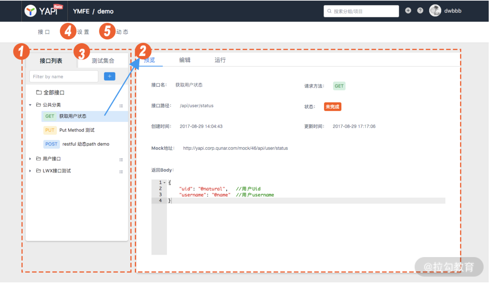

# 04 接口调试：Mock 工具如何快速进行接口调试？

上一课时我们讲了 source map 在开发调试中的作用，以及不同的 source map 策略对于构建时间和调试效果的影响。在课后留的讨论题是观察你项目里在开发和生产环境下使用的是哪一种 source map 类型，因为很多时候当我们用了预设好的脚手架工具后，这些细节可能不太关注到，希望借着这个题目能让你对这个方面的细节有更深入的理解。

今天我们来聊一下前端开发流程中的 Mock 工具使用问题。

### 什么是 Mock？

[Mock](https://en.wikipedia.org/wiki/Mock_object) 在程序设计中是指使用模拟（Mock）的对象来替代真实对象，以测试其他对象的行为。而在前端开发流程中，我们说的 Mock 通常是指模拟数据（俗称假数据）以及生成和使用模拟数据的工具与流程。那么为什么要使用 Mock 数据呢？是因为在实际中，我们经常遇到以下令人困扰的问题。

在一个前后端分离的项目开发流程中，项目的开发时间通常分为三块：前端开发时间 t1，后端开发时间 t2，前后端联调时间 t3。理想情况下，整体的项目开发时间是 \<=max（t1，t2）+t3，即前后端同时开发，两端都开发完成后进入联调。甚至再进一步，为了提高效率，也可以将整个开发流程按功能点进行更细粒度地拆分，即在开发时间内，也可以在部分功能开发完成后立即进行这一部分的联调，以期望利用碎片化的时间来减少后期完整联调的时间。

但现实中，随着项目前端交互流程的日益复杂化，在开发流程中，前端往往需要依赖一定的数据模型来组织页面与组件中的交互流程 ，而数模型又依赖着后端提供的 API 接口。也就是说，在新项目新功能的开发流程中，前端的开发时间多少，不只取决于自身开发部分的耗时，还依赖于后端开发完成的时间。那么如何实现前端的无依赖独立开发以提升效率呢？

假设在后端实际 API 功能完成之前，我们能获得对应的模拟数据作为接口的返回值来处理前端交互中的数据模型，待开发完成进入联调后再将假数据的部分切换到真实的后端服务接口数据，这样开发阶段的阻碍问题就解决了。事实上，使用 Mock 数据已成为前端开发流程中必不可少的一环。

### 选择 Mock 方案的考量标准

对于在前端开发中使用 Mock 数据的需求，实现路径有很多，例如：

1. 可以直接在代码中侵入式地书写静态返回数据来调试相关逻辑。
1. 可以使用后端开发服务作为 Mock 服务，将未实现的功能在后端返回 Mock 数据。
1. 可以通过一些本地 Mock 工具，使用项目本地化的 Mock 规则文件来生成 Mock 数据。
1. 可以使用功能更丰富的接口管理工具来提供独立的 Mock 能力。

这里面，第一种书写静态返回数据的方式和第二种开发服务端返回假数据的方式可能是前端同学从直觉上最容易理解和实践的。但是对于第一种方案而言，代码的维护成本、复杂接口的数据实现和处理以及特殊字段的额外处理等因素，都导致了它在实际开发过程中的使用场景非常局限；而第二种方案仍然依赖后端提供相应的服务，在独立性、稳定性与灵活性方面也难以达到 Mock 方案达成前端独立开发的要求。

剩下的两种实现方式则各有其适用场景和局限性：在后端已提供接口文档，而团队未使用接口管理工具的情况下，第三种本地化的 Mock 工具使用成本更低；而反之，第四种则有一定的前期搭建和维护成本，但在前后端达成一致使用接口管理工具的情况下，整体效率更高。

除了考虑不同实现路径外，对于相同的实现方式，可选择的工具也各有不同。在讨论具体的 Mock 方案之前，我们先来聊下选择的参考依据：

1. **仿真度** ：Mock 数据作为实际前后端调用时的数据模拟，需要在接口定义上尽可能与后端实际提供接口的各方面保持一致。从接口名称、调用方法、请求头信息到返回头信息，返回值字段一致性越高，在后期切换到联调实际接口时花费的时间越短。因此，使用 Mock 数据前，需要使前后端在事先对接口的定义上达成一致。因此，数据定义的仿真度是决定实际模拟过程效率和质量的首要因素。这部分的工作通常在开发初期通过接口文档的方式来提供，或由提供类似功能的 Mock 工具来提供。
   2. **易用性** ：在定义完接口文档之后，下一步是生成 Mock 数据。通常一个高效的 Mock 工具需要具备将接口文档自动转换为 Mock 接口的能力。接口文档作为前后端联调的一致性保证，当接口发生任何变化时都会首先更新到文档中，并自动反映到提供的 Mock 数据中。同样，后端提供的真实服务也应当完整通过 Mock 接口的测试，而这种自动输出 Mock 数据，以及自动测试接口的能力也是整个 Mock 方案易用性的考量标准之一。
   3. **灵活性** ：通常来说，实际的接口调用中我们会根据不同的调用方式与传入参数等条件来输出不同的返回值，前端根据不同条件下返回值的差异做不同的交互处理。因此，在使用 Mock 工具的过程中，对不同条件下返回不同数据的 Mock 期望能力也是我们选择 Mock 方案的考虑点。

以上几点构成我们选择 Mock 方案的基本考虑标准。接下来我们来了解一些前端领域主流的 Mock 工具。

### 几种主流的 Mock 工具介绍

#### Mock.js

[Mock.js](https://github.com/nuysoft/Mock) 是前端领域流行的 Mock 数据生成工具之一，后续许多功能更丰富的工具和系统在各自的 Mock 功能部分都将它作为基础设施。

Mock.js 的核心能力是定义了两类生成模拟数据的规范： **数据模板定义规范** （Data Template Definition, DTD）与 **数据占位符定义规范** （Data Placeholder Definition, DPD），以及实现了应用相应规范生成模拟数据的方法。 **数据模板定义规范（DTD）**  **数据模板定义规范** 约定了可以通过“属性名|生成规则：属性值”这样的格式来生成模拟数据，例如（完整示例代码参见 [04_mock](https://github.com/fe-efficiency/lessons_fe_efficiency/tree/master/04_mock)）：

```
Mock.mock({
  "number|1-100": 1
})
//Result: number为1-100内随机数，例如{number: 73}
Mock.mock({
  "boo|1-100": true
})
//Result: boo为true或false，其中true的概率为1%，例如{boo: false}
Mock.mock({
  "str|1-100": '1'
})
//Result: str为1-100个随机长度的字符串'1'。例如{str: '11111'}
```

从上面的例子可以看到，属性名只是作为生成数据的固定名称，而同样的生成规则下，随着属性值的不同，生成规则对应的内部处理逻辑也不同。在 Mock.js 中，共定义了 7 种生成规则：min-max、min-max.dmin-dmax、min-max.dcount、count、count.dmin-dmax、count.dcount、+step。根据这 7 种规则，再结合不同数据类型的属性值，就可以定义出任意我们所需要的随机数据生成逻辑。 **数据占位符定义规范 （DPD）**  **数据占位符定义规范** 则是对于随机数据的一系列常用类型预设，书写格式是'@占位符（参数 \[, 参数\] ）'。如以下例子：

```
Mock.mock('@email')
//Result: 随机单词连接成的email数据，例如："[email protected]"
Mock.mock('@city(true)')
//Result: 随机中国省份+省内城市数据，例如："吉林省 辽源市"
Mock.mock({'aa|1-3':['@cname()']})
//Result: aa值为随机3个中文姓名的数组，例如{aa: ['张三','李四','王五']}
Random.image('200x100', '#894FC4', '#FFF', 'png', '!')
//Result: 利用dummyimage库生成的图片url, "http://dummyimage.com/200x100/894FC4/FFF.png"
```

从这些例子中可以看到，占位符既可以用于单独返回指定类型的随机数据，又能结合数据模板，作为模板中属性值的部分来生成更复杂的数据类型。Mock.js 中定义了 9 大类共 42 种占位符，相关更多占位符的说明和示例可以从官网中查找和使用。 **其他功能** 除了提供生成模拟数据的规范和方法外，Mock.js 还提供了一些辅助功能，包括：

1. **Ajax 请求拦截** ：Mock.mock 方法中支持传入 Ajax 请求的 url 和 type，用于拦截特定 url 的请求，直接将模拟数据作为响应值返回。这一功能方便我们在项目本地中使用 Mock 数据做调试，其原理是覆盖了原生的 XMLHttpRequest 对象，因此对于使用 fetch 作为接口请求的 API 的项目还不能适用。此外，提供了 Mock.setup 方法来设置拦截 Ajax 请求后的响应时间。
2. **数据验证** ：Mock.valid 方法，验证指定数据和数据模板是否匹配。这一功能可以用于验证后端 API 接口的返回值与对应 Mock 数据的规则描述是否冲突。
3. **模板导出** ：Mock.toJSONSchema，将 Mock.js 风格的数据模板转换为 JSONSchema。可用于将数据模板导入到其他支持 JSON Schema 格式的工具中。

#### Faker.js

[Faker.js](https://github.com/Marak/faker.js) 是另一个较热门的模拟数据生成工具。与 Mock.js 相比，Faker.js 主要提供的是指定类型的随机数据，对应 Mock.js 中的占位符类型数据。在 API 的使用方面较直观，使用示例如下：

```
//单独使用api方法
var randomName = faker.name.findName(); // Rowan Nikolaus
var randomEmail = faker.internet.email(); // [email protected]
var randomCard = faker.helpers.createCard(); // random contact card containing many properties
//使用fake来组合api
faker.fake("{{name.lastName}}, {{name.firstName}} {{name.suffix}}")
// outputs: "Marks, Dean Sr."
```

除了在数据生成的规则上没有 Mock.js 的数据模板规则那样灵活以外，对于一般的数据模拟需求， Faker.js 已能很好地满足。此外，它还支持多种语言的本地化包，满足国际化站点开发的需求。

以上两种工具在实际项目使用中，都需要在项目本地编写数据生成模板或方法，而后根据一定的方式拦截 API 请求并指向本地生成的 Mock 数据。拦截的方法可以类似 Mock.js 的覆盖 API 调用对象，也可以是通过网络代理将后端域名指向本地目录。

这种本地植入模拟数据生成器的方式可以在一定程度上提升前端独立开发调试的效率，但从整体前后端工作的效率上来看，并非最佳选择：

1. 在使用 TypeScript 的项目中，数据模板和 TypeScript 类型需要通过人工来保持一致，缺乏自动检验的功能。
1. 仍然需要后端编写完整的接口文档后才能开始编写数据生成逻辑。
1. 本地模拟数据规则本质上和接口文档脱离，当后端接口字段发生变化时无法感知，导致沟通调试成本增加，也对基于模拟数据的单元测试的效果产生影响。

对于第一点，有种解决思路是基于 TypeScript 接口类型描述对象来自动生成模拟数据。而对于后面两点，解决方案是将接口文档和 Mock 数据服务，以及接口测试工具结合在一起，合并成相关功能链路集成的平台和工具，例如下面介绍的两个：

#### YApi

[YApi](https://github.com/YMFE/yapi) 定义是开发、产品、测试人员共同使用的接口管理服务，其功能特点主要包括：

1. 支持接口的定义、修改、运行、集合测试等。
1. 提供 Mock 服务，以定义的接口可以通过服务直接获取 Mock 数据。Mock 定义中支持 JSON Schema 和 Mock.js（不支持函数功能）。
1. 支持 Swagger 多种接口描述的数据导入与导出。
1. 支持部署到内网服务以及自定义插件。



#### Apifox

[Apifox](https://www.apifox.cn/) 是一个桌面应用类的接口管理工具。与 YApi 相比，除了使用方式不同外，其主要特点还包括：

1. 支持接口调试工具 Postman 的特色功能，例如环境变量、Cookie/Session 全局共享等。
1. 对同一个接口支持多种用例管理（成功用例、错误用例等）。
1. Mock 数据功能方面支持自定义期望，支持自定义占位符规则等。
1. 支持生成自动业务代码和接口请求代码，支持自定义代码模板等。


以上两种接口管理工具都包含了提供对应接口的 Mock 服务的能力。相比于单独提供生成 Mock 数据能力的 Mock.js 和 Faker.js，这类工具解决了接口定义与 Mock 数据脱离的问题：

1. 在接口定义阶段，支持后端服务内定义的 Swagger 等 OPEN API 风格的接口定义数据直接导入生成接口文档，也支持在工具界面内填写字段创建，创建时支持设定返回值的 Mock 描述。
1. 在接口定义完成后，即可直接访问工具提供的 Mock 服务接口供前端调用。
1. 在后端接口开发过程中，可通过工具提供的接口调试功能进行开发调试。
1. 在接口完成后的任意时间点，支持接口的自动化测试来保证功能与描述的一致性。

通过这样的流程串联，来解决前后端开发过程中的接口联调效率问题。

### 总结

通过这一课时的学习，我们一起讨论了 Mock 工具在前后端分离开发流程中起到的作用，以及选择 Mock 方案的一般考量标准，并重点介绍了几种 Mock 工具：有专注于提供生成模拟数据这一核心能力的 Mock.js 和 Faker.js，也有更平台化的内置 Mock 功能的 YApi 和 Apifox。大家在项目的开发过程中，可以根据自身项目的情况来选择使用。

课后讨论题：在你的项目开发中是否有用到本地或者服务化的 Mock 工具呢？有用到的话谈谈你的使用感受吧。

00:00

前端工程化精讲
