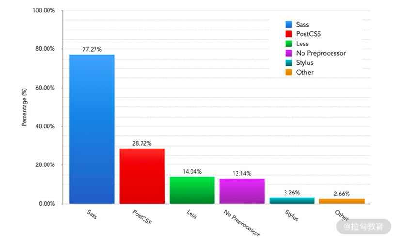
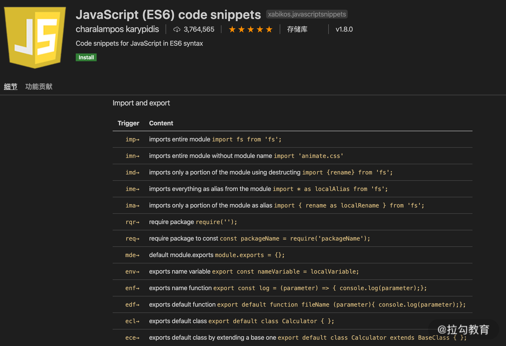

# 05 编码效率：如何提高编写代码的效率？

上一课时我们讨论了开发过程中 Mock 工具的使用。Mock 工具能帮助解决前端开发过程中的接口依赖问题，作为开发流程规范的一环，起到提升整体开发效率的作用。

今天我们来聊聊如何提高开发时的编码效率的问题。

俗话说，不会“偷懒”的程序员不是好程序员。一名好的程序员会不断地思考如何把重复的流程通过程序来自动化地完成，从而把剩下的时间投入到真正需要思考和有创造性的工作中去。那么如何才能在开发过程中更专业地“偷懒”呢？

### 提高编码效率的不同方式

对于前端同学而言，第一讲 **脚手架工具** 就是提高编码效率最直接的例子，通过脚手架帮我们生成一个项目的基础代码后，就免去了投入其中的时间。那么在开发过程中又有哪些方式可以帮助我们提高编码的效率呢？

以最终实现相同代码产出为目标，开发时提高编码效率的方式大致可以分为两类：

1. 通过使用 **预处理语言** ：相比原语言来说，预处理语言通常抽象度更高，提供更多封装好的工具方法，更有利于提高编码的效率。可以通过对应的预处理器（Preprocessor）将预处理语言在 **编译时** 转换为更完整的普通语法代码（例如 Sass 到 CSS）。
1. 通过 **代码生成** （例如 IDE 的自动完成）：以达到在 **编写时** 自动生成代码的作用，因而无须在编译时进行额外处理。

下面我们就来分别讨论下这两种方式，以及它们对应的工具。

### 使用预处理语言和预处理器

预处理语言指的是在原有语言的语法基础上，提供更多新的内置功能及精简语法，以便提高代码复用性和书写效率。下面我们就列举几个前端开发中涉及的典型预处理语言，来聊一聊它们在功能和使用上的特点，以便在开发中能够更有针对性地选择和使用。

#### Sass/Less/Stylus

**Sass（2006），Less（2009）和 Stylus（2010）**是三种目前主流的 CSS 预处理语言，有同学在创建新项目时可能不知道该选择哪一种，下面我会从几个方面对它们做一个比较，来作为你选择使用的参考依据：

从**流行程度来看**：

- 从第一课时脚手架部分的介绍中能发现，react-scripts 中集成了 sass-loader，而 vue-cli-service 中则同时支持这三种预处理器。
- 几个主流的 UI 库的使用情况是： Bootstrap4、 Antd 和 iView 使用 Less， ElementUI 使用 Sass。
- 此外，[2019 年的前端工具调查](https://ashleynolan.co.uk/blog/frontend-tooling-survey-2019-results)也显示上面三种工具的使用人数依次递减，即使用人数最多的是 Sass、 其次是 Less、最后是 Stylus。如下图所示：



在 **实现的功能** 方面：这三种 CSS 的预处理语言都实现了变量（Variables）、嵌套（Nesting）、混合 （Mixins）、运算（Operators）、父选择器引用（Parent Reference）、扩展（Extend）和大量内建函数（Build-in Functions）。但是与另外两种语言相比，Less 缺少自定义函数的功能（可以使用 Mixins 结合 Guard 实现类似效果），而 Stylus 提供了超过 60 个内建函数，更有利于编写复杂的计算函数。

在 **语法方面** ：**Sass **支持 .scss 与 .sass 两种文件格式。差异点是 .scss 在语法上更接近 CSS，需要括号、分号等标识符，而 Sass 相比之下，在语法上做了简化，去掉了 CSS 规则的括号分号等 （增加对应标识符会导致报错） 。** Less **的整体语法更接近 .scss。** Stylus**则同时支持类似 .sass 的精简语法和普通 CSS 语法。语法细节上也各不相同，示例如下：

```
//scss
red: '#900';
div {
  color: red;
}
//sass
red: '#900'
div
  color: red
//less
@green: '#090';
div {
  color: @green;
}
//stylus
blue = '#009'
div
  color: blue
```

从**安装使用**方面来看：

- Sass 目前有两种 npm 编译安装包，即基于 LibSass 的 node-sass 和基于 dart-sass 的 Sass。官方推荐为 dart-sass，它不仅在安装速度上更快，而且支持更多 Sass 内置特性，且支持 Yarn 的 PnP 功能。
- 如果使用 Webpack 构建，三种语言对应的预处理器分别是 sass-loader、 less-loader、 stylus-loader。需要注意的是 sass-loader 和 stylus-loader 安装时都需要同时安装独立编译包 Sass / node-sass 和 Stylus，而 less-loader 则不强制要求（也可以单独安装并在配置中指定不同的编译包版本）。此外，如第一课时中提到的， sass-loader 在处理 Partial 文件中的资源路径时需要增加 resolve-url-loader（以及 sass-loader 中需要[开启 sourceMap 参数](https://www.npmjs.com/package/resolve-url-loader#user-content-configure-webpack)） 以避免编译时的报错。对应的，stylus-loader 需要增加 “resolve url” 参数，而 less-loader 则不需要。具体示例参见课件代码[05_coding_efficiency](https://github.com/fe-efficiency/lessons_fe_efficiency/tree/master/05_coding_efficiency)。

#### Pug

对于 HTML 模板的预处理语言选择而言，目前主流的是[Pug](https://pugjs.org/)****（这里考虑的是预处理语言对于效率的提升，因此一些纯模板语言，如 **EJS** ，则不在讨论范围内。此外，基于其他技术栈的模板语言，例如 Ruby 的 **Haml** 和**Slim**，在前端工程化中的应用也并不多，因此也不在这里讨论）。

Pug 的前身名叫**Jade**（2010），2016 年时因为和同名软件商标冲突而改名为了 Pug。语法示例如下：

```
//pug
html
  head
  body
    p.foo Hello World
//html
<html><head></head><body><p class="foo">Hello World</p></body></html>
```

在功能方面，除了简化标签书写外，还支持迭代（Iteration）、条件（Condition）、扩展（Extend）、包含（Include）、混合（Mixins）等逻辑功能。

在 Vue 开发中，Vue 文件的 template 支持添加 lang="pug"，相应的在 vue-cli-service 的 Webpack 配置中，内置了[pug-loader](https://github.com/pugjs/pug-loader) 作为预处理器。而在 React 开发中，则可以通过 [babel 插件](https://github.com/pugjs/babel-plugin-transform-react-pug)获得支持。

#### 其他

上面主要介绍了 CSS 和 HTML 的主流预处理语言，同样具有精简语法功能的还有对应 JavaScript 的 CoffeeScript 和对应 JSON 的 YAML 等。但是，由于 JavaScript 代码本身的逻辑性要重于输入的便捷性，且随着 ES6 语法的普及，原本 CoffeeScript 诞生时要解决的问题已逐渐被 ES6 的语法所取代，因此目前主流的开发技术栈中已不再有它的身影。而 YAML 语言目前主要在一些配置上使用，例如 Dockerfile 和一些持续集成工具（CI）的配置文件，在开发语言中并不涉及，因此这里也不展开介绍了。

### 使用代码生成工具

除了使用上面介绍的预处理语言进行开发外，我们也可以使用 IDE（Integrated Development Environment，集成开发环境，即我们通常说的编辑器）的相关预设功能来帮助生成代码。这些功能主要包括：智能帮助、Snippet 和 Emmet（**注意**：对于预处理语言文件来说，通常 IDE 中需要安装对应文件类型的识别扩展，才能在文件中使用这些辅助功能）。这里重点介绍后两种。

通常在 IDE 中会默认内置一些**智能帮助 **（例如 VSCode 中的** IntelliSense**）功能，例如输入时的联想匹配、自动完成、类型提示、语法检查等。但是很多场景下，常常有些固定格式的语句或代码块需要重复输入，这个时候就需要用到下面介绍的功能了。

#### Snippet**Snippet** 是指开发过程中用户在 IDE 内使用的可复用代码片段，大部分主流的 IDE 中都包含了 Snippet 的功能，就像使用脚手架模板生成一个项目的基础代码那样，开发者可以在 IDE 中通过安装扩展来使用预设的片段，也可以自定义代码片段，并在之后的开发中使用它们

以 VS Code 为例，在扩展商店中搜索 Snippet 可以找到各种语言的代码片段包。例如下图中的[Javascript(ES6) code snippets](https://marketplace.visualstudio.com/items?itemName=xabikos.JavaScriptSnippets)，提供了 JavaScript 常用的 import 、console 等语句的缩写。安装后，输入缩写就能快速生成对应语句。



除了使用扩展包自带的预设片段外，IDE 还提供了用户自定义代码片段的功能。以 VS Code 为例，通过选择菜单中的"Code-首选项-用户片段"，即可弹出选择或新增代码片段的弹窗，选择或创建对应 .code-snippets 文件后即可编辑自定义的片段。就像下面示例代码中我们创建了一个简单的生成 TypeScript 接口代码的片段，保存后在项目代码里输入 tif 后再按回车，就能看到对应生成的片段了：

```
//sample.code-snippets
{
  "Typescript Interface": { //片段名称，下面描述不存在时显示在IDE智能提示中
    "scope": "typescript", //语言的作用域，不填写时默认对所有文件有效
    "prefix": "tif",  //触发片段的输入前缀字符(输入第一个字符时即开始匹配)
    "body": [       //片段内容
      "interface ${1:IFName} {", //$1,$2..为片段生成后光标位置，通过tab切换
      "\t${2:key}: ${3:value}", //${n:xx}的xx为占位文本
      "}"
    ],
    "description": "output typescript interface" //描述，显示在智能提示中
  }
}
//任意.ts文件中输入tif+回车后即可生成下面的代码，同时光标停留在IFName处
interface IFName {
  key: value
}
```

通过上面演示的自定义功能，我们就可以编写自身开发常用的个性预设片段了。相比使用第三方预设，自定义的预设更灵活也更便于记忆。两者相结合，能够大大提升我们编码的效率。同时，针对实际业务场景定制的自定义片段文件，也可以在团队内共享和共同维护，以提升团队整体的效率。

#### Emmet

[Emmet](https://emmet.io/)****（前身为 Zen Coding）是一个面向各种编辑器（几乎所有你见过的前端代码编辑器都支持该插件）的 Web 开发插件，用于高速编写和编辑结构化的代码，例如 Html 、 Xml 、 CSS 等。从下面官方的示例图中可以看到，简单的输入 ! 或 html:5 再输入 tab 键，编辑器中就会自动生成完整的 html5 基本标签结构（完整的缩写规则列表可在[官方配置](https://github.com/emmetio/emmet/tree/master/snippets)中查找）：


它的主要功能包括：

- 缩写代码块：
  - 支持子节点（>）、兄弟节点（+）、父节点（^）、重复（\*）、分组等节点关系运算符。
  - 支持 id、 class、序号 $ 和其他用\[\]表示的自定义属性。
  - 支持用 {} 表示的内容文本。
  - 支持在不带标签名称时根据父节点标签自动推断子节点。

```
#main>h1#header+ol>.item-$${List Item$}*3^footer
//转换为
<div id="main">
  <h1 id="header"></h1>
  <ol>
    <li class="item-01">List Item1</li>
    <li class="item-02">List Item2</li>
    <li class="item-03">List Item3</li>
  </ol>
  <footer></footer>
</div>
```

- CSS 缩写：支持常用属性和值的联合缩写，例如以下代码：

```
m10 => margin:10px
p100p => padding: 100%；
bdrs1e => border-radius: 1em;
```

- 自定义片段：Emmet 也允许使用用户自定义的缩写规则。以 VS Code 为例，首先修改设定中 emmet.extensionsPath 字段，指向包含自定义规则 snippets.json 文件的目录，然后在对应文件中增加 Emmet 规则即可（保存规则文件后需要 reload 编辑器才能使规则生效）。例如，在下面的示例中分别为 html 和 css 增加了 dltd 和 wsnp 缩写规则：

```
{
  "html": {
    "snippets": {
      "dltd": "dl>(dt+dd)*2"
    }
  },
  "css": {
    "snippets":{
      "wsnp": "white-space: no-wrap"
    }
  }
}
```

### 上述工具的一般使用建议

在介绍完上面的两类工具的基本信息和一般使用方法后，接下来我们再按照前端开发过程中的基本语言类型来讨论下不同语言的工具选择建议。

#### Html

Html 语言在如今组件化的前端项目中是作为一个组件的模板存在的。而编写组件模板与纯 Html 的区别在于，组件模板中通常已经由框架提供了 **数据注入** （Interpolation）以及循环、条件等语法，组件化本身也解决了包含、混入等代码复用的问题。因此，在使用提效工具时，我们用到的主要还是简化标签书写的功能，而不太涉及工具本身提供的上述逻辑功能（混用逻辑功能可能反而导致代码的混乱和调试的困难）。当然，简化标签书写既可以选择使用 Pug 语言，也可以使用 Emmet。

使用 Pug 的好处主要在于，对于习惯书写带缩进的 html 标签的同学而言 **上手更快** ，迁移成本低，且整体上阅读体验会更好一些。

而 Emmet 则相反，取消缩进后作为替代需要通过关系标识符来作为连接，书写习惯上 **迁移成本略高** 一些，且由于是即时转换，转后代码的阅读体验与 Html 没有区别。相对而言，由于可以自定义 Snippet 来使用常用缩写，因此使用熟练后实际效率提升会更明显一些。

#### CSS

毫无疑问，改进 CSS 书写效率就不会出现预处理语言和 Emmet 二选一的情况了：

- 对于项目中需要大量书写 CSS 的情况来说，使用预处理语言赋予的更强的代码抽象和组织能力，同时结合 Emmet 提供的属性缩写功能，能够大大提升整体 CSS 开发的效率。
- 另一方面，如果项目中主要使用 UI 组件库来呈现界面（例如大部分的中后台系统），而只需要少量编写自定义样式的话，使用 Emmet 的优先级更高。
- CSS 预处理语言的选择上，由于主要功能的相似性，团队统一选择其一即可。

#### JavaScript/TypeScript

JS/TS 的开发过程是非结构化的，通常 IDE 自带的一系列智能帮助功能一般情况下就足以提供良好的开发体验。这里可以用到的提效工具主要还是使用 Snippet，第三方扩展提供的常用语句的缩写，结合开发者自定义的常用片段（例如一个特定类型的模块初始化片段等），可以成为我们开发的瑞士军刀，再次提升编码效率。

### 总结

这一课时我们讨论了两种类型的提效工具：预处理语言和代码生成工具。这两种工具在一些场景下是功能重叠的，例如 Pug 和 Emmet 中的 html 生成，在其他场合下则各有功效，相辅相成。熟练运用预处理语言提供的各种细节语法功能，善于总结开发中常用的自定义片段，掌握这些技能后，我们的开发效率就能走上一个新的台阶。

这一课的讨论题是：第一课里我们讨论了用脚手架工具生成整个项目的初始化代码的过程，在这一课里我们也聊了用代码生成工具来生成代码片段的过程，那么在你的项目里有没有使用过其他粒度的代码生成工具呢？例如生成一个完整页面的工具？欢迎留言分享，我们会在之后的课程里再次展开这个话题。
