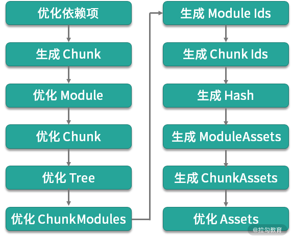
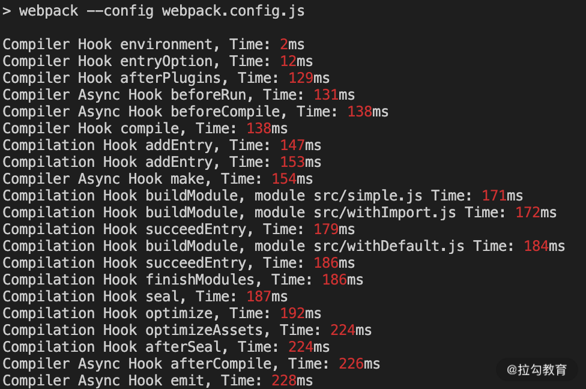

# 10 流程分解：Webpack 的完整构建流程

上节课我们聊了过去 20 余年里，前端项目开发时的工程化需求，以及对应产生的工具解决方案，其中最广泛运用的构建工具是 Webpack。这节课我们就来深入分析 Webpack 中的效率优化问题。

要想全面地分析 Webpack 构建工具的优化方案，首先要先对它的工作流程有一定理解，这样才能针对项目中可能存在的构建问题，进行有目标地分析和优化。

### Webpack 的基本工作流程

我们从两方面来了解 Webpack 的基本工作流程：

1. 通过 Webpack 的源码来了解具体函数执行的逻辑。
1. 通过 Webpack 对外暴露的声明周期 Hooks，理解整体流程的阶段划分。

其中会涉及对 Webpack 源代码的分析，源代码取自 Webpack 仓库的 [webpack-4 分支](https://github.com/webpack/webpack/blob/webpack-4)，而最新的 Webpack 5 中的优化我们会在后续课程中单独分析。

通常，在项目中有两种运行 Webpack 的方式：基于命令行的方式或基于代码的方式。

两种示例的代码分别如下（具体示例参照 [10_webpack_workflow](https://github.com/fe-efficiency/lessons_fe_efficiency/tree/master/10_webpack_workflow)）：

```
//第一种：基于命令行的方式
webpack --config webpack.config.js
//第二种：基于代码的方式
var webpack = require('webpack')
var config = require('./webpack.config')
webpack(config, (err, stats) => {})
```

#### webpack.js 中的基本流程

无论用哪种方式运行 Webpack，本质上都是 [webpack.js](https://github.com/webpack/webpack/blob/webpack-4/lib/webpack.js) 中的 Webpack 函数。

这一函数的核心逻辑是：根据配置生成编译器实例 compiler，然后处理参数，执行 WebpackOptionsApply().process，根据参数加载不同内部插件。在有回调函数的情况下，根据是否是 watch 模式来决定要执行 compiler.watch 还是 compiler.run。

为了讲解通用的流程，我们以没有 watch 模式的情况进行分析。简化流程后的代码示例如下：

```
const webpack = (options, callback) => {
  options = ... //处理options默认值
  let compiler = new Compiler(options.context)
  ... //处理参数中的插件等
  compiler.options = new WebpackOptionsApply().process(options, compiler); //分析参数，加载各内部插件
  ...
  if (callback) {
    ... 
    compiler.run(callback)
  }
  return compiler
}
```

#### Compiler.js 中的基本流程

我们再来看下运行编译器实例的内部逻辑，具体源代码在 [Compiler.js](https://github.com/webpack/webpack/blob/webpack-4/lib/Compiler.js) 中。

compiler.run(callback) 中的执行逻辑较为复杂，我们把它按流程抽象一下。抽象后的执行流程如下：

1. **readRecords** ：读取[构建记录](https://webpack.js.org/configuration/other-options/#recordspath)，用于分包缓存优化，在未设置 recordsPath 时直接返回。
   2. **compile 的主要构建过程** ，涉及以下几个环节：
   1. **newCompilationParams** ：创建 NormalModule 和 ContextModule 的工厂实例，用于创建后续模块实例。
   2. **newCompilation** ：创建编译过程 Compilation 实例，传入上一步的两个工厂实例作为参数。
   3. **compiler.hooks.make.callAsync** ：触发 make 的 Hook，执行所有监听 make 的插件（例如 [SingleEntryPlugin.js](https://github.com/webpack/webpack/blob/webpack-4/lib/SingleEntryPlugin.js) 中，会在相应的监听中触发 compilation 的 addEntry 方法）。其中，Hook 的作用，以及其他 Hook 会在下面的小节中再谈到。
   4. **compilation.finish** ：编译过程实例的 finish 方法，触发相应的 Hook 并报告构建模块的错误和警告。
   5. **compilation.seal** ：编译过程的 seal 方法，下一节中我会进一步分析。
   3. **emitAssets** ：调用 compilation.getAssets()，将产物内容写入输出文件中。
   4. **emitRecords** ：对应第一步的 readRecords，用于写入构建记录，在未设置 recordsPath 时直接返回。

在编译器运行的流程里，核心过程是第二步编译。具体流程在生成的 Compilation 实例中进行，接下来我们再来看下这部分的源码逻辑。

#### Compilation.js 中的基本流程

这部分的源码位于 [Compilation.js](https://github.com/webpack/webpack/blob/webpack-4/lib/Compilation.js) 中。其中，在编译执行过程中，我们主要从外部调用的是两个方法：

1. **addEntry** ：从 entry 开始递归添加和构建模块。
2. **seal** ：冻结模块，进行一系列优化，以及触发各优化阶段的 Hooks。

以上就是执行 Webpack 构建时的基本流程，这里再稍做总结：

1. 创建编译器 Compiler 实例。
1. 根据 Webpack 参数加载参数中的插件，以及程序内置插件。
1. 执行编译流程：创建编译过程 Compilation 实例，从入口递归添加与构建模块，模块构建完成后冻结模块，并进行优化。
1. 构建与优化过程结束后提交产物，将产物内容写到输出文件中。

除了了解上面的基本工作流程外，还有两个相关的概念需要理解：Webpack 的生命周期和插件系统。

### 读懂 Webpack 的生命周期

Webpack 工作流程中最核心的两个模块：Compiler 和 Compilation 都扩展自 Tapable 类，用于实现工作流程中的生命周期划分，以便在不同的生命周期节点上注册和调用 **插件** 。其中所暴露出来的生命周期节点称为 **Hook** （俗称钩子）。

#### Webpack 中的插件

Webpack 引擎基于插件系统搭建而成，不同的插件各司其职，在 Webpack 工作流程的某一个或多个时间点上，对构建流程的某个方面进行处理。Webpack 就是通过这样的工作方式，在各生命周期中，经一系列插件将源代码逐步变成最后的产物代码。

一个 Webpack 插件是一个包含 apply 方法的 JavaScript 对象。这个 apply 方法的执行逻辑，通常是注册 Webpack 工作流程中某一生命周期 Hook，并添加对应 Hook 中该插件的实际处理函数。例如下面的代码：

```
class HelloWorldPlugin {
  apply(compiler) {
    compiler.hooks.run.tap("HelloWorldPlugin", compilation => {
      console.log('hello world');
    })
  }
}
module.exports = HelloWorldPlugin;
```

#### Hook 的使用方式

Hook 的使用分为四步：

1. 在构造函数中定义 Hook 类型和参数，生成 Hook 对象。
1. 在插件中注册 Hook，添加对应 Hook 触发时的执行函数。
1. 生成插件实例，运行 apply 方法。
1. 在运行到对应生命周期节点时调用 Hook，执行注册过的插件的回调函数。如下面的代码所示：

```
lib/Compiler.js
this.hooks = {
  ...
  make: new SyncHook(['compilation', 'params']), //1. 定义Hook
  ...
}
...
this.hooks.compilation.call(compilation, params); //4. 调用Hook
...
lib/dependencies/CommonJsPlugin.js
//2. 在插件中注册Hook
compiler.hooks.compilation.tap("CommonJSPlugin", (compilation, { contextModuleFactory, normalModuleFactory }) => {
  ...
})
lib/WebpackOptionsApply.js
//3. 生成插件实例，运行apply方法
new CommonJsPlugin(options.module).apply(compiler);
```

以上就是 Webpack 中 Hook 的一般使用方式。正是通过这种方式，Webpack 将编译器和编译过程的生命周期节点提供给外部插件，从而搭建起弹性化的工作引擎。

Hook 的类型按照同步或异步、是否接收上一插件的返回值等情况分为 9 种。不同类型的 Hook 接收注册的方法也不同，更多信息可参照[官方文档](https://github.com/webpack/tapable#tapable)。下面我们来具体介绍 Compiler 和 Compilation 中的 Hooks。

#### Compiler Hooks

构建器实例的生命周期可以分为 3 个阶段：初始化阶段、构建过程阶段、产物生成阶段。下面我们就来大致介绍下这些不同阶段的 Hooks ： **初始化阶段**

- environment、afterEnvironment：在创建完 compiler 实例且执行了配置内定义的插件的 apply 方法后触发。
- entryOption、afterPlugins、afterResolvers：在 WebpackOptionsApply.js 中，这 3 个 Hooks 分别在执行 EntryOptions 插件和其他 Webpack 内置插件，以及解析了 resolver 配置后触发。

**构建过程阶段**

- normalModuleFactory、contextModuleFactory：在两类模块工厂创建后触发。
- beforeRun、run、watchRun、beforeCompile、compile、thisCompilation、compilation、make、afterCompile：在运行构建过程中触发。

**产物生成阶段**

- shouldEmit、emit、assetEmitted、afterEmit：在构建完成后，处理产物的过程中触发。
- failed、done：在达到最终结果状态时触发。

#### Compilation Hooks

构建过程实例的生命周期我们分为两个阶段：

**构建阶段**

- addEntry、failedEntry、succeedEntry：在添加入口和添加入口结束时触发（Webpack 5 中移除）。
- buildModule、rebuildModule、finishRebuildingModule、failedModule、succeedModule：在构建单个模块时触发。
- finishModules：在所有模块构建完成后触发。

**优化阶段**

优化阶段在 seal 函数中共有 12 个主要的处理过程，如下图所示：



每个过程都暴露了相应的 Hooks，分别如下:

- seal、needAdditionalSeal、unseal、afterSeal：分别在 seal 函数的起始和结束的位置触发。
- optimizeDependencies、afterOptimizeDependencies：触发优化依赖的插件执行，例如FlagDependencyUsagePlugin。
- beforeChunks、afterChunks：分别在生成 Chunks 的过程的前后触发。
- optimize：在生成 chunks 之后，开始执行优化处理的阶段触发。
- optimizeModule、afterOptimizeModule：在优化模块过程的前后触发。
- optimizeChunks、afterOptimizeChunks：在优化 Chunk 过程的前后触发，用于 [Tree Shaking](https://webpack.js.org/guides/tree-shaking/)。
- optimizeTree、afterOptimizeTree：在优化模块和 Chunk 树过程的前后触发。
- optimizeChunkModules、afterOptimizeChunkModules：在优化 ChunkModules 的过程前后触发，例如 ModuleConcatenationPlugin，利用这一 Hook 来做[Scope Hoisting](https://webpack.js.org/plugins/module-concatenation-plugin/#optimization-bailouts)的优化。
- shouldRecord、recordModules、recordChunks、recordHash：在 shouldRecord 返回为 true 的情况下，依次触发 recordModules、recordChunks、recordHash。
- reviveModules、beforeModuleIds、moduleIds、optimizeModuleIds、afterOptimizeModuleIds：在生成模块 Id 过程的前后触发。
- reviveChunks、beforeChunkIds、optimizeChunkIds、afterOptimizeChunkIds：在生成 Chunk id 过程的前后触发。
- beforeHash、afterHash：在生成模块与 Chunk 的 hash 过程的前后触发。
- beforeModuleAssets、moduleAsset：在生成模块产物数据过程的前后触发。
- shouldGenerateChunkAssets、beforeChunkAssets、chunkAsset：在创建 Chunk 产物数据过程的前后触发。
- additionalAssets、optimizeChunkAssets、afterOptimizeChunkAssets、optimizeAssets、afterOptimizeAssets：在优化产物过程的前后触发，例如在 TerserPlugin 的[压缩代码](https://github.com/webpack-contrib/terser-webpack-plugin/blob/master/src/index.js)插件的执行过程中，就用到了 optimizeChunkAssets。

### 代码实践：编写一个简单的统计插件

在了解了 Webpack 的工作流程后，下面我们进行一个简单的实践。

编写一个统计构建过程生命周期耗时的插件，这类插件会作为后续优化构建效率的准备工作。插件片段示例如下（完整代码参见 [10_webpack_workflow](https://github.com/fe-efficiency/lessons_fe_efficiency/tree/master/10_webpack_workflow)）：

```
class SamplePlugin {
  apply(compiler) {
    var start = Date.now()
    var statsHooks = ['environment', 'entryOption', 'afterPlugins', 'compile']
    var statsAsyncHooks = [
      'beforeRun',
      'beforeCompile',
      'make',
      'afterCompile',
      'emit',
      'done',
    ]
    statsHooks.forEach((hookName) => {
      compiler.hooks[hookName].tap('Sample Plugin', () => {
        console.log(`Compiler Hook ${hookName}, Time: ${Date.now() - start}ms`)
      })
    })
    ...
  }
})
module.exports = SamplePlugin;
```

执行构建后，可以看到在控制台输出了相应的统计时间结果（这里的时间是从构建起始到各阶段 Hook 触发为止的耗时），如下图所示：



根据这样的输出结果，我们就可以分析项目里各阶段的耗时情况，再进行针对性地优化。这个统计插件将在后面几课的优化实践中运用。

除了这类自己编写的统计插件外，Webpack 社区中也有一些较成熟的统计插件，例如[speed-measure-webpack-plugin](https://github.com/stephencookdev/speed-measure-webpack-plugin)等，感兴趣的话，你可以进一步了解。

### 总结

这一课时起，我们进入了 Webpack 构建优化的主题。在这节课中，我主要为你勾画了一个 Webpack 工作流程的轮廓，通过对三个源码文件的分析，让你对执行构建命令后的内部流程有一个基本概念。然后我们讨论了 Compiler 和 Compilation 工作流程中的生命周期 Hooks，以及插件的基本工作方式。最后，我们编写了一个简单的统计插件，用于实践上面所讲的课程内容。

今天的课后思考题是：在今天介绍的 Compiler 和 Compilation 的各生命周期阶段里，通常耗时最长的分别是哪个阶段呢？可以结合自己所在的项目测试分析一下。
