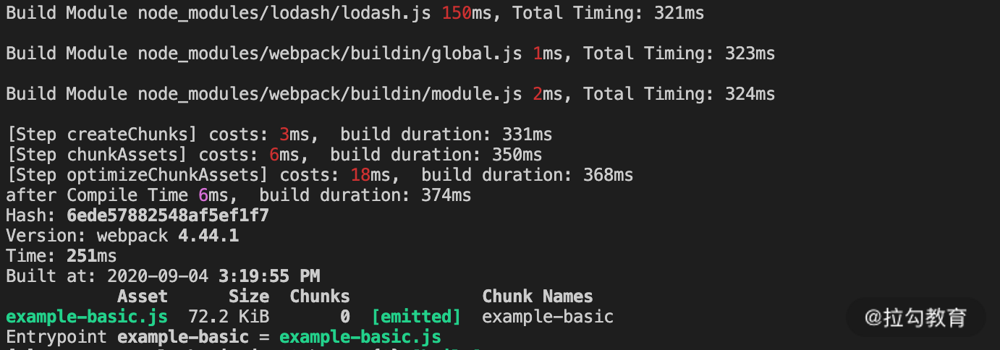
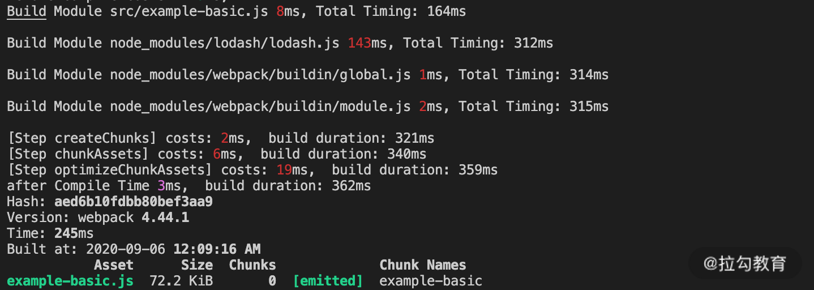
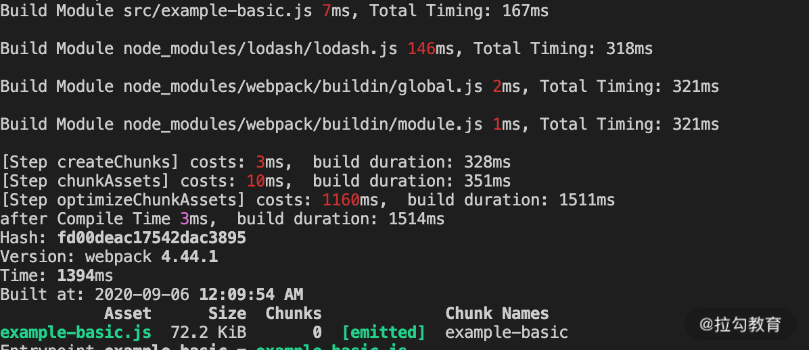

# 13 缓存优化：那些基于缓存的优化方案

上节课的思考题是 Webpack 4 中 Tree Shaking 的触发条件有哪些？我们一起来回忆一下，要让引入的模块支持 Tree Shaking，一般有 4 点需要注意：

1. 引入的模块需要是 ES6 类型的，CommonJS 类型的则不支持。
1. 引入方式不能使用 default。
1. 引用第三方依赖包的情况下，对应的 package.json 需要设置 sideEffects:false 来表明无副作用。
1. 使用 Babel 的情况下，需要注意不同版本 Babel 对于模块化的预设不同。

在前面的两节课中，我们讨论了 Webpack 在编译和优化打包阶段的提效方向，以及各自对应的实践方法。除了这些针对具体处理过程的优化方法外，还有一个特定类型的优化方法没有聊到，就是利用缓存数据来加速构建过程的处理。这节课我们就将介绍它。

### 缓存优化的基本原理

在讲缓存优化的原理之前我们先来看下面的例子，如下面的代码和图片所示（本节课的完整示例代码参见 [13_cache](https://github.com/fe-efficiency/lessons_fe_efficiency/tree/master/13_cache)）：

```
./src/example-basic.js
import _ from 'lodash'
```

 

可以看到，在没有增加任何优化设置的情况下，初次构建时在 optimizeChunkAssets 阶段的耗时是 1000ms 左右，而再次构建时的耗时直接降到了 18ms，几乎可以忽略不计。

这里的原因就在于，Webpack 4 内置了压缩插件 TerserWebpackPlugin，且默认开启了[缓存](https://webpack.js.org/plugins/terser-webpack-plugin/#cache)参数。在初次构建的压缩代码过程中，就将这一阶段的结果写入了缓存目录（node_modules/.cache/terser-webpack-plugin/）中，当再次构建进行到压缩代码阶段时，即可对比读取已有缓存，如下面的代码所示（相关的代码逻辑在插件的[源代码](https://github.com/webpack-contrib/terser-webpack-plugin/blob/master/src/index.js)中可以看到）。

```
terser-webpack-plugin/src/index.js:
...
if (cache.isEnabled()) {
  let taskResult;
  try {
    taskResult = await cache.get(task); //读取缓存
  } catch (ignoreError) {
    return enqueue(task); //缓存未命中情况下执行任务
  }
  task.callback(taskResult); //缓存命中情况下返回缓存结果
  ...
  const enqueue = async (task) => {
    let taskResult;
    if (cache.isEnabled() && !taskResult.error) {
      await cache.store(task, taskResult); //写入缓存
    }
  }
}
```

以上就是 TerserWebpackPlugin 插件中利用缓存的基本原理。事实上，在 Webpack 构建流程中还有许多处理过程支持使用缓存，下面我们就来梳理编译和优化打包阶段分别有哪些任务环境可以用到缓存。

### 编译阶段的缓存优化

编译过程的耗时点主要在使用不同加载器（Loader）来编译模块的过程。下面我们来分别看下几个典型 Loader 中的缓存处理：

#### Babel-loader

[Babel-loader](https://webpack.js.org/loaders/babel-loader/) 是绝大部分项目中会使用到的 JS/JSX/TS 编译器。在 Babel-loader 中，与缓存相关的设置主要有：

- **cacheDirectory**：默认为 false，即不开启缓存。当值为 true 时开启缓存并使用默认缓存目录（./node_modules/.cache/babel-loader/），也可以指定其他路径值作为缓存目录。
- **cacheIdentifier**：用于计算缓存标识符。默认使用 Babel 相关依赖包的版本、babelrc 配置文件的内容，以及环境变量等与模块内容一起参与计算缓存标识符。如果上述内容发生变化，即使模块内容不变，也不能命中缓存。
- **cacheCompression**：默认为 true，将缓存内容压缩为 gz 包以减小缓存目录的体积。在设为 false 的情况下将跳过压缩和解压的过程，从而提升这一阶段的速度。

开启缓存选项前后的构建时长效果如图所示（示例中运行 npm run build:babel），可以看到，由于开启了 Babel 的缓存，再次构建的速度比初次构建时要快了许多。

 

#### Cache-loader

在编译过程中利用缓存的第二种方式是使用 [Cache-loader](https://webpack.js.org/loaders/cache-loader/)。在使用时，需要将 cache-loader 添加到对构建效率影响较大的 Loader（如 babel-loader 等）之前，如下面的代码所示：

```
./webpack.cache.config.js
...
module: {
  rules: [
    {
      test: /\.js/,
      use: ['cache-loader', 'babel-loader'],
    },
  ],
}
...
```

执行两次构建后可以发现，使用 cache-loader 后，比使用 babel-loader 的开启缓存选项后的构建时间更短，如下图所示：

 

主要原因是 babel-loader 中的**缓存信息较少 **，而 cache-loader 中存储的** Buffer 形式的数据处理效率更高**。下面的示例代码，是 babel-loader 和 cache-loader 入口模块的缓存信息对比：

```
//babel-loader中的缓存数据
{"ast":null,"code":"import _ from 'lodash';","map":null,"metadata":{},"sourceType":"module"}
//cache-loader中的缓存数据
{"remainingRequest":"...lessons_fe_efficiency/13_cache/node_modules/babel-loader/lib/index.js!.../lessons_fe_efficiency/13_cache/src/example-basic.js","dependencies":[{"path":"...lessons_fe_efficiency/13_cache/src/example-basic.js","mtime":1599191174705},{"path":"...lessons_fe_efficiency/13_cache/node_modules/cache-loader/dist/cjs.js","mtime":499162500000},{"path":".../lessons_fe_efficiency/13_cache/node_modules/babel-loader/lib/index.js","mtime":499162500000}],"contextDependencies":[],"result":[{"type":"Buffer","data":"base64:aW1wb3J0IF8gZnJvbSAnbG9kYXNoJzs="},null]}
```

### 优化打包阶段的缓存优化

#### 生成 ChunkAsset 时的缓存优化

在 Webpack 4 中，生成 ChunkAsset 过程中的缓存优化是受限制的：只有在 watch 模式下，且配置中开启 [cache](https://v4.webpack.js.org/configuration/other-options/#cache) 时（development 模式下自动开启）才能在这一阶段执行缓存的逻辑。这是因为，在 Webpack 4 中，缓存插件是基于内存的，只有在 watch 模式下才能在内存中获取到相应的缓存数据对象。而在 Webpack 5 中这一问题得到解决，具体的我们会在后续课程中再次展开。

#### 代码压缩时的缓存优化

在上一课时中曾提到，在代码压缩阶段，对于 JS 的压缩，TerserWebpackPlugin 和 UglifyJSPlugin 都是支持缓存设置的。而对于 CSS 的压缩，目前最新发布的 CSSMinimizerWebpackPlugin 支持且默认开启缓存，其他的插件如 OptimizeCSSAssetsPlugin 和 OptimizeCSSNanoPlugin 目前还不支持使用缓存。

TerserWebpackPlugin 插件的效果在本节课的开头部分我们已经演示过了，这里再来看一下 CSSMinimizerWebpackPlugin 的缓存效果对比，如下面的图片所示，开启该插件的缓存后，再次构建的时长降低到了初次构建的 1/4。

 

以上就是 Webpack 4 中编译与优化打包阶段可用的几种缓存方案。接下来我们再来看下在构建过程中使用缓存的一些注意点。

### 缓存的失效

尽管上面示例所显示的再次构建时间要比初次构建时间快很多，但前提是两次构建没有任何代码发生变化，也就是说，最佳效果是在缓存完全命中的情况下。而现实中，通常需要重新构建的原因是代码发生了变化。因此**如何最大程度地让缓存命中**，成为我们选择缓存方案后首先要考虑的事情。

#### 缓存标识符发生变化导致的缓存失效

在上面介绍的支持缓存的 Loader 和插件中，会根据一些固定字段的值加上所处理的模块或 Chunk 的数据 hash 值来生成对应缓存的标识符，例如特定依赖包的版本、对应插件的配置项信息、环境变量等。一旦其中的值发生变化，对应缓存标识符就会发生改变。这也意味着对应工具中，**所有之前的缓存都将失效**。因此，通常情况下我们需要尽可能少地变更会影响到缓存标识符生成的字段。

其中**尤其需要注意的是**，在许多项目的集成构建环境中，特定依赖包由于安装时所生成的语义化版本，导致构建版本时常自动更新，并造成缓存失效。因此，建议大家还是在使用缓存时根据项目的构建使用场景来合理设置对应缓存标识符的计算属性，从而尽可能地减少因为标识符变化而导致缓存失效的情况。

#### 编译阶段的缓存失效

编译阶段的执行时间由每个模块的编译时间相加而成。在开启缓存的情况下，代码发生变化的模块将被重新编译，但不影响它所依赖的及依赖它的其他模块，其他模块将继续使用缓存。因此，这一阶段不需要考虑缓存失效扩大化的问题。

#### 优化打包阶段的缓存失效

优化打包阶段的缓存失效问题则需要引起注意。还是以课程开头的 example-basic 为例，在使用缓存快速构建后，当我们任意修改入口文件的代码后会发现，代码压缩阶段的时间再次变为和初次构建时相近，也就是说，这一 Chunk 的 Terser 插件的缓存完全失效了，如下面的图片所示。

 

之所以会出现这样的结果，是因为，尽管在模块编译阶段每个模块是单独执行编译的，但是当进入到代码压缩环节时，各模块已经被组织到了相关联的 Chunk 中。如上面的示例，4 个模块最后只生成了一个 Chunk，任何一个模块发生变化都会导致整个 Chunk 的内容发生变化，而使之前保存的缓存失效。

在知道了失效原因后，**对应的优化思路也就显而易见了**：尽可能地把那些不变的处理成本高昂的模块打入单独的 Chunk 中。这就涉及了 Webpack 中的分包配置——[splitChunks](https://webpack.js.org/configuration/optimization/#optimizationsplitchunks)。

#### 使用 splitChunks 优化缓存利用率

构建分包的好处有许多，比如合并通用依赖、提升构建缓存利用率、提升资源访问的缓存利用率、资源懒加载等，我们只讨论其中提升构建缓存利用率的部分。在上面示例的基础上，只要对设定稍加更改（webpack.cache-miss.config.js），就会看到，即使变更了入口模块的代码，也不会对压缩阶段的时间产生多少影响，因为主要的依赖包已经分离为独立的 Chunk，如下面的代码和图片所示：

```
./webpack.cache-miss.config.js
...
optimization: {
  splitChunks: {
    chunks: 'all',
  },
},
...
```


### 其他使用缓存的注意事项

#### CI/CD 中的缓存目录问题

在许多自动化集成的系统中，项目的构建空间会在每次构建执行完毕后，立即回收清理。在这种情况下，默认的项目构建缓存目录（node_mo dules/.cache）将无法留存，导致即使项目中开启了缓存设置，也无法享受缓存的便利性，反而因为需要写入缓存文件而浪费额外的时间。因此，在集成化的平台中构建部署的项目，如果需要使用缓存，则需要根据对应平台的规范，将缓存设置到公共缓存目录下。这类问题我们会在第三模块部署优化中再次展开。

#### 缓存的清理

缓存的便利性本质在于用磁盘空间换取构建时间。对于一个大量使用缓存的项目，随着时间的流逝，缓存空间会不断增大。这在只有少数项目的个人电脑中还不是非常大的问题，但对于上述多项目的集成环境而言，则需要考虑对缓存区域的定期清理。

#### 与产物的持久化缓存相区别

这节课我们没有谈到浏览器端加载资源的缓存问题，以及相对应的如何在 Webpack 中生成产物的持久化缓存方法（即那些你可能比较熟悉的 hash、chunkhash、contenthash），因为这一部分知识所影响的是项目访问的性能，而对构建的效率没有影响。希望你在学习时，清楚地区分这两者的区别。

### 总结

今天我们聊了 Webpack 常规构建效率优化的第三个方面：缓存优化主题的内容。Webpack 的构建缓存优化分为两个阶段：编译阶段的针对 Loader 的缓存优化，以及优化打包阶段的针对压缩代码过程的缓存优化。除了了解这些优化的工具和设置外，在使用缓存时还需要额外注意如何减少缓存的失效。此外，针对不同的构建环境，还需要考虑到缓存目录的留存与清理等问题。

这节课的**课后思考题是**：课程中介绍的几种支持缓存的工具在设定上有哪些相似的功能选项？建议你在课后对它们做一个整理对比，以便加深印象。
