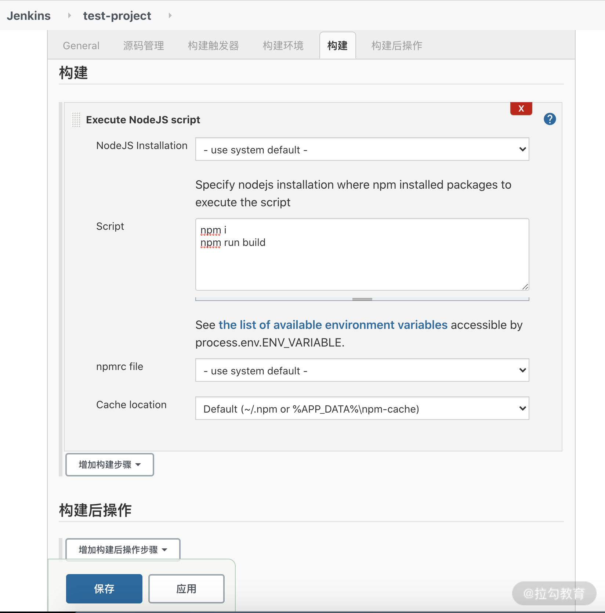
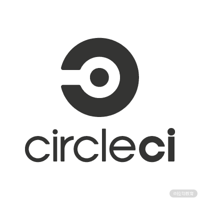
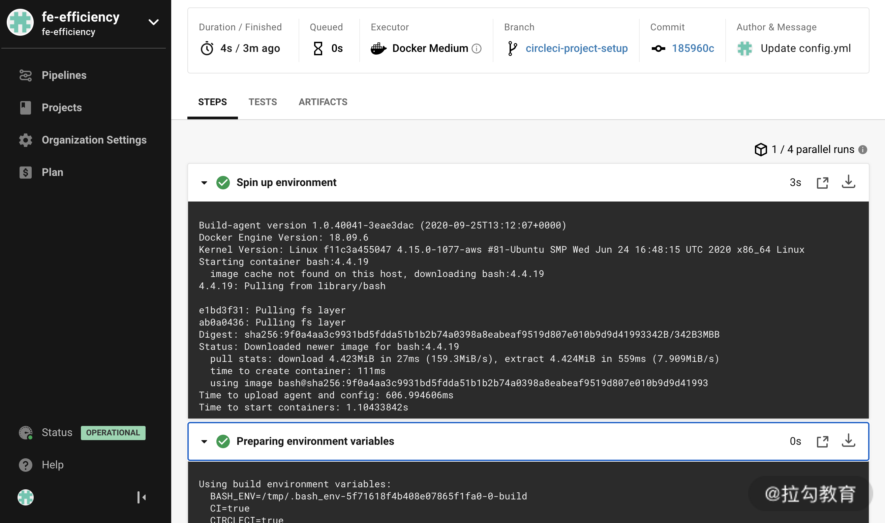
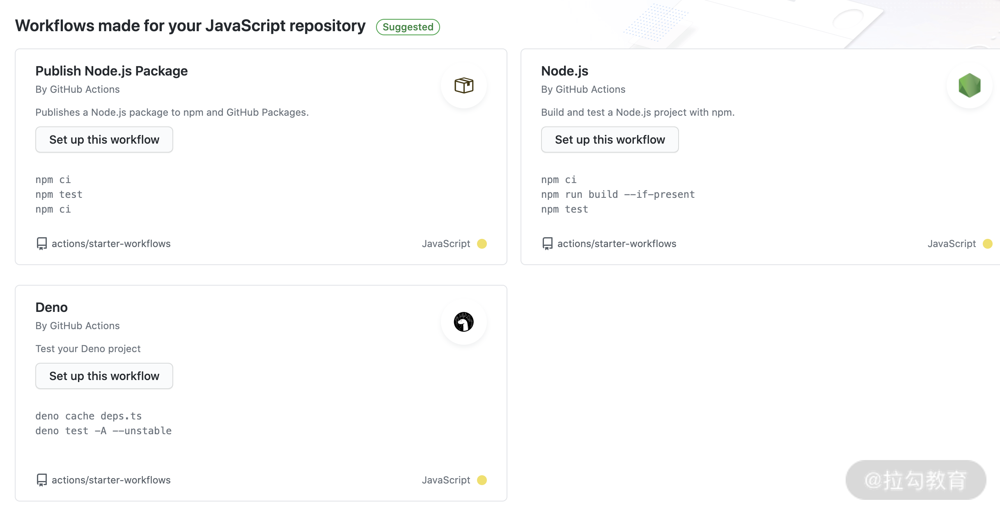
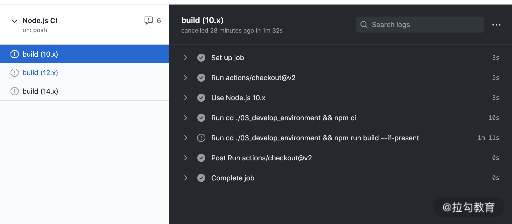

18 工具盘点：掌握那些流行的代码部署工具
=====================

上节课我们通过分析“为什么不在本地环境进行部署”这个问题，来对比部署系统的重要性：一个优秀的部署系统，能够自动化地完整部署流程的各环节，无须占用开发人员的时间与精力，同时又能保证环境与过程的一致性，增强流程的稳定性，降低外部因素导致的风险。此外，部署系统还可以提供过程日志、历史版本构建包、通知邮件等各类辅助功能模块，来打造更完善的部署工作流程。

这节课我就来为你介绍在企业项目和开源项目中被广泛使用的几个典型部署工具，包括 Jenkins、CircleCI、Github Actions、Gitlab CI。

### Jenkins

Jenkins Logo

[Jenkins](https://www.jenkins.io/) 是诞生较早且使用广泛的开源持续集成工具。早在 2004 年，Sun 公司就推出了它的前身 Husdon，它在 2011 年更名为 Jenkins。下面介绍它的功能特点。

#### 功能特点

* **搭建方式**：Jenkins 是一款基于 Java 的应用程序，官方提供了 Linux、Mac 和 Windows 等各系统下的搭建方式，同时也提供了基于 Docker 的容器化搭建方式。此外，Jenkins 支持分布式的服务方式，各任务可以在不同的节点服务器上运行。
* **收费方式**：Jenkins 是完全免费的开源产品。
* **多类型 Job**：Job 是 Jenkins 中的基本工作单元。它可以是一个项目的构建部署流程，也可以是其他类型，例如流水线（Pipeline）。在 Jenkins 中支持各种类型的 Job：自定义项目、流水线、文件夹、多配置项目、Github 组织等。
* **插件系统**：Jenkins 架构中内置的插件系统为它提供了极强的功能扩展性。目前 Jenkins 社区中共有超过[1500 个插件](https://plugins.jenkins.io/)，功能涵盖了继续继承和部署的各个环节。
* **Job 配置**：得益于其插件系统，在 Jenkins 的 Job 配置中可以灵活定制各种复杂的构建与部署选项，例如构建远程触发、构建参数化选项、关联 Jira、执行 Windows 批处理、邮件通知等。
* **API 调用**：Jenkins 提供了 Restful 的 API 接口，可用于外部调用控制节点、任务、配置、构建等处理过程。

Jenkins 中 Job 的基本配置界面

### CircleCI

CircleCI Logo

[CircleCI](https://circleci.com/product/) 是一款基于云端的持续集成服务，下面介绍它的功能特点。

#### 功能特点

* **云端服务**：由于 CircleCI 是一款基于云端的持续集成服务，因此无须搭建和管理即可直接使用。同时也提供了收费的本地化搭建服务方式。
* **收费方式**：CircleCI 的云端服务分为免费与收费两种，免费版本一个账号只能同时运行一个 Job，同时对使用数据量、构建环境等有一定限制。而收费版本则提供了更多的并发构建数、更多的环境、更快的性能等。此外，如第一点所述，企业内部使用的本地化搭建服务方式也是收费的。
* **缓存优化**：CircleCI 的任务构建是基于容器化的，因此能够缓存依赖安装的数据，从而加速构建流程。
* **SSH 调试**：它提供了基于 SSH 访问构建容器的功能，便于在构建错误时快速地进入容器内进行调试。
* **配置简化**：在 CircleCI 中提供了开箱即用的用户体验，只需要少量配置即可快速开始构建项目。
* **API 调用**：CircleCI 中也提供了 Restfull 的 API 接口，可用于访问项目、构建和产物。

CircleCI 项目流水线示例界面

### Github Actions

Github Actions Logo

[Github Actions](https://github.com/features/actions)（GHA）是 Github 官方提供的 CI/CD 流程工具，用于为 Github 中的开源项目提供简单易用的持续集成工作流能力。

#### 功能特点

* **多系统**：提供 Linux、Mac、Windows 等各主流操作系统环境下的运行能力，同时也支持在容器中运行。
* **矩阵运行**：支持同时在多个操作系统或不同环境下（例如不同 NodeJS 版本的环境中）运行构建和测试流程。
* **多语言**：支持 NodeJS、JAVA、PHP、Python、Go、Rust 等各种编程语言的工作流程。
* **多容器测试**：支持直接使用 Docker-Compose 进行多容器关联的测试（而 CircleCI 中则需要先执行安装才能使用）。
* **社区支持**：Github 社区中提供了众多工作流的模板可供选择使用，例如构建并发布 npm 包、构建并提交到 Docker Hub 等。
* **费用情况**：Github Action 对于公开的仓库，以及在自运维执行器的情况下是免费的。而对于私有仓库则提供一定额度的免费执行时间和免费存储空间，超出部分则需要收费。

Github Actions 的工作流模板

Github Actions 中的矩阵执行示例

### Gitlab CI

Gitlab 是由 Gitlab Inc. 开发的基于 Git 的版本管理与软件开发平台。除了作为代码仓库外，它还具有在线编辑、Wiki、CI/CD 等功能。在费用方面，它提供了免费的社区版本（Community Edition，CE）和免费或收费的商用版本（Enterprise Edition，EE）。其中社区版本和免费的商用版本的区别主要体现在升级到付费商用版本时的操作成本。另一方面，即使是免费的社区版本，其功能也能够满足企业内的一般使用场景，因此常作为企业内部版本管理系统的主要选择之一，下面我们就来了解 Gitlab 内置的 CI/CD 功能。

#### 功能特点

* 与前面两款产品相似的是，Gitlab CI 也使用 yml 文件作为 CI/CD 工作流程的配置文件，在 Gitlab 中，默认的配置文件名为 .gitlab-ci.yml。在配置文件中涵盖了任务流水线（Pipeline）的处理过程细节：例如在配置文件中可以定义一到多个任务（Job），每个任务可以指定一个任务运行的阶段（Stage）和一到多个执行脚本（Script）等。完整的 .gitlab-ci.yml 配置项可参考[官方文档](https://docs.gitlab.com/ee/ci/yaml/README.html)。
* **独立安装执行器 **：与前面两款产品不同的是，Gitlab 中需要单独安装执行器。Gitlab 中的执行器 Gitlab Runner 是一个独立运行的开源程序，它的作用是执行任务，并将结果反馈到 Gitlab 中。开发者可以在独立的服务器上[安装](https://docs.gitlab.com/runner/install/index.html)Gitlab Runner 工具，然后依次执行** gitlab-runner register **注册特定配置的 Runner，最后执行** gitlab-runner start**启动相应服务。此外，项目中除了注册独立的 Runner 外，也可以使用共享的或组内通用的 Runner。

当项目根目录中存在.gitlab-ci.yml 文件时，用户提交代码到 Git 仓库时，在 Gitlab 的 CI/CD 面板中即可看到相应的任务记录，当成功设置 gitlab-runner 时这些任务就会在相应的 Runner 中执行并反馈日志和结果。如下图所示：

Gitlab CI/CD 的任务列表示例界面

### 总结

最后我们来做一个总结。在今天的课程里，我们一起了解了 4 个典型 CI/CD 工具：Jenkins、CircleCI、Github Actions 和 Gitlab CI。

* 在这四款工具中，Jenkins 是诞生最早也最广为人知的，它的优点在于插件功能丰富且完全开源免费，因此在企业中应用较多。但缺点在于缺少特定语言环境工作流的配置模板，使用成本相对较高。此外，它的服务器需要独立部署和运维。
* CircleCI 和 Github Actions 都提供了基于容器化的云端服务的能力，提供不同的收费策略以满足普通小型开源项目和大型私有项目的各类需求。两者相比，CircleCI 胜在除了对接 Github 中的项目外，还支持 BitBucket、Heroku 等平台的流程对接。而 Github Actions 则是 Github 项目中内置的 CI/CD 工具，使用成本最低，且提供了矩阵运行、多容器测试、多工作流模板等特色功能。
* Gitlab CI 则是企业中较受欢迎的版本管理工具。Gitlab 中内置 CI/CD 工具，和 CircleCI 与 Github Actions 相同的是，Gitlab CI 也使用 yml 格式的配置文件，不同之处主要在于需要独立安装与配置 Runner。

本节课的课后思考题是：如果你所在的企业需要选择一款 CI/CD 工具，你选择的主要依据有哪些呢？以今天谈到的几款工具为例，谈谈你的选择和想法吧。
