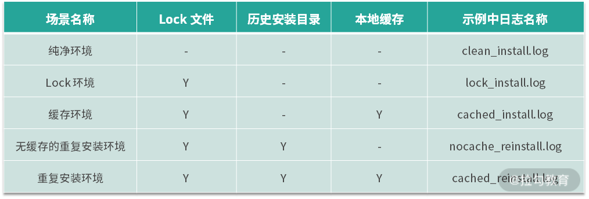

19 安装提效：部署流程中的依赖安装效率优化
======================

上节课我们主要介绍了几个典型的部署工具及其特点。课后的思考题是如果所在企业需要选择一款 CI/CD 工具，你选择的依据有哪些？如果是我会从这几个方面思考：选择付费系统还是免费系统，选择云服务还是自运维，所选的方案是否便于对接上下游系统流程，使用配置是否便捷，对用户而言是否有学习成本......希望这些能为你提供参考。

下面开始本节课的学习。我们在之前的课程中介绍过，前端项目的部署流程包含了代码获取、依赖安装、执行构建、产物打包等阶段，每个阶段的执行过程都有值得关注的效率提升点。在系列课程的第二模块构建效率篇中，我们已经讨论了执行构建阶段的主要优化点，而今天的课程则将详细分析在执行构建的前一个环节——依赖安装阶段中，又有哪些因素会对执行效率产生影响。

### 分析前的准备工作

#### 五种前端依赖的安装方式

我们先来对比 5 种不同的前端依赖安装方式：

* **npm**：npm 是 NodeJS 自带的包管理工具，也是使用最广泛的工具之一。在测试时我们使用它的默认安装命令 npm install，不带额外参数，示例代码参照 [19\_install/with\_npm](https://github.com/fe-efficiency/lessons_fe_efficiency/tree/master/19_install/with_npm)_。_
* **Yarn**：Yarn 是 Facebook 于 2016 年发布的包管理工具，和 npm 5 之前的版本相比，Yarn 在依赖版本稳定性和安装效率方面通常更优（在 Github 中，Yarn 的 star 数量是 npm 的两倍多，可见其受欢迎程度）。在测试时我们同样使用默认安装命令 Yarn, 不带额外参数，示例代码参照 [19\_install/with\_yarn](https://github.com/fe-efficiency/lessons_fe_efficiency/tree/master/19_install/with_yarn)。
* **Yarn with PnP**：Yarn 自 1.12 版本开始支持 PnP 功能，旨在抛弃作为包管理目录的 node\_modules，而使用软链接到本地缓存目录的方式来提升安装和模块解析的效率。在测试时我们使用 yarn --pnp，不带额外参数。示例代码参照 [19\_install/with\_yarn\_p](https://github.com/fe-efficiency/lessons_fe_efficiency/tree/master/19_install/with_yarn_pnp1)[np1](https://github.com/fe-efficiency/lessons_fe_efficiency/tree/master/19_install/with_yarn)。
* **Yarn v2**：Yarn 在 [2020 年初](https://dev.to/arcanis/introducing-yarn-2-4eh1)发布了 v2 版本，它和 v1 版本相比有许多重大改变，包括默认使用优化后的 PnP 等。v2 版本目前通过 Set Version 的方式安装在项目内部，而非全局安装。测试时我们使用安装命令 Yarn，不带额外参数。示例代码参照 [19\_install/with\_yarn\_v2](https://github.com/fe-efficiency/lessons_fe_efficiency/tree/master/19_install/with_yarn_v2)。
* **pnpm**：pnpm 是于 2017 年发布的包管理工具，和 Yarn 相同，它也支持依赖版本的确定性安装特性，同时使用硬连接与符号连接缓存目录的方式，这种方式相比于非 PnP 模式下的 Yarn 安装而言磁盘存储效率更高。测试时我们使用安装命令 pnpm install，不带额外参数。示例代码参照 [19\_install/with\_pnpm](https://github.com/fe-efficiency/lessons_fe_efficiency/tree/master/19_install/with_pnpm)。

#### 依赖安装的基本流程

在对影响效率的问题进行分析之前，我们需要先了解一下前端依赖安装的基本流程阶段划分，这有助于分析不同场景下执行时间的快慢因素，排除各工具的细节差异。前端项目中依赖包安装的主要执行阶段如下：

1.**解析依赖关系阶段 **：这个阶段的主要功能是分析项目中各依赖包的依赖关系和版本信息。
2.** 下载阶段 **：这个阶段的主要功能是下载依赖包。
3.** 链接阶段**：这个阶段的主要功能是处理项目依赖目录和缓存之间的硬链接和符号连接。

那么如何获取执行时间呢？

#### 如何获取执行时间

上面的几种安装方式中，npm 和 Yarn 在执行完成后的输出日志中会包含执行时间，而 pnpm 的输出日志中则没有。不过我们还是可以使用系统提供的 time 命令来获取，方法如下所示：

```
time npm i

time yarn

time pnpm i
```

#### 如何获取执行日志

除了获取安装过程的执行时间外，如果需要进一步分析造成时间差异的原因，就需要从安装过程日志中获取更详细的执行细节，从中寻找答案。不同工具显示详细日志的方式也不同：

* **npm**：使用 npm 安装时需要在执行命令后增加\*\*\*--verbose\*\*\*来显示完整日志。
* **Yarn v1 **：Yarn v1 版本（包括 Yarn --PnP）的实现方法和 npm 一样，即通过增加**\--verbose** 来显示完整日志。
* **Yarn v2**：Yarn v2 版本默认显示完整日志，可通过 --json 参数变换日志格式，这里使用默认设置即可。
* **pnpm **：pnpm 安装时需要在执行命令后增加**\--reporter ndjson**来显示完整日志。

#### 环境状态的五个分析维度

在确定了安装工具和分析方式后，我们还需要对执行过程进行划分，下面我一共区分了 5 种项目执行安装时可能遇到的场景：



> 注 1：除了第一种纯净环境外，后面的环境中都存在 Lock 文件。因为 Lock 文件对于提供稳定依赖版本至关重要。出于现实场景考虑，这里不再单独对比没有 Lock 文件但存在历史安装目录的场景。 注 2： 为了屏蔽网络对解析下载依赖包的影响，所有目录下均使用相同注册表网址 registry.npm.taobao.org。 注 3：以下时间统计的默认设备为 MacOS，网速约为 20Mbit/s。

### 不同维度对安装效率的影响分析

#### 纯净环境

首先来对纯净环境进行分析，不同安装方式的执行耗时统计如下：


> 注 1：总安装时间为执行后显示的时间。而各阶段的细分时间在日志中分析获取。 注 2：在 pnpm 的执行过程中并未对各阶段进行完全分隔，而是针对不同依赖包递归执行各阶段，这种情况在**纯净环境中尤其明显**，因此阶段时间上不便做单独划分。

对结果的分析如下：

* 在总体执行时间上，npm < pnpm < Yarn v1 --PnP < Yarn v1 < Yarn v2（根据[其他统计](https://github.com/pnpm/benchmarks-of-javascript-package-managers)，纯净环境下的执行时间是 pnpm < Yarn v1 --PnP < Yarn v1 < npm，推测主要是设备带宽等环境区别造成）。
* 在解析依赖阶段和下载阶段，npm 略快于 Yarn v1，主要原因是 Yarn 将网络并发数设置为 **8 **（源码中搜索 NETWORK\_CONCURRENCY 可见），而 npm 中的并发数则是** 10**（源码中搜索 npm.limit 可见）。而 Yarn v2 在这两个阶段中性能尤其缓慢，原因可能是其在设计上的重大变更——在相应阶段中引入了更复杂的依赖分析算法和对下载包的额外处理。
* 在链接阶段，npm 耗时小于 Yarn v1 而大于 Yarn v1 --PnP，原因在于 npm 在下载阶段中处理了文件写入安装目录的过程，Yarn v1 则在链接阶段进行写入，而 Yarn v1 --PnP 则直接使用软硬链接而非复制文件，因此效率更高。Yarn v2 一方面因为同样采用软硬链接的方式，另一方面链接的数据为 Zip 压缩包而非二进制缓存，因此效率中等。

#### Lock 环境

然后我们来考察 Lock 文件对于安装效率的影响。和第一种最纯净的情况相比，带有 Lock 文件的情况通常更符合现实中项目在部署环境中的初始状态（因为 Lock 文件可以在一定程度上保证项目依赖版本的稳定性，因此通常都会把 Lock 文件也保留在代码仓库中）。引入 Lock 文件后，不同安装工具执行安装的耗时情况如下：


> 注 1： Yarn 解析依赖阶段日志未显示耗时，因此标记为 0 秒。

对结果的分析如下：

* 从总的执行时间上看，Lock 文件的存在对于各安装工具而言都起到了积极的作用，安装时间都有一定程度的缩短。
* 进一步细分安装各阶段可以发现， **Lock 文件主要优化的是依赖解析阶段的时间** ，即在 Lock 文件存在的情况下，项目在安装时直接通过 Lock 文件获取项目中的具体依赖关系与依赖包的版本信息，因此这一阶段的耗时大多趋近于零。

#### 缓存环境

缓存环境是在部署服务中可能遇到的一种情形。项目在部署过程中依赖安装时产生了本地缓存，部署结束后项目工作目录被删除，因此再次部署开始时工作目录内有 Lock 文件，也有本地缓存，但是不存在安装目录。这种情形下的耗时统计如下：


对结果的分析如下：

* 从执行时间上看，各类型的安装方式的耗时都明显下降。
* 从细分阶段的耗时情况可以发现， **本地缓存主要优化的是下载依赖包阶段的耗时** ，即在本地缓存命中的情况下免去了通过网络请求下载依赖包数据的过程。对于使用 npm 的项目而言，这一阶段还剩下解压缓存写入安装目录的耗时。对于使用 Yarn 的项目而言，这一阶段没有其他处理，直接略过。对于 pnpm 的项目而言，这一阶段的处理中还剩下从缓存硬链接到项目安装目录的过程。

#### 无缓存的重复安装环境

无缓存的重复安装环境在本地环境下部署时可能遇到，即当本地已存在安装目录，但人工清理缓存后再次执行安装时可能遇到。这种情况的耗时如下：


对结果的分析如下：

* 从上面的表格中可以看到，存在安装目录这一条件首先 **对链接阶段能起到优化的作用** 。对于下载阶段，除了使用 PnP 的两种安装方式外，当项目中已存在安装目录时，下载阶段耗时也趋近于零。其中 Yarn v1 表现最好，各主要阶段都直接略过，而 npm 和 pnpm 则多少还有一些处理过程。
* 而使用 PnP 的两种安装方式因为内部机制依赖缓存，本身不存在 node\_modules，因此在清除本地缓存的情况下仍需完整经历远程下载过程，只不过由于其他安装后文件的存在（例如 .pnp.js），使得链接阶段的耗时相比 Lock 环境而言有所下降。

#### 有缓存的重复安装环境

最后是安装目录与本地缓存都存在的情况，耗时如下：


对结果的分析如下：

* 无论对于哪种安装方式而言，这种情况都是最理想的。可以看到，各安装工具的耗时都趋近于零。其中尤其对于 Yarn v1 而言效率最高，而 pnpm 次之，npm 相对最慢。

### 对不同安装工具和不同安装条件的效率总结

#### 不同安装条件

下面我们进行一个总结，首先来看不同安装条件下的效率情况：

1. 对于项目的依赖安装过程来说，效率最高的 3 个条件是：存在 Lock 文件存在，存在本地缓存存在和存在安装记录。
2. 这 3 个条件中，Lock 文件的留存是 **最容易做到的，也是最可能被忽略的** 。大部分项目也都会保留在代码仓库中。不过据我观察也存在不提交 Lock 文件的情况，即在一些多人维护的项目中，因为害怕处理冲突而主动忽略了 Lock 文件，这是应该尽量避免的。
3. 本地缓存则是当安装记录不存在时**最重要的优化手段。** 对于大部分部署系统而言，本地缓存通常也是会默认保留在部署服务器上的。因此需要注意的更多是磁盘空间与效率的平衡。此外需要注意在部署服务的个别项目中，执行清除缓存的操作也会影响其他项目。
4. 本地安装记录对于部署系统而言需要占据较多的磁盘空间，因此在多数情况下，部署系统默认不保留安装目录。项目中如需考虑这一优化点，建议确认所使用的部署系统是否支持相关设定。
5. 在安装条件方面，其实还有一些额外的不容易量化的条件，例如网速、磁盘 I/O 速度等，对于部署服务而言，这些硬件条件的好坏也会直接影响用户的使用效率。这里不再展开。

#### 不同安装工具

然后我们对不同安装工具的效率情况进行总结：

1.单从效率而言，各工具在不同安装条件下的优劣各有不同：

* 如果考虑各种场景下的综合表现，pnpm 是最稳定高效的，其他工具在不同场景下多少都有表现不佳的情况。
* 如果考虑现实情况中，在部署环境下大多可以支持 Lock 文件和本地缓存的留存，并且部分系统中也会保留安装目录，则 Yarn v1 是更好的选择。
* 如果考虑只有 Lock 文件的情况，则 npm 的表现要优于 Yarn。
* 在无安装目录的情况下，Yarn v1 的 PnP 模式效率要高于普通模式。
* 尽管 Yarn v2 在无缓存的情况都表现不佳，但是它有一点优势是其他方式无法替代的，即支持针对单个项目清除缓存而不影响全局。

2.不同的安装工具除了对安装过程的效率会有影响外，对构建过程也会产生影响。Yarn v1 普通模式可以作为 npm 的直接替代，不对构建产生影响。而剩下的 PnP 模式、Yarn v2 和 pnpm 则因为依赖存储的方式不同，在构建解析时多少会有差异。因此在项目中选择工具时需要综合考虑。

### 总结

这节课主要讨论了部署流程中的依赖安装环节的执行细节问题。依赖安装常常是一个容易被忽视的环节，但是其中又有很多对执行效率产生影响的因素，不同的安装方式和安装环境条件都可能对执行效率产生影响。

希望通过今天的课程，你可以掌握不同条件下的执行效率区别，并应用到实际项目中。今天的课后思考题是：如果项目中使用的是 npm，在最佳条件下，是否可以像 Yarn 那样耗时更趋近于零呢？试着从部署系统的角度考虑看看有没有解决方案。
