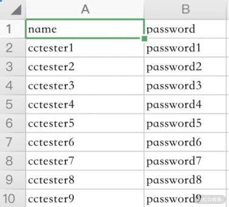

# 02 JMeter 参数化策略

上一讲我梳理了 JMeter 的核心概念，希望你能够通过课程去理解并灵活的应用到实际工作中。这一讲我会带你学习一个重要的知识点：参数化。无论是从使用频率还是从参数化对性能测试结果的影响，它都是你做性能测试必须要掌握的。

### 参数化是什么

简单来说，参数化就是选取不同的参数作为请求内容输入。使用 JMeter 测试时，测试数据的准备是一项重要的 工作。若要求每次传入的数据不一样，就需要进行参数化了。

### 为什么要进行参数化

刚才说到，若要求每次传入的数据不一样，就需要进行参数化。那为什么会有这种要求呢？我们来看两个场景。

- **数据被缓存导致测试结果不准确**

缓存原本是为了让数据访问的速度接近 CPU 的处理速度而设置的临时存储区域，比如 cache。如今缓存的概念变得更广了，很多空间都可以设置客户端缓存、CDN 缓存等等。

当你频繁地请求某一条固定的数据时，这条数据就很容易被缓存，而不是每次都从数据库中去获取，这就可能导致和真实的场景有差别。

比如大促有 10w 用户会从获取不同的商品信息，而你的压测中并没有进行充分的参数化，此时用大量线程反复请求同一件商品，极有可能访问的是缓存数据。从业务逻辑看接口返回并没有问题，但这样的场景几乎不会发生，这就会导致无效压测，测试的结果并没有多少意义。

- **流程不能正常执行**

数据被缓存可能会导致测试结果不准确，但至少业务能够走通。还有的情况是，在没有参数化的情况下，会产生大量的业务报错。

打个比方，你在测试限购商品抢购，如果用多线程模拟同一个用户操作可能会直接报错，因为在生成订单接口（支付等）都会判断是否是同一个用户。

在要求每次传入的数据不一样时，如果不进行参数化会造成很多问题，以上我列举的两个场景基本概括了没有参数化时会发生的问题，希望你能在性能测试时多加注意。下面我们就来看如何实现 JMeter 参数化。

### JMeter 参数化的实现方式

我列举了 3 种比较常见的 JMeter 参数化的实现方式，你可以根据自己的需要进行选择。

- **CSV Data Set Config** ：将参数化的数据放入文件中，参数化读取依赖于文件操作。这样的参数化方式很常用， **尤其适用于参数化数据量较多的场景** ，而且维护比较简单灵活。
- **User Defined Variables** ：一般来说可以配置脚本中的公共参数，如域名，端口号，不需要随着压测进行动态改变， **比较方便环境切换** 。
- **Function Helper 中的函数** ：使用函数的方式生成参数，如果你需要随机数、uuid 等都可以使用函数生成。JMeter 还提供了相应的接口给你二次开发，自定义需要的功能。

#### CSV Data Set Config

CSV Data Set Config 的可配置选项较多，也是目前性能测试参数化时使用最多的插件，这里我就重点介绍一下 CSV Data Set Config。

在配置组件中添加元件 CSV Data Set Config，如下图所示：


图 1：CSV Data Set Config

我们来看一下 CSV Data Set Config 各项的含义。 **文件名** ：顾名思义，这里填写文件的名字即可。

保存参数化数据的文件目录，我这边是将 user.csv 和脚本放置在同一路径下。在这里我要推荐一个小技巧，就是“ **相对路径** ”。使用绝对路径，在做脚本迁移时大部分情况下都需要修改。如果你是先在 Windows 或 Mac 机器上修改脚本，再将脚本上传到 Linux 服务器上执行测试的，那你就可以用相对路径，这样就不用频繁修改该选项了。 **文件编码** ：指定文件的编码格式，设置的格式一般需要和文件编码格式一致，大部分情况下保存编码格式为 UTF-8 即可。 **变量名称** ：对应参数文件每列的变量名，类似 Excel 文件的文件头，主要是作为后续引用的标识符，一般使用英文。如下图所示：



图 2：user.csv

图中我标示了 name 和 password，相对应 user.csv 中的第一列和第二列。

那如何引用需要的文件数据？通过“{变量名称}”就可以了，如下图所示：


图 3：引用演示图 **忽略首行** ： 第一行不读取。比如图 2 的第一行我只是标示这一列是什么类型的数据，实际上并不是需要读取的业务数据，此时就可以采用忽略首行。 **分隔符** ：用来标示参数文件中的分隔符号，与参数文件中的分隔符保持一致即可。 **遇到文件结束符再次循环** ：是否循环读取参数文件内容。因为 CSV Data Set Config 一次读入一行，如果设置的循环次数超过文本的行数，标示为 True 就是继续再从头开始读入。 **遇到文件结束符停止线程** ：读取到参数文件末尾时，是否停止读取线程，默认为 False。如果“遇到文件结束符再次循环”已经设置为 True 了，这个选项就没有意义了。 **线程共享模式** ：这个适用范围是一个脚本里多线程组的情况。所有线程是默认选项，代表当前测试计划中的所有线程中的所有的线程都有效；当前线程组代表当前线程组中的线程有效；当前线程则表示当前线程有效。一般情况下，我们选择默认选项“所有线程”就好，“当前线程组”和“当前线程”很少会用到。

上面我介绍了参数化的意义以及常见用法，参数化对于性能测试是基础且必需的，因为在性能场景中，很多时候不进行参数化，脚本也是可以跑通的，所以有一些测试同学在这方面就会“偷工减料”，但这会造成性能数据不准确。下面，我们就来看一种特殊的参数化：关联。

### 特殊的参数化：关联

关联是将上个请求的数据提取需要的部分放到下个请求中，通过关联我们可以获取到满足业务特性的不同数据，因此可以认为是一种特殊的参数化。

#### 关联的使用场景

我们来看一个例子，从例子中了解关联解决了什么问题。

我编写了一个查看订单接口，运行完成没有问题，并且返回正确的结果，如下所示：

```
{"data":{"code":0,"count":16,"items":[{"actualPrice":8900,"gmtCreate":1601448530000,"id":357,"orderNo":"1012020091448501002","skuList":[{"barCode":"150004","gmtCreate":1601448530000,"gmtUpdate":1601448530000,"id":389,"img":"https://demo.oss-cn-shenzhen.aliyuncs.com/bg/86338c9e576342baa0d079bc1caef9cc.jpg","num":1,"orderId":357,"orderNo":"1012020091448501002","originalPrice":10690,"price":8900,"skuId":2777,"spuId":1236771,"spuTitle":"昵趣 NaTruse 山羊奶配方狗狗洁齿骨 盒装 20g*40 支","title":"山羊奶","unit":"盒"}],"status":90},"msg":"第 1 页,共 1 条","pageNo":1,"pageSize":1，"total":1，"totalPageNo":2},"errmsg":"成功","errno":200,"timestamp":1609219480400}
```

一个小时之后，我再来运行这个接口时，却发现返回用户未登录：

```
 {"errmsg":"用户尚未登录","errno":10001,"timestamp":1609220170295}
```

在所有入参都没有修改的情况下为什么会出现这样的情况呢？因为你看到返回的信息是用户未登录，也就是说用户信息是无效的。

这个接口使用 Token 验证用户，Token 有效期为 15 分钟，刚刚问题产生的原因就是 Token 过期了。

那如何保证查看订单接口信息中需要的 Token 都是有效的呢？其中一个方法就是查看订单接口之前调用登录接口获取 Token，把登录接口的 Token 传入查看订单接口中。这个过程其实就是“关联”。

#### JMeter 如何实现关联

JMeter实现关联有 3 种方式：边界提取器，通过左右边界的方式关联需要的数据；Json Extractor提取器，针对返回的 json 数据类型；正则表达式提取器，通过正则表达式去提取数据，实现关联。

正则表达式提取器是最为常用，也是这里我要向你介绍的关联方式。我们来看下面的例子：


图 4：正则表达式提取器

我们来看一下正则表达式提取器中每一项的含义。

- **引用名称** ：自己定义的变量名称以及后续请求将要引用到的变量名。在图中我填写的是“token”，则引用方式是“${token}”。
- **正则表达式** ：提取内容的正则表达式。“( )”括起来的部分就是需要提取的，“.”点号表示匹配任何字符串，“+”表示一次或多次，“？”表示找到第一个匹配项后停止。
- **模板** ：用“$ $”引用，表示解析到的第几个值给 token，图 4 中的正则表达式如下：

```
"accesstoken":(.+?),"gender":(.+?)
```

$1$ 表示匹配的第一个值，即 accesstoken 后匹配后的值，模板 $2$ 则匹配 gender 后的值。图 4 演示的实例中只有 1 个 token 值，所以使用的 $1$。

- **匹配数字** ：0 代表随机取值，1 代表第一个值。假设我返回数据的结构是：

```
[{"accesstoken":"ABDS88WDWHJEHJSHWJW","gender":null},{{"accesstoken":"NDJNW3U98SJWKISXIWN","gender":null}]
```

此时提取结果是一个数组，accesstoken 对应了多个值相当于数组，1 代表匹配第一个 accsstoken 的值“ABDS88WDWHJEHJSHWJW”。

- **缺省值** ：正则匹配失败时的取值。比如这里我设置的是 null（token 值取不到时就会用 null 代替）。上面我们已经匹配了 token 值，在被测接口传参处直接用“${token}”就可以了。


图 5：关联 Token

关联后就可以看到，每次都能进行正常的业务返回了。


图 6：关联后正常业务返回

### 总结

这一讲我介绍了参数化策略以及使用场景。作为性能测试中最常用到的操作，你不仅要学会基本操作，还需要思考参数化策略适合的场景以及参数化数据对性能测试的影响。说到这里，我就要问一个问题了：不同的参数对性能结果会不会有影响？

举个例子，在电商系统中，你准备了不同的用户数据，用户又分为不同的等级，不同的等级可能有不一样的优惠规则和对应的优惠券，每个会员的优惠券数量可能也不一样，那这些不同的会员信息分布会对性能测试的结果有什么样的的影响？欢迎在评论区给出你的思考。
