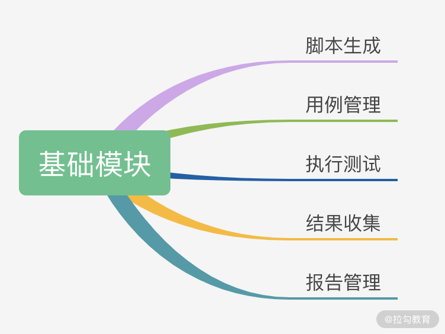
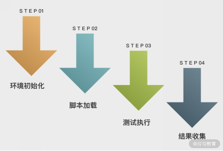

05 如何基于 JMeter API 开发性能测试平台？
============================

上一讲我带你学习了 JMeter 二次开发，通过对 JMeter 提供的接口或者抽象类方法重写可以自定义所需要的 JMeter 插件。这一讲我将带你了解如何开发一个性能测试平台。

目前测试界比较热门的一个方向就是 **开发测试平台** ，平台级别的性能测试能减少重复劳动、提升效率，也方便统一管理，自然受到了市场的欢迎，测试平台开发能力也成了资深测试人员的必备技能之一。

本专栏，我们应用的主要性能测试工具是 JMeter，那开发性能测试平台需要什么样的能力呢？我认为需要以下能力：

* **具备较好的 Java 开发能力**，JMeter 本身是 Java 开发，提供了较多的接口，所以使用 Java 开发具备天然的优势；
* 平台主要通过 Web 网页展示，需要具备较好的 **前端开发能力** ，目前 Vue 是比较流行的前端框架；
* **熟悉 JMeter 源码结构**，尤其是 JMeter 提供的相关 API。

### 构建性能测试平台的必要性

为什么我会如此推荐你去开发性能测试平台呢？回想一下你在工作中是否遇到过以下场景：

* B 同学如果需要 A 同学写完的脚本，A 只能单独发给 B，如果 A 的脚本有变化，不能实时同步到 B，而且发送的过程也存在 **沟通成本和时间差** ；
* 测试执行后，需要将测试结果同步给开发者，很多测试都是手动截图，不仅方式原始而且还会存在 **信息缺失** 的情况；
* 结果追溯时，我们需要找一些历史数据却发现并没有 **存档或共享** 。

这些场景使我们的性能测试平台具有了更多现实意义，我们希望有一个 **可以协作共享** ，并能够 **追溯历史数据的性能测试平台** 。基于这点我梳理了性能测试平台的基础功能，如下图所示：



图 1：性能测试平台基础功能

目前市面上的性能测试平台大多是基于 JMeter 提供的 API 开发的，核心流程如下图所示：



图 2：性能测试平台开发核心流程

接下来我们根据这 4 个阶段来学习如何使用 JMeter 的 API 实现性能测试。

### 环境初始化

JMeter API 在执行过程中，首先会读取 JMeter 软件安装目录文件下配置文件里的属性，所以我们要通过 JMeter API 读取指定的 JMeter 主配置文件的目录以及 JMeter 的安装目录；此外，我们还需要初始化 JMeter API 运行的 **语言环境** （默认是英语）和 **资源** 。以上便是 JMeter API 做初始化的目的。

其中环境初始化主要包括以下 2 个步骤：

1. 通过 JMeterUtils.loadJMeterProperties 加载安装目录的 JMeter 主配置文件 JMeter.properties，然后把 jmeter.properties 中的所有属性赋值给 JMeterUtils 对象，以便在脚本运行时可以获取所需的配置；
2. 设置 JMeter 的安装目录，JMeter API 会根据我们指定的目录加载脚本运行时需要的配置，例如 saveservice.properties 配置文件中的所有配置。

参考代码如下：

```
JMeterUtils.loadJMeterProperties("C:/Program Files/JMeter/bin/jmeter.properties");


JMeterUtils.setJMeterHome("C:/Program Files/JMeter");


JMeterUtils.initLocale();

```

这样一来，我们就实现了环境初始化，代码中的目录可以根据自己实际的目录设置。

### 脚本加载

脚本加载可以构建 HashTree，然后把构建的 HashTree 转成 JMeter 可执行的测试计划，进而执行测试用例。HashTree 是 JMeter API 中不可缺少的一种数据结构，在 JMeter API 中，HashTree 有 2 种构建方式，分别是 **本地脚本加载** 和**创建脚本文件**。

先来说**本地脚本加载**的方式。用 JMeter 客户端手动生成 jmx 脚本文件后，我们可以通过 SaveService.loadTree 解析本地的 jmx 文件来运行脚本，核心步骤如下：

```
//加载本地 jmx 脚本


HashTree jmxTree = SaveService.loadTree(file);

```

由于本地脚本是 JMeter 客户端手动生成的，所以这里只需要做读取文件操作即可，loadTree 会把 jmx 文件转成内存对象，并返回内存对象中生成的 HashTree。

那**创建脚本文件**是怎么做的呢？它是通过 API 构建测试计划，然后再保存为 JMeter 的 jmx 文件格式。核心步骤如下图所示：


图 3：脚本文件创建步骤

该方式需要自己构建 HashTree，我们可以参考 JMeter 客户端生成的 jmx 文件。

通过观察 jmx 文件我们可以知道需要构建的 jmx 结构，最外层是 TestPlan，TestPlan 是 HashTree 结构，包含 ThreadGroup（线程组）、HTTPSamplerProxy、LoopController（可选）、ResultCollector（结果收集）等节点。

接下来我将讲解 JMeter API 创建脚本文件的 6 个步骤，这 6 个步骤也是我们通过 JMeter 客户端创建脚本最常用的步骤，它们依次是创建测试计划、创建 ThreadGroup、创建循环控制器、创建 Sampler、创建结果收集器以及构建 tree，生成 jmx 脚本。**（1）创建测试计划**先生成一个 testplan，之后所有的测试活动都在 testplan 下面进行。代码如下：

```
try {


    TestPlan testPlan = new TestPlan("创建 JMeter 测试脚本");


    testPlan.setProperty(TestElement.TEST_CLASS, TestPlan.class.getName());


    testPlan.setProperty(TestElement.GUI_CLASS, TestPlanGui.class.getName());


    testPlan.setUserDefinedVariables((Arguments) new ArgumentsPanel().createTestElement());

```

通过以上代码，我们生成了 testplan。**（2）创建 ThreadGroup**ThreadGroup 是我们平时使用的线程组插件，它可以模拟并发用户数，一个线程通常认为是模拟一个用户。代码如下：

```
    ThreadGroup threadGroup = new ThreadGroup();


    threadGroup.setName("Example Thread Group");


    threadGroup.setNumThreads(1);


    threadGroup.setRampUp(1);


    threadGroup.setSamplerController(loopController);


    threadGroup.setProperty(TestElement.TEST_CLASS, ThreadGroup.class.getName());


    threadGroup.setProperty(TestElement.GUI_CLASS, ThreadGroupGui.class.getName());

```

以上是我们使用 JMeter API 创建 ThreadGroup 的代码，它实现了我们线程数的设置，如启动设置等。**（3）创建循环控制器**这一步是一个可选项。我们在实际测试过程中，可以选择多线程的循环或者按时间段进行。创建循环控制器是为了模拟一个用户多次进行同样操作的行为，不创建循环控制器则默认是只执行一次操作。循环控制器创建的代码如下：

```
    LoopController loopController = new LoopController();


    //设置循环次数，1 代表循环 1 次


    loopController.setLoops(1);


    loopController.setFirst(true);


    loopController.setProperty(TestElement.TEST_CLASS, LoopController.class.getName());


    loopController.setProperty(TestElement.GUI_CLASS, LoopControlPanel.class.getName());


    loopController.initialize()

```** （4）创建 Sampler **这一步来创建我们的实际请求，也是我们 JMeter 真正要执行的内容。以 HttpSampler 为例，创建 HttpSampler 是为了设置请求相关的一些信息，JMeter API 执行脚本的时候就可以根据我们设置的一些信息（比如请求地址、端口号、请求方式等）发送 HTTP 请求。

```

    // 2.创建一个 HTTP Sampler - 打开 本地一个模拟地址


    HTTPSamplerProxy httpSamplerProxy = new HTTPSamplerProxy();


    httpSamplerProxy.setDomain("127.0.0.1:8080/index");


    httpSamplerProxy.setPort(80);


    httpSamplerProxy.setPath("/");


    httpSamplerProxy.setMethod("GET");


    httpSamplerProxy.setName("Open ip");


    httpSamplerProxy.setProperty(TestElement.TEST_CLASS, HTTPSamplerProxy.class.getName());


    httpSamplerProxy.setProperty(TestElement.GUI_CLASS, HttpTestSampleGui.class.getName());

```

以上按照一个 HTTP 的请求方式设置了 IP、端口等。** （5）创建结果收集器 **结果收集器可以保存每次 Sampler 操作完成之后的结果的相关数据，例如，每次接口请求返回的状态、服务器响应的数据。

我们可以根据结果数据做一些性能指标计算返回给前端，如果在这里创建了结果收集器，那第 4 个阶段“结果收集”中就不用再创建了。创建代码如下：

```

    ResultCollector resultCollector = new ResultCollector();


    resultCollector.setName(ResultCollector.class.getName());

```** （6）构建 tree，生成 jmx 脚本 **以上第 2 步到第 5 步其实都是创建了一个 HashTree 的节点，就像我们用准备好的零件去拼装一辆赛车。我们把创建的这 4 个节点都添加到一个新建的子 HashTree 节点中，然后把子 HashTree 加到第 1 步的 testplan 中，最后再把 tesplan 节点加到构建好的父 HashTree 节点，这样就生成了我们的脚本可执行文件 jmx。代码如下：

```

    HashTree subTree = new HashTree();


    subTree.add(httpSamplerProxy);


    subTree.add(loopController);


    subTree.add(threadGroup);


    subTree.add(resultCollector);


    HashTree tree = new HashTree();


    tree.add(testPlan,subTree);


    SaveService.saveTree(tree, new FileOutputStream("test.jmx"));

} catch (IOException e) {

    e.printStackTrace();

}

```

通过以上代码我们可以创建出 JMeter 可识别的 HashTree 结构，并且可以通过 saveTree 保存为 test.jmx 文件。

到这里我们就完成了创建脚本文件的流程。我在这一讲的开始提到：** 脚本加载可以构建 HashTree **，** 然后把构建的 HashTree 转成 JMeter 可执行的测试计划 **，** 进而执行测试用例**。因此，我们接下来进入第 3 个阶段：测试执行。

### 测试执行

通过脚本文件的执行（测试执行），我们便可以开始对服务器发起请求，进行性能测试。测试执行主要包括 2 个步骤：

1.  把可执行的测试文件加载到 StandardJMeterEngine；
2.  通过 StandardJMeterEngine 的 run 方法执行，便实现了 Runable 的接口，其中 engine.run 执行的便是线程的 run 方法。

```

//根据 HashTree 执行测试用例

StandardJMeterEngine engine = new StandardJMeterEngine();

engine.configure(jmxTree);

engine.run();

```

通过以上代码，我们完成了代码方式驱动 JMeter 执行的核心步骤。

### 结果收集

性能实时数据采集可以更方便发现和分析出现的性能问题。我们在性能测试平台的脚本页面点击执行了性能测试脚本，当然希望能看到实时压测的性能测试数据，如果等测试完再生成测试报告，时效性就低了。

性能测试平台结果收集的流程图如下：


图 4：结果收集流程图

上面流程图中与 JMeter 关联最密切的是第 1 步，获取 JMeter 结果数据。那我们如何获取这些数据呢？

JMeter 性能测试用例执行完成之后会生成结果报告，既然生成了结果报告，那 JMeter 源码里一定有获取每次 loop 执行结果的地方。我们可以找到这个类，然后新建一个类去继承这个类，再重写每次结果获取的方法就能得到实时结果了。如果获取每次 loop 执行结果的是私有方法，我们也可以通过反射拿到它。

既然是这样，那关键就是找到， JMeter 执行中是在哪个类、哪个方法里拿的每次 loop 的结果。

通过查看 JMeter API 可以发现，JMeter API 提供了一个结果收集器（ResultCollector），从结果收集器的源码中可以找到获取每次 loop 执行结果的方法。结果收集器的部分源码如下所示：

```

/**

* When a test result is received, display it and save it.

*

* @param event

*            the sample event that was received

*/

@Override

public void sampleOccurred(SampleEvent event){...}

```

分析以上代码得知，我们可以重写 sampleOccurred 方法来收集每次 loop 的结果。该方法的参数 SampleEvent 中有我们需要的实时监控数据，这样实时监控就变得简单了。接下来，我以 **单客户端获取 QPS 实时监控数据** 为例，讲解性能测试平台结果收集相关代码实现的思路。

单客户端获取 QPS 实时监控数据，首先需要新建一个类继承 ResultCollector，并且重写 sampleOccurred 方法，但是这里有个问题： **怎么接收 SampleEvent 里面的实时监控数据，或者说怎么取出来在我们的业务代码里应用呢** ？我们可以在 sampleOccurred 把监控数据存起来，然后写个接口读取存储的数据返回给前端。

图 4 中有一个中间件，这个中间件可以是 **内存数据库** ，也可以是 **消息组件** ，根据中间件的不同有以下 2 种实现方式。

1.  **把需要的监控数据存在静态 map 里 **，** 接口读取 map 里的数据返回给前端 **。这种方法虽然有利于初学者快速实现，但它的数据是存在内存中的 ，并且没有做持久化处理，容易出现丢失的情况，所以我们一般只在演示中使用。
2.** 把数据存到消息队列里面 **，** 接口将消费队列的数据返回给前端**。这是目前在互联网公司中较为常用的使用方式，在高并发下可靠性也不错。

下面我来讲解下第 2 种方式的代码：

*   新建一个类继承 ResultCollector 重写 sampleOccurred 方法，使用 Kafka 接收消息；

```

public class CCTestResultCollector extends ResultCollector {

    public static final String REQUEST_COUNT = "requestCount";


    public CCTestResultCollector() {


        super();


    }


    public CCTestResultCollector(Summariser summer) {


        super(summer);


    }


    @Override


    public void sampleOccurred(SampleEvent event) {


        super.sampleOccurred(event);


        ......


        //代码片段,使用 kafka 发送消息


        producer.send(new ProducerRecord<String,Integer>("monitorData","requestCount", requestCountMap.get(REQUEST_COUNT) == null ? 0 : (requestCountMap.get(REQUEST_COUNT) + 1)));


    }

}

```

*   后端获取存储的实时采集数据，这一步是后端获取数据并进行计算，生成的数据给前端展示使用。

```

@PostMapping("getMonitorData")

    public Result getMonitorData(@RequestBody MonitorDataReq monitorDataReq) {


        Map<String,Object> monitorDataMap = new HashMap<>();


        Long monitorXData = monitorDataReq.getMonitorXData();


        ......

   //kafka 消费消息代码片段，仅做示例演示

while (true) {

            //获取 ConsumerRecords，一秒钟轮训一次


            ConsumerRecords<String, String> records = consumer.poll(Duration.ofMillis(1000));


            //消费消息，遍历 records


            for (ConsumerRecord<String, String> r : records) {


                System.out.println(r.key() + ":" + r.value());


                if("requestCount".equals(r.key())){


                  //r.value 便可以获取到我们上个代码片段发送的消息，然后对 requestCount 做计算，计算后的值 put 到 monitorDataMap 后返回给前端；


                  ......


                }


            }


        }


        return Result.resultSuccess(null, monitorDataMap, ResultType.GET_PERFORMANCE_REPORT_SUCCE


        }

```

实现后的效果图如下：


图 5 ：效果图

> 其中横坐标是时间，纵坐标是实时处理能力的展示，可以看到每秒请求次数在 400 ~ 600 之间波动。

### 总结

这一讲我主要介绍了性能测试平台的功能模块划分，JMeter API 核心功能的 4 个阶段：环境初始化、脚本加载、测试执行和结果收集，并对脚本构建的 2 种方式和获取监控数据部分的代码实现思路做了一个详细的分析，同时贴出了关键部分的代码。

希望这一讲能够对你在开发性能测试平台时有所帮助，特别是关于平台实现还没有找到切入点的同学，性能测试平台开发相关的大多数需求都可以在这一讲的基础上扩展。

到此，我们对于工具的学习也告一段落了，通过 **模块一** 的学习，你不仅知道了工具的原理，还知道了它们的基础使用方法以及拓展方法。希望你也能在日常工作中，把这些工具用起来，有任何问题，都欢迎在留言区交流。
