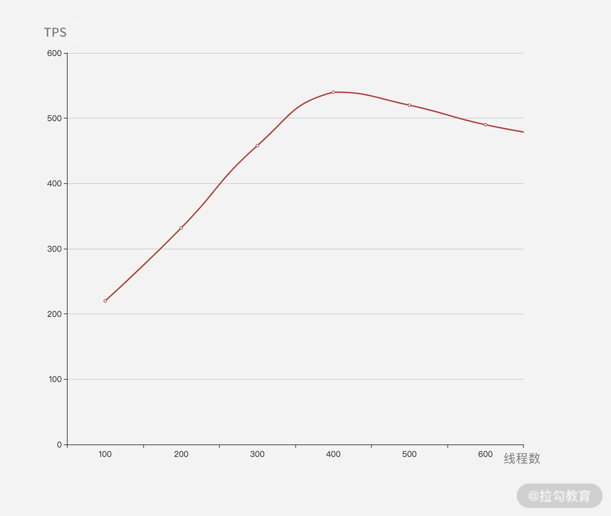
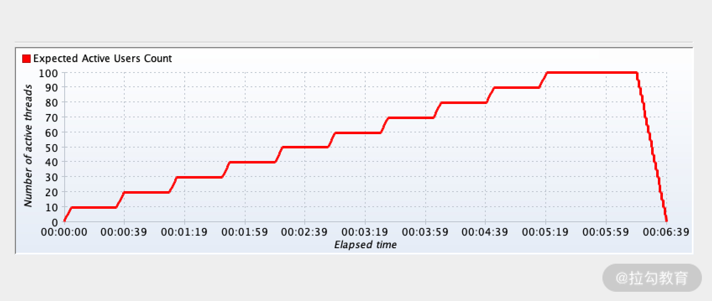

# 08 性能测试场景的分类和意义

上一讲我带你学习了性能测试的分类和如何制定性能目标，这一讲我将带你学习性能测试场景的分类和意义，这也是决定你是否能做好性能测试的关键。

性能测试场景的重要程度类似于业务测试的 case，case 是你进行业务测试的指引，case 是否完善也直接决定了测试的覆盖率。同理，场景是传递执行性能测试的 **步骤和目的** ，关于这两点是你一定要清楚的。

首先带你认识下我认为最重要的三个性能场景： **基准场景** 、**单接口负载场景 **、** 混合场景负载测试**，这几个场景也是我经常说的“基石场景”。接下来为你讲解这三个场景是怎么操作，以及核心目的是什么？

### 基准场景**基准场景是指单线程或者少量线程 **（一般在 5 个线程以下）** 对单接口进行测试**，然后将测试结果作为基准数据，在系统调优或者评估的过程中，通过运行相同的业务接口比较测试结果，为系统的优化以及后续测试流程提供决策数据

有人觉得基准测试并不是在高并发下进行的，不算是性能测试，但我认为这其实是性能测试中重要的基础步骤，它有以下作用：

- 验证测试脚本及测试参数的正确性，同时也可以验证脚本数据是否能够支持重复性测试等；
- 通过少量线程访问系统获取结果数据，作为对比参考基准；
- 根据测试结果，初步判断可能成为系统瓶颈的场景，并决定是否进行后续的测试；
- 基准场景的结果被一部分公司作为上线的基线指标，不达到要求是不允许上线的，这样的场景也经常被固化成自动化的脚本定时触发和巡检。

### 单接口负载场景

**单接口负载场景就是通过模拟多线程对单接口进行负载测试**。我的具体做法是选定线程数后持续循环运行一定时间，比如分别运行 100 线程、200 线程、300线程等，一般相同线程数运行 10～15 min，然后获取事务响应时间、TPS、报错率，监测测试系统的各服务器资源使用情况（CPU、内存、磁盘、网络等），把具体数据记录之后再开始跑下一个线程数。每一组线程数级别会有对应的 TPS，直到你找到 TPS 的拐点。如下图所示，横坐标是线程数，纵坐标是 TPS，线程数增加到 400 时出现了拐点。

这里需要**注意的点**有两个。

- 使用工具做性能测试时，动辄就是上千的线程数，所以如果你是一位初学者，我更加倾向于你从一个相对 **比较低的线程数梯度增加** ，这样才能够比较清晰地找到 TPS 的拐点。
- 我还建议为 **每个虚拟用户级别做单独的场景** ，网上绝大部分的教程，在一个场景中做了很多梯度（如下图所示），这样只是看上去简单方便一些，其实很不利于分析和诊断，这个方式我并不推荐。因为并不是每一个量级的性能表现都是类似的，而且一个场景多梯度出来的报表也可能没你想象中的清晰明了。在 JMeter 的聚合报告中还会将结果数据平均化， **这样的方式并不能准确地记录每个线程梯度对应的 TPS** 。而在一个场景里先固定虚拟用户可以将自己的精力聚焦在诊断上。

### 混合场景负载测试

混合场景是性能测试中最重要的场景之一，这个场景是为了最大程度模拟用户真实的操作。真实的线上操作不只有单接口的操作，一定是多种业务同时在进行，比如张三在浏览商品，李四在添加购物车等。

所以混合场景测试会将多个接口按照实际大促时候的比例混合起来，然后增加线程数找出多个接口 TPS 的和对应的峰值。这个比例也是混合场景的关键，在\[《07 | 你真的知道如何制定性能测试的目标吗？》\]中已经较为详细地阐述了制定比例的方法，本讲就不再赘述。加用户运行的基本策略可以参考上文的 **单接口负载测试** 。混合场景执行除了要观察总的 TPS，还有一个非常关键的因素就是如何控制接口之间的调用比例，使其不能偏离预期。

**如何使用 JMeter 去控制场景比例？ **相信你已经知道线程数可以改变接口的 TPS，但是如果每次通过线程数调整这个过程会比较烦琐。JMeter 提供了一个能较好地解决这个问题的插件，叫作** 吞吐量控制器**，它在逻辑控制器组件中，如下图所示：

我来简单介绍一下这个插件配置规则，默认的情况下使用的是**百分比模式**，也就是 Percent Excutions。吞吐量一栏对应的是 TPS 占比，我用 login 和 register 这两个接口来模拟下，

login 接口配置比例是 80%，如下图所示，剩下的 20% 配置给 register。

看下运行后的效果，我直接在 JMeter 中添加聚合报告元件，如下图所示：

实际计算下来的值为 1778.2/2222.7≈0.8，这个数据是比较准确的。

以上是我所说的基石场景，包括基准测试、负载测试、混合场景测试等，这三个场景是有**依次执行的顺序关系**的，按照顺序执行更容易发现问题且减少不必要的工作，比如你连基准测试都不通过，就没有必要进行负载测试了。所以我们在做每一次性能测试时，都不应该省去或者颠倒上述的场景步骤。

接着我带你继续学习其他性能测试场景，为了达到相对应的性能测试目的，这些场景可以根据需求进行选择。

### 异常性能测试

性能测试也是存在异常测试的，顾名思义就是在系统异常的情况下看系统的处理能力或者是通过处理后的恢复能力是如何的。

比如在架构的高可用方面，遇到服务的上下线、数据库的主从切换等这些情况的时延是多少、处理能力能不能达到预期标准。另外在目前的电商应用架构中，大促遇到紧急情况经常需要限流和熔断，可能你经常听到这两个词，但不是特别清楚两者的区别。

限流就是**控制单位时间内的请求量**，比如说早晚高峰坐地铁，很多入口都会放隔离带，降低乘客流动速度，这就是一种限流方式。

熔断就比较直接了，当判断到调用的依赖服务报错到达一定数量后，直接返回一个既定的数据，将不再访问该服务。就像家中的保险丝一样，到达一定条件后，会自行断电，以保障电路安全。所以我们也会测试触发限流和熔断所设置的阈值，并观察在触发后的系统表现是如何的。

### 稳定性性能测试

性能测试中的稳定性测试是通过给系统加载一定压力的情况下，运行较长一段时间，验证系统是否稳定。通常是采用典型混合场景，应用系统运行 72 小时，查看系统运行指数是否平稳。**稳定性测试的注意点 **稳定性测试在性能测试中是一个** 相对严苛**的场景，因为在 72 小时中可能发生的事情太多了，不仅仅是业务承载的问题，还包括你准备的数据、客户端稳定性，甚至硬件设备断网断电等。任何一项意外的发生，都会造成场景的失败。稳定性测试的监控级别也应当更高，一旦有问题，立即钉钉或者电话通知，所以稳定性测试之前需要有充足的预案和监控报警。

### 经常被问到的问题**什么情况下可以停止负载测试？ **有同学问我，无论是单接口负载测试还是混合场景的负载测试都是** 梯度增加线程数**，那线程数增加到多少程度才可以停止呢？

首先我们结合图 1 可以看到，在梯度增加线程数时，TPS 一般会随之发生变化，当你能够根据 TPS 的变化找到相应的峰值且这个值也是符合预期时，便可以停止负载测试了。

但是现实的情况并没有这么理想，很多时候当你还没有发现图 1 中的拐点时，接口就可能在报错了，那遇到这样的情况是继续测试还是停止测试呢？这其实是一个约定的问题，即测试的结束条件是什么？

- 理想的情况下自然是达到目标就停止了。
- 那不理想呢？根据我的经验，会在测试之前组内协商出场景异常情况下的停止条件，比如 CPU 达到 70%，响应时间超过 500 ms，接口正确率低于 99% 等，当触发这些条件时，我将不会继续加线程进行测试了。

**混合场景我选取哪个线程梯度的访问量进行测试？ **这个问题经常被问到，一些同学喜欢基于** 峰值处理能力**去进行稳定性测试，这是一个很严格的要求。其实标准因公司的实际体量而异。今年的某电商双 11 实时支付峰值达到 50 w/s，有可能这个值也未必能平稳跑 72 h，但以这个访问量为执行标准已经足够用了。所以对于不同的公司而言，自行选择适当的线程梯度就可以。我经常听到一句话，今年的峰值流量就是明年的正常流量，对于这样飞速发展的公司，我想还是需要基于峰值去执行稳定性测试场景。

关于场景的命名一直有同学很困惑，感觉对于同样一个场景，怎么有的人说是混合场景，还有同学说是容量场景。关于场景名字的叫法，不仅不同的公司会不一样，就包括参考资料上也没有形成非常统一的规范，但我认为并不需要用很多精力研究场景的叫法，但你一定要能描述清楚场景的核心目的是什么，执行步骤是什么，这才是需要向你的协作伙伴传递的最准确的信息。

### 总结

本讲带你系统地学习了性能测试的场景设计，关于三大基石场景的作用以及意义，混合场景的操作方法以及稳定性场景的注意事项，这些是你在性能测试执行过程中经常遇到的问题，也许你还做过其他性能场景，欢迎在留言区留言和我交流。
