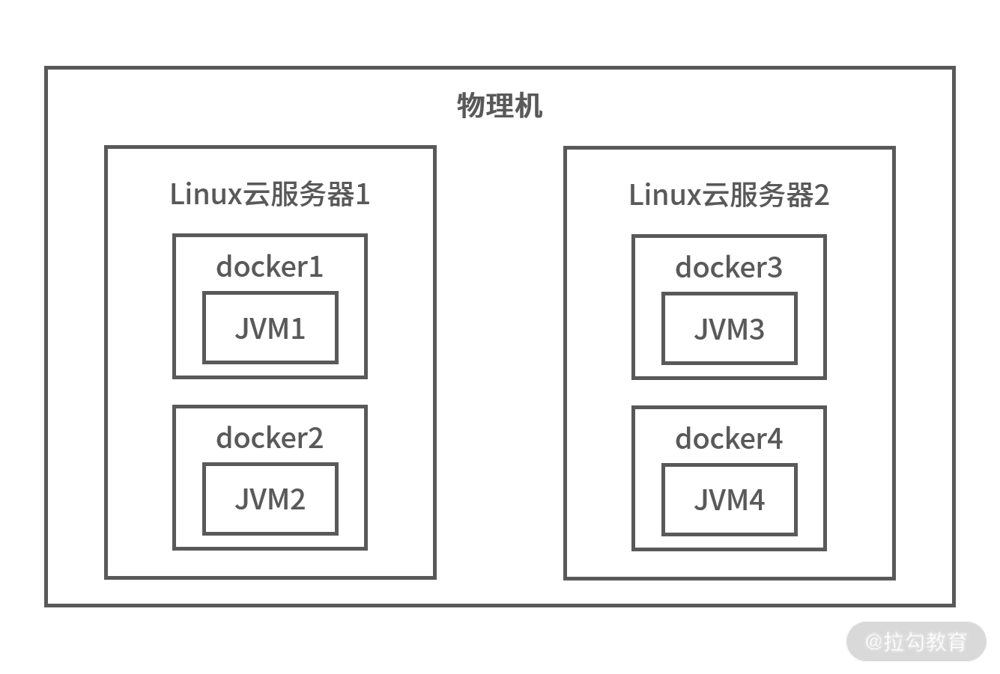
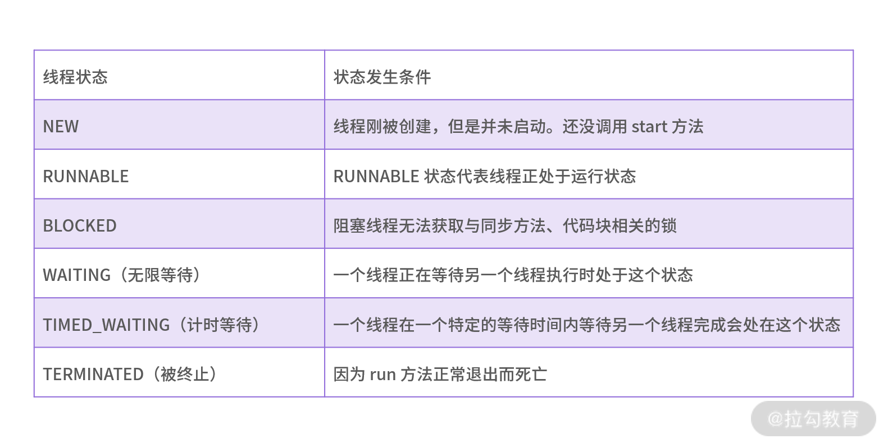
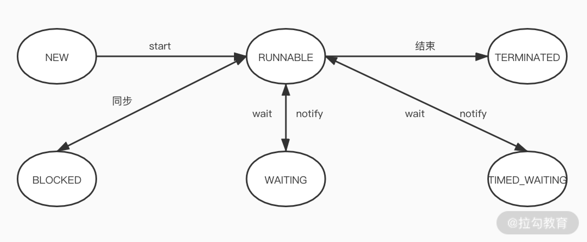

# 14 如何从 CPU 飙升定位到热点方法？

上一模块我带你学习了如何进行系统监控，相信你已经掌握了监控部署的常见手段，通过监控这双“眼睛”，会帮助你及时发现系统资源异常，那当你发现资源异常时候，是不是觉得已经找到问题了呢？事实上并非如此，绝大多数资源异常只是你看到的表象问题，就好比你发现一个地方着火了，你可以先灭火，但是着火的原因是必须找到的，并制定相关的措施，这样才能有效避免下一次的火情。

对于系统也是这样的，当你发现了资源异常，你需要继续寻找发生问题的根因，所以作为一名专业的性能测试工程师，你也应当具备顺着表象去找问题根因的能力。这一讲我就以最流行的 Java 语言为例，带你学习如何透过现象看本质。

对于排查问题，不要只满足于掌握一些排查工具或者命令，你应当对 **被测语言以及运行原理** 有所了解，这样得出来的结论才可能更全面。

这一讲我先带你理解 Java 运行过程中的核心概念。首先要明白 Java 代码在哪里运行，一些初学者说是在 idea 或者 eclipse 里面，因为它们是写代码的软件，不过细心的同学会发现，所有的 idea 或者 eclipse 要运行 Java 代码都需要配置 Java 环境，其实 idea 是我们开发的编辑器，而真正运行代码的是 JVM。

什么是 JVM 呢？JVM 是 Java Virtual Machine 的缩写，它是一个独立出来的运行环境，通过这样的环境去进行 Java 代码中各种逻辑运行。

读到这里可能同学有疑问了：“我现在接触了很多环境，比如 JVM 运行环境、Docker 运行环境，还有云服务器之类，它们到底是什么关系？”这对于不少人来说，确实是有一定疑惑的，我先用一张图来示意下：



从图中你可以看到，一般在底层物理机上会部署多个云服务器，而云服务器上又可以部署多个基于 Docker 的 JVM 节点，这样的部署结构也是比较常用的，既能做到 **环境的隔离** 也能 **节约机器成本** 。

JVM 本身是一个较为庞大的知识体系，对于测试来说，不一定要理解 JVM 特别晦涩的概念，但至少需要了解 JVM 的结构以及运行的机制，你可以认为 JVM 是运行在 Win 或者 Linux 系统上专门运行 Java 的虚拟机，Java 虚拟机直接和操作系统交互。

### Java 文件是如何被运行的

比如我们现在写了一个 HelloTester.java，这个 HelloTester.java 就类似一个文本文件，不过这个文件里面包含了符合 Java 语法规范的文本。比如我在 idea 里写一个简单的方法，如下代码所示：

```
 public class HelloTester {
    public void sayName(String name){
        System.out.println("my name is "+name);
    }
    public  static void main(String[] args){
        HelloTester helloTester=new HelloTester();
        helloTester.sayName("cctester");
}
```

那我们的 **JVM 是不认识文本文件的** ，**所以它需要编译**，让其成为一个会读二进制文件的 HelloTester.class，一般这个文件会产生在工程文件夹下的 Target 当中。

如果**JVM **想要执行这个 .class 文件，我们需要将其装进一个** 类加载器**中，它就像一个搬运工一样，会把所有的 .class 文件全部搬进 JVM 里面来。如下图所示：


对于如上的过程我们再总结概括一下：

1. Java 文件经过编译后变成 .class 字节码文件；
1. 字节码文件通过类加载器被搬运到 JVM 中，生成的对象一般会在 JVM 中堆空间运行。

### Java 对象又是如何在堆空间运行的？

同样还是根据以上代码示意，我带你看下 Java 对象如何进入堆空间以及在堆空间中运行的。

通过上文可知，编译 HelloTester.java 便会得到 HelloTester.class，执行 class 文件后系统会启动一个 JVM 进程，找到 HelloTester.class 后将类信息加载到 JVM 中。

JVM 找到 mian 方法后就可以执行 main 中的 HelloTester helloTester=new HelloTester()，也就是在 JVM 里创建一个 helloTester 对象，不过此时方法区里面还没有 HelloTester 类的信息，所以 JVM 就会去加载该类：

- 加载 HelloTester 类后，JVM 在堆内就会为新的 HelloTester 实例进行内存的分配使用；
- 然后执行 helloTester.sayName()，JVM 根据 HelloTester 对象引用定位到方法区中 HelloTester 类的类型信息的方法表，获得 sayName() 的字节码地址；
- 最后执行 sayName("cctester")。

以上便是 Java 对象在 JVM 中运行的大体过程，了解了这些基本信息之后，再来了解下堆空间中 Java 运行的线程状态，当程序开始创建线程时，便开始有了生命周期，其实就和人一样，会有“生老病死”几个状态，而对于线程来说会经历六个状态，如下表所示：



我们用一张图来直观地概括下这几个状态的演变：



从字面上来看，NEW、RUNNABLE、TERMINATED 这几个状态比较好理解，但对于 BLOCKED、WAITING、TIMED_WAITING 很多人却分不清楚，我想通过一些实际生活中的例子来帮助你理解。

#### BLOCKED

先来说下 BLOCKED，比如你去参加面试，可是接待室里面已经有张三正在面试，此时你是线程 T1，张三是线程 T2，而会议室是锁。这时 T1 就被 blocked，而 T2 获取了会议室的锁。

#### WAITING

接着我们来说 WAITING，你已经进入面试环节，面试官对你的第一轮面试比较满意，让你在会议室等第二轮面试，此时就进入了 WAITING 状态，直到第二轮面试开始你才能结束 WAITING 状态。

#### TIMED_WAITING

当你结束了所有面试环节，HR 对你说我们一般会在三天内给回复，如果三天内没有回复就不要再等了，此时你就进入 TIMED_WAITING 状态，如果三天内没答复，你可能会看其他机会或者直接入职备选公司了。

这几个例子我想可以帮助你理解 TIMED_WAITING、WATING、BLOCKED 状态。

### 一般哪些线程状态占用 CPU 呢？

处于 TIMED_WAITING、WATING、BLOCKED 状态的线程是不消耗 CPU 的，而处于RUNNABLE 状态的线程要结合当前线程代码的性质判断是否消耗 CPU：

- 纯 Java 运算代码，并且未被挂起，是消耗 CPU 的；
- 网络 IO 操作，在等待数据时是不消耗 CPU 的。

通过如上的学习，你了解了线程的状态，可以知道这个线程是在“休息”还是在“奔跑”。如果很多线程处于“奔跑”状态，必定会消耗相关的硬件资源，反过来理解，如果在性能测试过程中发现资源消耗是不是也能定位到相关的线程，从而发现代码问题呢？当你定位到具体的代码行，是不是可以和研发人员讨论下有没有优化的空间，而不是简单地将机器升级配置去解决问题，所以我将继续沿着如何定位代码问题这条思路为你讲解。

举一个实际例子，我以一个问题为切入点，首先看下面示意代码，可以看出 CPU 占用比较高的线程。

```
top - 17:41:39 up 168 days,  8:55,  2 users,  load average: 0.71, 0.81, 0.57
Tasks: 155 total,   1 running, 153 sleeping,   0 stopped,   1 zombie
%Cpu(s): 68.4 us,  6.4 sy,  0.0 ni, 23.5 id,  0.0 wa,  0.0 hi,  1.7 si,  0.0 st
KiB Mem :  8010676 total,   326472 free,  6196656 used,  1487548 buff/cache
KiB Swap:        0 total,        0 free,        0 used.  1120940 avail Mem 
PID USER      PR  NI    VIRT    RES    SHR S  %CPU %MEM     TIME+ COMMAND
 6937 root      20   0 4778684 518804   6
 140 S 141.9  6.5  17:46.36 java
14643 root      20   0 4639440 821244   2472 S  11.6 10.3   1789:33 java
```

通过如上示例的第 3 行你可以发现服务器上 CPU 占用蛮高的，空闲值为 23.5%，也就是说占用了 76.5%；再看第 8 行，你可以看到 PID 为 6937 的进程消耗 CPU 为 141.9%。可能你有疑问了，为什么使用率可以超过 100%。这和你的服务器核数有关系，因为这个数值是每个核上该进程消耗的 CPU 之和，会有叠加关系。那你已经知道了消耗 CPU 最高的进程，然后执行如下命令：

```
[[email protected] jmeter_test]# top -Hp 6937
top - 23:20:53 up 168 days, 14:35,  3 users,  load average: 1.33, 0.71, 0.88
Threads: 788 total,   1 running, 787 sleeping,   0 stopped,   0 zombie
%Cpu(s): 75.0 us,  6.2 sy,  0.0 ni, 18.8 id,  0.0 wa,  0.0 hi,  0.0 si,  0.0 st
KiB Mem :  8010676 total,   576860 free,  5697612 used,  1736204 buff/cache
KiB Swap:        0 total,        0 free,        0 used.  1616168 avail Mem 
PID USER      PR  NI    VIRT    RES    SHR S %CPU %MEM     TIME+ COMMAND
25695 root      20   0 5409224   1.0g   4892 S  6.2 13.2   0:00.09 java
```

我们可以看到每个线程的使用状态，你可以选择 25695 这个线程号，将 25695 转化为 16 进制，如下所示：

```
printf "%x\n" 25695
645f
```

然后通过 jstack 命令定位可能存在问题的方法：

```
jstack 6937|grep 645f -A 30
```

通过运行上面的命令可以查看到的内容如下图所示：


标红部分就是定位的业务代码，能够比较清晰地知道哪个方法在消耗 CPU 资源。

总结下来，要确定哪些线程状态占用 CPU 至少需要如下步骤：

- 使用 top 命令找出有问题 Java 进程的 ID；
- 开启线程显示模式（top -Hp）；
- 按照 CPU 使用率将线程排序（打开 top 后按 P 可以按 CPU 使用降序展示）；
- 记下 Java 进程 ID 及其 CPU 高的线程 ID；
- 用进程 ID 作为参数，手动转换线程 ID 成十六进制，通过 jstack 去剖析对应的线程栈，以分析问题。

你可以看到，实际过程略显烦琐，而有能力的同学可以做成 shell 脚本，这样会比较方便，当然社区也已经有这样的开源脚本供大家使用，[点击访问地址](https://github.com/oldratlee/useful-scripts/blob/master/docs/install.md.html)。

下载完成之后进入 useful-scripts，执行 ./show-busy-java-threads.sh，执行完成后的示意图如下所示：


这样的方式是可以看到这台服务上所有导致 CPU 飙升的 Java 方法的，当然直接一键也可以查看指定进程里的 java 方法，非常简单方便，方法如下所示：

```
 show-busy-java-threads -p <指定的Java进程Id>
```

### 总结

根据本讲的学习，相信你已经能够掌握 Java 在 JVM 中的运行过程，以及 Java 线程在 JVM 中的运行状态，并且能够从 CPU 飙升定位到代码问题。

那对于你来说，当你发现 CPU 占用过高怎么去处理呢？我相信不同的公司、不同的开发语言有不同的方案，欢迎在评论区给出你的实践。
