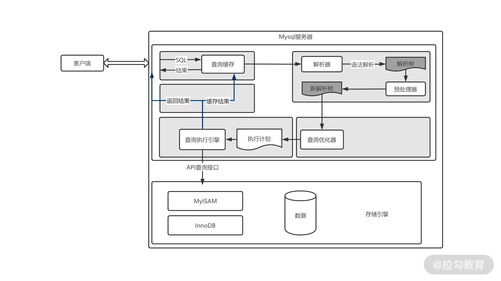
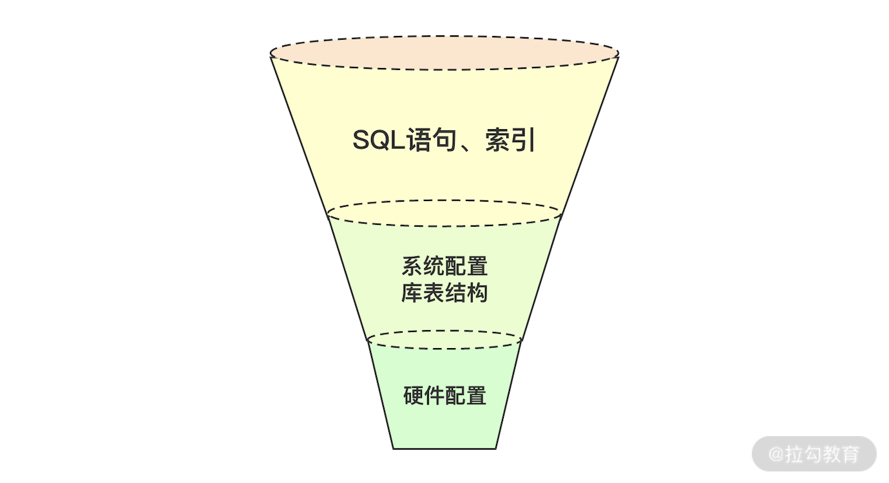

# 18 如何才能优化 MySQL 性能？

上一讲带你学习了 Redis，知道了它带来的好处，不过 Redis 虽然高效迅速，但如果不能合理使用依然会存在不少性能问题。

这一讲我会带你学习以 MySQL 为例的持久化的数据库，说到数据库优化这块，很多同学并不陌生，比如添加索引、读写分离之类。那如何第一时间发现索引有没有缺失、索引有没有生效、扫描了多少行、读写分离用的什么策略，很多同学又不知道如何回答，本讲我就围绕 MySQL 优化的点来一起聊聊。

### 为什么要对 MySQL 进行优化？

有一句俗话叫作“Web 项目即增删改查”，虽然这句话未必精确，但足以体现 **Web 项目对数据的依赖程度**，MySQL 数据库作为数据的重要载体，自然围绕着 MySQL 的优化也是必不可少的。而且对于一些发展中公司来说，往往项目初期数据量比较少，并没有把数据库优化列入日常的活动当中。当业务累积到足够的数据量时，会发现系统越来越慢，这时候数据库优化才引起重视，并投入大量的人力物力，当然不仅仅消耗的是企业成本，还会牺牲用户体验。

### 一次 SQL 的查询过程是怎样的？

简单来说，我们可以将这个过程概括为以下 5 步。

1. 客户端发送一个查询 SQL 给数据库服务器。
1. 服务器先检查查询缓存，如果命中，也就是查询缓存中有这条记录，那么便直接返回缓存中的结果。如果没有命中，则进入下一阶段（解析器）。
1. 服务器由解析器检查 SQL 语法是否正确，然后由预处理器检查 SQL 中的表和字段是否存在，最后由查询器生成执行计划，也就是 SQL 的执行方式或者步骤。
1. MySQL 根据优化器生成的执行计划，调用存储引擎的 API 来执行查询。
1. 将结果返回给客户端。

然后我们将上述步骤使用流程图展示，如下所示：



图 1：MySQL 查询过程

### 对于 MySQL 来说，影响性能的关键点有哪些？

关于这个问题，我想大家都应该可以回答一些，比如硬件层面、系统层面等等。但在性能领域中，一个不能忽略的问题是你需要考虑**影响的面有多少**，以及如何优化才是最具有性价比的。以我的经验来看，如何做优化更具性价比也存在漏斗模型，如图 2 所示。



图 2：漏斗模型

从上往下看：

- **SQL 语句和索引相关问题是最常见的，带来的价值也是最明显的**；
- 系统配置库表结构带来的价值次之；
- 而硬件层次的优化优先级是不高的。

#### 1.硬件配置

现在我们基本上都是使用云服务器，就会涉及服务器配置选型，对于数据库处理复杂 SQL 而言，尽量选择高频 CPU，而且数据库一般都会 **开辟缓存池来存放数据** ，所以在服务器选型的时候内存大小也需要考虑。一般来说 **数据库服务器的硬件配置的重要性高于应用服务器配置** ，这方面了解下即可，测试工作基本上不会涉及数据库服务器的选型，而且一旦选型固定之后不会轻易改变数据库的硬件配置。

#### 2.MySQL 系统配置选项

**（1）max_connections **这个参数表示 MySQL 可以** 接收到的最大连接数**，可以直接通过如下命令查看：

```
 mysql> show variables like '%max_connections%';
+-----------------+-------+
| Variable_name   | Value |
+-----------------+-------+
| max_connections | 151  |
+-----------------+-------+
```

那如何查看 MySQL 的实际连接数呢？我们可以用如下命令进行查看：

```
 mysql> show status like 'Threads%';
+-------------------+-------+
| Variable_name     | Value |
+-------------------+-------+
| Threads_cached    | 7     |
| Threads_connected | 64    |
| Threads_created   | 1705  |
| Threads_running   | 1     |
+-------------------+-------+
```

其中**Threads_connected 是你实际的连接数 **。如果 max_connections 的值设置较小，在高并发的情况下易出现 “** too many connections**” 这样的报错，我们可以通过如下命令调节配置从而减少此问题的发生，你可以根据所在公司的实际情况进行配置。

```
 mysql> set global max_connections=500;
```** （2）innodb\_buffer\_pool\_size **这个参数实际定义了** InnoDB 存储引擎下 MySQL 的内存缓冲区大小 **。

来解释下这句话什么意思，首先** InnoDB 存储引擎是 MySQL 的默认存储引擎 **，使用也很广泛。缓冲池是什么呢？其实就和缓存类似，通过上一讲学习你可以知道，从** 磁盘读取数据效率是很低的 **，为了避免这个问题，MySQL 开辟了基于内存的缓冲池，核心做法就是把经常请求的热数据放入池中，如果请求交互的数据都在缓冲池中则会很高效，所以一般数据库缓冲池设置得会比较大，占到操作系统内存值的 70%～80%。** 那如何评估缓冲池大小是否合理？**

我们可以通过计算缓存命中率来判断，公式为：

> (1-innodb\_buffer\_pool\_reads/innodb\_buffer\_pool\_read\_request) \* 100

一般来说，当缓存命中率低于 90% 就说明需要加大缓冲池了。

关于公式中的两个变量的查看方式，通过如下命令你就可以获得：
```

show status like  'Innodb_buffer_pool_read\_%';
+---------------------------------------+----------+
| Variable_name                         | Value    |
+---------------------------------------+----------+
| Innodb_buffer_pool_read_ahead_rnd     | 0        |
| Innodb_buffer_pool_read_ahead         | 51       |
| Innodb_buffer_pool_read_ahead_evicted | 0        |
| Innodb_buffer_pool_read_requests      | 25688179 |
| Innodb_buffer_pool_reads              | 2171     |
+---------------------------------------+----------+

```

#### 3.SQL 优化

对于成熟的互联网公司来说，不管是硬件还是配置层面的数值都已经优化且形成了一定的经验值，其实不太可能频繁地改动。而对于业务的 SQL 来说，每天都会更新，一旦 SQL 本身执行很慢，无论从配置或者是硬件进行优化都无法根本解决问题。SQL 的问题也是你做数据库调优接触最多的，也是多样化的，所以接下来我们就继续学习慢 SQL 相关的知识点。

**（1）什么是慢 SQL？ **从默认定义上来讲，** 执行超过 10s 的 SQL 都被定义为慢 SQL **。不过对于互联网应用来讲，10s 的时间标准过于宽松，如果是比较热门的应用 10s 都不能返回结果，基本可以定义为事故了，所以很多企业都会修改这个配置。先来看下怎么查看慢查询配置的时间，如下命令示意，你可以看到默认的配置是 10s。
```

mysql> show variables like 'long_query_time';
+-----------------+-----------+
| Variable_name   | Value     |
+-----------------+-----------+
| long_query_time | 10.000000 |

```

如果需要修改该配置为 1s，可以在 my.cnf 中添加，这样的方式需要重启 MySQL 服务。
```

long_query_time=1

```** （2）如何获取慢 SQL？ **你在分析慢 SQL 之前首先需要获取慢 SQL，如何获取慢 SQL 呢，其中的一种方式是在 my.cnf 中配置，如下示意：
```

slow_query_log=1
slow_query_log_file=/data/mysql-slow.log

```

你就可以将慢 SQL 写入相应的日志文件内。除了这个方法，在测试过程中，我也会使用 show full processlist 这个命令实时获取交互的 SQL，通过观察 state 状态以及 SQL 出现的频率也能判断出来是不是慢 SQL。** （3）如何分析慢 SQL？ **关于慢 SQL，绝大多数原因都是 SQL 本身的问题，比如写的业务 SQL 不合理，返回了大量数据；表设计不合理需要多表的连接查询；索引的问题等。在我的经验当中，众多 SQL 问题中** 索引相关的问题也是最突出的 **，在我看来索引的相关问题有以下几种。** 索引缺失 **首先来看看什么是索引，索引是一种单独地、物理地对数据库表中一列或者多列进行排序的数据库结构。** 索引的作用相当于图书的目录 **，可以根据目录的页码快速找到所需要的内容。当数据库存在大量数据做查询操作，你就需要 check 是否存在索引，如果没有索引，会非常影响查询速度。

在 InnoDB 中，我们可以简单地把索引分成两种：** 聚簇索引 **（主键）** 和普通索引 **。按照我的理解来看，聚簇索引是叶子节点保存了数据，而普通索引的叶子节点保存的是数据地址。

通常推荐在** 区分度较高的字段上创建索引 **，这样效果比较好，比如，一个会员系统中，给用户名建索引，查询时候可以快速定位到要找的数据，而给性别字段建索引则没有意义。** 索引失效 **添加索引只是其中的一个必要步骤，并不是添加完成后就万事大吉了。在一些情况下索引其实是不生效的，比如索引列中存在 Null 值、重复数据较多的列、前导模糊查询不能利用索引（like '%XX' 或者 like '%XX%'）等。在一般情况下你可以使用执行计划查看索引是否真正生效，在下一讲中，我也会用更多的实例带你看这个问题。** 联合索引不满足最左前缀原则**

又来新概念了，有两个问题：

*   什么是联合索引；
*   什么又是最左前缀。

首先来解释下 **联合索引** ，用大白话解释就是一个索引会同时对应多个列，比如 c1、c2、c3 为三个字段，则可以通过 index\_name(c1,c2,c3) 的方式建立联合索引，这样做的好处是什么呢？通过这样的方式建立索引，等于为 c1、(c1,c2)、(c1,c2,c3) 都建立了索引。因为每增加一个索引，也会增加写操作的磁盘开销，所以说联合索引是一种性价比比较高的建立索引的方式。

那么什么是 **最左前缀原则** 呢？你刚刚在 c1、c2、c3 上建立了联合索引，索引中的数据也是按 c1、c2、c3 进行排序，最左前缀顾名思义就是最左边的优先，比如如下 SQL 命令：
```

SELECT * FROM table WHERE c1="1" AND c2="2" AND c3="3"

```

这条 SQL 就会按照 **从左到右** 的匹配规则，如果打破最左前缀规则联合索引是不生效的，如下写法所示：
```

SELECT * FROM table WHERE c1="1" AND  c3="3"

```

那如何判断 SQL 有没有走索引或者索引有没有生效呢？接下来我们要了解一个新概念叫作执行计划，什么是执行计划呢？

执行计划通常是开发者拿到慢 SQL 之后，优化 SQL 语句的第一步。MySQL 在解析 SQL 语句时，会生成多套执行方案，然后内部会进行一个成本的计算，通过优化器选择一个最优的方案执行，然后根据这个方案会生成一个执行计划。开发者通过查看 SQL 语句的执行计划，可以直观地了解到 MySQL 是如何解析执行这条 SQL 语句的，然后再针对性地进行优化。

**（4）如何查看 SQL 语句的执行计划？**

我们可以在执行 SQL 的前面添加 desc，如下所示：
```

desc select * from user

```

或者添加 explain，如下所示：
```

mysql> explain select * from user;
+----+-------------+-------+------------+------+---------------+------+---------+------+------+----------+-------+
| id | select_type | table | partitions | type | possible_keys | key  | key_len | ref  | rows | filtered | Extra |
+----+-------------+-------+------------+------+---------------+------+---------+------+------+----------+-------+
|  1 | SIMPLE      | user  | NULL       | ALL  | NULL          | NULL | NULL    | NULL | 9984 |   100.00 | NULL  |
+----+-------------+-------+------------+------+---------------+------+---------+------+------+----------+-------+
1 row in set, 1 warning (0.01 sec)

```

对于 explain 返回的内容我选择一些重点解释一下，尤其是 **对性能产生不利的表现内容** 。

**table **table 显示的是这一行的数据是关于哪张表的，上述内容中显示的表名就是 user。** type **这是重要的列，显示连接使用了何种类型，类型还是蛮多的，我选择最不理想的 ALL 类型和你解释一下，这个连接类型对于查询的表进行全表数据扫描，这种情况比较糟糕，应该尽量避免，上面的示例就进行了全表扫描。** key **key 表示实际使用的索引。如果为 Null，则没有使用索引，这种情况也是尤其需要注意的。** rows **rows 表明 SQL 返回请求数据的行数，这一行非常重要，返回的内容中 SQL 遍历了 9984 行，其实也证明了这条 SQL 遍历了一张表。** extra**

关于 extra，我列举两个你需要注意的状态，因为这样的状态是会对性能产生不良的影响，意味着查询需要优化了。

**Using filesort：**表示****SQL 需要进行额外的步骤来发现如何对返回的行排序。它会根据连接类型、存储排序键值和匹配条件的全部行进行排序。

**Using temporary：**表示****MySQL 需要创建一个临时表来存储结果，非常消耗性能。

### 总结

本讲相对系统地讲述了常见的 MySQL 数据库性能影响点，你可以从一个全局的角度去思考诊断 MySQL 性能问题的步骤，同时我也讲了执行计划，通过执行计划可以发现 SQL 性能问题产生的原因，这是一个非常实用的手段。
```
