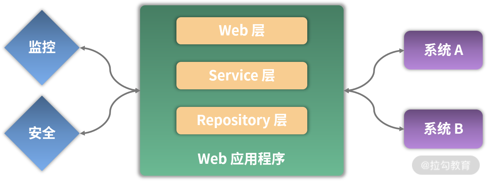

00 开篇词 从零开始：为什么要学习 Spring Boot？
===============================

你好，我是鉴湘，有 10 年以上大型 Java EE 和分布式系统构建和优化的经验，曾带领百人团队完成基于 Spring 家族技术体系的亿级用户规模互联网应用系统的建设工作，对基于 Spring 框架进行系统开发和维护有着丰富的实践经验。

在我的从业生涯中，曾经带过不少项目，以我所带领的电商项目开发团队为例，开发团队从接收产品需求、开发联调再到测试上线，整个过程往往要求在短短几天之内完成，这样的挑战就倒逼我们要保证开发过程的简单性，其中最核心的一点就是“快”：如何快速、高效地实现系统功能，成了一个非常现实且棘手的问题。

为此，我对比实践过不少框架，最终发现了一个开发利器——Spring Boot。在 Java EE 领域，**Spring Boot 在传统 Spring 框架的基础上做了创新和优化，将开发人员从以往烦琐的配置工作中解放出来，并提供了大量即插即用的集成化组件，从而解决了各种组件之间复杂的整合过程，大大提高了开发效率，降低了维护成本。**比如，我们之前做了一个完整的 Web 应用程序，原本使用的是 Spring MVC 框架，但是在整个开发过程中，除了需要编写一大堆配置文件、针对每个层次引入专门的开发组件外，还需要独立部署和管理应用服务器。最后，为了对系统的运行状态进行有效监控，还需要引入一些并不好用的外部框架。

经过反复尝试，我们最终使用了 Spring Boot 框架，因为**它直接解决了使配置变简单、使编程变简单、使部署变简单、使监控变简单的问题，好用、简单又高效**。

基于以上种种优势，Spring Boot 于 2015 年在国内开始走红，且越来越多的企业将 Spring Boot 作为系统开发的首选框架。比如我自己带领的几个团队中，无一例外在使用 Spring Boot 构建应用程序。

### 你为什么需要学习这门课程？

越来越强大的 Spring Boot 俨然是 Java EE 领域的标准开发框架了。因此，掌握 Spring Boot 成了 Java 工程师的必备技能，而熟练掌握 Spring Boot 中的各项技术组件，并能够在一定程度上掌握其内部运行机制，是你从事 Java 应用程序开发的基本要求，也是你将来学习 Spring Cloud 等微服务开发框架的基础。

我自己也有着多家大型互联网公司的从业经验，日常也经常面试来自不同公司的 Java 工程师，在面试过程中，我对开发人员的要求：**掌握 Spring Boot 已经不是一个加分项，而是一个必备技能。**你也可以上拉勾网站查看相关岗位职责，基本都有这条限制，以下是我截取的两份 Java 开发工程师岗的招聘要求：

 

（职位信息来源：拉勾网）**可以说，深入了解并掌握 Spring Boot 是你成功进入大公司、斩获高薪 Offer 的一个重要砝码。**

### 这门课程是如何设计的？

虽然 Spring Boot 为我们提供了开发友好性，但很多人学习、应用 Spring Boot 的过程并不容易，我在实际开发过程中就曾亲身经历很多问题和挑战，而据我了解这也是大部分同学共同面对的境况。

* **看上去简单，实则复杂：** Spring Boot 的特点是容易上手，让你觉得开发起来很快很简单，但实际上 Spring Boot 提供了很多隐式的功能，比如自动配置，它将系统开发的复杂度隐藏得很深。如果你不了解框架的核心内容，开发过程中一旦出现问题，那么你将会觉得一头雾水，定位问题和解决问题的难度也会加大。
* **技术体系和组件众多：** Spring Boot 提供了一大批功能组件，这些功能组件构成了庞大的技术体系。你会发现学会了一个组件后，碰到新的组件时还是需要重新学习，导致学习效率很低，且容易出错。
* **框架集成的“坑”不少： **Spring Boot 是一个集成性的框架，内部整合了市面上很多开源框架。因为各个框架之间的技术差异性，你会发现存在很多“坑”，以至于你在使用过程中经常出现一些莫名其妙的问题，进而影响开发节奏。** 虽然 Spring Boot 让你只花 20% 的时间就可解决 80% 的问题，但是剩下 20% 的问题需要我们通过系统性的学习去弄懂，而学习 Spring Boot 是有一定的方法和套路的**。

为此，我根据个人多年的架构经验以及对 Spring Boot 的理解，整理出了一套系统化、由浅入深的学习路径，从中你不仅可以掌握 Spring Boot 的全局，更可以从学习三大难题入手一一突破，更加高效地掌握 Spring Boot 的使用方法和实战技巧。

基于如下图所示的 Web 应用程序的拆分维度，我把整个课程设计为 8 大部分，基于目前最主流的 Java EE 领域开发框架 Spring Boot，向你介绍如何从零构建一个 Web 应用程序。

Web 应用程序的拆分维度

* **第 1 部分，开启 Spring 框架的学习之旅**。这部分将介绍 Spring 家族的整个生态系统和技术体系，并提供一个 Spring Customer Service System（简称 SpringCSS） 案例来贯穿整个 Spring Boot 框架的学习过程。
* **第 2 部分，如何使用 Spring 构建多维度配置层**。这部分将介绍 Spring Boot 中的自动配置解决方案和实现原理，以及如何使用其配置体系来实现复杂的多维配置以及定制化配置。
* **第 3 部分，如何使用 Spring 构建数据访问层**。这部分将针对关系型数据库介绍 Spring Boot 中提供的一系列数据访问组件，同时全面介绍 Spring Data 这个统一的数据访问抽象框架。
* **第 4 部分，如何使用 Spring 构建 Web 服务层**。这部分将介绍基于 Spring Boot 构建一个 Web 服务的系统方法，以及如何实现多个 Web 服务之间的交互和集成。同时，我也将对远程过程调用中的具体细节和实现原理展开分析。
* **第 5 部分，如何使用 Spring 构建消息通信层**。这部分将介绍消息通信的基本概念，以及基于 Spring Boot 所提供的模板工具类完成与 ActiveMQ、Kafka、RabbitMQ 等多款主流消息中间件之间的集成。
* **第 6 部分，如何使用 Spring 构建系统安全层**。这部分将介绍 Spring 中的安全体系，我将重点从用户认证、访问授权，以及信息加密等系统安全领域的核心维度出发，和你一起探索 Spring Boot 中所提供的安全体系解决方案。
* **第 7 部分，如何使用 Spring 构建系统监控层**。这部分将介绍 Spring Boot 中即插即用的服务监控技术组件，内容涵盖 Spring Boot 内置的各种度量指标、监控端点和可视化管理功能，这也是 Spring Boot 框架的一大亮点。
* **第 8 部分，如何测试 Spring 应用程序**。这部分将介绍针对 Spring Boot 应用程序的测试解决方案，重点关注如何使用 Mock 机制和各种注解实施数据访问层和服务集成层的系统化测试方法和工程实践。

此外，课程中所涉及的各个 Spring Boot 核心组件，我都会基于完整的案例分析给出详细的代码实现方案，方便你进行学习和改造。课程配套代码，你可以在 [https://github.com/lagoueduCol/SpringBoot-jianxiang](https://github.com/lagoueduCol/SpringBoot-jianxiang) 进行下载。

### 讲师寄语

现如今，无论公司基于何种业务，也无论公司规模和人员如何，但凡涉及 Java EE 应用程序的开发，基本都会用到 Spring Boot 框架。Spring Boot 的应用越来越广泛，企业对于相关开发人员的需求量也越来越大，掌握 Spring Boot 框架已成为各大互联网公司高薪诚聘的基本岗位需求。

对于开发者而言，掌握这门核心技能将成为你的“敲门砖”，让你获得升职加薪机会的同时，还能获得心仪大厂的 Offer，因此，你有必要好好学习本门课程，快速掌握 Spring Boot 框架，并且熟练应用到日常开发过程中。
