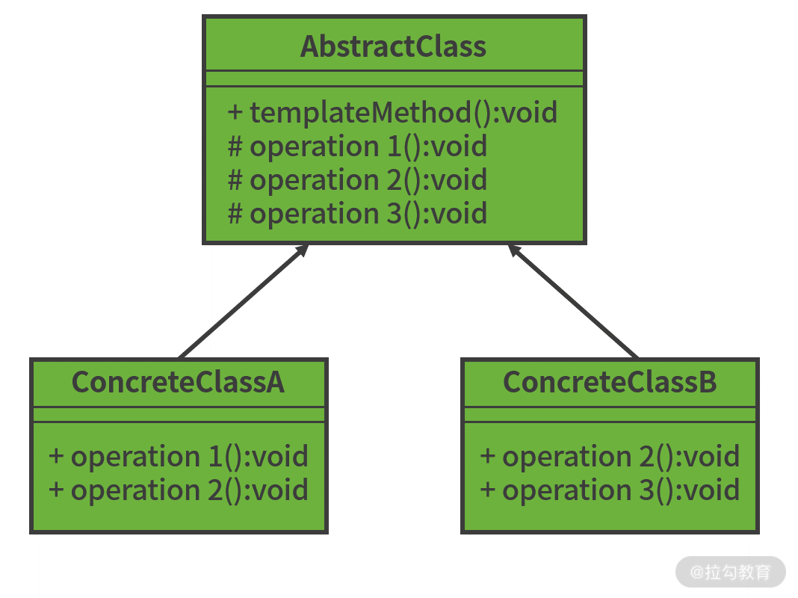
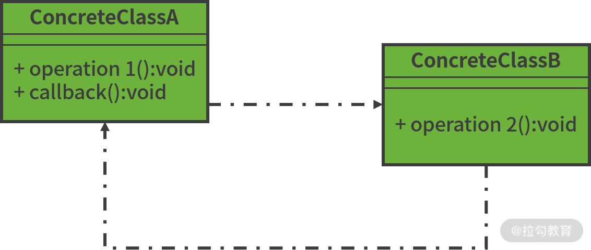

08 数据访问：如何剖析 JdbcTemplate 数据访问实现原理？
===================================

07 讲中，我们介绍了使用 JdbcTemplate 模板工具类完成关系型数据库访问的详细实现过程，通过 JdbcTemplate 不仅简化了数据库操作，还避免了使用原生 JDBC 带来的代码复杂度和冗余性问题。

那么，JdbcTemplate 在 JDBC 基础上如何实现封装的呢？今天，我将带领大家从设计思想出发，讨论 JDBC API 到 JdbcTemplate 的演进过程，并剖析 JdbcTemplate 的部分核心源码。

### 从模板方法模式和回调机制说起

从命名上 JdbcTemplate 显然是一种模板类，这就让我们联想起设计模式中的模板方法模式。为了让你更好地理解 JdbcTemplate 的实现原理，我们先对这一设计模式进行简单说明。

#### 模板方法设计模式

模板方法模式的原理非常简单，它主要是利用了面向对象中类的继承机制，目前应用非常广泛的，且在实现上往往与抽象类一起使用，比如 Spring 框架中也大量应用了模板方法实现基类和子类之间的职责分离和协作。

按照定义，完成一系列步骤时，这些步骤需要遵循统一的工作流程，个别步骤的实现细节除外，这时我们就需要考虑使用模板方法模式处理了。模板方法模式的结构示意图如下所示：



模板方法设计模式结构示意图

上图中，抽象模板类 AbstractClass 定义了一套工作流程，而具体实现类 ConcreteClassA 和 ConcreteClassB 对工作流程中的某些特定步骤进行了实现。

#### 回调机制

在软件开发过程中，回调（Callback）是一种常见的实现技巧，回调的含义如下图所示：



回调示意图

上图中，ClassA 的 operation1() 方法调用 ClassB 的 operation2() 方法，ClassB 的 operation2() 方法执行完毕再主动调用 ClassA 的 callback() 方法，这就是回调机制，体现的是一种双向的调用方式。

从上面描述可以看到，回调在任务执行过程中不会造成任何的阻塞，任务结果一旦就绪，回调就会被执行，显然在方法调用上这是一种异步执行的方式。同时，回调还是实现扩展性的一种简单而直接的模式。

在上图中，我们看到执行回调时，代码会从一个类中的某个方法跳到另一个类中的某个方法，这种思想同样可以扩展到组件级别，即代码从一个组件跳转到另一个组件。只要预留回调的契约，原则上我们可以实现运行时根据调用关系动态来实现组件之间的跳转，从而满足扩展性的要求。

事实上，JdbcTemplate 正是基于模板方法模式和回调机制，才真正解决了原生 JDBC 中的复杂性问题。

接下来，我们结合 07 讲中给出的 SpringCSS 案例场景从 JDBC 的原生 API 出发，讨论 JdbcTemplate 的演进过程。

### JDBC API 到 JdbcTemplate 的演变

在 06《基础规范：如何理解 JDBC 关系型数据库访问规范？》讲中，我们给出了基于 JDBC 原生 API 访问数据库的开发过程，那如何完成 JDBC 到JdbcTemplate 呢？

在整个过程中，我们不难发现创建 DataSource、获取 Connection、创建 Statement 等步骤实际上都是重复的，只有处理 ResultSet 部分需要我们针对不同的 SQL 语句和结果进行定制化处理，因为每个结果集与业务实体之间的对应关系不同。

这样，我们的思路就来了，首先我们想到的是如何构建一个抽象类实现模板方法。

#### 在 JDBC API 中添加模板方法模式

假设我们将这个抽象类命名为 AbstractJdbcTemplate，那么该类的代码结构应该是这样的：

```
public abstract class AbstractJdbcTemplate{


 


    @Autowired


    private DataSource dataSource;


    


    public final Object execute(String sql) {  


        Connection connection = null;


        Statement statement = null;


        ResultSet resultSet = null;


        try {


            connection = dataSource.getConnection();


            statement = connection.createStatement();


            resultSet = statement.executeQuery(sql);


            Object object = handleResultSet(resultSet);         


            return object;


        } catch (SQLException e) {


            System.out.print(e);


        } finally {


            if (resultSet != null) {


                try {


                    resultSet.close();


                } catch (SQLException e) {


                }


            }


            if (statement != null) {


                try {


                    statement.close();


                } catch (SQLException e) {


                }


            }


            if (connection != null) {


                try {


                    connection.close();


                } catch (SQLException e) {


                }


            }


        }


        return null;


    }


    


    protected abstract Object handleResultSet(ResultSet rs) throws SQLException;  


}

```

AbstractJdbcTemplate 是一个抽象类，而 execute 方法主体代码我们都很熟悉，基本照搬了07 讲所构建的 OrderRawJdbcRepository 类中的代码。**唯一需要注意的是，这里出现了一个模板方法 handleResultSet 用来处理 ResultSet。**

下面我们再构建一个 AbstractJdbcTemplate 的实现类 OrderJdbcTemplate，如下代码所示：

```
public class OrderJdbcTemplate extends AbstractJdbcTemplate{


 


    @Override


    protected Object handleResultSet(ResultSet rs) throws SQLException {


 


        List<Order> orders = new ArrayList<Order>();


        while (rs.next()) {


            Order order = new Order(rs.getLong("id"), rs.getString("order_number"), rs.getString("delivery_address"));


            orders.add(order);


        }


        return orders;


    }


}

```

显然，这里我们获取了 ResultSet 中的结果，并构建了业务对象进行返回。

我们再使用 OrderJdbcTemplate 执行目标 SQL 语句，如下代码所示：

```
AbstractJdbcTemplate jdbcTemplate = new OrderJdbcTemplate();  


List<Order> orders = (List<Order>) jdbcTemplate.execute("select * from Order");

```

就这样，一个添加了模板方法模式的 JdbcTemplate 就构建完成了，是不是很简单？接下来，我们继续讨论如何对它进行进一步改进。

#### 在 JDBC API 中添加回调机制

试想一下，如果我们需要对各种业务对象实现数据库操作，那势必需要提供各种类似 OrderJdbcTemplate 这样的实现类，这点显然很不方便。一方面我们需要创建和维护一批新类，另一方面如果抽象方法数量很多，子类就需要实现所有抽象方法，尽管有些方法中子类并不会用到，这时该如何解决呢？

实际上，这种问题本质在于我们使用了抽象类。如果我们不想使用抽象类，则可以引入前面介绍的回调机制。使用回调机制的第一步，先定义一个回调接口来剥离业务逻辑，我们将其命名为 StatementCallback，如下代码所示：

```
public interface StatementCallback {


    


    Object handleStatement(Statement statement) throws SQLException;  


}

```

然后，我们重新创建一个新的 CallbackJdbcTemplate 用来执行数据库访问，如下代码所示:

```
public class CallbackJdbcTemplate {


 


    @Autowired


    private DataSource dataSource;


    


    public final Object execute(StatementCallback callback){  


        Connection connection = null;


        Statement statement = null;


        ResultSet resultSet = null;


        try {


            connection = dataSource.getConnection();


            statement = connection.createStatement();


            Object object = callback.handleStatement(statement);


            return object;


        } catch (SQLException e) {


            System.out.print(e);


        } finally {


            //省略异常处理


        }


        return null;


    }


}

```

**注意，与 AbstractJdbcTemplate 类相比，CallbackJdbcTemplate 存在两处差异点。** 首先，CallbackJdbcTemplate 不是一个抽象类。其次，execute 方法签名上传入的是一个 StatementCallback 对象，而具体的定制化处理是通过 Statement 传入到 Callback 对象中完成的，我们也可以认为是把原有需要子类抽象方法实现的功能转嫁到了 StatementCallback 对象上。

基于 CallbackJdbcTemplate 和 StatementCallback，我们可以构建具体数据库访问的执行流程，如下代码所示：

```
public Object queryOrder(final String sql)  {


 


        class OrderStatementCallback implements StatementCallback {


 


            public Object handleStatement(Statement statement) throws SQLException {


                ResultSet rs = statement.executeQuery(sql);


                List<Order> orders = new ArrayList<Order>();


                while (rs.next()) {


                    Order order = new Order(rs.getLong("id"), rs.getString("order_number"),


                            rs.getString("delivery_address"));


                    orders.add(order);


                }


 


                return orders;


            }


        }


 


        CallbackJdbcTemplate jdbcTemplate = new CallbackJdbcTemplate();


        return jdbcTemplate.execute(new OrderStatementCallback());


}

```

这里，我们定义了一个 queryOrder 方法并传入 SQL 语句中用来实现对 Order 表的查询。

注意到，在 queryOrder 方法中我们构建了一个 OrderStatementCallback 内部类，该类实现了 StatementCallback 接口并提供了具体操作 SQL 的定制化代码。然后我们创建了一个 CallbackJdbcTemplate 对象并将内部类 OrderStatementCallback 传入该对象的 execute 方法中。

针对这种场景，实际上我们也可以不创建 OrderStatementCallback 内部类，因为该类只适用于这个场景中，此时更为简单的处理方法是使用匿名类，如下代码所示：

```
public Object queryOrder(final String sql)  {


 


        CallbackJdbcTemplate jdbcTemplate = new CallbackJdbcTemplate();


        return jdbcTemplate.execute(new StatementCallback() {


            


            public Object handleStatement(Statement statement) throws SQLException {


                ResultSet rs = statement.executeQuery(sql);


                List<Order> orders = new ArrayList<Order>();


                while (rs.next()) {


                    Order order = new Order(rs.getLong("id"), rs.getString("order_number"),


                            rs.getString("delivery_address"));


                    orders.add(order);


                }


 


                return orders;


            }


        });     


}

```

匿名类的实现方式比较简洁点，且在日常开发过程中，我们也经常使用这种方式实现回调接口。

### JdbcTemplate 源码解析

理解了 JDBC API 到 JdbcTemplate 的演变过程，接下来我们真正进入 Spring Boot 所提供的 JdbcTemplate 模板工具类的源码部分，看看它是否采用了这种设计思路。

我们直接看 JdbcTemplate 的 execute(StatementCallback action) 方法，如下代码所示：

```
public <T> T execute(StatementCallback<T> action) throws DataAccessException {


        Assert.notNull(action, "Callback object must not be null");


 


        Connection con = DataSourceUtils.getConnection(obtainDataSource());


        Statement stmt = null;


        try {


            stmt = con.createStatement();


            applyStatementSettings(stmt);


            T result = action.doInStatement(stmt);


            handleWarnings(stmt);


            return result;


        }


        catch (SQLException ex) {


            String sql = getSql(action);


            JdbcUtils.closeStatement(stmt);


            stmt = null;


            DataSourceUtils.releaseConnection(con, getDataSource());


            con = null;


            throw translateException("StatementCallback", sql, ex);


        }


        finally {


            JdbcUtils.closeStatement(stmt);


            DataSourceUtils.releaseConnection(con, getDataSource());


        }


}

```

从以上代码中可以看出，execute 方法中同样接收了一个 StatementCallback 回调接口，然后通过传入 Statement 对象完成 SQL 语句的执行，这与前面我们给出的实现方法完全一致。

StatementCallback 回调接口定义代码如下：

```
public interface StatementCallback<T> {


 


    T doInStatement(Statement stmt) throws SQLException, DataAccessException;


}

```

同样，我们发现 StatementCallback 回调接口的定义也很类似。我们来看看上述 execute(StatementCallback action) 方法的具体使用方法。

\*\*事实上，在 JdbcTemplate 中，还存在另一个 execute(final String sql) 方法，该方法中恰恰使用了 execute(StatementCallback action) 方法，\*\*如下代码所示：

```
public void execute(final String sql) throws DataAccessException {


        if (logger.isDebugEnabled()) {


            logger.debug("Executing SQL statement [" + sql + "]");


        }


 


        class ExecuteStatementCallback implements StatementCallback<Object>, SqlProvider {


            @Override


            @Nullable


            public Object doInStatement(Statement stmt) throws SQLException {


                stmt.execute(sql);


                return null;


            }


            @Override


            public String getSql() {


                return sql;


            }


        }


 


        execute(new ExecuteStatementCallback());


}

```

这里，我们同样采用了内部类的实现方式创建 StatementCallback 回调接口的实现类 ExecuteStatementCallback，然后通过传入 Statement 对象完成 SQL 语句的执行，最后通过调用 execute(StatementCallback`<T>` action) 方法实现整个执行过程。

### 从源码解析到日常开发

今天的内容与其说在讲 JdbcTemplate 的源码，不如说在剖析该类背后的设计思想，因此 08 讲中的很多知识点和实现方法都可以应用到日常开发过程中。

无论是模板方法还是回调机制，在技术实现上都没有难度，有难度的是应用的场景以及对问题的抽象。JdbcTemplate 基于 JDBC 的原生 API，把模板方法和回调机制结合在了一起，为我们提供了简洁且高扩展的实现方案，值得我们分析和应用。

### 小结与预告

JdbcTemplate 是 Spring 中非常具有代表性的一个模板工具类。今天的课程中，我们从现实应用场景出发，系统分析了原始 JDBC 规范到 JdbcTemplate 的演进过程，并给出了模板方法设计模式和回调机制在这一过程中所发挥的作用。我们先提供了 JdbcTemplate 的初步实现方案，然后结合 Spring Boot中 的 JdbcTemplate 源码做了类比。
