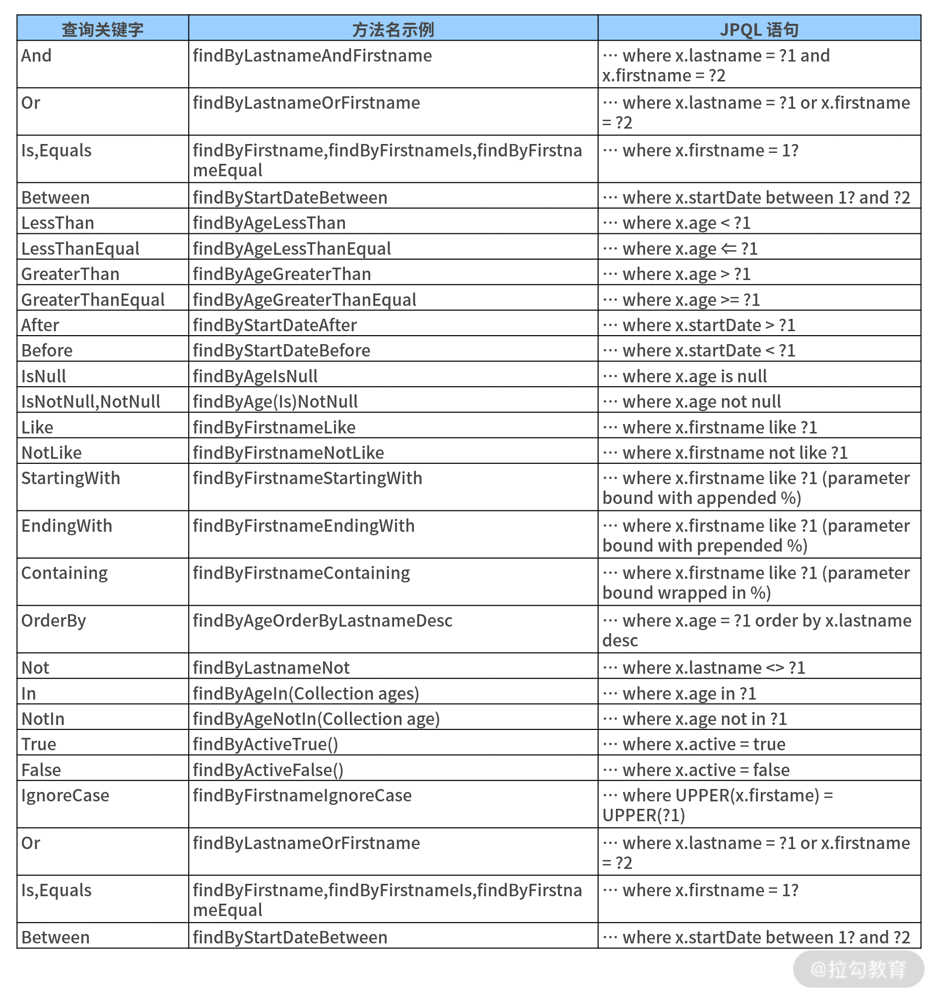
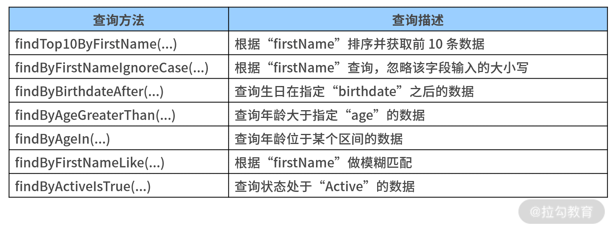
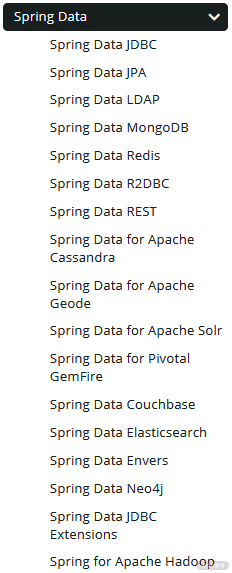

# 09 数据抽象：Spring Data 如何对数据访问过程进行统一抽象？

事实上，JdbcTemplate 是相对偏底层的一个工具类，作为系统开发最重要的基础功能之一，数据访问层组件的开发方式在 Spring Boot 中也得到了进一步简化，并充分发挥了 Spring 家族中另一个重要成员 Spring Data 的作用。

前面我们通过两个课时介绍了 Spring 框架用于访问关系型数据库的 JdbcTemplate 模板类，今天我们将对 Spring Data 框架中所提供的数据访问方式展开讨论。

Spring Data 是 Spring 家族中专门用于数据访问的开源框架，其核心理念是对所有存储媒介支持资源配置从而实现数据访问。我们知道，数据访问需要完成领域对象与存储数据之间的映射，并对外提供访问入口，Spring Data 基于 Repository 架构模式抽象出一套实现该模式的统一数据访问方式。

Spring Data 对数据访问过程的抽象主要体现在两个方面：① 提供了一套 Repository 接口定义及实现；② 实现了各种多样化的查询支持，接下来我们分别看一下。

### Repository 接口及实现

Repository 接口是 Spring Data 中对数据访问的最高层抽象，接口定义如下所示：

```
public interface Repository<T, ID> {
}
```

在以上代码中，我们看到 Repository 接口只是一个空接口，通过泛型指定了领域实体对象的类型和 ID。在 Spring Data 中，存在一大批 Repository 接口的子接口和实现类，该接口的部分类层结构如下所示：


Repository 接口的部分类层结构图

可以看到 CrudRepository 接口是对 Repository 接口的最常见扩展，添加了对领域实体的 CRUD 操作功能，具体定义如下代码所示：

```
public interface CrudRepository<T, ID> extends Repository<T, ID> {
  <S extends T> S save(S entity);
  <S extends T> Iterable<S> saveAll(Iterable<S> entities);
  Optional<T> findById(ID id);
  boolean existsById(ID id);
  Iterable<T> findAll();
  Iterable<T> findAllById(Iterable<ID> ids);
  long count();
  void deleteById(ID id);
  void delete(T entity);
  void deleteAll(Iterable<? extends T> entities);
  void deleteAll();
}
```

这些方法都是自解释的，我们可以看到 CrudRepository 接口提供了保存单个实体、保存集合、根据 id 查找实体、根据 id 判断实体是否存在、查询所有实体、查询实体数量、根据 id 删除实体 、删除一个实体的集合以及删除所有实体等常见操作，我们具体来看下其中几个方法的实现过程。

在实现过程中，我们首先需要关注最基础的 save 方法。通过查看 CrudRepository 的类层结构，我们找到它的一个实现类 SimpleJpaRepository，这个类显然是基于 JPA 规范所实现的针对关系型数据库的数据访问类。

save 方法如下代码所示：

```
private final JpaEntityInformation<T, ?> entityInformation;
private final EntityManager em;
@Transactional
public <S extends T> S save(S entity) {
        if (entityInformation.isNew(entity)) {
            em.persist(entity);
            return entity;
        } else {
            return em.merge(entity);
        }
}
```

显然，上述 save 方法依赖于 JPA 规范中的 EntityManager，当它发现所传入的实体为一个新对象时，就会调用 EntityManager 的 persist 方法，反之使用该对象进行 merge。关于 JPA 规范以及 EntityManager 我们在下一课时中会详细展开。

我们接着看一下用于根据 id 查询实体的 findOne 方法，如下代码所示：

```
public T findOne(ID id) {
        Assert.notNull(id, ID_MUST_NOT_BE_NULL);
        Class<T> domainType = getDomainClass();
        if (metadata == null) {
            return em.find(domainType, id);
        }
        LockModeType type = metadata.getLockModeType();
        Map<String, Object> hints = getQueryHints();
        return type == null ? em.find(domainType, id, hints) : em.find(domainType, id, type, hints);
}
```

在执行查询过程中，findOne 方法会根据领域实体的类型调用 EntityManager 的 find 方法来查找目标对象。需要注意的是，这里也会用到一些元数据 Metadata，以及涉及改变正常 SQL 执行效果的 Hint 机制的使用。

### 多样化查询支持

在日常开发过程中，数据查询的操作次数要远高于数据新增、数据删除和数据修改，因此在 Spring Data 中，除了对领域对象提供默认的 CRUD 操作外，我们还需要对查询场景高度抽象。而在现实的业务场景中，最典型的查询操作是 @Query 注解和方法名衍生查询机制。

#### @Query 注解

我们可以通过 @Query 注解直接在代码中嵌入查询语句和条件，从而提供类似 ORM 框架所具有的强大功能。

下面就是使用 @Query 注解进行查询的典型例子：

```
public interface AccountRepository extends JpaRepository<Account, 
 Long> {
  @Query("select a from Account a where a.userName = ?1") 
  Account findByUserName(String userName);
}
```

注意到这里的 @Query 注解使用的是类似 SQL 语句的语法，它能自动完成领域对象 Account 与数据库数据之间的相互映射。因我们使用的是 JpaRepository，所以这种类似 SQL 语句的语法实际上是一种 JPA 查询语言，也就是所谓的 JPQL（Java Persistence Query Language）。

JPQL 的基本语法如下所示：

```
SELECT 子句 FROM 子句 
[WHERE 子句] 
[GROUP BY 子句]
[HAVING 子句] 
[ORDER BY 子句]
```

JPQL 语句是不是和原生的 SQL 语句非常类似？唯一的区别就是 JPQL FROM 语句后面跟的是对象，而原生 SQL 语句中对应的是数据表中的字段。

介绍完 JPQL 之后，我们再回到 @Query 注解定义，这个注解位于 org.springframework.data.jpa.repository 包中，如下所示：

```
package org.springframework.data.jpa.repository;
public @interface Query {
    String value() default "";
    String countQuery() default "";
    String countProjection() default "";
    boolean nativeQuery() default false;
    String name() default "";
    String countName() default "";
}
```

@Query 注解中最常用的就是 value 属性，在前面示例中 JPQL 语句有使用到 。当然，如果我们将 nativeQuery 设置为 true，那么 value 属性则需要指定具体的原生 SQL 语句。

请注意，在 Spring Data 中存在一批 @Query 注解，分别针对不同的持久化媒介。例如 MongoDB 中存在一个 @Query 注解，但该注解位于 org.springframework.data.mongodb.repository 包中，定义如下：

```
package org.springframework.data.mongodb.repository;
public @interface Query {
    String value() default "";
    String fields() default "";
    boolean count() default false;
    boolean exists() default false;
    boolean delete() default false;
}
```

与面向 JPA 的 @Query 注解不同的是，MongoDB 中 @Query 注解的 value 值是一串 JSON 字符串，用于指定需要查询的对象条件，这里我们就不具体展开了。

#### 方法名衍生查询

方法名衍生查询也是 Spring Data 的查询特色之一，通过在方法命名上直接使用查询字段和参数，Spring Data 就能自动识别相应的查询条件并组装对应的查询语句。典型的示例如下所示：

```
public interface AccountRepository extends JpaRepository<Account, 
 Long> {
        List<Account> findByFirstNameAndLastName(String firstName, String 
 lastName);
}
```

在上面的例子中，通过 findByFirstNameAndLastname 这样符合普通语义的方法名，并在参数列表中按照方法名中参数的顺序和名称（即第一个参数是 fistName，第二个参数 lastName）传入相应的参数，Spring Data 就能自动组装 SQL 语句从而实现衍生查询。是不是很神奇？

**而想要使用方法名实现衍生查询，我们需要对 Repository 中定义的方法名进行一定约束。**首先我们需要指定一些查询关键字，常见的关键字如下表所示：



方法名衍生查询中查询关键字列表

有了这些查询关键字后，在方法命名上我们还需要指定查询字段和一些限制性条件。例如，在前面的示例中，我们只是基于“fistName”和“lastName”这两个字段做查询。

事实上，我们可以查询的内容非常多，下表列出了更多的方法名衍生查询示例，你可以参考下。



方法名衍生查询示例

在 Spring Data 中，方法名衍生查询的功能非常强大，上表中罗列的这些也只是全部功能中的一小部分而已。

讲到这里，你可能会问一个问题：如果我们在一个 Repository 中同时指定了 @Query 注解和方法名衍生查询，那么 Spring Data 会具体执行哪一个呢？要想回答这个问题，就需要我们对查询策略有一定的了解。

在 Spring Data 中，查询策略定义在 QueryLookupStrategy 中，如下代码所示：

```
public interface QueryLookupStrategy {
    public static enum Key {
        CREATE, USE_DECLARED_QUERY, CREATE_IF_NOT_FOUND;
        public static Key create(String xml) {
            if (!StringUtils.hasText(xml)) {
                return null;
            }
            return valueOf(xml.toUpperCase(Locale.US).replace("-", "_"));
        }
    }
    RepositoryQuery resolveQuery(Method method, RepositoryMetadata metadata, ProjectionFactory factory, NamedQueries namedQueries);
}
```

从以上代码中，我们看到 QueryLookupStrategy 分为三种，即 CREATE、USE_DECLARED_QUERY 和 CREATE_IF_NOT_FOUND。

这里的 CREATE 策略指的是直接根据方法名创建的查询策略，也就是使用前面介绍的方法名衍生查询。

而 USE_DECLARED_QUERY 指的是声明方式，主要使用 @Query 注解，如果没有 @Query 注解系统就会抛出异常。

而最后一种 CREATE_IF_NOT_FOUND 可以理解为是 @Query 注解和方法名衍生查询两者的兼容版。**请注意，Spring Data 默认使用的是 CREATE_IF_NOT_FOUND 策略，也就是说系统会先查找 @Query 注解，如果查到没有，会再去找与方法名相匹配的查询。 **### Spring Data 中的组件** Spring Data 支持对多种数据存储媒介进行数据访问，表现为提供了一系列默认的 Repository，包括针对关系型数据库的 JPA/JDBC Repository，针对 MongoDB、Neo4j、Redis 等 NoSQL 对应的 Repository，支持 Hadoop 的大数据访问的 Repository，甚至包括 Spring Batch 和 Spring Integration 在内的系统集成的 Repository。**在 Spring Data 的官方网站[https://spring.io/projects/spring-data](https://spring.io/projects/spring-data) 中，列出了其提供的所有组件，如下图所示：



Spring Data 所提供的组件列表（来自 Spring Data 官网）

根据官网介绍，Spring Data 中的组件可以分成四大类：核心模块（Main modules）、社区模块（Community modules）、关联模块（Related modules）和正在孵化的模块（Modules in Incubation）。例如，前面介绍的 Respository 和多样化查询功能就在核心模块 Spring Data Commons 组件中。**这里，我特别想强调下的是正在孵化的模块，它目前只包含一个组件，即 Spring Data R2DBC。** R2DBC 是[Reactive Relational Database Connectivity](https://github.com/r2dbc/) 的简写，代表响应式关系型数据库连接，相当于是响应式数据访问领域的 JDBC 规范。

### 小结与预告

数据访问是一切应用系统的基础，Spring Boot 作为一款集成性的开发框架，专门提供了 Spring Data 组件实现对数据访问过程进行抽象。基于 Repository 架构模式，Spring Data 为开发人员提供了一系列用于完成 CRUD 操作的工具方法，尤其是对最常用的查询操作专门进行了提炼和设计，使得开发过程更简单、高效。
