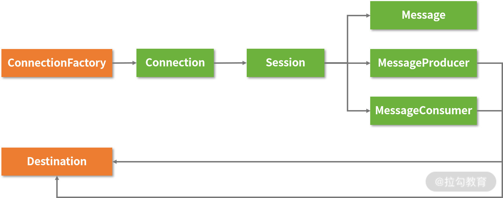
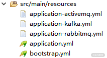

15 消息驱动：如何使用 JmsTemplate 集成 ActiveMQ？
=====================================

14 讲我们介绍了基于 Kafka 和 KafkaTemplate 实现消息发送和消费，并重构了 SpringCSS 案例系统中的 account-service 和 customer-service 服务。今天，我们继续介绍 ActiveMQ，并基于 JmsTemplate 模板工具类为 SpringCSS 案例添加对应的消息通信机制。

### JMS 规范与 ActiveMQ

JMS（Java Messaging Service）是一种 Java 消息服务，它基于消息传递语义，提供了一整套经过抽象的公共 API。目前，业界也存在一批 JMS 规范的实现框架，其中具备代表性的是 ActiveMQ。

#### JMS 规范

JMS 规范提供了一批核心接口供开发人员使用，而这些接口构成了客户端的 API 体系，如下图所示：



JMS 规范中的核心 API

上图中可以看到，我们可以通过 ConnectionFactory 创建 Connection，作为客户端的 MessageProducer 和 MessageConsumer 通过 Connection 提供的会话（Session）与服务器进行交互，而交互的媒介就是各种经过封装、包含目标地址（Destination）的消息。

**JMS 的消息由两大部分组成，即消息头（Header）和消息体（Payload）。 **** 消息体 **只包含具体的业务数据，而** 消息头**包含了 JMS 规范定义的通用属性，比如消息的唯一标识 MessageId、目标地址 Destination、接收消息的时间 Timestamp、有效期 Expiration、优先级 Priority、持久化模式 DeliveryMode 等都是常见的通用属性，这些通用属性构成了消息通信的基础元数据（Meta Data），由消息通信系统默认设置。

JMS 规范中的点对点模型表现为队列（Queue），队列为消息通信提供了一对一顺序发送和消费的机制。点对点模型 API 在通用 API 基础上，专门区分生产者 QueueSender 和消费者 QueueReceiver。

而 Topic 是 JMS 规范中对发布-订阅模型的抽象，JMS 同样提供了专门的 TopicPublisher 和 TopicSubscriber。

对于 Topic 而言，因多个消费者存在同时消费一条消息的情况，所以消息有副本的概念。相较点对点模型，发布-订阅模型通常用于更新、事件、通知等非响应式请求场景。在这些场景中，消费者和生产者之间是透明的，消费者可以通过配置文件进行静态管理，也可以在运行过程中动态被创建，同时还支持取消订阅操作。

#### ActiveMQ**JMS 规范存在 ActiveMQ、WMQ、TIBCO 等多种第三方实现方式，其中较主流的是 ActiveMQ。**针对 ActiveMQ，目前有两个实现项目可供选择，一个是经典的 5.x 版本，另一个是下一代的 Artemis，关于这两者之间的关系，我们可以简单地认为 Artemis 是 ActiveMQ 的未来版本，代表 ActiveMQ 的发展趋势。因此，本课程我们将使用 Artemis 演示消息通信机制

如果我们想启动 Artemis 服务，首先需要通过如下所示的命名创建一个服务实例。

```
artemis.cmd create D:\artemis --user springcss --password springcss_password

```

然后，执行如下命令，我们就可以正常启动这个 Artemis 服务实例了。

```
D:\artemis \bin\artemis run

```

Spring 提供了对 JMS 规范及各种实现的友好集成，通过直接配置 Queue 或 Topic，我们就可以使用 JmsTemplate 提供的各种方法简化对 Artemis 的操作了。

### 使用 JmsTemplate 集成 ActiveMQ

如果我们想基于 Artemis 使用 JmsTemplate，首先需要在 Spring Boot 应用程序中添加对 spring-boot-starter-artemis 的依赖，如下代码所示：

```
<dependency>


    <groupId>org.springframework.boot</groupId>


    <artifactId>spring-boot-starter-artemis</artifactId>


</dependency>

```

在讨论如何使用 JmsTemplate 实现消息发送和消费之前，我们先来分析消息生产者和消费者的工作模式。

通常，生产者行为模式单一，而消费者根据消费方式的不同有一些特定的分类，比如常见的有推送型消费者（Push Consumer）和拉取型消费者（Pull Consumer）。**推送型方式指的是应用系统向消费者对象注册一个 Listener 接口并通过回调 Listener 接口方法实现消息消费，而在拉取方式下应用系统通常主动调用消费者的拉取消息方法消费消息，主动权由应用系统控制。**

在消息通信的两种基本模型中，发布-订阅模型支持生产者/消费者之间的一对多关系，属于一种典型的推送消费者实现机制；而点对点模型中有且仅有一个消费者，他们主要通过基于间隔性拉取的轮询（Polling）方式进行消息消费。

14 讲我们提到 Kafka 中消费消息的方式是一种典型的推送型消费者，所以 KafkaTemplate 只提供了发送消息的方法而没有提供实现消费消息的方法。而 JmsTemplate 则不同，它同时支持推送型消费和拉取型消费，接下来我们一起看下如何使用JmsTemplate 发送消息。

#### 使用 JmsTemplate 发送消息

JmsTemplate 中存在一批 send 方法用来实现消息发送，如下代码所示：

```
@Override


public void send(MessageCreator messageCreator) throws JmsException {


}


 


@Override


public void send(final Destination destination, final MessageCreator messageCreator) throws JmsException {


}


 


@Override


public void send(final String destinationName, final MessageCreator messageCreator) throws JmsException {


}

```

这些方法一方面指定了目标 Destination，另一方面提供了一个用于创建消息对象的 MessageCreator 接口，如下代码所示：

```
public interface MessageCreator {


    Message createMessage(Session session) throws JMSException;


}

```

通过 send 方法发送消息的典型实现方式如下代码所示：

```
public void sendDemoObject(DemoObject demoObject) { 


    jmsTemplate.send("demo.queue", new MessageCreator() { 


        @Override 


        public Message createMessage(Session session) 


        throws JMSException { 


         return session.createObjectMessage(demoObject); 


     } 


}

```

与 KakfaTemplate 不同，JmsTemplate 还提供了一组更为简便的方法实现消息发送，即 convertAndSend 方法，如下代码所示：

```
public void convertAndSend(Destination destination, final Object message) throws JmsException {


}

```

通过 convertAndSend 方法，我们可以直接传入任意业务对象，且该方法能自动将业务对象转换为消息对象并进行消息发送，具体的示例代码如下所示：

```
public void sendDemoObject(DemoObject demoObject) { 


 jmsTemplate.convertAndSend("demo.queue", demoObject); 


}

```

在以上代码中，我们注意到 convertAndSend 方法还存在一批重载方法，它包含了消息后处理功能，如下代码所示：

```
@Override


public void convertAndSend( Destination destination, final Object message, final MessagePostProcessor postProcessor)throws JmsException {


}

```

上述方法中的 MessagePostProcessor 就是一种消息后处理器，它用来在构建消息过程中添加自定义的消息属性，它的一种典型的使用方法如下代码所示：

```
public void sendDemoObject(DemoObject demoObject) { 


 jmsTemplate.convertAndSend("demo.queue", demoObject, new                 MessagePostProcessor() { 


        @Override 


        public Message postProcessMessage(Message message) throws       JMSException { 


         //针对 Message 的处理


            return message;


     } 


});

```

使用 JmsTemplate 的最后一步就是在配置文件中添加配置项，如下代码所示：

```
spring:


  artemis:


    host: localhost


    port: 61616


    user: springcss


    password: springcss_password

```

* * *

这里我们指定了 artemis 服务器的地址、端口、用户名和密码等信息。同时，我们也可以在配置文件中指定 Destination 信息，具体配置方式如下代码所示：

```
spring:


  jms:


    template:


      default-destination: springcss.account.queue

```

#### 使用 JmsTemplate 消费消息

基于前面的讨论，我们知道 JmsTemplate 同时支持推送型消费和拉取型消费两种消费类型。我们先来看一下如何实现拉取型消费模式。

在 JmsTemplate 中提供了一批 receive 方法供我们从 artemis 中拉取消息，如下代码所示：

```
public Message receive() throws JmsException {


}


 


public Message receive(Destination destination) throws JmsException {


}


 


public Message receive(String destinationName) throws JmsException {


}

```

到这一步我们需要注意一点：调用上述方法时，当前线程会发生阻塞，直到一条新消息的到来。针对阻塞场景，这时 receive 方法的使用方式如下代码所示：

```
public DemoEvent receiveEvent() {


 Message message = jmsTemplate.receive(“demo.queue”); 


    return (DemoEvent) messageConverter.fromMessage(message);


}

```

这里我们使用了一个 messageConverter 对象将消息转化为领域对象。

在使用 JmsTemplate 时，我们可以使用 Spring 提供的 MappingJackson2MessageConverter、MarshallingMessageConverter、MessagingMessageConverter，以及 SimpleMessageConverter 实现消息转换，一般系统默认使用 SimpleMessageConverter。而在日常开发过程中，我们通常会使用 MappingJackson2MessageConverter 来完成 JSON 字符串与对象之间的转换。

同时，JmsTemplate 还提供了一组更为高阶的 receiveAndConvert 方法完成消息的接收和转换，如下代码所示：

```
public Object receiveAndConvert(Destination destination) throws JmsException {


}

```

顾名思义，receiveAndConvert 方法能在接收消息后完成对消息对象的自动转换，使得接收消息的代码更为简单，如下代码所示：

```
public DemoEvent receiveEvent() { 


 return (DemoEvent)jmsTemplate.receiveAndConvert("demo.queue"); 


}

```

当然，在消费者端，我们同样需要指定与发送者端完全一致的 MessageConverter 和 Destination 来分别实现消息转换和设置消息目的地。

介绍完拉模式，接下来我们介绍推模式下的消息消费方法，实现方法也很简单，如下代码所示：

```
@JmsListener(queues = “demo.queue”)


public void handlerEvent(DemoEvent event) {


    //TODO：添加消息处理逻辑


}

```

在推模式下，开发人员只需要在 @JmsListener 注解中指定目标队列，就能自动接收来自该队列的消息。

### 在 SpringCSS 案例中集成 ActiveMQ

ActiveMQ 是本专栏中使用到的第二款消息中间件，因为每款消息中间件都需要设置一些配置信息，所以我们有必要回到 SpringCSS 案例系统，先对配置信息的管理做一些优化。

#### 实现 account-service 消息生产者

首先，我们来回顾下《多维配置：如何使用 Spring Boot 中的配置体系？》的内容介绍，在 Spring Boot 中，我们可以通过 Profile 有效管理针对不同场景和环境的配置信息。

而在 SpringCSS 案例中，Kafka、ActiveMQ 及 16 讲将要介绍的 RabbitMQ 都是消息中间件，在案例系统运行过程中，我们需要选择其中一种中间件演示消息发送和接收到过程，这样我们就需要针对不同的中间件设置不同的 Profile 了。

在 account-service 中，我们可以根据 Profile 构建如下所示的配置文件体系。



account-service 中的配置文件

从以上图中可以看到：根据三种不同的中间件，我们分别提供了三个配置文件。以其中的 application-activemq.yml 为例，其包含的配置项如下代码所示：

```
spring:


  jms:


    template:


      default-destination: springcss.account.queue


  artemis:


    host: localhost


    port: 61616


    user: springcss


    password: springcss_password


    embedded:


       enabled: false

```

在主配置文件 application.yml 中，我们可以将当前可用的 Profile 设置为 activemq，如下代码所示：

```
spring:


  profiles:


    active: activemq

```

介绍完配置信息的优化管理方案，我们再来看看实现消息发送的 ActiveMQAccountChangedPublisher 类，如下代码所示：

```
@Component("activeMQAccountChangedPublisher")


public class ActiveMQAccountChangedPublisher{


 


    @Autowired


    private JmsTemplate jmsTemplate;


 


    @Override


    protected void publishEvent(AccountChangedEvent event) {


        jmsTemplate.convertAndSend(AccountChannels.SPRINGCSS_ACCOUNT_QUEUE, event, this::addEventSource);


    }


 


    private Message addEventSource(Message message) throws JMSException {


        message.setStringProperty("EVENT_SYSTEM", "SpringCSS");


        return message;


    }


}

```

以上代码中，我们基于 JmsTemplate 的 convertAndSend 方法完成了消息的发送。同时，我们注意到：这里也使用了另一种实现 MessagePostProcessor 的方法，即 lambda 语法，你可以参考这种语法简化代码的组织方式。

另一方面，在案例中，我们希望使用 MappingJackson2MessageConverter 完成对消息的转换。因此，我们可以在 account-service 中添加一个 ActiveMQMessagingConfig 初始化具体的 MappingJackson2MessageConverter 对象，如下代码所示：

```
@Configuration


public class ActiveMQMessagingConfig {


 


    @Bean


    public MappingJackson2MessageConverter activeMQMessageConverter() {


        MappingJackson2MessageConverter messageConverter = new MappingJackson2MessageConverter();


        messageConverter.setTypeIdPropertyName("_typeId");


 


        Map<String, Class<?>> typeIdMappings = new HashMap<String, Class<?>>();


        typeIdMappings.put("accountChangedEvent", AccountChangedEvent.class);


        messageConverter.setTypeIdMappings(typeIdMappings);


 


        return messageConverter;


    }


}

```

上述代码的核心作用是定义了 typeId 到 Class 的 Map，这样做的目的在于为消息的转换提供了灵活性。比如我们可以在 account-service 中发送了一个 Id 为“accountChangedEvent”且类型为 AccountChangedEvent 的业务对象，而在消费该消息的场景中，我们只需要指定同一个 Id，对应的消息就可以自动转化为另一种业务对象（不一定是这里使用到的 AccountChangedEvent）。

#### 实现 customer-service 消息消费者

我们先回到 customer-service 服务，看看如何消费来自 account-service 的消息，如下代码所示：

```
@Component("activeMQAccountChangedReceiver")


public class ActiveMQAccountChangedReceiver {


 


    @Autowired


    private JmsTemplate jmsTemplate;


 


    @Override


    protected AccountChangedEvent receiveEvent() {


        return (AccountChangedEvent) jmsTemplate.receiveAndConvert(AccountChannels.SPRINGCSS_ACCOUNT_QUEUE);


    }


}

```

这里，我们只是简单通过 JmsTemplate 的 receiveAndConvert 方法拉取来自 ActiveMQ 的消息。

**请注意，因为 receiveAndConvert 方法的执行过程是阻塞性的拉取行为，所以我们可以实现一个新的 Controller 专门测试该方法的有效性，如下代码所示：**

```
@RestController


@RequestMapping(value="messagereceive")


public class MessageReceiveController {


    @Autowired


    private ActiveMQAccountChangedReceiver accountChangedReceiver; 


    @RequestMapping(value = "", method = RequestMethod.GET)


    public void receiveAccountChangedEvent() {


        accountChangedReceiver.receiveAccountChangedEvent();


    }


}

```

一旦我们访问了这个端点，系统就会拉取 ActiveMQ 中目前尚未消费的消息。如果 ActiveMQ 没有待消费的消息，这个方法就会阻塞，且一直处于等待状态，直到新消息的到来。

如果你想使用消息推送的方式来消费消息，实现过程更加简单，如下代码所示：

```
@Override


@JmsListener(destination = AccountChannels.SPRINGCSS_ACCOUNT_QUEUE)


public void handlerAccountChangedEvent(AccountChangedEvent event) { 


    AccountMessage account = event.getAccountMessage();


    String operation = event.getOperation(); 


 


 System.out.print(accountMessage.getId() + ":" + accountMessage.getAccountCode() + ":" + accountMessage.getAccountName());


}

```

从以上代码中可以看到，我们可以直接通过 @JmsListener 注解消费从 ActiveMQ 推送过来的消息。这里我们只是把消息打印了出来，你可以根据实际需要对消息进行任何形式的处理。

### 小结与预告

本节课我们继续介绍基于 JMS 规范的 ActiveMQ 消息中间件，并使用 Spring Boot 提供的 JmsTemplate 完成了消息的发送和消费。同样，我们也将 ActiveMQ 的使用过程集成到 SpringCSS 案例中，并基于 Spring Boot 的配置体系对配置信息的管理过程做了优化。16 讲我们将继续介绍本课程中最后一款要引入的消息中间件 RabbitMQ 及 Spring Boot 中提供的模板工具类 RabbitTemplate。
