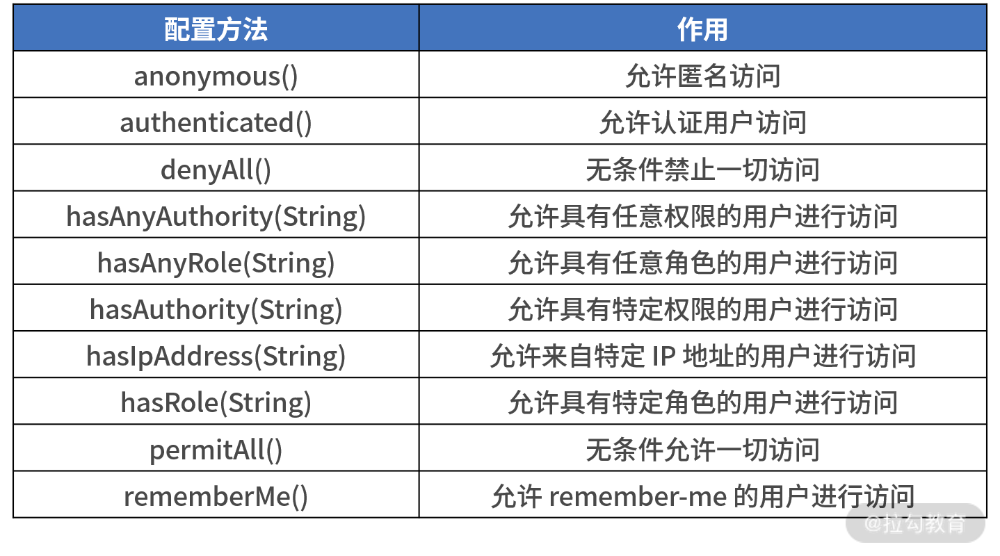

# 19 服务授权：如何基于 Spring Security 确保请求安全访问？

18 讲中，我们集中讨论了如何通过 WebSecurityConfigurerAdapter 完成对用户认证体系的构建。这一讲我们将继续使用这个配置类完成对服务访问的授权控制。

在日常开发过程中，我们需要对 Web 应用中的不同 HTTP 端点进行不同粒度的权限控制，并且希望这种控制方法足够灵活。而借助 Spring Security 框架，我们就可以对其进行简单实现，下面我们一起来看下。

### 对 HTTP 端点进行访问授权管理

在一个 Web 应用中，权限管理的对象是通过 Controller 层暴露的一个个 HTTP 端点，而这些 HTTP 端点就是需要授权访问的资源。

开发人员使用 Spring Security 中提供的一系列丰富技术组件，即可通过简单的设置对权限进行灵活管理。

#### 使用配置方法

实现访问授权的第一种方法是使用配置方法，关于配置方法的处理过程也是位于 WebSecurityConfigurerAdapter 类中，但使用的是 configure(HttpSecurity http) 方法，如下代码所示：

```
protected void configure(HttpSecurity http) throws Exception {
        http
            .authorizeRequests()
            .anyRequest()
            .authenticated()
            .and()
            .formLogin()
            .and()
            .httpBasic();
}
```

上述代码就是 Spring Security 中作用于访问授权的默认实现方法，这里用到了多个常见的配置方法。

回想 18 课时中的内容，访问任何端点时，一旦在代码类路径中引入了 Spring Security 框架，就会弹出一个登录界面从而完成用户认证。因为认证是授权的前置流程，认证结束后就可以进入授权环节。

结合这些配置方法的名称，我们简单分析一下实现这种默认的授权效果的具体步骤。

首先，通过 HttpSecurity 类的 authorizeRequests() 方法，我们可以对所有访问 HTTP 端点的 HttpServletRequest 进行限制。

其次，anyRequest().authenticated() 语句指定了所有请求都需要执行认证，也就是说没有通过认证的用户无法访问任何端点。

然后，formLogin() 语句指定了用户需要使用表单进行登录，即会弹出一个登录界面。

最后， httpBasic() 语句使用 HTTP 协议中的 Basic Authentication 方法完成认证。

18 讲中我们也演示了如何使用 Postman 完成认证的方式，这里就不过多赘述了。

当然，Spring Security 中还提供了很多其他有用的配置方法供开发人员灵活使用，下表中我们进行了列举，一起来看下。



**基于上表中的配置方法，我们就可以通过 HttpSecurity 实现自定义的授权策略。** 比方说，我们希望针对“/orders”根路径下的所有端点进行访问控制，且只允许认证通过的用户访问，那么可以创建一个继承了 WebSecurityConfigurerAdapter 类的 SpringCssSecurityConfig，并覆写其中的 configure(HttpSecurity http) 方法来实现，如下代码所示：

```
@Configuration
public class SecurityConfig extends WebSecurityConfigurerAdapter {
    @Override
    public void configure(HttpSecurity http) throws Exception {
        http.authorizeRequests()
            .antMatchers("/orders/**")
            .authenticated();
    }
}
```

**请注意：虽然上表中的这些配置方法非常有用，但是由于我们无法基于一些来自环境和业务的参数灵活控制访问规则，也就存在一定的局限性。**

为此，Spring Security 还提供了一个 access() 方法，该方法允许开发人员传入一个表达式进行更细粒度的权限控制，这里，我们将引入Spring 框架提供的一种动态表达式语言—— SpEL（Spring Expression Language 的简称）。

只要 SpEL 表达式的返回值为 true，access() 方法就允许用户访问，如下代码所示：

```
@Override
public void configure(HttpSecurity http) throws Exception {
        http.authorizeRequests()
            .antMatchers("/orders")
            .access("hasRole('ROLE_USER')");
}
```

上述代码中，假设访问“/orders”端点的请求必须具备“ROLE_USER”角色，通过 access 方法中的 hasRole 方法我们即可灵活地实现这个需求。当然，除了使用 hasRole 外，我们还可以使用 authentication、isAnonymous、isAuthenticated、permitAll 等表达式进行实现。因这些表达式的作用与前面介绍的配置方法一致，我们就不过多赘述。

#### 使用注解

除了使用配置方法，Spring Security 还为我们提供了 @PreAuthorize 注解实现类似的效果，该注解定义如下代码所示：

```
@Target({ ElementType.METHOD, ElementType.TYPE })
@Retention(RetentionPolicy.RUNTIME)
@Inherited
@Documented
public @interface PreAuthorize {
    //通过 SpEL 表达式设置访问控制
    String value();
}
```

可以看到 @PreAuthorize 的原理与前面介绍的 access() 方法一样，即通过传入一个 SpEL 表达式设置访问控制，如下所示代码就是一个典型的使用示例：

```
@RestController
@RequestMapping(value="orders")
public class OrderController {
    @PostMapping(value = "/")
    @PreAuthorize("hasRole(ROLE_ADMIN)")
    public void addOrder(@RequestBody Order order) {
        …
    }
}
```

从这个示例中可以看到，在“/orders/”这个 HTTP 端点上，我们添加了一个 @PreAuthorize 注解用来限制只有角色为“ROLE_ADMIN”的用户才能访问该端点。

其实，Spring Security 中用于授权的注解还有 @PostAuthorize，它与 @PreAuthorize 注解是一组，主要用于请求结束之后检查权限。因这种情况比较少见，这里我们不再继续展开，你可以翻阅相关资料学习。

### 实现多维度访问授权方案

我们知道 HTTP 端点是 Web 应用程序的一种资源，而每个 Web 应用程序对于自身资源的保护粒度因服务而异。对于一般的 HTTP 端点，用户可能通过认证就可以访问；对于一些重要的 HTTP 端点，用户在已认证的基础上还会有一些附加要求。

接下来，我们将讨论对资源进行保护的三种粒度级别。

- **用户级别：** 该级别是最基本的资源保护级别，只要是认证用户就可能访问服务内的各种资源。
- **用户+角色级别：** 该级别在认证用户级别的基础上，还要求用户属于某一个或多个特定角色。
- **用户+角色+操作级别：** 该级别在认证用户+角色级别的基础上，对某些 HTTP 操作方法做了访问限制。

基于配置方法和注解，我们可以轻松实现上述三种访问授权方案。

#### 使用用户级别保护服务访问

这次，我们来到 SpringCSS 案例系统中的 customer-service，先来回顾一下 CustomerController 的内容，如下所示：

```
@RestController
@RequestMapping(value="customers")
public class CustomerController {
    @Autowired
    private CustomerTicketService customerTicketService; 
    @PostMapping(value = "/{accountId}/{orderNumber}")
    public CustomerTicket generateCustomerTicket( @PathVariable("accountId") Long accountId,
            @PathVariable("orderNumber") String orderNumber) {
        CustomerTicket customerTicket = customerTicketService.generateCustomerTicket(accountId, orderNumber);
        return customerTicket;
    }
    @GetMapping(value = "/{id}")
    public CustomerTicket getCustomerTicketById(@PathVariable Long id) {
        CustomerTicket customerTicket = customerTicketService.getCustomerTicketById(id);
     return customerTicket;
    }
    @GetMapping(value = "/{pageIndex}/{pageSize}")
    public List<CustomerTicket> getCustomerTicketList( @PathVariable("pageIndex") int pageIndex, @PathVariable("pageSize") int pageSize) {
        List<CustomerTicket> customerTickets = customerTicketService.getCustomerTickets(pageIndex, pageSize);
        return customerTickets;
    }
 @DeleteMapping(value = "/{id}")
    public void deleteCustomerTicket( @PathVariable("id") Long id) {
        customerTicketService.deleteCustomerTicket(id);
    }
}
```

因为 CustomerController 是 SpringCSS 案例中的核心入口，所以我们认为它的所有端点都应该受到保护。于是，在 customer-service 中，我们创建了一个 SpringCssSecurityConfig 类继承 WebSecurityConfigurerAdapter，如下代码所示：

```
@Configuration
public class SpringCssSecurityConfig extends WebSecurityConfigurerAdapter {
    @Override
    public void configure(HttpSecurity http) throws Exception {
        http.authorizeRequests()
            .anyRequest()
            .authenticated();
    }
}
```

位于 configure() 方法中的 .anyRequest().authenticated() 语句指定了访问 customer-service 下的所有端点的任何请求都需要进行验证。因此，当我们使用普通的 HTTP 请求访问 CustomerController 中的任何 URL（例如[http://localhost:8083/customers/1](http://localhost:8083/customers/1)），将会得到如下图代码所示的错误信息，该错误信息明确指出资源的访问需要进行认证。

```
{
    "error": "access_denied",
    "error_description": "Full authentication is required to access to this resource"
}
```

记得 18 讲中覆写 WebSecurityConfigurerAdapter 的 config(AuthenticationManagerBuilder auth) 方法时提供了一个用户名“springcss_user”，现在我们就用这个用户名来添加用户认证信息并再次访问该端点。显然，因为此时我们传入的是有效的用户信息，所以可以满足认证要求。

#### 使用用户+角色级别保护服务访问

对于某些安全性要求比较高的 HTTP 端点，我们通常需要限定访问的角色。

例如，customer-service 服务中涉及客户工单管理等核心业务，我们认为不应该给所有的认证用户开放资源访问入口，而应该限定只有角色为“ADMIN”的管理员才开放。这时，我们就可以使用认证用户+角色保护服务的访问控制机制，具体的示例代码如下所示：

```
@Configuration
public class SpringCssSecurityConfig extends WebSecurityConfigurerAdapter {
    @Override
    public void configure(HttpSecurity http) throws Exception {
        http.authorizeRequests()
            .antMatchers("/customers/**")
            .hasRole("ADMIN")
            .anyRequest()
            .authenticated();
    }
}
```

在上述代码中可以看到，我们使用了 HttpSecurity 类中的 antMatchers("/customer/ **") 和 hasRole("ADMIN") 方法为访问"/customers/** "的请求限定了角色，只有"ADMIN"角色的认证用户才能访问以"/customers/"为根地址的所有 URL。

如果我们使用了认证用户+角色的方式保护服务访问，使用角色为“USER”的认证用户“springcss_user”访问 customer-service 时就会出现如下所示的“access_denied”错误信息：

```
{
    "error": "access_denied",
    "error_description": "Access is denied"
}
```

而我们使用具有“ADMIN”角色的“springcss_admin”用户访问 customer-service 时，将会得到正常的返回信息，关于这点你可以自己做一些尝试。

#### 使用用户+角色+操作级别保护服务访问

最后一种保护服务访问的策略粒度划分最细，在认证用户+角色的基础上，我们需要再对具体的 HTTP 操作进行限制。

在 customer-service 中，我们认为所有对客服工单的删除操作都很危险，因此可以使用 http.antMatchers(HttpMethod.DELETE, "/customers/**") 方法对删除操作进行保护，示例代码如下：

```
@Configuration
public class SpringCssSecurityConfig extends WebSecurityConfigurerAdapter {
    @Override
    public void configure(HttpSecurity http) throws Exception{
        http.authorizeRequests()
                .antMatchers(HttpMethod.DELETE, "/customers/**")
                .hasRole("ADMIN")
                .anyRequest()
                .authenticated();
    }
}
```

上述代码的效果在于对“/customers”端点执行删除操作时，我们需要使用具有“ADMIN”角色的“springcss_admin”用户，执行其他操作时不需要。因为如果我们使用“springcss_user”账户执行删除操作，还是会出现“access_denied”错误信息。

### 小结与预告

通过 19 讲的学习，我们明确了 Web 应用程序中访问授权控制的三种粒度，并基于 SpringCSS 案例给出了三种粒度下的控制实现方式。
