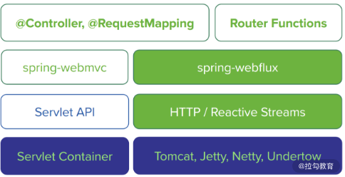
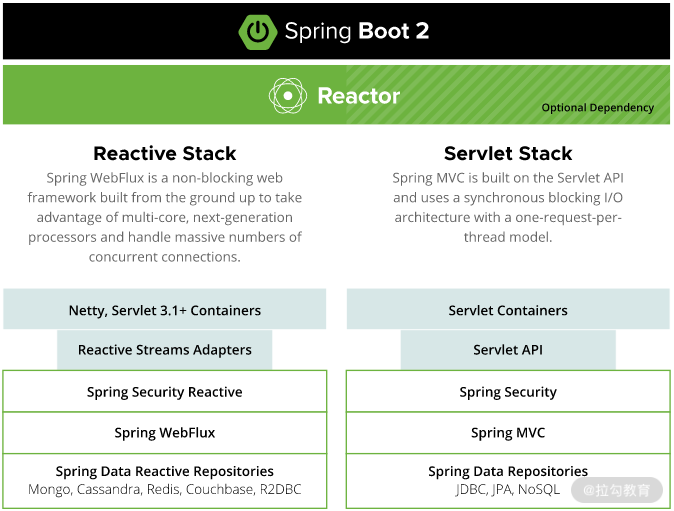

# 结束语 以终为始：Spring Boot 总结和展望

终于到了课程的最后一讲啦，这一讲我们将对整个 Spring Boot 课程进行总结。

Spring Boot 不仅是 Spring 家族的重要组成成员，也是一款业界领先的应用程序开发框架。通过 Spring Boot 提供的多项核心功能，我们能够快速构建一个完整的 Web 服务开发解决方案。

作为一门针对 Spring Boot 的系统化课程，在课程最后，我们先总结一下整个课程中介绍的 Spring Boot 核心功能，然后梳理一下写作过程中的一些思考和心得，最后对 Spring Boot 的未来发展进行展望。

### Spring Boot 的创新性

Spring Boot 是 Spring 家族中由 Pivotal 团队提供的核心开发框架，它基于 Spring4.0 设计，目的是简化新 Spring 应用程序的初始搭建过程和开发过程。

自这个框架诞生以来，它就是快速应用开发领域（Rapid Application Development，RAD）界的领导者。通过使用 Spring Boot 内置的自动配置机制，使得开发人员再也不需要像传统的 Spring 框架那样，使用复杂和重复的配置构建和运行整个 Web 应用程序了，大大简化了开发工作流程。从这点上讲，Spring Boot 无疑是一款具有创新性的开发框架。

Spring Boot 不仅继承了 Spring 框架原有的优秀特性，同时它还添加了很多新的功能，包含但不限于以下五点：

- 可以创建独立的 Spring 应用程序，这些应用程序可以以 JAR 包的形式直接运行；
- 内嵌 Tomcat、Jetty 等 Servlet 容器；
- 提供自动配置的“starter”项目以简化外部组件依赖管理；
- 尽可能把配置 Spring 容器的工作自动化；
- 提供开箱即用的特性，如指标、健康检查和外部化配置。

除此之外，Spring Boot 还是 “约定优于配置（Convention over configuration）”设计理念的倡导者和实践者。

约定优于配置是一种软件设计范式，旨在帮助软件开发人员获得已经默认的内置功能组件，从而减少做决定的次数。在日常开发过程中，开发人员只需要指定自己所开发的应用程序中与约定存在差异的那部分内容即可，剩余的全部交给框架处理。

当然，Spring Boot 框架的强大之处还体现在集成性上。

在使用传统的 Spring 框架时，我们经常会遇到因为各个依赖的组件之间版本不一致导致应用程序无法启动的情况。而 Spring Boot 通过集成大量的外部框架，使得依赖包的版本冲突、引用的不稳定性等问题得到了很好的解决。在这点上，同样也体现了 Spring Boot 的创新性。

### Spring Boot 课程总结

总结完 Spring Boot 的各项核心功能及所具备的创新性，我们再来总结一下整个课程的讲解特色和与其他课程之间的差异。

这里，我整理了本课程的三大亮点。

**第一大亮点：完整介绍了 Spring Boot 开发技术体系** 。通过学习本课程，你可以全面梳理基于 Spring Boot 的 Web 应用程序开发技术组件，其中包括配置体系、数据访问、Web 服务、消息通信、系统安全、系统监控、系统测试等专项主题。这些技术组件涵盖了 Java EE 应用程序开发涉及的方方面面，具有广泛的应用场景。 **第二大亮点：提供了实用的应用程序开发案例** 。这个案例系统足够简单，可以让你从零开始理解和掌握其中的各项知识点。同时，这个案例系统又足够完整，涉及的各个核心功能都为我们提供了相关的配置项和示例代码，在日常开发过程中可以进行参考。 **第三大亮点：提供了深入的功能组件原理分析过程** 。这些分析过程能帮助你在掌握 Spring Boot 框架应用的基础上，深入理解自动配置、数据访问、远程调用等核心技术组件的实现原理，做到知其然而知其所以然。

整个课程从平时的积累到酝酿，再到启动，最后到上线经历了小半年的时间，伴随着这个过程，我把 Spring Boot 的部分源代码系统梳理了一遍，也对内部的设计思想和实现原理做了一些提炼和总结。

总体而言，Spring Boot 是一款代码质量非常高的开源框架，其中关于 Spring Boot 和 Spring 框架的集成、内置的自动配置机制，以及数据访问、远程调用等诸多功能都给我留下了深刻的印象，使我受益良多，相信坚持学习到今天的你也是如此。

### Spring Boot 的发展和演进

最后，我们来对 Spring Boot 的发展做一些展望。

首先，我们来看一下 Spring Boot 与 Spring 框架的演进过程。

目前 Spring 已经演进到 5.X 版本，随着 Spring 5 的正式发布，我们迎来了响应式编程（Reactive Programming）的全新发展时期。

Spring 5 中内嵌了与数据管理相关的响应式数据访问、与系统集成相关的响应式消息通信，以及与 Web 服务相关的响应式 Web 框架等多种响应式组件，从而极大简化了响应式应用程序的开发过程和难度。

以支持响应式 Web 的 Spring WebFlux 为例，这里我们给出它的架构图，如下图所示：

Spring WebFlux 架构图（来自 Spring 官网）

在图中我们可以看到，上图左侧为基于 Spring Webflux 的技术栈，右侧为基于 Spring MVC 的技术栈。我们知道传统的 Spring MVC 是在 Java EE 的 Servlet 标准之上进行构建的，该标准本身就是阻塞式和同步式。而 Spring WebFlux 基于响应式流进行构建，因此我们可以使用它来构建异步非阻塞的服务。

随着 WebFlux 等响应式编程技术的兴起，它为构建具有即时响应性和回弹性的应用程序提供了一个很好的技术基础。

我们知道一个分布式系统中，可能存在数十乃至数百个独立的 Web 应用程序，它们之间互相通信以完成复杂的业务流程，而这个过程势必涉及大量的 I/O 操作。

一旦涉及 I/O 操作，尤其是阻塞式 I/O 操作将会整体增加系统的延迟并降低吞吐量。如果我们能够在复杂的流程中集成非阻塞、异步通信机制，就可以高效处理跨服务之间的网络请求。针对这种场景，WebFlux 也是一种非常有效的解决方案。

下面我们再来看一下 Spring Boot 2 的另一张官网架构图，如下图所示：

Spring Boot 2 架构图（来自 Spring 官网）

从图中我们可以看到，上图底部将 Spring Data 明确划分为两大类型：一类是支持 JDBC、JPA 和部分 NoSQL 的传统 Spring Data Repository，另一类则是支持 Mongo、Cassandra、Redis、Couchbase 等的响应式 Spring Data Reactive Repository。

这张图背后的意义在于，Spring Boot 可以帮助我们构建从 Web 服务层到数据访问层的全栈式响应式编程技术，从而确保系统的各个环节都具备即时响应性。

未来，让我们一起期待响应式编程技术与 Spring Boot 框架之间更加紧密的整合吧。
