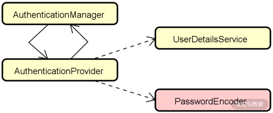
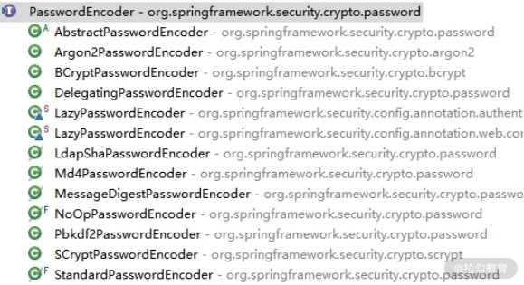
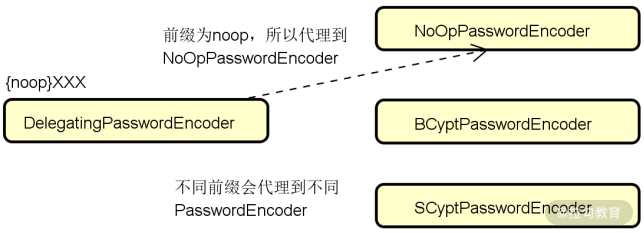

04 密码安全：Spring Security 中包含哪些加解密技术？
===================================

通过前面两讲内容的学习，相信你已经掌握了 Spring Security 中的用户认证体系。用户认证的过程通常涉及密码的校验，因此密码的安全性也是我们需要考虑的一个核心问题。Spring Security 作为一款功能完备的安全性框架，一方面提供了 **用于完成认证操作的 PasswordEncoder 组件** ，另一方面也包含一个独立而完整的 **加密模块** ，方便在应用程序中单独使用。

### PasswordEncoder

我们先来回顾一下整个用户认证流程。在 AuthenticationProvider 中，我们需要使用 PasswordEncoder 组件验证密码的正确性，如下图所示：



PasswordEncoder 组件与认证流程之间的关系

在“用户认证：如何使用 Spring Security 构建用户认证体系？”一讲中我们也介绍了基于数据库的用户信息存储方案：

```
@Override


protected void configure(AuthenticationManagerBuilder auth) throws Exception {


 


        auth.jdbcAuthentication().dataSource(dataSource)


               .usersByUsernameQuery("select username, password, enabled from Users " + "where username=?")


               .authoritiesByUsernameQuery("select username, authority from UserAuthorities " + "where username=?")


               .passwordEncoder(new BCryptPasswordEncoder());


}

```

请注意，在上述方法中，我们通过 jdbcAuthentication() 方法验证用户信息时一定要 **集成加密机制** ，也就是使用 passwordEncoder() 方法嵌入一个 PasswordEncoder 接口的实现类。

#### PasswordEncoder 接口

在 Spring Security 中，PasswordEncoder 接口代表的是一种密码编码器，其核心作用在于 **指定密码的具体加密方式** ，以及如何将一段给定的加密字符串与明文之间完成匹配校验。PasswordEncoder 接口定义如下：

```
public interface PasswordEncoder {


    //对原始密码进行编码


    String encode(CharSequence rawPassword);


    //对提交的原始密码与库中存储的加密密码进行比对


    boolean matches(CharSequence rawPassword, String encodedPassword);


    //判断加密密码是否需要再次进行加密，默认返回 false


    default boolean upgradeEncoding(String encodedPassword) {


        return false;


    }


}

```

Spring Security 内置了一大批 PasswordEncoder 接口的实现类，如下所示：



Spring Security 中的 PasswordEncoder 实现类

我们对上图中比较常见的几个 PasswordEncoder 接口展开叙述。

* NoOpPasswordEncoder：以明文形式保留密码，不对密码进行编码。这种 PasswordEncoder 通常只用于演示，不应该用于生产环境。
* StandardPasswordEncoder：使用 SHA-256 算法对密码执行哈希操作。
* BCryptPasswordEncoder：使用 bcrypt 强哈希算法对密码执行哈希操作。
* Pbkdf2PasswordEncoder：使用 PBKDF2 算法对密码执行哈希操作。

下面我们以 BCryptPasswordEncoder 为例，看一下它的 encode 方法，如下所示：

```
public String encode(CharSequence rawPassword) {


        String salt;


        if (random != null) {


           salt = BCrypt.gensalt(version.getVersion(), strength, random);


        } else {


           salt = BCrypt.gensalt(version.getVersion(), strength);


        }


        return BCrypt.hashpw(rawPassword.toString(), salt);


}

```

可以看到，上述 encode 方法执行了两个步骤，首先使用 Spring Security 提供的 BCrypt 工具类生成盐（Salt），然后根据盐和明文密码生成最终的密文密码。这里有必要对加盐的概念做一些展开：所谓加盐，就是在初始化明文数据时，由系统自动往这个明文里添加一些附加数据，然后散列。引入加盐机制是为了 **进一步保证加密数据的安全性** ，单向散列加密以及加盐思想也被广泛应用于系统登录过程中的密码生成和校验。

同样，在 Pbkdf2PasswordEncoder 中，也是通过对密码加盐之后进行哈希，然后将结果作为盐再与密码进行哈希，多次重复此过程，生成最终的密文。

介绍完 PasswordEncoder 的基本结构，我们继续来看它的应用方式。如果我们想在应用程序中使用某一个 PasswordEncoder 实现类，通常只需要通过它的构造函数创建一个实例，例如：

```
PasswordEncoder p = new StandardPasswordEncoder(); 


PasswordEncoder p = new StandardPasswordEncoder("secret");


 


PasswordEncoder p = new SCryptPasswordEncoder(); 


PasswordEncoder p = new SCryptPasswordEncoder(16384, 8, 1, 32, 64);

```

而如果想要使用 NoOpPasswordEncoder，除了构造函数之外，还可以通过它的 getInstance() 方法来获取静态实例，如下所示：

```
PasswordEncoder p = NoOpPasswordEncoder.getInstance()

```

#### 自定义 PasswordEncoder

尽管 Spring Security 已经为我们提供了丰富的 PasswordEncoder，但你也可以通过实现这个接口来设计满足自身需求的任意一种密码编解码和验证机制。例如，我们可以编写如下所示的一个 PlainTextPasswordEncoder：

```
public class PlainTextPasswordEncoder implements PasswordEncoder {


 


   @Override


   public String encode(CharSequence rawPassword) {


         return rawPassword.toString(); 


   }


   @Override


   public boolean matches(CharSequence rawPassword, String encodedPassword) {


         return rawPassword.equals(encodedPassword); 


   }


}

```

PlainTextPasswordEncoder 的功能与 NoOpPasswordEncoder 类似，没有对明文进行任何处理。如果你想使用某种算法集成 PasswordEncoder，就可以实现类似如下所示的 Sha512PasswordEncoder，这里使用了 SHA-512 作为加解密算法：

```
public class Sha512PasswordEncoder implements PasswordEncoder {


 


   @Override


   public String encode(CharSequence rawPassword) {


      return hashWithSHA512(rawPassword.toString());


   }


   @Override


   public boolean matches(CharSequence rawPassword, String encodedPassword) {


      String hashedPassword = encode(rawPassword);


     return encodedPassword.equals(hashedPassword);


   }


   private String hashWithSHA512(String input) {


     StringBuilder result = new StringBuilder();


     try {


       MessageDigest md = MessageDigest.getInstance("SHA-512");


       byte [] digested = md.digest(input.getBytes());


       for (int i = 0; i < digested.length; i++) {


       result.append(Integer.toHexString(0xFF & digested[i]));


       }


       } catch (NoSuchAlgorithmException e) {


       throw new RuntimeException("Bad algorithm");


     }


     return result.toString();


  }


}

```

上述代码中，hashWithSHA512() 方法就使用了前面提到的 **单向散列加密算法** 来生成消息摘要（Message Digest），其主要特点在于 **单向不可逆和密文长度固定** 。同时也具备“碰撞”少的优点，即明文的微小差异就会导致所生成密文完全不同。SHA（Secure Hash Algorithm）以及MD5（Message Digest 5）都是常见的单向散列加密算法，在 JDK 自带的 MessageDigest 类中已经包含了默认实现，我们直接调用方法即可。

#### 代理式 DelegatingPasswordEncoder

在前面的讨论中，我们都基于一个假设，即在对密码进行加解密过程中，只会使用到一个 PasswordEncoder，如果这个 PasswordEncoder 不满足我们的需求，那么就需要替换成另一个 PasswordEncoder。这就引出了一个问题，如何优雅地应对这种变化呢？

在普通的业务系统中，由于业务系统也在不断地变化，替换一个组件可能并没有很高的成本。但对于 Spring Security 这种成熟的开发框架而言，在设计和实现上不能经常发生变化。因此，在新/旧 PasswordEncoder 的兼容性，以及框架自身的稳健性和可变性之间需要保持一种平衡。为了实现这种平衡性，Spring Security 提供了 DelegatingPasswordEncoder。

虽然 DelegatingPasswordEncoder 也实现了 PasswordEncoder 接口，但事实上，它更多扮演了一种代理组件的角色，这点从命名上也可以看出来。DelegatingPasswordEncoder 将具体编码的实现根据要求代理给不同的算法，以此实现不同编码算法之间的兼容并协调变化，如下图所示：



DelegatingPasswordEncoder 的代理作用示意图

下面我们来看一下 DelegatingPasswordEncoder 类的构造函数，如下所示：

```
public DelegatingPasswordEncoder(String idForEncode,


        Map<String, PasswordEncoder> idToPasswordEncoder) {


        if (idForEncode == null) {


             throw new IllegalArgumentException("idForEncode cannot be null");


        }


        if (!idToPasswordEncoder.containsKey(idForEncode)) {


             throw new IllegalArgumentException("idForEncode " + idForEncode + "is not found in idToPasswordEncoder " + idToPasswordEncoder);


        }


        for (String id : idToPasswordEncoder.keySet()) {


             if (id == null) {


                 continue;


             }


             if (id.contains(PREFIX)) {


                 throw new IllegalArgumentException("id " + id + " cannot contain " + PREFIX);


             }


             if (id.contains(SUFFIX)) {


                 throw new IllegalArgumentException("id " + id + " cannot contain " + SUFFIX);


             }


        }


        this.idForEncode = idForEncode;


        this.passwordEncoderForEncode = idToPasswordEncoder.get(idForEncode);


        this.idToPasswordEncoder = new HashMap<>(idToPasswordEncoder);


}

```

该构造函数中的 idForEncode 参数决定 PasswordEncoder 的类型，而 idToPasswordEncoder 参数决定判断匹配时兼容的类型。显然，idToPasswordEncoder 必须包含对应的 idForEncode。

我们再来看这个构造函数的调用入口。在 Spring Security 中，存在一个创建 PasswordEncoder 的工厂类 PasswordEncoderFactories，如下所示：

```
public class PasswordEncoderFactories {


    @SuppressWarnings("deprecation")


    public static PasswordEncoder createDelegatingPasswordEncoder() {


        String encodingId = "bcrypt";


        Map<String, PasswordEncoder> encoders = new HashMap<>();


        encoders.put(encodingId, new BCryptPasswordEncoder());


        encoders.put("ldap", new org.springframework.security.crypto.password.LdapShaPasswordEncoder());


        encoders.put("MD4", new org.springframework.security.crypto.password.Md4PasswordEncoder());


        encoders.put("MD5", new org.springframework.security.crypto.password.MessageDigestPasswordEncoder("MD5"));


        encoders.put("noop", org.springframework.security.crypto.password.NoOpPasswordEncoder.getInstance());


        encoders.put("pbkdf2", new Pbkdf2PasswordEncoder());


        encoders.put("scrypt", new SCryptPasswordEncoder());


        encoders.put("SHA-1", new org.springframework.security.crypto.password.MessageDigestPasswordEncoder("SHA-1"));


        encoders.put("SHA-256", new org.springframework.security.crypto.password.MessageDigestPasswordEncoder("SHA-256"));


        encoders.put("sha256", new org.springframework.security.crypto.password.StandardPasswordEncoder());


        encoders.put("argon2", new Argon2PasswordEncoder());


 


        return new DelegatingPasswordEncoder(encodingId, encoders);


    }


 


    private PasswordEncoderFactories() {}


}

```

可以看到，在这个工厂类中初始化了一个包含所有 Spring Security 中支持 PasswordEncoder 的 Map。而且，我们也明确了框架默认使用的就是 key 为“bcrypt”的 BCryptPasswordEncoder。

通常，我们可以通过以下方法来使用这个 PasswordEncoderFactories 类：

```
PasswordEncoder passwordEncoder =


    PasswordEncoderFactories.createDelegatingPasswordEncoder();

```

另一方面，PasswordEncoderFactories 的实现方法为我们自定义 DelegatingPasswordEncoder 提供了一种途径，我们也可以根据需要创建符合自己需求的 DelegatingPasswordEncoder，如下所示：

```
String idForEncode = "bcrypt";


Map encoders = new HashMap<>();


encoders.put(idForEncode, new BCryptPasswordEncoder());


encoders.put("noop", NoOpPasswordEncoder.getInstance());


encoders.put("pbkdf2", new Pbkdf2PasswordEncoder());


encoders.put("scrypt", new SCryptPasswordEncoder());


encoders.put("sha256", new StandardPasswordEncoder());


 


PasswordEncoder passwordEncoder =


    new DelegatingPasswordEncoder(idForEncode, encoders);

```

请注意，在 Spring Security 中，密码的标准存储格式是这样的：

```
{id}encodedPassword

```

这里的 id 就是 PasswordEncoder 的种类，也就是前面提到的 idForEncode 参数。假设密码原文为“password”，经过 BCryptPasswordEncoder 进行加密之后的密文就变成了这样一个字符串：

```
$2a$10$dXJ3SW6G7P50lGmMkkmwe.20cQQubK3.HZWzG3YB1tlRy.fqvM/BG

```

最终存储在数据库中的密文应该是这样的：

```
{bcrypt}$2a$10$dXJ3SW6G7P50lGmMkkmwe.20cQQubK3.HZWzG3YB1tlRy.fqvM/BG

```

以上实现过程可以通过查阅 DelegatingPasswordEncoder 的 encode() 方法得到验证：

```
@Override


public String encode(CharSequence rawPassword) {


    return PREFIX + this.idForEncode + SUFFIX + this.passwordEncoderForEncode.encode(rawPassword);


}

```

我们继续来看 DelegatingPasswordEncoder 的 matcher 方法，如下所示：

```
@Override


public boolean matches(CharSequence rawPassword, String prefixEncodedPassword) {


        if (rawPassword == null && prefixEncodedPassword == null) {


             return true;


        }


 


        //取出 PasswordEncoder 的 id


        String id = extractId(prefixEncodedPassword);


 


        //根据 PasswordEncoder 的 id 获取对应的 PasswordEncoder


        PasswordEncoder delegate = this.idToPasswordEncoder.get(id);


 


        //如果找不到对应的 PasswordEncoder，则使用默认 PasswordEncoder 进行匹配判断


 if (delegate == null) {


             return this.defaultPasswordEncoderForMatches


                 .matches(rawPassword, prefixEncodedPassword);


        }


 


        //从存储的密码字符串中抽取密文，去掉 id


        String encodedPassword = extractEncodedPassword(prefixEncodedPassword);


 


        //使用对应 PasswordEncoder 针对密文进行匹配判断


        return delegate.matches(rawPassword, encodedPassword);


}

```

上述方法的流程还是很明确的，至此，我们对 DelegatingPasswordEncoder 的实现原理就讲清楚了，也进一步理解了 PasswordEncoder 的使用过程。

### Spring Security 加密模块

正如我们在开头介绍的，使用 Spring Security 时，通常涉及用户认证的部分会用到加解密技术。但就应用场景而言，加解密技术是一种通用的基础设施类技术，不仅可以用于用户认证，也可以用于其他任何涉及敏感数据处理的场景。因此，Spring Security 也充分考虑到了这种需求，专门提供了一个加密模式（Spring Security Crypto Module，SSCM）。

请注意，尽管 PasswordEncoder 也属于这个模块的一部分，但这个模块本身是高度独立的，我们可以脱离于用户认证流程来使用这个模块。

Spring Security 加密模块的核心功能有两部分，首先就是加解密器（Encryptors），典型的使用方式如下：

```
BytesEncryptor e = Encryptors.standard(password, salt);

```

上述方法使用了标准的 256 位 AES 算法对输入的 password 字段进行加密，返回的是一个 BytesEncryptor。同时，我们也看到这里需要输入一个代表盐值的 salt 字段，而这个 salt 值的获取就可以用到 Spring Security 加密模块的另一个功能——键生成器（Key Generators），使用方式如下所示：

```
String salt = KeyGenerators.string().generateKey();

```

上述键生成器会创建一个 8 字节的密钥，并将其编码为十六进制字符串。

如果将加解密器和键生成器结合起来，我们就可以实现通用的加解密机制，如下所示：

```
String salt = KeyGenerators.string().generateKey(); 


String password = "secret"; 


String valueToEncrypt = "HELLO"; 


BytesEncryptor e = Encryptors.standard(password, salt); 


byte [] encrypted = e.encrypt(valueToEncrypt.getBytes()); 


byte [] decrypted = e.decrypt(encrypted);

```

在日常开发过程中，你可以根据需要调整上述代码并嵌入到我们的系统中。

### 小结与预告

对于一个 Web 应用程序而言，一旦需要实现用户认证，势必涉及用户密码等敏感信息的加密。为此，Spring Security 专门提供了 PasswordEncoder 组件对密码进行加解密。Spring Security 内置了一批即插即用的 PasswordEncoder，并通过代理机制完成了各个组件的版本兼容和统一管理。这种设计思想也值得我们学习和借鉴。当然，作为一款通用的安全性开发框架，Spring Security 也提供了一个高度独立的加密模块应对日常开发需求。

本讲内容总结如下：


这里给你留一道思考题：你能描述 DelegatingPasswordEncoder 所起到的代理作用吗？欢迎在留言区和我分享你的思考。
