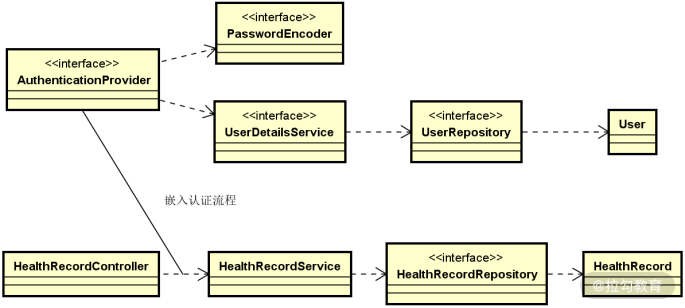
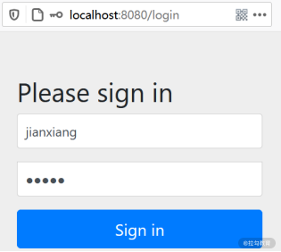
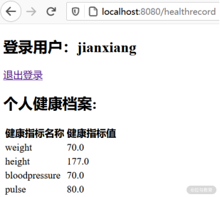
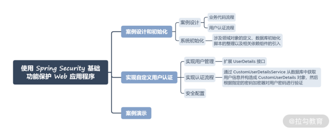

# 07 案例实战：使用 Spring Security 基础功能保护 Web 应用

前面几讲我们系统地介绍了 Spring Security 的认证和授权功能，这是该框架为我们提供的最基础、也是最常用的安全性功能。作为阶段性的总结，今天我们就把前面几讲的内容整合在一起，基于 Spring Security 的认证和授权功能保护 Web 应用程序。

### 案例设计和初始化

在今天的案例中，我们将构建一个简单但完整的小型 Web 应用程序。当合法用户成功登录系统之后，浏览器会跳转到一个系统主页，并展示一些个人健康档案（HealthRecord）数据。

#### 案例设计

这个 Web 应用程序将采用经典的三层架构，即 **Web 层、服务层和数据访问层** ，因此我们会存在 HealthRecordController、HealthRecordService 以及 HealthRecordRepository，这是一条独立的代码流程，用来完成 **系统业务逻辑处理** 。

另一方面，本案例的核心功能是 **实现自定义的用户认证流程** ，所以我们需要构建独立的 UserDetailsService 以及 AuthenticationProvider，这是另一条独立的代码流程。而在这条代码流程中，势必还需要 User 以及 UserRepository 等组件。

我们可以把这两条代码线整合在一起，得到案例的整体设计蓝图，如下图所示：



案例中的业务代码流程和用户认证流程

#### 系统初始化

要想实现上图中的效果，我们需要先对系统进行初始化。这部分工作涉及 **领域对象的定义、数据库初始化脚本的整理以及相关依赖组件的引入** 。

针对领域对象，我们重点来看如下所示的 User 类定义：

```
@Entity
public class User {
    @Id
    @GeneratedValue(strategy = GenerationType.IDENTITY)
    private Integer id;
    private String username;
    private String password;
    @Enumerated(EnumType.STRING)
    private PasswordEncoderType passwordEncoderType;
    @OneToMany(mappedBy = "user", fetch = FetchType.EAGER)
 private List<Authority> authorities;
 …
}
```

可以看到，这里除了指定主键 id、用户名 username 和密码 password 之外，还包含了一个 **加密算法枚举值 EncryptionAlgorithm** 。在案例系统中，我们将提供 BCryptPasswordEncoder 和 SCryptPasswordEncoder 这两种可用的密码解密器，你可以通过该枚举值进行设置。

同时，我们在 User 类中还发现了一个 Authority 列表。显然，这个列表用来指定该 User 所具备的权限信息。Authority 类的定义如下所示：

```
@Entity
public class Authority {
    @Id
    @GeneratedValue(strategy = GenerationType.IDENTITY)
    private Integer id;
    private String name;
    @JoinColumn(name = "user")
    @ManyToOne
 private User user;
 …
}
```

通过定义不难看出 User 和 Authority 之间是 **一对多** 的关系，这点和 Spring Security 内置的用户权限模型是一致的。我们注意到这里使用了一系列来自 JPA（Java Persistence API，Java 持久化 API）规范的注解来定义领域对象之间的关联关系。关于这些注解的使用方式你可以参考拉勾教育上的\[《Spring Data JPA 原理与实战》专栏\]进行学习。

基于 User 和 Authority 领域对象，我们也给出创建数据库表的 SQL 定义，如下所示：

```
CREATE TABLE IF NOT EXISTS `spring_security`.`user` (
  `id` INT NOT NULL AUTO_INCREMENT,
  `username` VARCHAR(45) NOT NULL,
  `password` TEXT NOT NULL,
  `password_encoder_type` VARCHAR(45) NOT NULL,
  PRIMARY KEY (`id`));
CREATE TABLE IF NOT EXISTS `spring_security`.`authority` (
  `id` INT NOT NULL AUTO_INCREMENT,
  `name` VARCHAR(45) NOT NULL,
  `user` INT NOT NULL,
  PRIMARY KEY (`id`));
```

在运行系统之前，我们同样也需要初始化数据，对应脚本如下所示：

```
INSERT IGNORE INTO `spring_security`.`user` (`id`, `username`, `password`, `password_encoder_type`) VALUES ('1', 'jianxiang', '$2a$10$xn3LI/AjqicFYZFruSwve.681477XaVNaUQbr1gioaWPn4t1KsnmG', 'BCRYPT');
INSERT IGNORE INTO `spring_security`.`authority` (`id`, `name`, `user`) VALUES ('1', 'READ', '1');
INSERT IGNORE INTO `spring_security`.`authority` (`id`, `name`, `user`) VALUES ('2', 'WRITE', '1');
INSERT IGNORE INTO `spring_security`.`health_record` (`id`, `username`, `name`, `value`) VALUES ('1', 'jianxiang', 'weight', '70');
INSERT IGNORE INTO `spring_security`.`health_record` (`id`, `username`, `name`, `value`) VALUES ('2', 'jianxiang', 'height', '177');
INSERT IGNORE INTO `spring_security`.`health_record` (`id`, `username`, `name`, `value`) VALUES ('3', 'jianxiang', 'bloodpressure', '70');
INSERT IGNORE INTO `spring_security`.`health_record` (`id`, `username`, `name`, `value`) VALUES ('4', 'jianxiang', 'pulse', '80');
```

请注意，这里初始化了一个用户名为 “jianxiang”的用户，同时指定了它的密码为“12345”，加密算法为“BCRYPT”。

现在，领域对象和数据层面的初始化工作已经完成了，接下来我们需要在代码工程的 pom 文件中添加如下所示的 Maven 依赖：

```
<dependencies>     
        <dependency>
            <groupId>org.springframework.boot</groupId>
            <artifactId>spring-boot-starter-data-jpa</artifactId>
        </dependency>
        <dependency>
            <groupId>org.springframework.boot</groupId>
            <artifactId>spring-boot-starter-security</artifactId>
        </dependency>
        <dependency>
            <groupId>org.springframework.boot</groupId>
            <artifactId>spring-boot-starter-thymeleaf</artifactId>
        </dependency>
        <dependency>
            <groupId>org.springframework.boot</groupId>
            <artifactId>spring-boot-starter-web</artifactId>
        </dependency>
        <dependency>
            <groupId>mysql</groupId>
            <artifactId>mysql-connector-java</artifactId>
            <scope>runtime</scope>
        </dependency>
        <dependency>
            <groupId>org.springframework.security</groupId>
            <artifactId>spring-security-test</artifactId>
            <scope>test</scope>
        </dependency>
</dependencies>
```

这些依赖包都是很常见的，相信从包名中你就能明白各依赖包的作用。

> 依赖包参考链接： spring-boot-starter-data-jpa：[https://mvnrepository.com/artifact/org.springframework.boot/spring-boot-starter-data-jpa](https://mvnrepository.com/artifact/org.springframework.boot/spring-boot-starter-data-jpa?fileGuid=xxQTRXtVcqtHK6j8) spring-boot-starter-security：[https://mvnrepository.com/artifact/org.springframework.boot/spring-boot-starter-security](https://mvnrepository.com/artifact/org.springframework.boot/spring-boot-starter-security?fileGuid=xxQTRXtVcqtHK6j8) spring-boot-starter-thymeleaf：[https://mvnrepository.com/artifact/org.springframework.boot/spring-boot-starter-thymeleaf](https://mvnrepository.com/artifact/org.springframework.boot/spring-boot-starter-thymeleaf?fileGuid=xxQTRXtVcqtHK6j8) spring-boot-starter-web：[https://mvnrepository.com/artifact/org.springframework.boot/spring-boot-starter-web](https://mvnrepository.com/artifact/org.springframework.boot/spring-boot-starter-web?fileGuid=xxQTRXtVcqtHK6j8) mysql-connector-java：[https://mvnrepository.com/artifact/mysql/mysql-connector-java](https://mvnrepository.com/artifact/mysql/mysql-connector-java?fileGuid=xxQTRXtVcqtHK6j8) spring-security-test：[https://mvnrepository.com/artifact/org.springframework.security/spring-security-test](https://mvnrepository.com/artifact/org.springframework.security/spring-security-test?fileGuid=xxQTRXtVcqtHK6j8)

### 实现自定义用户认证

实现自定义用户认证的过程通常涉及两大部分内容，一方面需要使用 User 和 Authority 对象来完成 **定制化的用户管理** ，另一方面需要把这个定制化的用户管理 **嵌入整个用户认证流程中** 。下面我们分别详细分析。

#### 实现用户管理

我们知道在 Spring Security 中，代表用户信息的就是 UserDetails 接口。我们也在\[ 03讲 “认证体系：如何深入理解 Spring Security 的用户认证机制？”\]中介绍过 UserDetails 接口的具体定义。如果你想实现自定义的用户信息，扩展这个接口即可。实现方式如下所示：

```
public class CustomUserDetails implements UserDetails {
    private final User user;
    public CustomUserDetails(User user) {
        this.user = user;
    }
    @Override
    public Collection<? extends GrantedAuthority> getAuthorities() {
        return user.getAuthorities().stream()
                   .map(a -> new SimpleGrantedAuthority(a.getName()))
                   .collect(Collectors.toList());
    }
    @Override
    public String getPassword() {
        return user.getPassword();
    }
    @Override
    public String getUsername() {
        return user.getUsername();
    }
    @Override
    public boolean isAccountNonExpired() {
        return true;
    }
    @Override
    public boolean isAccountNonLocked() {
        return true;
    }
    @Override
    public boolean isCredentialsNonExpired() {
        return true;
    }
    @Override
    public boolean isEnabled() {
        return true;
    }
    public final User getUser() {
        return user;
    }
}
```

上述 CustomUserDetails 类实现了 UserDetails 接口中约定的所有需要实现的方法。请注意，这里的 getAuthorities() 方法中，我们将 User 对象中的 Authority 列表转换为了 Spring Security 中代表用户权限的 **SimpleGrantedAuthority 列表** 。

当然，所有的自定义用户信息和权限信息都是维护在数据库中的，所以为了获取这些信息，我们需要创建数据访问层组件，这个组件就是 UserRepository，定义如下：

```
public interface UserRepository extends JpaRepository<User, Integer> {
    Optional<User> findUserByUsername(String username);
}
```

这里只是简单扩展了 Spring Data JPA 中的 JpaRepository 接口，并使用 **方法名衍生查询机制** 定义了根据用户名获取用户信息的 findUserByUsername 方法。

现在，我们已经能够在数据库中维护自定义用户信息，也能够根据这些用户信息获取到 UserDetails 对象，那么接下来要做的事情就是扩展 UserDetailsService。自定义 CustomUserDetailsService 实现如下所示：

```
@Service
public class CustomUserDetailsService implements UserDetailsService {
    @Autowired
    private UserRepository userRepository;
    @Override
    public CustomUserDetails loadUserByUsername(String username) {
        Supplier<UsernameNotFoundException> s =
                () -> new UsernameNotFoundException("Username" + username + "is invalid!");
        User u = userRepository.findUserByUsername(username).orElseThrow(s);
        return new CustomUserDetails(u);
    }
}
```

这里我们通过 UserRepository 查询数据库来获取 CustomUserDetails 信息，如果传入的用户名没有对应的 CustomUserDetails 则会抛出异常。

#### 实现认证流程

我们再次回顾 AuthenticationProvider 的接口定义，如下所示：

```
public interface AuthenticationProvider {
    //执行认证，返回认证结果
    Authentication authenticate(Authentication authentication)
             throws AuthenticationException;
    //判断是否支持当前的认证对象
    boolean supports(Class<?> authentication);
}
```

实现自定义认证流程要做的也是实现 AuthenticationProvider 中的这两个方法，而认证过程势必要借助于前面介绍的 CustomUserDetailsService。

我们先来看一下 AuthenticationProvider 接口的实现类 AuthenticationProviderService，如下所示：

```
@Service
public class AuthenticationProviderService implements AuthenticationProvider {
    @Autowired
    private CustomUserDetailsService userDetailsService;
    @Autowired
    private BCryptPasswordEncoder bCryptPasswordEncoder;
    @Autowired
    private SCryptPasswordEncoder sCryptPasswordEncoder;
    @Override
    public Authentication authenticate(Authentication authentication) throws AuthenticationException {
        String username = authentication.getName();
        String password = authentication.getCredentials().toString();
        //根据用户名从数据库中获取 CustomUserDetails
        CustomUserDetails user = userDetailsService.loadUserByUsername(username);
        //根据所配置的密码加密算法分别验证用户密码
        switch (user.getUser().getPasswordEncoderType()) {
            case BCRYPT:
                return checkPassword(user, password, bCryptPasswordEncoder);
            case SCRYPT:
                return checkPassword(user, password, sCryptPasswordEncoder);
        }
        throw new  BadCredentialsException("Bad credentials");
    }
    @Override
    public boolean supports(Class<?> aClass) {
        return UsernamePasswordAuthenticationToken.class.isAssignableFrom(aClass);
    }
    private Authentication checkPassword(CustomUserDetails user, String rawPassword, PasswordEncoder encoder) {
        if (encoder.matches(rawPassword, user.getPassword())) {
            return new UsernamePasswordAuthenticationToken(user.getUsername(), user.getPassword(), user.getAuthorities());
        } else {
            throw new BadCredentialsException("Bad credentials");
        }
    }
}
```

AuthenticationProviderService 类虽然看起来比较长，但代码基本都是自解释的。我们首先通过 CustomUserDetailsService 从数据库中获取用户信息并构造成 CustomUserDetails 对象。然后，根据指定的密码加密器对用户密码进行验证，如果验证通过则构建一个 UsernamePasswordAuthenticationToken 对象并返回，反之直接抛出 BadCredentialsException 异常。而在 supports() 方法中指定的就是这个目标 UsernamePasswordAuthenticationToken 对象。

#### 安全配置

最后，我们要做的就是通过 Spring Security 提供的配置体系将前面介绍的所有内容串联起来，如下所示：

```
@Configuration
public class SecurityConfig extends WebSecurityConfigurerAdapter {
    @Autowired
    private AuthenticationProviderService authenticationProvider;
    @Bean
    public BCryptPasswordEncoder bCryptPasswordEncoder() {
        return new BCryptPasswordEncoder();
    }
    @Bean
    public SCryptPasswordEncoder sCryptPasswordEncoder() {
        return new SCryptPasswordEncoder();
    }
    @Override
    protected void configure(AuthenticationManagerBuilder auth) {
        auth.authenticationProvider(authenticationProvider);
    }
    @Override
    protected void configure(HttpSecurity http) throws Exception {
        http.formLogin()
            .defaultSuccessUrl("/healthrecord", true);
        http.authorizeRequests().anyRequest().authenticated();
    }
}
```

这里注入了已经构建完成的 AuthenticationProviderService，并初始化了两个密码加密器 BCryptPasswordEncoder 和 SCryptPasswordEncoder。最后，我们覆写了 WebSecurityConfigurerAdapter 配置适配器类中的 configure() 方法，并指定用户登录成功后将跳转到"/main"路径所指定的页面。

对应的，我们需要构建如下所示的 MainController 类来指定"/main"路径，并展示业务数据的获取过程，如下所示：

```
@Controller
public class HealthRecordController {
    @Autowired
    private HealthRecordService healthRecordService;
    @GetMapping("/healthrecord")
    public String main(Authentication a, Model model) {
        String userName = a.getName();
        model.addAttribute("username", userName);
        model.addAttribute("healthRecords", healthRecordService.getHealthRecordsByUsername(userName));
        return "health_record.html";
    }
}
```

我们通过 Authentication 对象获取了认证用户信息，同时通过 HealthRecordService 获取了健康档案信息。关于 HealthRecordService 的实现逻辑不是今天内容的重点，你可以参考案例源码进行学习：[https://github.com/lagouEdAnna/SpringSecurity-jianxiang/tree/main/SpringSecurityBasicDemo](https://github.com/lagouEdAnna/SpringSecurity-jianxiang/tree/main/SpringSecurityBasicDemo?fileGuid=xxQTRXtVcqtHK6j8)。

请注意，这里所指定的 health_record.html 位于 resources/templates 目录下，该页面基于 thymeleaf 模板引擎构建，如下所示：

```
<!DOCTYPE html>
<html lang="en" xmlns:th="http://www.thymeleaf.org">
    <head>
        <meta charset="UTF-8">
        <title>健康档案</title>
    </head>
    <body>
        <h2 th:text="'登录用户：' + ${username}" />
        <p><a href="/logout">退出登录</a></p>
        <h2>个人健康档案:</h2>
        <table>
            <thead>
            <tr>
                <th> 健康指标名称 </th>
                <th> 健康指标值 </th>
            </tr>
            </thead>
            <tbody>
            <tr th:if="${healthRecords.empty}">
                <td colspan="2"> 无健康指标 </td>
            </tr>
            <tr th:each="healthRecord : ${healthRecords}">
                <td><span th:text="${healthRecord.name}"> 健康指标名称 </span></td>
                <td><span th:text="${healthRecord.value}"> 健康指标值 </span></td>
            </tr>
            </tbody>
        </table>
    </body>
</html>
```

这里我们从 Model 对象中获取了认证用户信息以及健康档案信息，并渲染在页面上。

### 案例演示

现在，让我们启动 Spring Boot 应用程序，并访问[http://localhost:8080](http://localhost:8080/?fileGuid=xxQTRXtVcqtHK6j8)端点。因为访问系统的任何端点都需要认证，所以 Spring Security 会自动跳转到如下所示的登录界面：



用户登录界面

我们分别输入用户名“jianxiang”和密码“12345”，系统就会跳转到健康档案主页：



健康档案主页

在这个主页中，我们正确获取了登录用户的用户名，并展示了个人健康档案信息。这个结果也证实了自定义用户认证体系的正确性。你可以根据示例代码做一些尝试。

### 小结与预告

这一讲我们动手实践了“利用 Spring Security 基础功能保护 Web 应用程序”。综合第 2 讲到 6 讲中的核心知识点，我们设计了一个简单而又完整的案例，并通过构建用户管理和认证流程讲解了实现自定义用户认证机制的过程。

本讲内容总结如下：



最后给你留一道思考题：在 Spring Security 中，实现一套自定义的用户认证体系需要哪些开发步骤？
