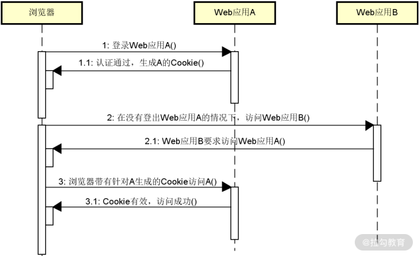
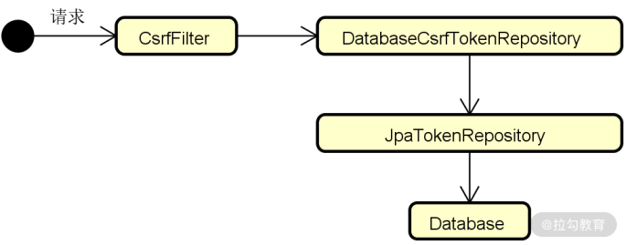
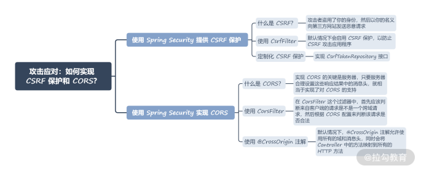

# 09 攻击应对：如何实现 CSRF 保护和跨域 CORS？

现在我们已经掌握了 Spring Security 提供的多项核心功能，但正如在开篇词中提到的，我们面临的系统安全性问题不止如此。今天我们就来讨论在日常开发过程中常见的两个安全性话题，即 CSRF 和 CORS。这两个缩写名称看似陌生，但和应用程序的每次请求都有关联，Spring Security 对它们也提供了良好的开发支持。

### 使用 Spring Security 提供 CSRF 保护

我们先来看 CSRF。CSRF 的全称是 Cross-Site Request Forgery，翻译成中文就是 **跨站请求伪造** 。那么，究竟什么是跨站请求伪造，面对这个问题我们又该如何应对呢？请继续往下看。

#### 什么是 CSRF？

从安全的角度来讲，你可以将 CSRF 理解为一种攻击手段，即攻击者盗用了你的身份，然后以你的名义向第三方网站发送恶意请求。我们可以使用如下所示的流程图来描述 CSRF：



CSRF 运行流程图

具体流程如下：

- 用户浏览并登录信任的网站 A，通过用户认证后，会在浏览器中生成针对 A 网站的 Cookie；
- 用户在没有退出网站 A 的情况下访问网站 B，然后网站 B 向网站 A 发起一个请求；
- 用户浏览器根据网站 B 的请求，携带 Cookie 访问网站 A；
- 由于浏览器会自动带上用户的 Cookie，所以网站 A 接收到请求之后会根据用户具备的权限进行访问控制，这样相当于用户本身在访问网站 A，从而网站 B 就达到了模拟用户访问网站 A 的操作过程。

显然，从应用程序开发的角度来讲，CSRF 就是系统的一个安全漏洞，这种安全漏洞也在 Web 开发中广泛存在。

基于 CSRF 的工作流程，进行 CSRF 保护的基本思想就是 **为系统中的每一个连接请求加上一个随机值** ，我们称之为 csrf_token。这样，当用户向网站 A 发送请求时，网站 A 在生成的 Cookie 中就会设置一个 csrf_token 值。而在浏览器发送请求时，提交的表单数据中也有一个隐藏的 csrf_token 值，这样网站 A 接收到请求后，一方面从 Cookie 中提取出 csrf_token，另一方面也从表单提交的数据中获取隐藏的 csrf_token，将两者进行比对，如果不一致就代表这就是一个伪造的请求。

#### 使用 CsrfFilter

在 Spring Security 中，专门提供了一个 CsrfFilter 来实现对 CSRF 的保护。CsrfFilter 拦截请求，并允许使用 GET、HEAD、TRACE 和 OPTIONS 等 HTTP 方法的请求。而针对 PUT、POST、DELETE 等可能会修改数据的其他请求，CsrfFilter 则希望接 **收包含 csrf_token 的消息头** 。如果这个消息头不存在或包含不正确的 csrf_token 值，应用程序将拒绝该请求并将响应的状态设置为 403。

看到这里，你可能会问，这个 csrf_token 到底长什么样子呢？其实它本质上就是一个 **字符串** 。在 Spring Security 中，专门定义了一个 CsrfToken 接口来约定它的格式：

```
public interface CsrfToken extends Serializable {
    //获取消息头名称
    String getHeaderName();
    //获取应该包含 Token 的参数名称
    String getParameterName();
 //获取具体的 Token 值
    String getToken();
}
```

而在 CsrfFilter 类中，我们也找到了如下所示的针对 CsrfToken 的处理过程：

```
@Override
protected void doFilterInternal(HttpServletRequest request,
             HttpServletResponse response, FilterChain filterChain)
                     throws ServletException, IOException {
        request.setAttribute(HttpServletResponse.class.getName(), response);
        //从 CsrfTokenRepository 中获取 CsrfToken
        CsrfToken csrfToken = this.tokenRepository.loadToken(request);
        final boolean missingToken = csrfToken == null;
        //如果找不到 CsrfToken 就生成一个并保存到 CsrfTokenRepository 中
        if (missingToken) {
             csrfToken = this.tokenRepository.generateToken(request);
             this.tokenRepository.saveToken(csrfToken, request, response);
        }
        //在请求中添加 CsrfToken
        request.setAttribute(CsrfToken.class.getName(), csrfToken);
        request.setAttribute(csrfToken.getParameterName(), csrfToken);
        if (!this.requireCsrfProtectionMatcher.matches(request)) {
             filterChain.doFilter(request, response);
             return;
        }
        //从请求中获取 CsrfToken
        String actualToken = request.getHeader(csrfToken.getHeaderName());
        if (actualToken == null) {
             actualToken = request.getParameter(csrfToken.getParameterName());
        }
        //如果请求所携带的 CsrfToken 与从 Repository 中获取的不同，则抛出异常
        if (!csrfToken.getToken().equals(actualToken)) {
             if (this.logger.isDebugEnabled()) {
                 this.logger.debug("Invalid CSRF token found for "
                         + UrlUtils.buildFullRequestUrl(request));
             }
             if (missingToken) {
                 this.accessDeniedHandler.handle(request, response,
                         new MissingCsrfTokenException(actualToken));
             }
             else {
                 this.accessDeniedHandler.handle(request, response,
                         new InvalidCsrfTokenException(csrfToken, actualToken));
             }
             return;
        }
        //正常情况下继续执行过滤器链的后续流程
        filterChain.doFilter(request, response);
}
```

整个过滤器执行流程还是比较清晰的，基本就是 **围绕 CsrfToken 的校验工作** 。我们注意到这里引入了一个 CsrfTokenRepository，这个 Repository 组件实现了对 CsrfToken 的存储管理，其中就包含前面提到的专门针对 Cookie 的 CookieCsrfTokenRepository。从 CookieCsrfTokenRepository 中，首先我们能看到一组常量定义，包括针对 CSRF 的 Cookie 名称、参数名称以及消息头名称，如下所示：

```
static final String DEFAULT_CSRF_COOKIE_NAME = "XSRF-TOKEN";
static final String DEFAULT_CSRF_PARAMETER_NAME = "_csrf";
static final String DEFAULT_CSRF_HEADER_NAME = "X-XSRF-TOKEN";
```

CookieCsrfTokenRepository 的 saveToken() 方法也比较简单，就是基于 Cookie 对象进行了 CsrfToken 的设置工作，如下所示：

```
@Override
public void saveToken(CsrfToken token, HttpServletRequest request,
             HttpServletResponse response) {
        String tokenValue = token == null ? "" : token.getToken();
        Cookie cookie = new Cookie(this.cookieName, tokenValue);
        cookie.setSecure(request.isSecure());
        if (this.cookiePath != null && !this.cookiePath.isEmpty()) {
                 cookie.setPath(this.cookiePath);
        } else {
                 cookie.setPath(this.getRequestContext(request));
        }
        if (token == null) {
             cookie.setMaxAge(0);
        }
        else {
             cookie.setMaxAge(-1);
        }
        cookie.setHttpOnly(cookieHttpOnly);
        if (this.cookieDomain != null && !this.cookieDomain.isEmpty()) {
             cookie.setDomain(this.cookieDomain);
        }
        response.addCookie(cookie);
}
```

在 Spring Security 中，CsrfTokenRepository 接口具有一批实现类，除了 CookieCsrfTokenRepository，还有 HttpSessionCsrfTokenRepository 等，这里不再一一展开。

了解了 CsrfFilter 的基本实现流程，下面我们继续讨论如何使用它来实现 CSRF 保护。从 Spring Security 4.0 开始，默认启用 CSRF 保护，以防止 CSRF 攻击应用程序。Spring Security CSRF 会针对 POST、PUT 和 DELETE 方法进行防护。因此，对于开发人员而言，实际上你并不需要做什么额外工作就能使用这个功能了。当然，如果你不想使用这个功能，也可以通过如下配置方法进行关闭：

```
http.csrf().disable();
```

#### 定制化 CSRF 保护

根据前面的讨论，如果你想获取 HTTP 请求中的 CsrfToken，只需要使用如下所示的代码：

```
CsrfToken token = (CsrfToken)request.getAttribute("_csrf");
```

如果你不想使用 Spring Security 内置的存储方式，而是想基于自身需求把 CsrfToken 存储起来，要做的事情就是 **实现 CsrfTokenRepository 接口** 。这里我们尝试把 CsrfToken 保存到关系型数据库中，所以可以通过扩展 Spring Data 中的 JpaRepository 来定义一个 JpaTokenRepository，如下所示：

```
public interface JpaTokenRepository extends JpaRepository<Token, Integer> {
    Optional<Token> findTokenByIdentifier(String identifier);
}
```

JpaTokenRepository 很简单，只有一个根据 identifier 获取 Token 的查询方法，而新增接口则是 JpaRepository 默认提供的，我们可以直接使用。

然后，我们基于 JpaTokenRepository 来构建一个 DatabaseCsrfTokenRepository，如下所示：

```
public class DatabaseCsrfTokenRepository
        implements CsrfTokenRepository {
    @Autowired
    private JpaTokenRepository jpaTokenRepository;
    @Override
    public CsrfToken generateToken(HttpServletRequest httpServletRequest) {
        String uuid = UUID.randomUUID().toString();
        return new DefaultCsrfToken("X-CSRF-TOKEN", "_csrf", uuid);
    }
    @Override
    public void saveToken(CsrfToken csrfToken, HttpServletRequest httpServletRequest, HttpServletResponse httpServletResponse) {
        String identifier = httpServletRequest.getHeader("X-IDENTIFIER");
        Optional<Token> existingToken = jpaTokenRepository.findTokenByIdentifier(identifier);
        if (existingToken.isPresent()) {
            Token token = existingToken.get();
            token.setToken(csrfToken.getToken());
        } else {
            Token token = new Token();
            token.setToken(csrfToken.getToken());
            token.setIdentifier(identifier);
            jpaTokenRepository.save(token);
        }
    }
    @Override
    public CsrfToken loadToken(HttpServletRequest httpServletRequest) {
        String identifier = httpServletRequest.getHeader("X-IDENTIFIER");
        Optional<Token> existingToken = jpaTokenRepository.findTokenByIdentifier(identifier);
        if (existingToken.isPresent()) {
            Token token = existingToken.get();
            return new DefaultCsrfToken("X-CSRF-TOKEN", "_csrf", token.getToken());
        }
        return null;
    }
}
```

DatabaseCsrfTokenRepository 类的代码基本都是自解释的，这里借助了 HTTP 请求中的“X-IDENTIFIER”请求头来确定请求的唯一标识，从而将这一唯一标识与特定的 CsrfToken 关联起来。然后我们使用 JpaTokenRepository 完成了针对关系型数据库的持久化工作。

最后，想要上述代码生效，我们需要通过配置方法完成对 CSRF 的设置，如下所示，这里直接通过 csrfTokenRepository 方法集成了自定义的 DatabaseCsrfTokenRepository：

______________________________________________________________________

```
@Override
protected void configure(HttpSecurity http) throws Exception {
        http.csrf(c -> {
            c.csrfTokenRepository(databaseCsrfTokenRepository());
        });
        …
}
```

______________________________________________________________________

作为总结，我们可以用如下所示的示意图来梳理整个定制化 CSRF 所包含的各个组件以及它们之间的关联关系：



定制化 CSRF 的相关组件示意图

### 使用 Spring Security 实现 CORS

介绍完 CSRF，我们继续来看 Web 应用程序开发过程中另一个常见的需求——CORS，即跨域资源共享（Cross-Origin Resource Sharing）。那么问题来了，什么叫跨域？

#### 什么是 CORS？

当下的 Web 应用程序开发基本都采用了前后端分离的开发模式，数据的获取并非同源，所以跨域问题在我们日常开发中特别常见。例如，当我们从“test.com”这个域名发起请求时，浏览器为了一定的安全因素考虑，并不会允许请求去访问“api.test.com”这个域名，因为请求已经跨越了两个域名。

请注意， **跨域是浏览器的一种同源安全策略，是浏览器单方面限制的，所以仅在客户端运行在浏览器中才需要考虑这个问题** 。从原理上讲，实际就是浏览器在 HTTP 请求的消息头部分新增一些字段，如下所示：

```
//浏览器自己设置的请求域名
Origin     
//浏览器告诉服务器请求需要用到哪些 HTTP 方法
Access-Control-Request-Method
//浏览器告诉服务器请求需要用到哪些 HTTP 消息头
Access-Control-Request-Headers
```

当浏览器进行跨域请求时会和服务器端进行一次的握手协议，从响应结果中可以获取如下信息：

```
//指定哪些客户端的域名允许访问这个资源
Access-Control-Allow-Origin 
//服务器支持的 HTTP 方法
Access-Control-Allow-Methods 
//需要在正式请求中加入的 HTTP 消息头
Access-Control-Allow-Headers 
```

因此，实现 CORS 的关键是 **服务器** 。只要服务器 **合理设置这些响应结果中的消息头** ，就相当于实现了对 CORS 的支持，从而支持跨源通信。

#### 使用 CorsFilter

和 CsrfFilter 注解一样，在 Spring 中也存在一个 CorsFilter 过滤器，不过这个过滤器并不是 Spring Security 提供的，而是来自 **Spring Web MVC** 。在 CorsFilter 这个过滤器中，首先应该判断来自客户端的请求是不是一个跨域请求，然后根据 CORS 配置来判断该请求是否合法，如下所示：

```
@Override
protected void doFilterInternal(HttpServletRequest request, HttpServletResponse response,
             FilterChain filterChain) throws ServletException, IOException {
        if (CorsUtils.isCorsRequest(request)) {
             CorsConfiguration corsConfiguration = this.configSource.getCorsConfiguration(request);
             if (corsConfiguration != null) {
                 boolean isValid = this.processor.processRequest(corsConfiguration, request, response);
                 if (!isValid || CorsUtils.isPreFlightRequest(request)) {
                     return;
                 }
             }
        }
        filterChain.doFilter(request, response);
}
```

上述操作的内容是创建合适的配置类 CorsConfiguration。根据 CorsFilter，Spring Security 也在 HttpSecurity 工具类通过提供了 cors() 方法来创建 CorsConfiguration，使用方式如下所示：

```
@Override
protected void configure(HttpSecurity http) throws Exception {
        http.cors(c -> {
            CorsConfigurationSource source = request -> {
                CorsConfiguration config = new CorsConfiguration();
                config.setAllowedOrigins(Arrays.asList("*"));
                config.setAllowedMethods(Arrays.asList("*"));
                return config;
            };
            c.configurationSource(source);
        });
        …
}
```

我们可以通过 setAllowedOrigins() 和 setAllowedMethods() 方法实现对 HTTP 响应消息头的设置。**这里将它们都设置成“\*”，意味着所有请求都可以进行跨域访问**。你也可以根据需要设置特定的域名和 HTTP 方法。

#### 使用 @CrossOrigin 注解

通过 CorsFilter，我们实现了全局级别的跨域设置。但有时候，我们可能只需要针对某些请求实现这一功能，通过 Spring Security 也是可以做到这一点的，我们可以在特定的 HTTP 端点上使用如下所示的 @CrossOrigin 注解：

```
@Controller
public class TestController {
    @PostMapping("/hello")
 @CrossOrigin("http://api.test.com:8080")
    public String hello() {
        return "hello";
    }
}
```

默认情况下，@CrossOrigin 注解允许使用所有的域和消息头，同时会将 Controller 中的方法映射到所有的 HTTP 方法。

### 小结与预告

这一讲关注的是对 Web 请求安全性的讨论，我们讨论了日常开发过程中常见的两个概念，即 CSRF 和 CORS。这两个概念有时候容易混淆，但应对的是完全不同的两种场景。

CSRF 是一种攻击行为，所以我们需要对系统进行保护，而 CORS 更多的是一种前后端开发模式上的约定。在 Spring Security 中，针对这两个场景都提供了对应的过滤器，我们只需要通过简单的配置方法就能在系统中自动集成想要的功能。

本讲主要内容如下：



最后我想给你留一道思考题：在 Spring Security 中，如何定制化一套对 CsrfToken 的处理机制？欢迎你在留言区和我分享观点。
