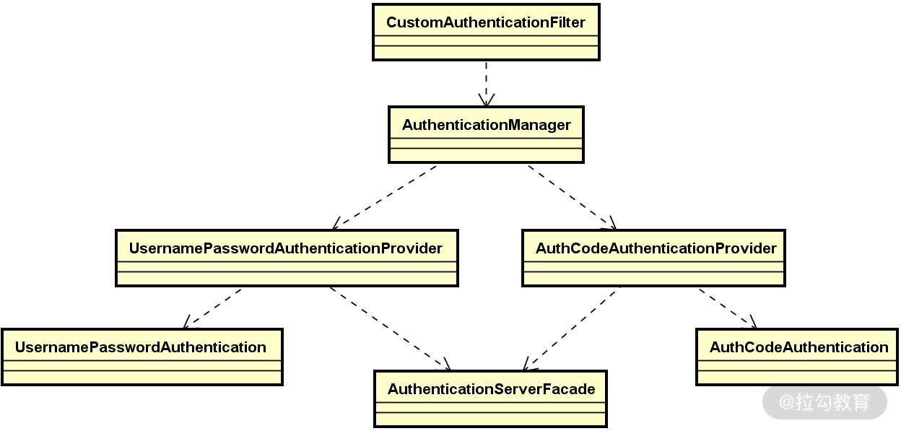

# 11 案例实战：使用 Spring Security 高级主题保护 Web 应用

前面几讲我们系统介绍了 Spring Security 提供的一些高级功能，包括过滤器、CSRF 保护、CORS 以及全局方法，这些都是非常实用的功能特性。作为阶段性的总结，今天的内容将利用这些功能特性构建在安全领域中的一种典型的认证机制，即 **多因素认证** （Multi-Factor Authentication，MFA）机制。

### 案例设计和初始化

在今天的案例中，我们构建多因素认证的思路并不是采用第三方成熟的解决方案，而是基于 Spring Security 的功能特性来自己设计并实现一个简单而完整的认证机制。

#### 多因素认证设计

多因素认证是一种安全访问控制的方法，基本的设计理念在于 **用户想要访问最终的资源，至少需要通过两种以上的认证机制** 。

那么，我们如何实现多种认证机制呢？一种常见的做法是分成两个步骤，第一步通过用户名和密码获取一个认证码（Authentication Code），第二步基于用户名和这个认证码进行安全访问。基于这种多因素认证的基本执行流程如下图所示：


多因素认证的实现方式示意图

#### 系统初始化

为了实现多因素认证，我们需要构建一个独立的认证服务 Auth-Service，该服务 **同时提供了基于用户名+密码以及用户名+认证码的认证形式** 。当然，实现认证的前提是构建用户体系，因此我们需要提供如下所示的 User 实体类：

```
@Entity


public class User {


 


    @Id


    @GeneratedValue(strategy = GenerationType.IDENTITY)


    private Integer id;


    


    private String username;


    private String password;


}

```

可以看到，User 对象中包含了用户名 Username 和密码 Password 的定义。同样的，在如下所示的代表认证码的 AuthCode 对象中包含了用户名 Username 和具体的认证码 Code 字段的定义：

```
@Entity


public class AuthCode {


 


    @Id


    @GeneratedValue(strategy = GenerationType.IDENTITY)


    private Integer id;


    


    private String username;


    private String code;   


}

```

基于 User 和 AuthCode 实体对象，我们也给出创建数据库表的对应 SQL 定义，如下所示：

```
CREATE TABLE IF NOT EXISTS `spring_security_demo`.`user` (


    `id` INT NOT NULL AUTO_INCREMENT,


    `username` VARCHAR(45) NULL,


    `password` TEXT NULL,


    PRIMARY KEY (`id`));


 


CREATE TABLE IF NOT EXISTS `spring_security_demo`.`auth_code` (


    `id` INT NOT NULL AUTO_INCREMENT,


    `username` VARCHAR(45) NOT NULL,


    `code` VARCHAR(45) NULL,


    PRIMARY KEY (`id`));

```

有了认证服务，接下来我们需要构建一个业务服务 Business-Service，该业务服务通过集成认证服务，完成具体的认证操作，并返回访问令牌（Token）给到客户端系统。因此，从依赖关系上讲，Business-Service 会调用 Auth-Service，如下图所示：


Business-Service 调用 Auth-Service 关系图

接下来，我们分别从这两个服务入手，实现多因素认证机制。

### 实现多因素认证机制

对于多因素认证机制而言， **实现认证服务是基础** ，但难度并不大，我们往下看。

#### 实现认证服务

从表现形式上看，认证服务也是一个 Web 服务，所以内部需要 **通过构建 Controller 层组件实现 HTTP 端点的暴露** 。为此，我们构建了如下所示的 AuthController：

```
@RestController


public class AuthController {


 


    @Autowired


    private UserService userService;


 


    //添加User


    @PostMapping("/user/add")


    public void addUser(@RequestBody User user) {


        userService.addUser(user);


    }


 


    //通过用户名+密码对用户进行首次认证


    @PostMapping("/user/auth")


    public void auth(@RequestBody User user) {


        userService.auth(user);


    }


 


    //通过用户名+认证码进行二次认证


    @PostMapping("/authcode/check")


    public void check(@RequestBody AuthCode authCode, HttpServletResponse response) {


        if (userService.check(authCode)) {


            response.setStatus(HttpServletResponse.SC_OK);


        } else {


            response.setStatus(HttpServletResponse.SC_FORBIDDEN);


        }


    }


}

```

可以看到，这里除了一个添加用户信息的 HTTP 端点之外，我们分别实现了通过用户名+密码对用户进行首次认证的"/user/auth"端点，以及通过用户名+认证码进行二次认证的"/authcode/check"端点。

这两个核心端点背后的实现逻辑都位于 UserService 中，我们先来看其中的 auth() 方法：

```
public void auth(User user) {


        Optional<User> o =


                userRepository.findUserByUsername(user.getUsername());


 


        if(o.isPresent()) {


            User u = o.get();


            if (passwordEncoder.matches(user.getPassword(), u.getPassword())) {


                 //生成或刷新认证码


                generateOrRenewAutoCode(u);


            } else {


                throw new BadCredentialsException("Bad credentials.");


            }


        } else {


            throw new BadCredentialsException("Bad credentials.");


        }


}

```

上述代码中的关键流程就是在 **完成用户密码匹配之后的刷新认证码流程** ，负责实现该流程的 generateOrRenewAutoCode() 方法如下所示：

```
private void generateOrRenewAutoCode (User u) {


        String generatedCode = GenerateCodeUtil.generateCode();


 


        Optional<AuthCode> autoCode = autoCodeRepository.findAuthCodeByUsername(u.getUsername());


        if (autoCode.isPresent()) {//如果存在认证码，则刷新该认证码


            AuthCode code = autoCode.get();


            code.setCode(generatedCode);


        } else {//如果没有找到认证码，则生成并保存一个新的认证码


            AuthCode code = new AuthCode();


            code.setUsername(u.getUsername());


            code.setCode(generatedCode);


            autoCodeRepository.save(code);


        }


}

```

上述方法的流程也很明确，首先通过调用工具类 GenerateCodeUtil 的 generateCode() 方法生成一个认证码，然后根据当前数据库中的状态决定是否对已有的认证码进行刷新，或者直接生成一个新的认证码并保存。因此， **每次调用 UserService 的 auth() 方法就相当于对用户的认证码进行了动态重置** 。

一旦用户获取了认证码，并通过该认证码访问系统，认证服务就可以对该认证码进行校验，从而确定其是否有效。对认证码进行验证的方法如下所示：

```
public boolean check(AuthCode authCodeToValidate) {


        Optional<AuthCode> authCode = autoCodeRepository.findAuthCodeByUsername(authCodeToValidate.getUsername());


        if (authCode.isPresent()) {


            AuthCode authCodeInStore = authCode.get();


            if (authCodeToValidate.getCode().equals(authCodeInStore.getCode())) {


                return true;


            }


        }


 


        return false;


}

```

这里的逻辑也很简单，就是 **把从数据库中获取的认证码与用户传入的认证码进行比对** 。

至此，认证服务的核心功能已经构建完毕，下面我们来看业务服务的实现过程。

#### 实现业务服务

在业务服务中，势必需要 **调用认证服务提供的 HTTP 端点** 来完成用户认证和认证码认证这两个核心的认证操作。因此，我们需要构建一个认证服务的客户端组件完成远程调用。在案例中，我们参考设计模式中的门面（Facade）模式的设计理念，将这个组件命名为 AuthenticationServerFacade，也就是说它是认证服务的一种门面组件，定义如下：

```
@Component


public class AuthenticationServerFacade {


 


    @Autowired


    private RestTemplate rest;


 


    @Value("${auth.server.base.url}")


    private String baseUrl;


 


    public void checkPassword(String username, String password) {


        String url = baseUrl + "/user/auth";


 


        User body = new User();


        body.setUsername(username);


        body.setPassword(password);


 


        HttpEntity<User> request = new HttpEntity<User>(body);


 


        rest.postForEntity(url, request, Void.class);


    }


 


    public boolean checkAuthCode(String username, String code) {


        String url = baseUrl + "/authcode/check";


 


        User body = new User();


        body.setUsername(username);


        body.setCode(code);


 


        HttpEntity<User> request = new HttpEntity<User>(body);


        


        ResponseEntity<Void> response = rest.postForEntity(url, request, Void.class);


 


        return response.getStatusCode().equals(HttpStatus.OK);


    }


}

```

这里的 baseUrl 就是认证服务暴露的服务地址，我们使用 RestTemplate 模板类发起对认证服务的远程调用，并根据返回值来判断认证是否通过。

有了 AuthenticationServerFacade，我们就可以在业务服务中集成认证服务了。我们在每次请求的处理过程中完成这种集成工作，此时需要用到拦截器，而这种集成工作显然需要依赖于认证管理器 AuthenticationManager。因此，我们可以先来设计并实现如下所示的 CustomAuthenticationFilter 代码结构：

```
@Component


public class CustomAuthenticationFilter extends OncePerRequestFilter {


 


    @Autowired


    private AuthenticationManager manager;


 


    @Override


    protected void doFilterInternal(HttpServletRequest request, HttpServletResponse response, FilterChain filterChain) throws ServletException, IOException {


        String username = request.getHeader("username");


        String password = request.getHeader("password");


        String code = request.getHeader("code");


 


        //使用 AuthenticationManager 处理认证过程


    }


}

```

上述代码中第一个需要关注的点是 CustomAuthenticationFilter 所扩展的基类 OncePerRequestFilter。顾名思义，OncePerRequestFilter 能够确保在一次请求中只执行一次过滤器逻辑，不会发生多次重复执行的情况。这里我们分别从 HTTP 请求头中获取了用户名 username、密码 password 以及认证码 code 这三个参数，并尝试使用 AuthenticationManager 完成认证。基于\[03 讲“认证体系：如何深入理解 Spring Security 的用户认证机制？”\]中的讨论，我们知道 AuthenticationManager 的背后实际上使用了 AuthenticationProvider 执行具体的认证操作。

再来回想一下认证服务中提供的两种认证操作，一种是基于用户名和密码完成用户认证，一种是基于用户名和认证码完成针对认证码的认证。因此，我们需要针对这两种操作分别实现不同的 AuthenticationProvider。例如，如下所示的 UsernamePasswordAuthenticationProvider 就实现了针对用户名和密码的认证操作：

```
@Component


public class UsernamePasswordAuthenticationProvider implements AuthenticationProvider {


 


    @Autowired


    private AuthenticationServerFacade authServer;


 


    public Authentication authenticate(Authentication authentication) throws AuthenticationException {


        String username = authentication.getName();


        String password = String.valueOf(authentication.getCredentials());


        


        //调用认证服务完成认证


        authServer.checkPassword(username, password);


 


        return new UsernamePasswordAuthenticationToken(username, password);


    }


 


    public boolean supports(Class<?> aClass) {


        return UsernamePasswordAuthentication.class.isAssignableFrom(aClass);


    }


}

```

可以看到，这里使用了 AuthenticationServerFacade 门面类来完成对认证服务的远程调用。类似地 ，我们也可以构建针对认证码的 AuthenticationProvider，即如下所示的 AuthCodeAuthenticationProvider：

```
@Component


public class AuthCodeAuthenticationProvider implements AuthenticationProvider {


 


    @Autowired


    private AuthenticationServerFacade authServer;


 


    public Authentication authenticate(Authentication authentication) throws AuthenticationException {


        String username = authentication.getName();


        String code = String.valueOf(authentication.getCredentials());


        


        //调用认证服务完成认证


        boolean result = authServer.checkAuthCode(username, code);


 


        if (result) {


            return new AuthCodeAuthentication(username, code);


        } else {


            throw new BadCredentialsException("Bad credentials.");


        }


    }


 


    public boolean supports(Class<?> aClass) {


        return AuthCodeAuthentication.class.isAssignableFrom(aClass);


    }


}

```

请注意，无论是 UsernamePasswordAuthenticationProvider 还是 AuthCodeAuthenticationProvider，所返回的 UsernamePasswordAuthentication 和 AuthCodeAuthentication 都是 **自定义的认证信息类** ，它们都继承了 Spring Security 自带的 UsernamePasswordAuthenticationToken。

现在，让我们回到过滤器组件 CustomAuthenticationFilter，并提供对它的完整实现，如下所示：

```
@Component


public class CustomAuthenticationFilter extends OncePerRequestFilter {


 


    @Autowired


    private AuthenticationManager manager;


 


    @Override


    protected void doFilterInternal(HttpServletRequest request, HttpServletResponse response, FilterChain filterChain) throws ServletException, IOException {


        String username = request.getHeader("username");


        String password = request.getHeader("password");


        String code = request.getHeader("code");


 


        //如果认证码为空，说明需要先执行用户名/密码认证


        if (code == null) {


            Authentication a = new UsernamePasswordAuthentication(username, password);


            manager.authenticate(a);


        } else {


         //如果认证码不为空，则执行认证码认证


            Authentication a = new AuthCodeAuthentication(username, code);


            manager.authenticate(a);


 


            //如果认证码认证通过，则通过 UUID 生成一个 Token 并添加在响应的消息头中


            String token = UUID.randomUUID().toString();


            response.setHeader("Authorization", token);


        }


 


    }


 


    @Override


    protected boolean shouldNotFilter(HttpServletRequest request) {


        return !request.getServletPath().equals("/login");


    }


}

```

CustomAuthenticationFilter 的实现过程比较简单，代码也都是自解释的，唯一需要注意的是 **在基于认证码的认证过程通过之后，我们会在响应中添加一个“Authorization”消息头，并使用 UUID 值作为 Token 进行返回** 。

针对上述代码，我们可以通过如下所示的类图进行总结：



多因素认证执行核心类图

最后，我们需要通过 Spring Security 中的配置体系确保各个类之间的有效协作。为此，我们构建了如下所示的 SecurityConfig 类：

```
@Configuration


public class SecurityConfig extends WebSecurityConfigurerAdapter {


 


    @Autowired


    private CustomAuthenticationFilter customAuthenticationFilter;


 


    @Autowired


    private AuthCodeAuthenticationProvider authCodeAuthenticationProvider;


 


    @Autowired


    private UsernamePasswordAuthenticationProvider usernamePasswordAuthenticationProvider;


 


    @Override


    protected void configure(AuthenticationManagerBuilder auth) {


        auth.authenticationProvider(authCodeAuthenticationProvider)


            .authenticationProvider(usernamePasswordAuthenticationProvider);


    }


 


    @Override


    protected void configure(HttpSecurity http) throws Exception {


        http.csrf().disable();


 


        http.addFilterAt(


                customAuthenticationFilter,


                BasicAuthenticationFilter.class);


 


        http.authorizeRequests()


                .anyRequest().authenticated();


    }


 


    @Override


    @Bean


    protected AuthenticationManager authenticationManager() throws Exception {


        return super.authenticationManager();


    }


}

```

上述配置内容中，我们看到可以通过 addFilterAt() 方法添加自定义过滤器。关于过滤器使用方式的更多内容，你也可以参考\[08 讲“管道过滤：如何基于 Spring Security 过滤器扩展安全性？”\]的内容进行回顾。

关于案例的完整代码你可以在这里进行下载：[https://github.com/lagouEdAnna/SpringSecurity-jianxiang/tree/main/MultiFactorAuthenticationDemo](https://github.com/lagouEdAnna/SpringSecurity-jianxiang/tree/main/MultiFactorAuthenticationDemo)。

### 案例演示

现在，让我们分别在本地启动认证服务和业务服务，请注意：认证服务的启动端口是 8080，而业务服务的启动端口是 9090。然后我们打开模拟 HTTP 请求的 Postman 并输入相关参数，如下所示：


多因素认证的第一步认证示意图：基于用户名+密码

显然，该请求只传入了用户名和密码，所以会基于 UsernamePasswordAuthenticationProvider 执行认证过程，从而为用户“jianxiang”生成认证码。 **认证码是动态生成的，所以每次请求对应的结果都是不一样的** ，我通过查询数据库，获取该认证码为“9750”，你也可以自己做一些尝试。

有了认证码，相当于完成了多因素认证机制的第一步。接下来，我们再次基于这个认证码构建请求并获取响应结果，如下所示：


多因素认证的第二步认证示意图：基于用户名+认证码

可以看到，通过传入正确的认证码，我们基于 AuthCodeAuthenticationProvider 完成了多因素认证机制中的第二步认证，并最终在 HTTP 响应中生成了一个“Authorization”消息头。

### 小结与预告

这一讲我们基于多因素认证机制展示了如何利用 Spring Security 中的一些高级主题保护 Web 应用程序的实现方法。多因素认证机制的实现需要构建多个自定义的 AuthenticationProvider，并通过拦截器完成对请求的统一处理。相信案例中展示的这些开发技巧会给你的日常开发工作带来帮助。

本讲内容总结如下：


这里给你留一道思考题：在 Spring Security 中，如何利用过滤器实现对用户请求的定制化认证？
