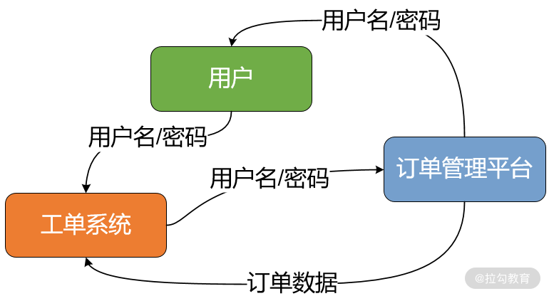
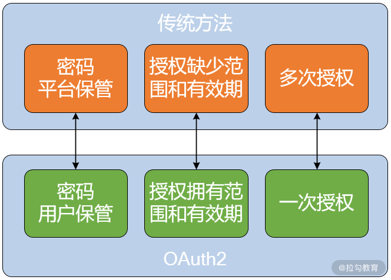
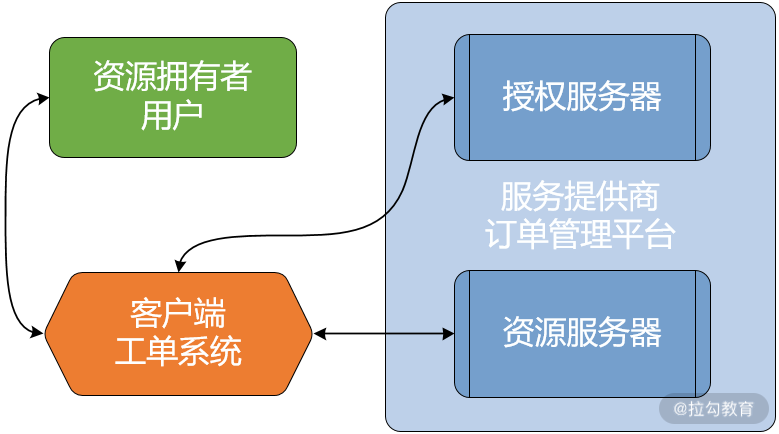
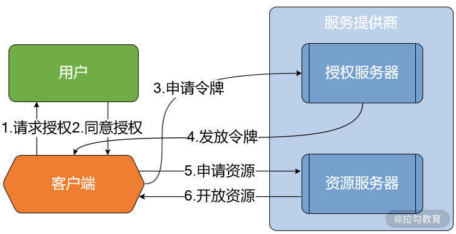
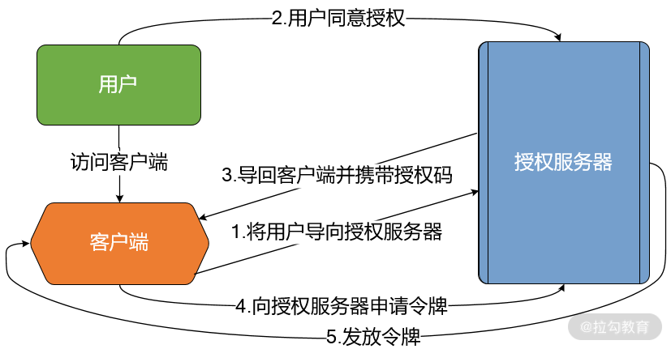
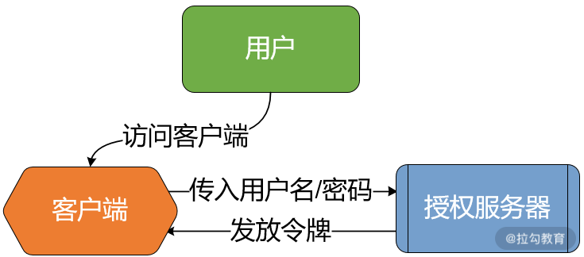
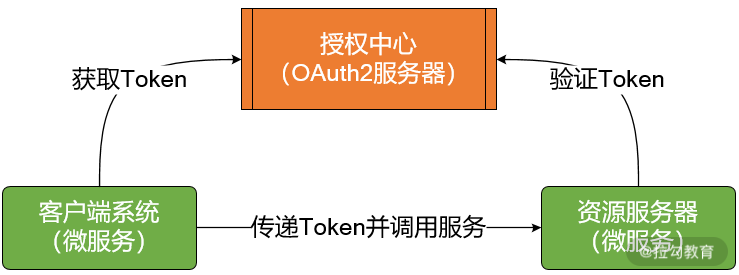

12 开放协议：OAuth2 协议解决的是什么问题？
==========================

从今天开始，我们针对安全性的讨论将从单体服务上升到微服务架构。对于微服务架构而言，安全性设计的最核心考虑点还是 **认证和授权** 。由于一个微服务系统中各服务之间存在相互调用的关系，因此针对每一个服务，我们既需要考虑来自客户端的请求，同时也要考虑可能来自另一个服务的请求。安全访问控制就面临着从客户端请求到服务、从服务到服务的多种授权场景。因此，我们需要引入专门用于处理分布式环境下的授权体系，OAuth2 协议就是应对这种应用场景的有效解决方案。

### OAuth2 协议详解

OAuth 是 Open Authorization 的简称， **该协议解决的是授权问题** 而不是认证问题，目前普遍被采用的是 OAuth 2.0 版协议。OAuth2 是一个相对复杂的协议，对涉及的角色和授权模式给出了明确的定义，我们继续往下看。

#### OAuth2 协议的应用场景

在常见的电商系统中，通常会存在类似工单处理的系统，而工单的生成在使用用户基本信息的同时，势必也依赖于用户的订单记录等数据。为了降低开发成本，假设我们的整个商品订单模块并不是自己研发的，而是集成了外部的订单管理平台，此时为了生成工单记录，就必须让工单系统读取用户在订单管理平台上的订单记录。

在这个场景中，难点在于 **只有得到用户的授权** ，才能同意工单系统读取用户在订单管理平台上的订单记录。那么问题就来了，工单系统如何获得用户的授权呢？一般我们想到的方法是用户将自己在订单管理平台上的用户名和密码告诉工单系统，然后工单系统通过用户名和密码登录到订单管理平台并读取用户的订单记录，整个过程如下图所示：



案例系统中用户认证和授权交互示意图

上图中的方案虽然可行，但显然存在几个严重的缺点：

* 工单系统为了开展后续的服务，会保存用户在订单管理平台上的密码，这样很不安全；如果用户密码不小心被泄露了，就会导致订单管理平台上的用户数据发生泄露；
* 工单系统拥有了获取用户存储在订单管理平台上所有资料的权限，用户无法限制工单系统获得授权的范围和有效期；
* 如果用户修改了订单管理平台的密码，那么工单系统就无法正常访问订单管理平台了，这会导致业务中断，但我们又不能限制用户修改密码。

既然这个方案存在如此多的问题，那么有没有更好的办法呢？答案是肯定的， **OAuth2 协议** 的诞生就是为了解决这些问题。

首先，针对密码的安全性，在 OAuth2 协议中，密码还是由用户自己保管，避免了敏感信息的泄露；其次，OAuth2 协议中提供的授权具有明确的应用范围和有效期，用户可以根据需要限制工单系统所获取授权信息的作用效果；最后，如果用户对自己的密码等身份凭证信息进行了修改，只需通过 OAuth2 协议重新进行一次授权即可，不会影响到相关联的其他第三方应用程序。



传统认证授权机制与 OAuth2 协议的对比图

#### OAuth2 协议的角色

OAuth2 协议之所有能够具备这些优势，一个主要的原因在于它把整个系统涉及的各个角色及其职责做了很好地划分。OAuth2 协议中定义了四个核心的角色： **资源、客户端、授权服务器和资源服务器** 。



OAuth2 协议中的角色定义

我们可以把 OAuth2 中的角色与现实中的应用场景对应起来。

* OAuth2 协议中把需要访问的接口或服务统称为资源（Resource），每个资源都有一个拥有者（Resource Owner），也就是案例中的用户。
* 案例的工单系统代表的是一种第三方应用程序（Third-party Application），通常被称为客户端（Client）。
* 与客户端相对应的，OAuth2 协议中还存在一个服务提供商，案例中的订单管理平台就扮演了这个角色。服务提供商拥有一个 **资源服务器** （Resource Server）和一个 **授权服务器** （Authorization Server），其中资源服务器存放着用户资源，案例中的订单记录就是一种用户资源；而授权服务器的作用就是完成针对用户的授权流程，并最终颁发一个令牌，也就是我们所说的 Token。

#### OAuth2 协议的 Token

看到这里，你可能会提问，所谓的访问令牌是什么？令牌是 OAuth2 协议中非常重要的一个概念，本质上也是一种 **代表用户身份的授权凭证** ，但与普通的用户名和密码信息不同， **令牌具有针对资源的访问权限范围和有效期** 。如下所示就是一种常见的令牌信息：

```
{


    "access_token": "0efa61be-32ab-4351-9dga-8ab668ababae",


    "token_type": "bearer",


    "refresh_token": "738c42f6-79a6-457d-8d5a-f9eab0c7cc5e",


    "expires_in": 43199,


    "scope": "webclient"


}

```

上述令牌信息中的各个字段都很重要，我们展开分析。

* access\_token：代表 OAuth2 的令牌，当访问每个受保护的资源时，用户都需要携带这个令牌以便进行验证。
* token\_type：代表令牌类型，OAuth2 协议中有多种可选的令牌类型，包括 Bearer 类型、MAC 类型等，这里指定的 Bearer 类型是最常见的一种类型。
* expires\_in：用于指定 access\_token 的有效时间，当超过这个有效时间，access\_token 将会自动失效。
* refresh\_token：其作用在于当 access\_token 过期后，重新下发一个新的 access\_token。
* scope：指定了可访问的权限范围，这里指定的是访问 Web 资源的“webclient”。

现在我们已经介绍完令牌，你可能会好奇这样一个令牌究竟有什么用？接下来，我们就来看如何使用令牌完成基于 OAuth2 协议的授权工作流程。整个流程如下图所示： 

基于 OAuth2 协议的授权工作流程图

我们可以把上述流程进一步展开梳理。

* 首先，客户端向用户请求授权，请求中一般包含资源的访问路径、对资源的操作类型等信息。如果用户同意授权，就会将这个授权返回给客户端。
* 现在，客户端已经获取了用户的授权信息，可以向授权服务器请求访问令牌。
* 接下来，授权服务器向客户端发放访问令牌，这样客户端就能携带访问令牌访问资源服务器上的资源。
* 最后，资源服务器获取访问令牌后会验证令牌的有效性和过期时间，并向客户端开放其需要访问的资源。

#### OAuth2 协议的授权模式

在整个工作流程中，最为关键的是第二步，即获取用户的有效授权。那么如何获取用户授权呢？在 OAuth 2.0 中，定义了四种授权方式，即 **授权码模式（Authorization Code）、简化模式（Implicit）、密码模式（Password Credentials）和客户端模式（Client Credentials）** 。

我们先来看最具代表性的授权码模式。 **当用户同意授权后，授权服务器返回的只是一个授权码，而不是最终的访问令牌** 。在这种授权模式下，需要客户端携带授权码去换令牌，这就需要客户端自身具备与授权服务器进行直接交互的后台服务。



授权码模式工作流程图

我们简单梳理一下授权码模式下的执行流程。

首先，用户在访问客户端时会被客户端导向授权服务器，此时用户可以选择是否给予客户端授权。一旦用户同意授权，授权服务器会调用客户端的后台服务提供的一个回调地址，并在调用过程中将一个授权码返回给客户端。客户端收到授权码后进一步向授权服务器申请令牌。最后，授权服务器核对授权码并向客户端发送访问令牌。

这里要注意的是， **通过授权码向授权服务器申请令牌的过程是系统自动完成的，不需要用户的参与，用户需要做的就是在流程启动阶段同意授权** 。

接下来，我们再来看另一种比较常用的密码模式，其授权流程如下图所示：



密码模式工作流程图

可以看到，密码模式比较简单，也更加容易理解。用户要做的就是提供自己的用户名和密码，然后客户端会基于这些用户信息向授权服务器请求令牌。授权服务器成功执行用户认证操作后将会发放令牌。

OAuth2 中的客户端模式和简化模式因为在日常开发过程中应用得不是很多，这里就不详细介绍了。

你可能注意到了，虽然 OAuth2 协议解决的是授权问题，但它也应用到了认证的概念，这是因为只有验证了用户的身份凭证，我们才能完成对他的授权。所以说， **OAuth2 实际上是一款技术体系比较复杂的协议，综合应用了信息摘要、签名认证等安全性手段，并需要提供令牌以及背后的公私钥管理等功能** 。

### OAuth2 协议与微服务架构

对应到微服务系统中， **服务提供者充当的角色就是资源服务器，而服务消费者就是客户端** 。所以每个服务本身既可以是客户端，也可以作为资源服务器，或者两者兼之。当客户端拿到 Token 之后，该 Token 就能在各个服务之间进行传递。如下图所示： 

OAuth2 协议在服务访问场景中的应用

在整个 OAuth2 协议中，最关键的问题就是如何获取客户端授权。就目前主流的微服架构来说，当我们发起 HTTP 请求时，关注的是如何通过 HTTP 协议透明而高效地传递令牌，此时授权码模式下通过回调地址进行授权管理的方式就不是很实用，密码模式反而更加简洁高效。因此，在本专栏中，我们将使用 **密码模式** 作为 OAuth2 协议授权模式的默认实现方式。

### 小结与预告

今天我们进入微服务安全性领域展开了探讨，在这个领域中，认证和授权仍然是最基本的安全性控制手段。通过系统分析微服务架构中的认证和授权解决方案，我们引入了 OAuth2 协议，这也是微服务架构体系下主流的授权协议。我们对 OAuth2 协议具备的角色、授权模式以及与微服务架构之间的集成关系做了详细展开。

本讲内容总结如下：


最后给你留一道思考题：你能描述 OAuth2 协议中所具备的四大角色以及四种授权模式吗？欢迎在留言区和我分享你的收获。
