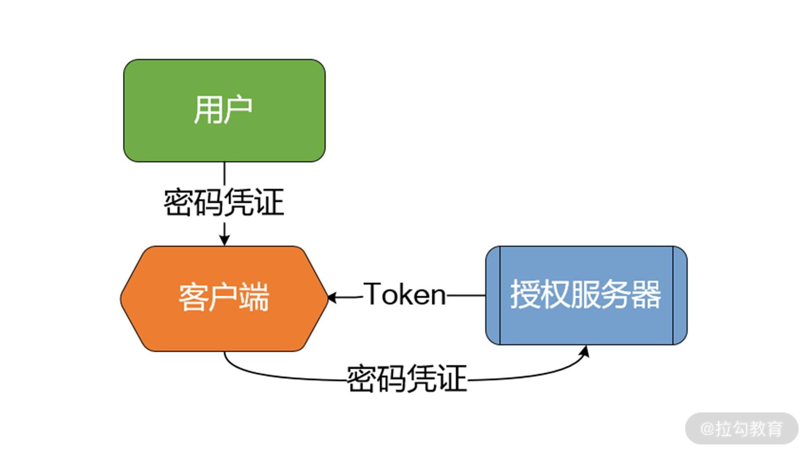
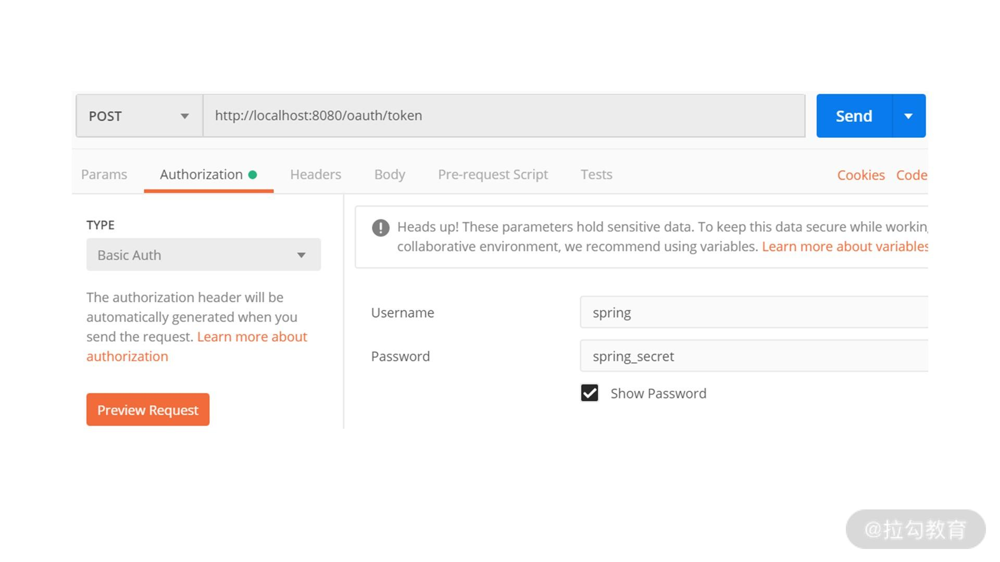
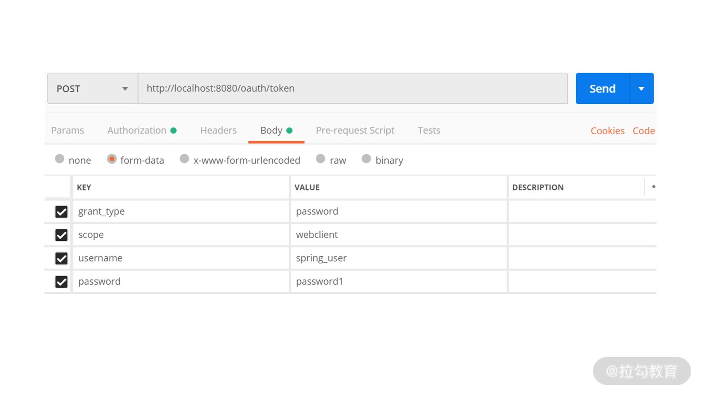
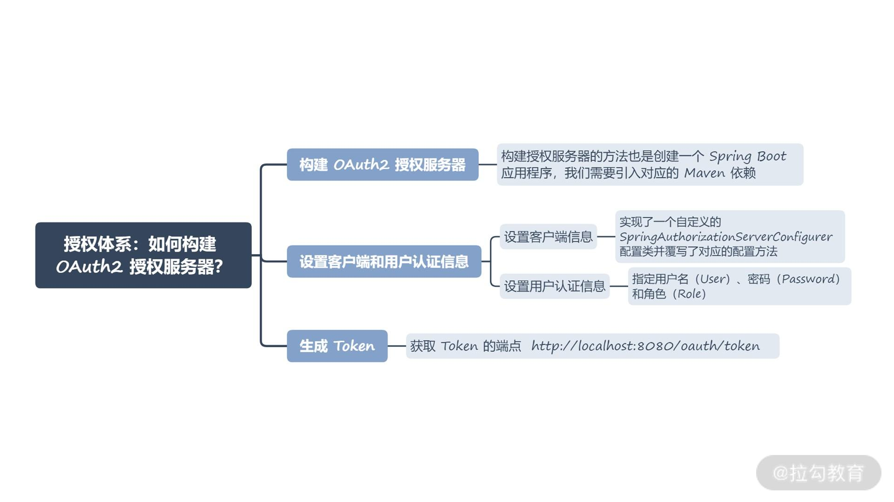

# 13 授权体系：如何构建 OAuth2 授权服务器？

上一讲我们讨论了 OAuth2 协议的详细内容，相信你已经了解了可以使用 OAuth2 协议实现微服务之间访问的授权。但是在此之前，我们需要在微服务系统中构建 OAuth2 授权服务器。今天我们就基于 Spring Security 框架，讨论如何构建这一授权服务器，并基于常用的密码模式生成对应的 Token，从而为下一讲中的服务访问控制提供基础。

### 构建 OAuth2 授权服务器

从表现形式上看，OAuth2 授权服务器也是一个独立的微服务，因此构建授权服务器的方法也是 **创建一个 Spring Boot 应用程序** ，我们需要引入对应的 Maven 依赖，如下所示：

```
<dependency>
    <groupId>org.springframework.security.oauth</groupId>
    <artifactId>spring-security-oauth2</artifactId>
</dependency>
```

这里的 spring-security-oauth2 就是来自 Spring Security 中的 OAuth2 库。现在 Maven 依赖已经添加完毕，下一步就是构建 Bootstrap 类作为访问的入口：

```
@SpringBootApplication
@EnableAuthorizationServer
public class AuthorizationServer {
    public static void main(String[] args) {
        SpringApplication.run(AuthorizationServer.class, args);
    }
}
```

请注意，这里出现了一个新的注解 @EnableAuthorizationServer，这个注解的作用在于 **为微服务运行环境提供一个基于 OAuth2 协议的授权服务** ，该授权服务会暴露一系列基于 RESTful 风格的端点（例如 /oauth/authorize 和 /oauth/token）供 OAuth2 授权流程使用。

构建 OAuth2 授权服务只是集成 OAuth2 协议的第一步，授权服务器是一种 **集中式系统** ，管理着所有与安全性流程相关的客户端和用户信息。因此，接下来我们需要在授权服务器中对这些基础信息进行初始化，而 Spring Security 为我们提供了各种配置类来实现这一目标。

### 设置客户端和用户认证信息

上一讲我们提到 OAuth2 协议存在四种授权模式，并提到在微服务架构中，密码模式以其简单性得到了广泛的应用。在接下来的内容中，我们就以密码模式为例展开讲解。

在密码模式下，用户向客户端提供用户名和密码，并将用户名和密码发给授权服务器从而请求 Token。授权服务器首先会对密码凭证信息进行认证，确认无误后，向客户端发放 Token。整个流程如下图所示：



密码模式授权流程示意图

请注意，授权服务器在这里执行认证操作的目的是 **验证传入的用户名和密码是否正确** 。在密码模式下，这一步是必需的，如果采用其他授权模式，不一定会有用户认证这一环节。

确定采用密码模式后，我们来看为了实现这一授权模式，需要对授权服务器做哪些开发工作。首先我们需要设置一些基础数据，包括客户端信息和用户信息。

#### 设置客户端信息

我们先来看如何设置客户端信息。设置客户端时，用到的配置类是 ClientDetailsServiceConfigurer，该配置类用来配置客户端详情服务 ClientDetailsService。用于描述客户端详情的 ClientDetails 接口则包含了与安全性控制相关的多个重要方法，该接口中的部分方法定义如下：

```
public interface ClientDetails extends Serializable {
     //客户端唯一性 Id
     String getClientId();
     //客户端安全码
     String getClientSecret();
     //客户端的访问范围
     Set<String> getScope();
     //客户端可以使用的授权模式
     Set<String> getAuthorizedGrantTypes();
     …
}
```

上述代码中的几个属性都与日常开发工作息息相关。

首先 ClientId 是一个必备属性，用来唯一标识客户的 Id，而 ClientSecret 代表客户端安全码。这里的 Scope 用来限制客户端的访问范围，如果这个属性为空，客户端就拥有全部的访问范围。常见的设置方式可以是 webclient 或 mobileclient，分别代表 Web 端和移动端。

最后，authorizedGrantTypes 代表客户端可以使用的授权模式，可选的范围包括代表授权码模式的 authorization_code、代表隐式授权模式 implicit、代表密码模式的 password 以及代表客户端凭据模式的 client_credentials。这个属性在设置上也 **可以添加 refresh_token，通过刷新操作获取以上授权模式下产生的新 Token** 。

和实现认证过程类似，Spring Security 也提供了 AuthorizationServerConfigurerAdapter 这个配置适配器类来简化配置类的使用方式。我们可以通过继承该类并覆写其中的 configure(ClientDetailsServiceConfigurer clients) 方法进行配置。使用 AuthorizationServerConfigurerAdapter 进行客户端信息配置的基本代码结构如下：

```
@Configuration
public class SpringAuthorizationServerConfigurer extends AuthorizationServerConfigurerAdapter {
 @Override
 public void configure(ClientDetailsServiceConfigurer clients) throws Exception {
  clients.inMemory()
            .withClient("spring")
            .secret("{noop}spring_secret")
            .authorizedGrantTypes("refresh_token", "password", "client_credentials")
            .scopes("webclient", "mobileclient");
 }
}
```

可以看到，我们创建了一个 SpringAuthorizationServerConfigure r类来继承 AuthorizationServerConfigurerAdapter，并通过 ClientDetailsServiceConfigurer 配置类设置了授权模式为密码模式。在授权服务器中存储客户端信息有两种方式，一种就是如上述代码所示的 **基于内存级别的存储** ，另一种则是 **通过 JDBC 在数据库中存储详情信息** 。为了简单起见，这里使用了内存级别的存储方式。

同时我们注意到，在设置客户端安全码时使用了"{noop}spring_secret"这种格式。这是因为在 Spring Security 5 中统一使用 PasswordEncoder 对密码进行编码，在设置密码时要求格式为“{id}password”。而这里的前缀“{noop}”就是代表具体 PasswordEncoder 的 id，表示我们使用的是 NoOpPasswordEncoder。关于 PasswordEncoder，你可以回顾\[“密码安全：Spring Security 中包含哪些加解密技术？”\]一讲中的内容。

我们已经在前面的内容中提到，@EnableAuthorizationServer 注解会暴露一系列的端点，而授权过程是使用 AuthorizationEndpoint 这个端点进行控制的。要想对该端点的行为进行配置，你可以使用 AuthorizationServerEndpointsConfigurer 这个配置类。和 ClientDetailsServiceConfigurer 配置类一样，我们也通过使用 AuthorizationServerConfigurerAdapter 配置适配器类进行配置。

因为我们指定了授权模式为密码模式，而密码模式包含认证环节。所以针对 AuthorizationServerEndpointsConfigurer 配置类需要指定一个认证管理器 AuthenticationManager，用于对用户名和密码进行认证。同样因为我们指定了基于密码的授权模式，所以需要指定一个自定义的 UserDetailsService 来替换全局的实现。关于 UserDetailsService 我们已经在\[“用户认证：如何使用 Spring Security 构建用户认证体系？”\]一讲中做了详细的讨论，我们明确可以通过如下代码来配置 AuthorizationServerEndpointsConfigurer：

```
@Configuration
public class SpringAuthorizationServerConfigurer extends AuthorizationServerConfigurerAdapter {
 @Autowired
 private AuthenticationManager authenticationManager;
 @Autowired
 private UserDetailsService userDetailsService;
 @Override
 public void configure(AuthorizationServerEndpointsConfigurer endpoints) throws Exception {
  endpoints.authenticationManager(authenticationManager).userDetailsService(userDetailsService);
 } 
}
```

至此，客户端设置工作全部完成，我们所做的事情就是 **实现了一个自定义的 SpringAuthorizationServerConfigurer 配置类并覆写了对应的配置方法** 。

#### 设置用户认证信息

设置用户认证信息所依赖的配置类是 WebSecurityConfigurer 类，Spring Security 同样提供了 WebSecurityConfigurerAdapter 类来简化该配置类的使用方式，我们可以继承 WebSecurityConfigurerAdapter 类并且覆写其中的 configure() 的方法来完成配置工作。

关于 WebSecurityConfigurer 配置类，我们首先需要明确配置的内容。实际上，设置用户信息非常简单， **只需要指定用户名（User）、密码（Password）和角色（Role）这三项数据** 即可，如下所示：

```
@Configuration
public class SpringWebSecurityConfigurer extends WebSecurityConfigurerAdapter {
 @Override
 @Bean
 public AuthenticationManager authenticationManagerBean() throws Exception {
  return super.authenticationManagerBean();
 }
 @Override
 @Bean
 public UserDetailsService userDetailsServiceBean() throws Exception {
  return super.userDetailsServiceBean();
 }
 @Override
 protected void configure(AuthenticationManagerBuilder builder) throws Exception {
  builder
            .inMemoryAuthentication()
            .withUser("spring_user")
            .password("{noop}password1")
            .roles("USER")
            .and()
   .withUser("spring_admin")
            .password("{noop}password2")
            .roles("USER", "ADMIN");
 }
}
```

结合上面的代码，我们看到构建了具有不同角色和密码的两个用户， **请注意"spring_user"代表的角色是一个普通用户，"spring_admin"则具有管理员角色** 。我们在设置密码时，同样需要添加前缀“{noop}”。同时，我们还看到 authenticationManagerBean()和 userDetailsServiceBean() 方法分别返回了父类的默认实现，而这里返回的 UserDetailsService 和 AuthenticationManager 在前面设置客户端时会用到。这里使用的用户认证机制你也可以回顾\[“用户认证：如何使用 Spring Security 构建用户认证体系？”\]中的内容。

### 生成 Token

现在，OAuth2 授权服务器已经构建完毕，启动这个授权服务器，我们就可以获取 Token。我们在构建 OAuth2 服务器时已经提到授权服务器中会暴露一批端点供 HTTP 请求进行访问，而获取 Token 的端点就是[http://localhost:8080/oauth/token](http://localhost:8080/oauth/token)。在使用该端点时，我们需要提供前面配置的客户端信息和用户信息。

这里使用 Postman 来模拟 HTTP 请求，客户端信息设置方式如下图所示：



客户端信息设置示意图

我们在“Authorization”请求头中指定认证类型为“Basic Auth”，然后设置客户端名称和客户端安全码分别为“spring”和“spring_secret”。

接下来我们指定针对授权模式的专用配置信息。首先是用于指定授权模式的 grant_type 属性，以及用于指定客户端访问范围的 scope 属性，这里分别设置为 “password”和“webclient”。既然设置了密码模式，所以也需要指定用户名和密码用于识别用户身份，这里，我们以“spring_user”这个用户为例进行设置，如下图所示：



用户信息设置示意图

在 Postman 中执行这个请求，会得到如下所示的返回结果：

```
{
    "access_token": "0efa61be-32ab-4351-9dga-8ab668ababae",
    "token_type": "bearer",
    "refresh_token": "738c42f6-79a6-457d-8d5a-f9eab0c7cc5e",
    "expires_in": 43199,
    "scope": "webclient"
}
```

可以看到，除了作为请求参数的 scope，这个返回结果中还包含了 access_token、token_type、refresh_token 和 expires_in 等属性。这些属性都很重要，我们在上一讲中都做了详细的介绍。当然，因为每次请求生成的 Token 都是唯一的，所以你在尝试时获取的结果可能与我的不同。

### 小结与预告

对微服务访问进行安全性控制的首要条件是 **生成一个访问 Token** 。这一讲我们从构建 OAuth2 服务器讲起，基于密码模式给出了如何设置客户端信息、用户认证信息以及最终生成 Token 的实现过程。这个过程中需要开发人员熟悉 OAuth2 协议的相关概念以及 Spring Security 框架中提供的各项配置功能。

本讲内容总结如下：



最后给你留一道思考题：基于密码模式，你能说明生成 Token 需要哪些具体的开发步骤吗？
