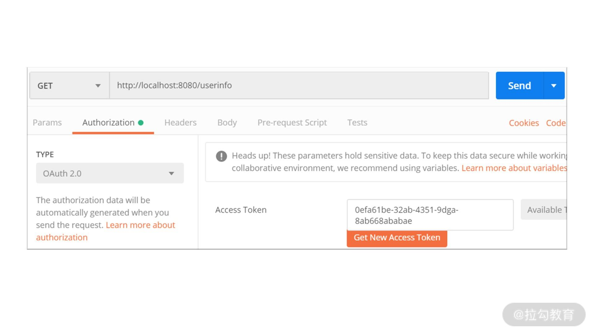
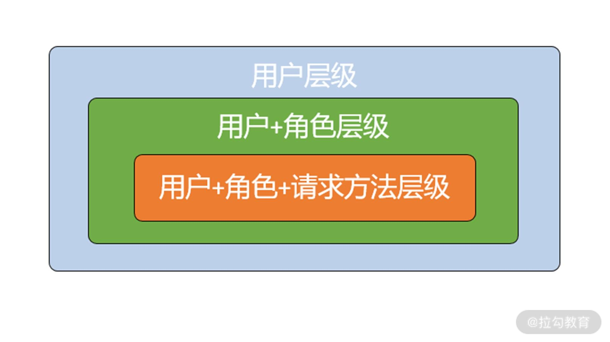
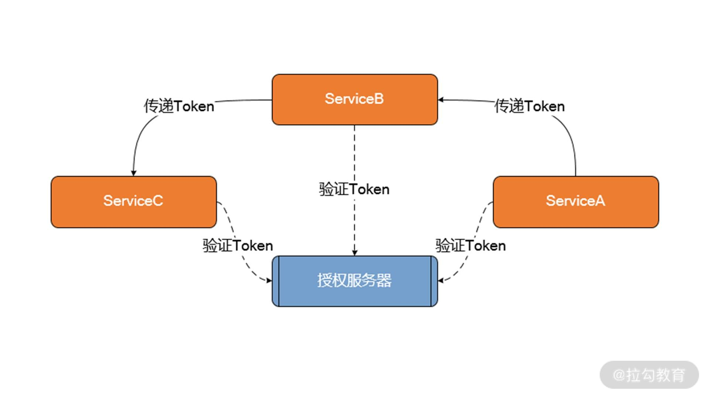
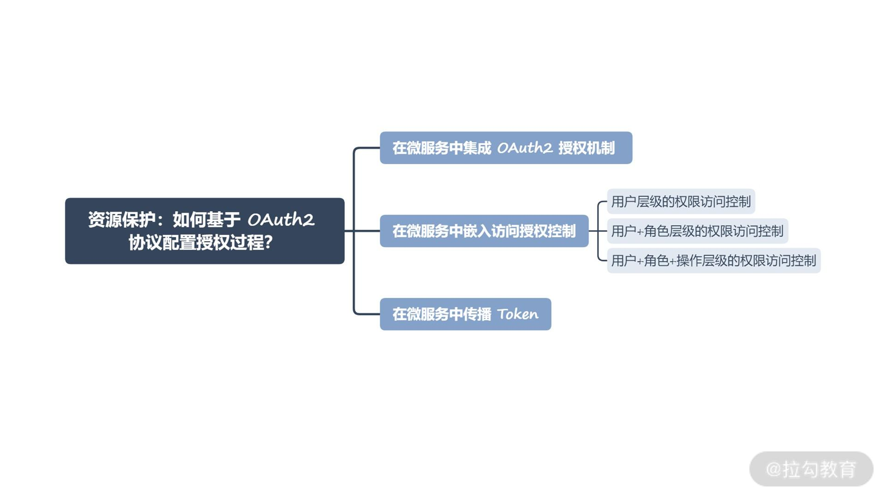

# 14 资源保护：如何基于 OAuth2 协议配置授权过程？

上一讲我们学习了如何构建 OAuth2 授权服务器，并掌握了生成 Token 的系统方法。今天我们关注的重点是如何使用 Token 实现对服务访问的具体授权。在日常开发过程中，我们需要对每个服务的不同功能进行不同粒度的权限控制，并且希望这种控制方法足够灵活，能够确保不同服务根据业务场景动态调整权限控制体系。同时，在微服务架构中，我们还需要考虑如何在多个服务中对 Token 进行有效的传播，确保整个服务访问的链路都得到授权管理。借助 Spring Security 框架，实现这些需求都很简单，下面我们就来展开学习。

### 在微服务中集成 OAuth2 授权机制

我们知道在 OAuth2 协议中，单个微服务的定位就是资源服务器。Spring Security 框架为此提供了专门的 @EnableResourceServer 注解。通过 **在 Bootstrap 类中添加 @EnableResourceServer 注解** ，相当于声明该服务中的所有内容都是受保护的资源，示例代码如下所示：

```
@SpringBootApplication
@EnableResourceServer
public class UserApplication {
    public static void main(String[] args) {
        SpringApplication.run(UserApplication.class, args);
    }
}
```

一旦我们在微服务中添加了 @EnableResourceServer 注解，该服务就会对所有的 HTTP 请求进行验证以确定 Header 部分中是否包含 Token 信息。如果没有 Token 信息，就会直接限制访问；如果有 Token 信息，则通过访问 OAuth2 服务器进行 Token 的验证。那么问题来了，每个微服务是如何与 OAuth2 服务器进行通信并获取传入 Token 的验证结果的呢？

要想回答这个问题，我们需要明确将 Token 传递给 OAuth2 授权服务器的目的是 **获取该 Token 中包含的用户和授权信息** 。这样，我们势必需要在各个微服务和 OAuth2 授权服务器之间建立起一种交互关系。我们可以在配置文件中添加如下所示的 security.oauth2.resource.userInfoUri 配置项来实现这一目标：

```
security:
  oauth2:
    resource:
   userInfoUri: http://localhost:8080/userinfo
```

这里的 [http://localhost:8080/userinfo](http://localhost:8080/userinfo)指向 OAuth2 授权服务器中的一个自定义端点，实现方式如下所示：

```
@RequestMapping(value = "/userinfo", produces = "application/json")
public Map<String, Object> user(OAuth2Authentication user) {
        Map<String, Object> userInfo = new HashMap<>();
        userInfo.put("user", user.getUserAuthentication().getPrincipal());
        userInfo.put("authorities", AuthorityUtils.authorityListToSet(
user.getUserAuthentication().getAuthorities()));
        return userInfo;
}
```

这个端点的作用就是获取可访问的那些受保护服务的用户信息。这里我们用到了 OAuth2Authentication 类，该类保存着用户的身份（Principal）和权限（Authority）信息。

当使用 Postman 访问 <http://localhost:8080/userinfo> 端点时，我们就需要传入一个有效的 Token。这里我们以上一讲中生成的 Token“0efa61be-32ab-4351-9dga-8ab668ababae”为例，在 HTTP 请求中添加一个“Authorization”请求头。请注意，因为我们使用的是 bearer 类型的 Token，所以需要 **在 access_token 的具体值之前加上“bearer”前缀** 。当然，我们也可以直接在“Authorization”页中选择协议类型为 OAuth 2.0，然后输入 Access Token，这样就相当于添加了请求头信息，如下图所示：



通过 Token 发起 HTTP 请求示意图

在后续的 HTTP 请求中，我们都将以这种方式发起对微服务的调用。该请求的结果如下所示：

```
{
     "user":{
         "password":null,
         "username":"spring_user",
         "authorities":[
             {
                 "autority":"ROLE_USER"
             }
         ],
         "accountNonExpired":true,
         "accountNonLocker":true,
         "credentialsNonExpired":true,
         "enabled":true
     },
     "authorities":[
         "ROLE_USER"
     ]
 }
```

我们知道“0efa61be-32ab-4351-9dga-8ab668ababae”这个 Token 是由“spring_user”这个用户生成的，可以看到该结果中包含了用户的用户名、密码以及该用户名所拥有的角色，这些信息与我们在上一讲中初始化的“spring_user”用户信息保持一致。我们也可以尝试使用“spring_admin”这个用户来重复上述过程。

### 在微服务中嵌入访问授权控制

在一个微服务系统中，每个微服务作为独立的资源服务器，对自身资源的保护粒度并不是固定的，可以根据需求对访问权限进行精细化控制。在 Spring Security 中，对访问的不同控制层级进行了抽象，形成了 **用户、角色和请求方法** 这三种粒度，如下图所示：



用户、角色和请求方法三种控制粒度示意图

基于上图，我们可以对这三种粒度进行排列组合，形成用户、用户+角色以及用户+角色+请求方法这三种层级，这三种层级能够访问的资源范围逐一递减。用户层级是指只要是认证用户就能访问服务内的各种资源；而用户+角色层级在用户层级的基础上，还要求用户属于某一个或多个特定角色；最后的用户+角色+请求方法层级要求最高，能够对某些 HTTP 操作进行访问限制。接下来我们针对这三个层级展开讨论。

#### 用户层级的权限访问控制

通过上一讲的学习，我们已经熟悉了通过扩展各种 ConfigurerAdapter 配置适配器类来实现自定义配置信息的方法。对于资源服务器而言，也存在一个 ResourceServerConfigurerAdapter 类，而我们的做法同样是 **继承该类并覆写它的 configure 方法** ，如下所示：

```
@Configuration
public class ResourceServerConfiguration extends ResourceServerConfigurerAdapter {
    @Override
    public void configure(HttpSecurity httpSecurity) throws Exception{
        httpSecurity.authorizeRequests()
             .anyRequest()
             .authenticated();
    }
}
```

我们注意到，这个方法的入参是一个 HttpSecurity 对象，而上述配置中的 anyRequest().authenticated() 方法指定了访问该服务的任何请求都需要进行验证。因此，当我们使用普通的 HTTP 请求来访问 user-service 中的任何 URL 时，将会得到一个“unauthorized”的 401 错误信息。解决办法就是 **在 HTTP 请求中设置“Authorization”请求头并传入一个有效的 Token 信息** ，你可以模仿前面的示例做一些练习。

#### 用户+角色层级的权限访问控制

对于某些安全性要求比较高的资源，我们不应该开放资源访问入口给所有的认证用户，而是需要 **限定访问资源的角色** 。针对不同的业务场景，我们可以判断哪些服务涉及核心业务流程，这些服务的 HTTP 端口不应该开放给普通用户，而是限定只有角色为“ADMIN”的管理员才能访问该服务。要想达到这种效果，实现方式也比较简单，就是在HttpSecurity 中通过 antMatchers() 和 hasRole() 方法指定想要限制的资源和角色。我们可以创建一个新 ResourceServerConfiguration 类实例并覆写它的 configure 方法，如下所示：

```
@Configuration
public class ResourceServerConfiguration extends 
 ResourceServerConfigurerAdapter{
    @Override
 public void configure(HttpSecurity httpSecurity) throws Exception {
        httpSecurity.authorizeRequests()
                .antMatchers("/order/**")
                .hasRole("ADMIN")
                .anyRequest()
                .authenticated();
    }
}
```

可以看到，这里使用了 05 讲\[“访问授权：如何对请求的安全访问过程进行有效配置？”\]中介绍的 Ant 匹配器实现了授权管理。现在，如果我们使用角色为“User”的 Token 访问这个服务，就会得到一个“access_denied”的错误信息。然后，我们使用上一讲中初始化的一个具有“ADMIN”角色的用户“spring_admin”来创建新的 Token，并再次访问该服务，就能得到正常的返回结果。

#### 用户+角色+操作层级的权限访问控制

更进一步，我们还可以针对某个端点的某个具体 HTTP 方法进行控制。例如，如果我们认为对某个微服务中的“user”端点下的资源进行更新的风险很高，那么就可以在 HttpSecurity 的 antMatchers() 中添加 HttpMethod.PUT 限定。

```
@Configuration
public class ResourceServerConfiguration extends ResourceServerConfigurerAdapter {
    @Override
    public void configure(HttpSecurity httpSecurity) throws Exception{
        httpSecurity.authorizeRequests()
                .antMatchers(HttpMethod.PUT, "/user/**")
                .hasRole("ADMIN")
                .anyRequest()
                .authenticated();
    }
}
```

现在，我们使用普通“USER”角色生成的 Token，并调用"/order/"端点中的 Update 操作，同样会得到“access_denied”的错误信息。而尝试使用“ADMIN”角色生成的 Token 进行访问，就可以得到正常响应。

### 在微服务中传播 Token

我们知道一个微服务系统势必涉及多个服务之间的调用，并形成一个链路。因为访问所有服务的过程都需要进行访问权限的控制，所以我们需要确保生成的 Token 能够在服务调用链路中进行传播，如下图所示：



微服务中 Token 传播示意图

那么，如何实现上图中的 Token 传播效果呢？Spring Security 基于 RestTemplate 进行了封装，专门提供了一个用在 HTTP 请求中传播 Token 的 OAuth2RestTemplate 工具类。想要在业务代码中构建一个 OAuth2RestTemplate 对象，可以使用如下所示的示例代码：

```
@Bean
public OAuth2RestTemplate oauth2RestTemplate(
 OAuth2ClientContext oauth2ClientContext,
    OAuth2ProtectedResourceDetails details) {
        return new OAuth2RestTemplate(details, oauth2ClientContext);
}
```

可以看到，通过传入 OAuth2ClientContext 和 OAuth2ProtectedResourceDetails，我们就可以创建一个 OAuth2RestTemplate 类。OAuth2RestTemplate 会把从 HTTP 请求头中获取的 Token 保存到一个 OAuth2ClientContext 上下文对象中，而OAuth2ClientContext 会把每个用户的请求信息控制在会话范围内，以确保不同用户的状态分离。另一方面，OAuth2RestTemplate 还依赖于 OAuth2ProtectedResourceDetails 类，该类封装了我们在上一讲中介绍过的clientId、客户端安全码 clientSecret、访问范围 scope 等属性。

一旦 OAuth2RestTemplate 创建成功，我们就可以使用它对某一个远程服务进行访问，实现代码如下所示：

```
@Component
public class OrderServiceClient {
    @Autowired
 OAuth2RestTemplate restTemplate;
    public Order getOrderById(String orderId){
        ResponseEntity<Order> result =
                restTemplate.exchange(
                        "http://orderservice/order/{orderId}",
                        HttpMethod.GET,
                        null, Order.class, orderId);
        Order order = result.getBody();
        return order;
    }
}
```

显然，基于这种远程调用方式，我们唯一要做的就是使用 OAuth2RestTemplate 替换原有的 RestTemplate，所有关于 Token 传播的细节已经被完整地封装在每次请求中。

### 小结与预告

这一讲我们的关注点在于对服务访问进行授权。通过今天的学习，我们明确了在微服务中嵌入访问授权控制的三种粒度。同时，在微服务系统中，因为涉及多个服务之间的交互，所以需要实现 Token 在这些服务之间的有效传播，我们可以借助 Spring Security 提供的工具类轻松实现这些需求。

本讲内容总结如下： 

最后给你留一道思考题：你能描述对服务访问进行授权的三种层级，以及每个层级对应的实现方法吗？欢迎在留言区分享你的学习收获。
