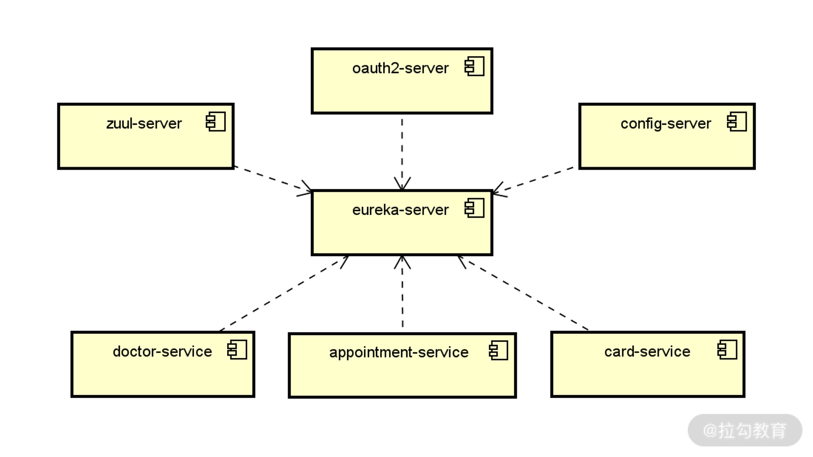
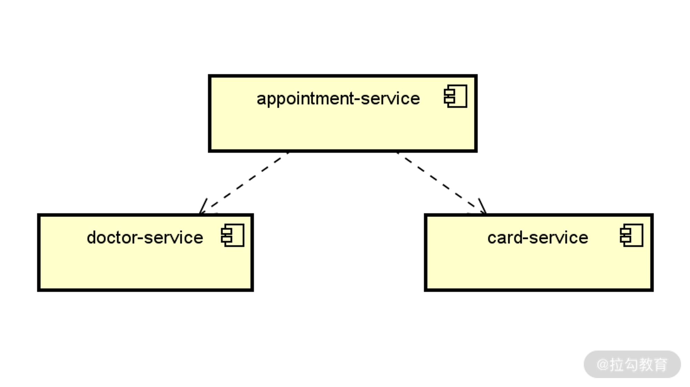

# 16 案例实战：基于 Spring Security 和 Spring Cloud 构建微服务安全架构

通过前面课程的学习，我们已经知道 Spring Security 可以集成 OAuth2 协议并实现分布式环境下的访问授权。同时，Spring Security 也可以和 Spring Cloud 框架无缝集成，并完成对各个微服务的权限控制。

今天我们将设计一个案例系统，从零构建一个完整的微服务系统，除了演示微服务系统构建过程，还将重点展示 OAuth2 协议以及 JWT 在其中所起到的作用。

### 案例驱动：SpringAppointment

在本课程中，我们通过构建一个相对精简的完整系统，来展示微服务架构相关的设计理念以及各项技术组件，这个案例系统称为 SpringAppointment。

SpringAppointment 包含的业务场景比较简单，可以用来模拟就医过程中的预约处理流程。一般而言，预约流程势必会涉及三个独立的微服务，即就诊卡（Card）服务、预约（Appointment）服务，以及医生（Doctor）服务。

我们把以上三个服务统称为 **业务服务** 。纵观整个 SpringAppointment 系统，除了这三个业务微服务之外，还有一批非业务性的基础设施类服务，具体包括：注册中心服务（Eureka）、配置中心服务（Spring Cloud Config），以及 API 网关服务（Zuul）。关于 Spring Cloud 中基础设施类服务的构建过程不是本专栏的重点，你可以参考拉勾上\[《Spring Cloud 原理与实战》\]专栏做详细了解。

虽然案例中的各个服务在物理上都是独立的，但就整个系统而言，需要各服务相互协作构成一个完整的微服务系统。也就是说，服务运行时存在一定的依赖性。我们结合系统架构对 SpringAppointment 的运行方式进行梳理，梳理的基本方法就是按照服务列表构建独立服务，并基于注册中心来管理它们之间的依赖关系，如下图所示：



基于注册中心的服务运行时依赖关系图

### 构建 OAuth2 授权服务

在上图中，我们注意到还存在着案例系统中的最后一个基础设施类微服务，即 OAuth2 授权服务，在这里充当着授权中心的作用。关于 OAuth2 授权服务的具体构建步骤已经在\[《授权体系：如何在微服务架构中集成OAuth2协议？》\]做了详细介绍，这里我们直接创建 WebSecurityConfigurerAdapter 的子类 WebSecurityConfigurer

以及 AuthorizationServerConfigurerAdapter 的子类 JWTOAuth2Config，实现代码如下所示：

```
@Configuration
public class WebSecurityConfigurer extends WebSecurityConfigurerAdapter {
    @Override
    @Bean
    public AuthenticationManager authenticationManagerBean() throws Exception {
        return super.authenticationManagerBean();
    }
    @Override
    @Bean
    public UserDetailsService userDetailsServiceBean() throws Exception {
        return super.userDetailsServiceBean();
    }
    @Override
    protected void configure(AuthenticationManagerBuilder builder) throws Exception {
     builder.inMemoryAuthentication().withUser("user").password("{noop}password1").roles("USER").and()
                 .withUser("admin").password("{noop}password2").roles("USER", "ADMIN");
    }
}
@Configuration
public class JWTOAuth2Config extends AuthorizationServerConfigurerAdapter {
    @Autowired
    private AuthenticationManager authenticationManager;
    @Autowired
    private UserDetailsService userDetailsService;
    @Override
    public void configure(AuthorizationServerEndpointsConfigurer endpoints) throws Exception {
     endpoints.authenticationManager(authenticationManager).userDetailsService(userDetailsService);
    }
    @Override
    public void configure(ClientDetailsServiceConfigurer clients) throws Exception {
     clients.inMemory().withClient("appointment_client").secret("{noop}appointment_secret")
                 .authorizedGrantTypes("refresh_token", "password", "client_credentials")
                 .scopes("webclient", "mobileclient");
    }
}
```

### 初始化业务服务

在 SpringAppointment 案例系统中，我们需要构建三个业务微服务，即 card-service、appointment-service 和 doctor-service，它们都是独立的 Spring Boot 应用程序。在构建业务服务时，我们首先需要完成它们与基础设施类服务集成。因为 API 网关起到的是服务路由作用，所以对于各个业务服务而言是透明的，而其他的注册中心、配置中心和授权中心都需要每个业务服务完成与它们之间的集成。

#### 集成注册中心

对于注册中心 Eureka 而言，card-service、appointment-service 和 doctor-service 都是它的客户端，所以需要 spring-cloud-starter-netflix-eureka-client 的依赖，如下所示。

```
<dependency>
    <groupId>org.springframework.cloud</groupId>
    <artifactId>spring-cloud-starter-netflix-eureka-client</artifactId>
</dependency>
```

然后，我们以 appointment-service 为例，来看它的 Bootstrap 类，如下所示：

```
@SpringBootApplication
@EnableEurekaClient
public class AppointmentApplication {
 public static void main(String[] args) {
        SpringApplication.run(AppointmentApplication.class, args);
    }
}
```

这里引入了一个新的注解 @EnableEurekaClient，该注解用于表明当前服务就是一个 Eureka 客户端，这样该服务就可以自动注册到 Eureka 服务器。当然，我们也可以直接使用统一的 @SpringCloudApplication 注解来实现 @SpringBootApplication 和 @EnableEurekaClient这两个注解整合在一起的效果。

接下来就是最重要的配置工作，appointment-service 中的配置内容如下所示：

```
spring:
  application:
 name: appointmentservice
server:
  port: 8081
eureka:
  client:
    registerWithEureka: true
    fetchRegistry: true
    serviceUrl:
   defaultZone: http://localhost:8761/eureka/
```

显然，这里包含两段配置内容。其中，第一段配置指定了服务的名称和运行时端口。在上面的示例中 appointment-service 的名称通过“spring.application.name=appointmentservice”进行指定，也就是说 appointment-service 在注册中心中的名称为 appointmentservice。在后续的示例中，我们会使用这一名称获取 appointment-service 在 Eureka 中的各种注册信息。

#### 集成配置中心

要想获取配置服务器中的配置信息，我们首先需要初始化客户端，也就是在将各个业务微服务与 Spring Cloud Config 服务器端进行集成。初始化客户端的第一步是引入 Spring Cloud Config 的客户端组件 spring-cloud-config-client，如下所示。

```
<dependency>
    <groupId>org.springframework.cloud</groupId>
    <artifactId>spring-cloud-config-client</artifactId>
</dependency>
```

然后我们需要在配置文件 application.yml 中配置服务器的访问地址，如下所示：

```
spring: 
  cloud:
    config:
    enabled: true
    uri: http://localhost:8888
```

以上配置信息中，我们指定了配置服务器所在的地址，也就是上面的 uri：[http://localhost:8888](http://localhost:8888/)。

一旦我们引入了 Spring Cloud Config 的客户端组件，相当于在各个微服务中自动集成了访问配置服务器中 HTTP 端点的功能。也就是说，访问配置服务器的过程对于各个微服务而言是透明的，即微服务不需要考虑如何从远程服务器获取配置信息，而只需要考虑如何在 Spring Boot 应用程序中使用这些配置信息。而对于常见的关系型数据访问配置而言，Spring 已经帮助我们内置了整合过程，我们要做的就是引入相关的依赖组件而已。

我们以 appointment-service 为例来演示数据库访问功能，案例中使用的是 JPA 和 MySQL，因此需要在服务中引入相关的依赖，如下所示：

```
<dependency>
    <groupId>org.springframework.boot</groupId>
    <artifactId>spring-boot-starter-data-jpa</artifactId>
</dependency>
<dependency>
    <groupId>mysql</groupId>
    <artifactId>mysql-connector-java</artifactId>
</dependency>
```

现在，我们就可以使用 JPA 提供的数据访问功能来访问 MySQL 数据库了。

#### 集成授权中心

在业务服务中集成授权中心的实现方法，我们已经在\[《14.资源保护：如何使用OAuth2协议实现对微服务访问进行授权？》\]中做了详细介绍，这里做一些简单的回顾。首先，我们需要在 Spring Boot 的启动类上添加 @EnableResourceServer 注解：

```
@SpringCloudApplication
@EnableResourceServer
public class AppointmentApplication {
    public static void main(String[] args) {
        SpringApplication.run(AppointmentApplication.class, args);
    }
}
```

然后，我们需要在配置文件中指定授权中心服务的地址：

```
security:
  oauth2:
    resource:
   userInfoUri: http://localhost:8080/userinfo
```

最后，要做的就是在每个业务服务中嵌入访问授权控制。我们可以使用用户层级的权限访问控制、用户+角色层级的权限访问控制，以及用户+角色+操作层级的权限访问控制这三种策略中的任意一种来实现这一目标。

### 集成和扩展 JWT

让我们再次回到 SpringAppointment 案例系统，以用户下单这一业务场景为例，就涉及 appointment-service 同时调用 doctor-service 和 card-service，这三个服务之间的交互方式如下图所示： 

SpringAppointment 案例系统中三个业务微服务的交互方式图

通过这个交互图，实际上我们已经可以梳理出这一场景下的代码结构了，如下所示：

```
public Appointment generateAppointment(String doctorName, String cardCode) {
        Appointment appointment = new Appointment();
        //获取远程 Card 信息
        CardMapper card = getCard(cardCode);
        …
        //获取远程 Doctor 信息
        DoctorMapper doctor = getDoctor(doctorName);
        …
        appointmentRepository.save(appointment);
        return appointment;
}
```

其中 appointment-service 从 card-service 获取 Card 对象，以及从 doctor-service 中获取 Doctor 对象，这两个步骤都会涉及远程 Web 服务的访问。因此，我们首先需要分别在 card-service 和 doctor-service 服务中创建对应的 HTTP 端点。这一过程不是课程的重点，如果你感兴趣，可以参考案例源码自己进行学习：[https://github.com/lagouEdAnna/SpringSecurity-jianxiang/tree/main/SpringAppointment](https://github.com/lagouEdAnna/SpringSecurity-jianxiang/tree/main/SpringAppointment)。

#### 集成 JWT

在《15 | 令牌扩展：如何使用JWT实现定制化 Token？》中，我们引入了 JWT 并完成了与 OAuth2 协议的集成，从而实现了定制化的 Token。JWT 同样也需要在整个服务调用链路中进行传递。而持有 JWT 的客户端访问 appointment-service 提供的 HTTP 端点进行下单操作，该服务会验证所传入 JWT 的有效性。然后，appointment-service 会再通过网关访问 card-service 和 doctor-service，同样这两个服务也会分别对所传入的 JWT 进行验证，并返回相应的结果。

现在，让我们在 appointment-service 中构建一个 CardRestTemplateClient 类，会发现它使用了在《15 | 令牌扩展：如何使用 JWT 实现定制化 Token？》中所创建的 RestTemplate 对象来发起远程调用，代码如下所示：

```
@Service
public class CardRestTemplateClient {
    @Autowired
    RestTemplate restTemplate;
    public CardMapper getCardByCardCode(String cardCode) {
        ResponseEntity<CardMapper> result =
                restTemplate.exchange("http://cardservice/cards/{cardCode}", HttpMethod.GET, null,
                        CardMapper.class, cardCode);
        return result.getBody();
    }
}
```

我们知道在这个 RestTemplate 中，基于 AuthorizationHeaderInterceptor 对请求进行了拦截，从而完成了 JWT 在各个服务中的正确传播。

最后，我们通过 Postman 来验证以上流程的正确性。通过访问 Zuul 中配置的 appointment-service 端点，并传入角色为“ADMIN”的用户对应的 Token 信息，可以看到订单记录已经被成功创建。你可以尝试通过生成不同的 Token 来执行这一流程，并验证授权效果。

#### 扩展 JWT

在案例的最后，我们来讨论一下如何扩展 JWT。JWT 具有良好的可扩展性，开发人员可以根据需要在 JWT Token 中添加自己想要添加的各种附加信息。

针对 JWT 的扩展性场景，Spring Security 专门提供了一个 TokenEnhancer 接口来对 Token 进行增强（Enhance），该接口定义如下：

```
public interface TokenEnhancer {
    OAuth2AccessToken enhance(OAuth2AccessToken accessToken, OAuth2Authentication authentication);
}
```

可以看到这里处理的是一个 OAuth2AccessToken 接口，而该接口有一个默认的实现类 DefaultOAuth2AccessToken。我们可以通过该实现类的 setAdditionalInformation 方法，以键值对的方式将附加信息添加到 OAuth2AccessToken 中，示例代码如下所示：

```
public class JWTTokenEnhancer implements TokenEnhancer {
    @Override
    public OAuth2AccessToken enhance(OAuth2AccessToken accessToken, OAuth2Authentication authentication) {
        Map<String, Object> systemInfo = new HashMap<>();
        systemInfo.put("system", "Appointment System");
        ((DefaultOAuth2AccessToken) accessToken).setAdditionalInformation(systemInfo);
        return accessToken;
    }
}
```

这里我们以硬编码的方式添加了一个“system”属性，你也可以根据需要进行相应的调整。

要想使得上述 JWTTokenEnhancer 类能够生效，我们需要对 JWTOAuth2Config 类中的 configure 方法进行重新配置，并将 JWTTokenEnhancer 嵌入到 TokenEnhancerChain 中，如下所示：

```
@Override
public void configure(AuthorizationServerEndpointsConfigurer endpoints) throws Exception {
        TokenEnhancerChain tokenEnhancerChain = new TokenEnhancerChain();
        tokenEnhancerChain.setTokenEnhancers(Arrays.asList(jwtTokenEnhancer, jwtAccessTokenConverter)); 
        endpoints.tokenStore(tokenStore)
                .accessTokenConverter(jwtAccessTokenConverter)
                .tokenEnhancer(tokenEnhancerChain)
                .authenticationManager(authenticationManager)
                .userDetailsService(userDetailsService);
}
```

请注意，我们在这里通过创建一个 TokenEnhancer 的列表将包括 JWTTokenEnhancer 在内的多个 TokenEnhancer 嵌入到 TokenEnhancerChain 中。

现在，我们已经扩展了 JWT Token。那么，如何从这个 JWT Token 中获取所扩展的属性呢？方法也比较简单和固定，如下所示：

```
//获取 JWTToken
RequestContext ctx = RequestContext.getCurrentContext();
String authorizationHeader = ctx.getRequest().getHeader(AUTHORIZATION_HEADER);
String jwtToken = authorizationHeader.replace("Bearer ","");
//解析 JWTToken
String[] split_string = jwtToken.split("\\.");
String base64EncodedBody = split_string[1];
Base64 base64Url = new Base64(true);
String body = new String(base64Url.decode(base64EncodedBody));
JSONObject jsonObj = new JSONObject(body);
//获取定制化属性值
String systemName = jsonObj.getString("system");
```

我们可以把这段代码嵌入到需要使用到自定义“system”属性的任何场景中。

### 小结与预告

案例分析是掌握一个框架应用方式的最好方法，对于 OAuth2 协议也是一样。本讲中，我们将 Spring Security 结合 Spring Cloud 构建了一个微服务案例系统 SpringAppointment。然后根据 SpringAppointment 案例中的业务场景划分了各个微服务，并重点介绍了各个业务服务的构建过程。我们一方面展示了业务服务与基础设施服务的集成过程，另一方面也演示了如何集成和扩展 JWT 的实现过程。

最后再给你留一道思考题：在业务系统中如何实现对 JWT 进行定制化的扩展呢？欢迎在留言区和我分享你的收获。
