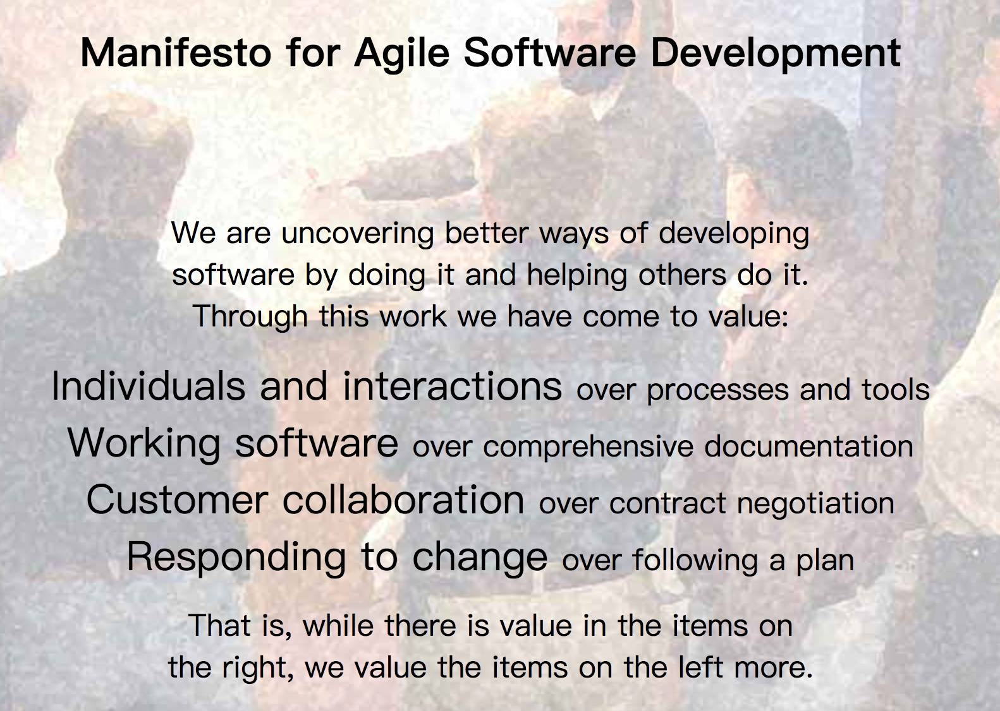
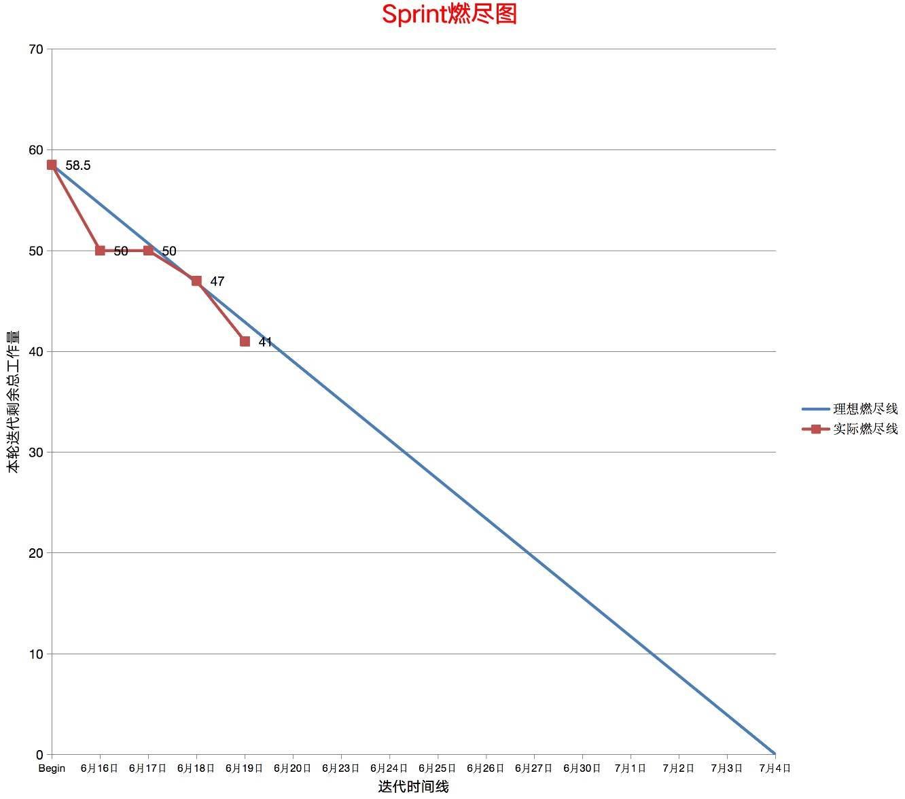
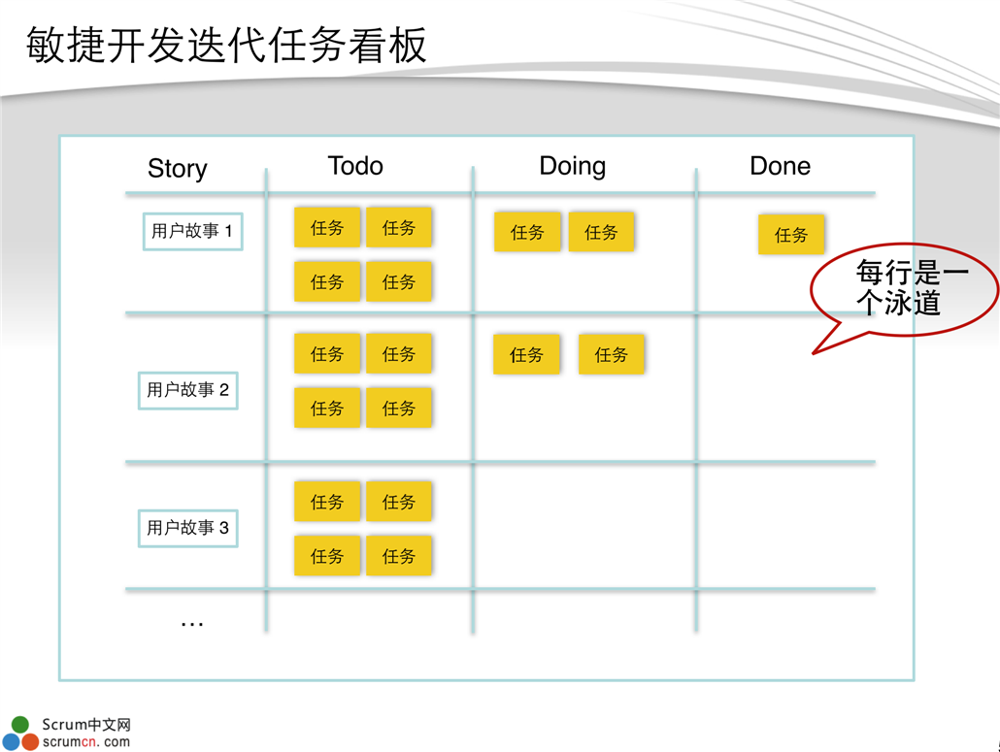
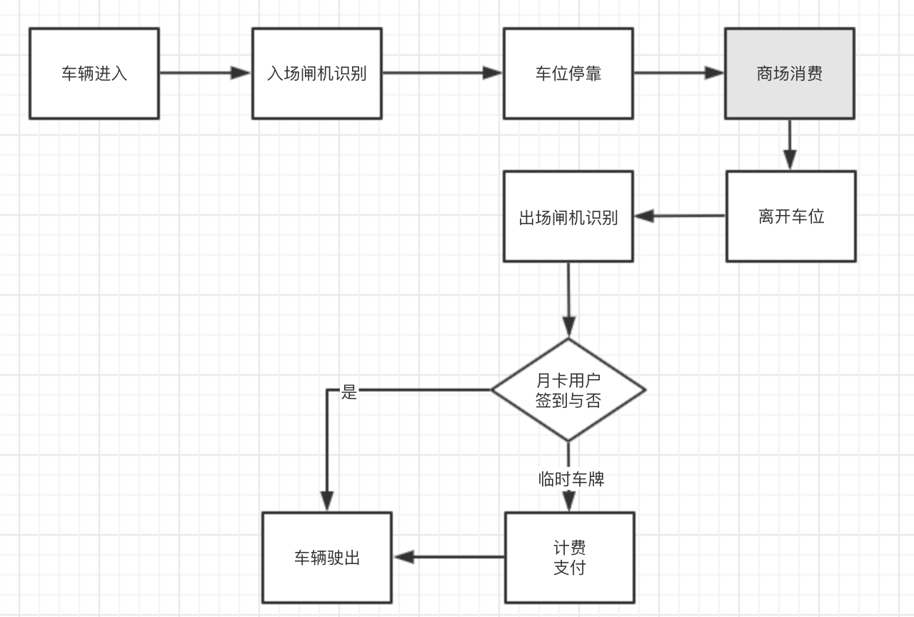

# 01 以真实“商场停车”业务切入——需求分析

不管是传统开发模式还是时下推崇的敏捷开发模式，都要从源头——业务需求开始着手，缺少了需求获取分析环节或本环节做的不够好，由此造成的错误会随着软件迭代的步伐，逐步被放大，近而造成巨大的损失。有时金钱成本尚可接受，但由此造成的时间成本、机会成本则是无法估量的。

为什么选取"商场停车业务"作为需求原型呢，有两个考量：一是场景熟知度比较高，业务理解上不存在很大障碍；二是能将我们所要表达的微服务特性融入进去，业务复杂度较低，便于上手开发，门槛太高反而不利于技术实践。

下面随着课程的步伐，一步一步深入进去吧。

### 停车收费需求

相信大家经常去商场购物，不管你有没有停过车，商场的停车场不会是个陌生的存在，本次实操就是以商场停车收费为业务原型开展。业务需求相对简单（实际业务要比案例中功能更复杂），主要是要能通过简单的业务功能掌握到我们关心的微服务技术栈即可。

主要干系人就是商场物业管理部，提出的原始需求如下：

1. 用户手机号绑定商场的系统，在里面添加车辆，每天到商场附近时可以签到，领取积分，积分可以用于兑换限量的商场优惠券，也可以兑换洗车券，在停车场指定位置洗车。
1. 用户可以通过系统开通 VIP 停车月卡，出入停车场时，无须额外付费。可以充值为月卡延期，充值时，为用户赠送一定数量的积分，可以做为正常积分使用。充值后，用户可以收到充值通知。
1. 若用户未开通月卡，出场时，必须在系统里支付停车费用后，才能出场。费用多少按停车场约定的计费规则来计算。缴费后，用户能收到缴费通知。
1. 用户进停车场前，能实时看到可用停车位数量。
1. 在系统后台，可以看到用户的支付流水、充值流水，车位使用情况等

业务场景很清晰，也比较常见（实际场景中，本系统应当与其它系统打通，数据共享，便于数据分析、统计挖掘等，实际功能同样比这个更复杂些），本次就以如上的简单需求，结合微服务技术栈，来一次从 0 到 1 的完整性开发实践。

### 需求整理思路

Scrum 敏捷开发实践，在国内应用的时间也不算短，不少企业已经成功应用于产品迭代开发中，本次实战会融入敏捷思想，来指导这次的微服务开发实战。本文的需求分析工作多数情况下是由 PO（产品经理）完成。

按传统的瀑布研发模式来走，流程大致时需求分析，输出需求分析文档，而后进行概要设计、详细设计（数据库设计），并输出对应的文档，后续再进行编码工作。

敏捷中提倡可工作的文档高于详尽的文档，所以无须严格按照传统的模块输出一堆文档，能表述清楚、能与团队成员正确传达即可。

（图片来源于网站[http://agilemanifesto.org/](http://agilemanifesto.org/)）

基于原始需求，由 PO 输出用户故事列表形成需求池 Product Backlog，每个迭代中从中按优先级顺序，放入不同的迭代中形成 Sprint Backlog，同时分解故事为任务（故事的粒度要比任务粗，是一组功能的组合），由组员一起将任务工作量估算并认领。任务工作量汇总后，就形成了当前迭代的总工作量，基于燃尽图，随着时间的延长以及工作进度的推进，可以清晰的从燃尽图中看到任务的完成情况。可以借助于看板，将故事任务以不同色块的 3M 便利贴贴在白板上，画出待办列表、进行中列表、已完成列表，任务完成后由组员调整位置。

 （工具绘制）

（图片来源于敏捷中文网）

为了提高工作效率，一般会借助对应的敏捷开发工具完成，比如 Teambition、JIRA、禅道等等，里面针对敏捷的各个环节都有很好的支持，相信能帮助大家节省不少成本。

### 需求分析

依据原始停车需求，整合分析后可归集为六个业务模块：

1. 会员，会员信息（主要是姓名、手机号、生日），车辆信息（主要车牌信息），月卡信息(充值一定金额后，指定区间内免支付出入场，针对商场的工作人员或办公区的白领)，签到信息
1. 停车场资源，车位（车辆停靠车位后，系统自动打标，可用车位扣减，停车场入口可用车实时更新）、道闸(基础数据，真实场景中涉及到岗亭值班人员安排，设备维护等)
1. 积分，会员到达商场后签到领取积分（如签到一次可免费停车 2 小时，超出部分，以计费规则为准）。积分可兑换商场优惠券、洗车券。
1. 计费，计费规则，车辆进场（记录车辆入场时间，开始计费）、出场扣费(出场时识别车牌，依计费规则，支付停车费，分临时车与月卡车两种，临时车现场收费，月卡车做有效期判定是符合条件后再出场)
1. 财务，车辆出入的支付流水，会员月卡充值费用，收入统计
1. 消息，车辆出场支付消息，会员充值消息
1. 兑换洗车券后，停车场内洗车消费

### 用户故事、任务整理

以上述需求归集情况，罗列几个代表性的用户故事，取代传统的需求文档。约定：商场停车系统以下简称为系统

1. 作为一个普通用户，我希望可以使用系统绑定手机号，并录入车辆信息，以便于可以离场时支付费用，接受支付结果通知。
1. 作为一个系统用户，我希望可以开通停车场月卡，同时可额外获得积分，以便于在离场时无须额外支付，快速通过。
1. 作为一个系统用户，我希望可以通过系统日常签到，得到积分，以便于可以兑换商场优惠券或停车场洗车券。
1. 作为一个普遍用户/系统，我希望可以在进入停车场前，识别可用车位数，以便我做出相应的决策。
1. 作为一个系统月卡用户，为月卡充值时收到消费通知，同时得到额外的积分。
1. 作为一个系统用户，离场时需要按计费规则支付对应的停车费，并接收支付通知。
1. 作为一个系统管理用户，我希望可以看到所有场内车位的使用情况、用户的支付流水、会员月卡的充值流水。

基于以上故事，将故事拆解成较细的任务，拿第一个 User Story 举例。

1.1 商场系统中绑定手机号，通过手机验收码，确定是本人手机。

1.2 完善个人信息，可以保存个人姓名、生日等信息

1.3 录入车辆车牌信息，后期出场车牌识别后，自动计算车辆停车费

罗列出故事的具体任务后，开发人员针对任务情况，进行工作量评估，敏捷估算工作量常用用部分斐波那契数列（小时数）：0 ，1 ，2 ，3 ，5 ，8， 13， 21 等，建议不超过 8 时，超过 8 意味着需要进一步分拆，争取在一天内可以完成一个任务。估算需要选取一个基准复杂度，比如一次 DB 交互为 1，在此基础上，分析每个故事的复杂度，结合前面的工作量估算方法就可以给某个任务确定预估工时数。

有朋友会比较担心，万一预估的时间少了完不成怎么办，其实这只是初步预估，在实际执行时，以实际执行为准，没有一个敏捷团队的迭代燃尽图会像理想状态一般燃烧。

实操过程中不少小伙伴存在一个误区：关注花费过的时间，而不是关注剩余工作时间，燃尽图中显示是剩余工时数量。

### 关键业务流程梳理

基于需求情况，找出核心的业务流程，指导后期的核心业务开发。

小结：

本篇带你结合 Scrum 敏捷思想进行产品需求的分析，由 PO 人员整理用户故事、核心业务流程，由开发人员认领故事，分解故事为具体任务，并预估工作量，录入敏捷辅助工具中，为期开发人员介入作好准备工作。

### 留 2 个节后实践题目

1. 初中级的开发者普遍不重视需求，更追求技能的提升，如果要走的快走的远，一定要坚持把技术、业务一起抓。尝试将所有 User Story 罗列出来吧，并分解为 Task 录入到一个特定的敏捷开发辅助工具中去，并结合敏捷开发全流程，跟随项目的实战全程体验一番。
1. 敏捷真的不需要留存文档吗？
