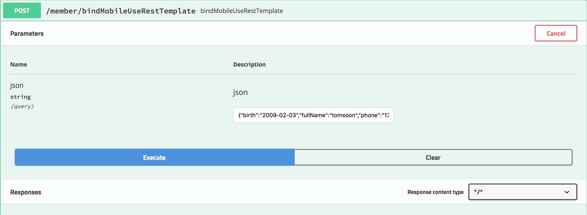
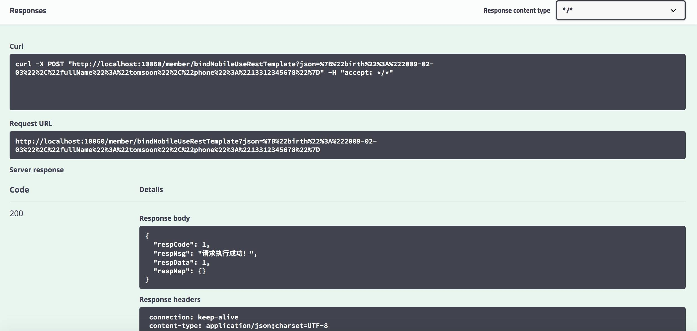
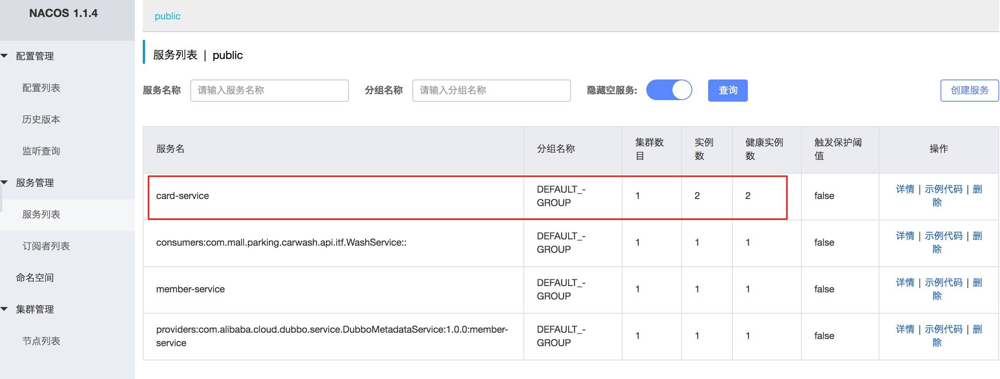

# 07 如何调用本业务模块外的服务——服务调用

上篇已经引入 Nacos 基础组件，完成了服务注册与发现机制，可以将所有服务统一的管理配置起来，方便服务间调用。本篇将结合需求点，进行服务间调用，完成功能开发。

### 几种服务调用方式

服务间调用常见的两种方式：RPC 与 HTTP，RPC 全称 Remote Produce Call 远程过程调用，速度快，效率高，早期的 WebService 接口，现在热门的 Dubbo、gRPC 、Thrift、Motan 等，都是 RPC 的典型代表，有兴趣的小伙伴可以查找相关的资料，深入了解下。

HTTP 协议（HyperText Transfer Protocol，超文本传输协议）是因特网上应用最为广泛的一种网络传输协议，所有的 WWW 文件都必须遵守这个标准。对服务的提供者和调用方没有任何语言限定，更符合微服务语言无关的理念。时下热门的 RESTful 形式的开发方式，也是通过 HTTP 协议来实现的。

本次案例更多的考虑到简捷性以及 Spring Cloud 的基础特性，决定采用 HTTP 的形式，进行接口交互，完成服务间的调用工作。Spring Cloud 体系下常用的调用方式有：RestTemplate 、 Ribbon 和 Feign 这三种。

**RestTemplate** ，是 Spring 提供的用于访问 Rest 服务的客户端，RestTemplate 提供了多种便捷访问远程 Http 服务的方法，能够大大提高客户端的编写效率。 **Ribbon** ，由 Netflix 出品，更为人熟知的作用是客户端的 Load Balance（负载均衡）。 **Feign** ，同样由 Netflix 出品，是一个更加方便的 HTTP 客户端，用起来就像调用本地方法，完全感觉不到是调用的远程方法。内部也使用了 Ribbon 来做负载均衡功能。

由于 Ribbon 已经融合在 Feign 中，下面就只介绍 RestTemplate 和 Feign 的使用方法。

### RestTemplate 的应用

功能需求：会员绑定手机号时，同时给其增加相应的积分。会员绑定手机号在会员服务中完成，增加会员积分在积分服务中完成。请求路径是客户端->会员服务->积分服务。

响应客户端请求的方法

```java
    @RequestMapping(value = "/bindMobileUseRestTemplate", method = RequestMethod.POST)
    public CommonResult<Integer> bindMobileUseRestTemplate(String json) throws BusinessException{
        CommonResult<Integer> result = new CommonResult<>();
        log.info("bind mobile param = " + json);
        int rtn = memberService.bindMobileUseRestTemplate(json);
        result.setRespData(rtn);
        return result;
    }
```

做好 RestTemplate 的配置工作，否则无法正常使用。

```java
@Configuration
public class RestTemplateConfig {
    @Bean
    public RestTemplate restTemplate(ClientHttpRequestFactory simpleClientHttpRequestFactory){
        return new RestTemplate(simpleClientHttpRequestFactory);
    }
    @Bean
    public ClientHttpRequestFactory simpleClientHttpRequestFactory(){
        SimpleClientHttpRequestFactory factory = new SimpleClientHttpRequestFactory();
        return factory;
    }
}
```

在 MemberService 中处理请求，逻辑如下：

```java
@Autowired
RestTemplate restTemplate;
@Override
    public int bindMobileUseRestTemplate(String json) throws BusinessException {
        Member member = JSONObject.parseObject(json, Member.class);
        int rtn = memberMapper.insertSelective(member);
        // invoke another service
        if (rtn > 0) {
            MemberCard card = new MemberCard();
            card.setMemberId(member.getId());
            card.setCurQty("50");
            MultiValueMap<String, String> requestMap = new LinkedMultiValueMap<String, String>();
            requestMap.add("json", JSONObject.toJSONString(card).toString());
            HttpEntity<MultiValueMap<String, String>> requestEntity = new HttpEntity<MultiValueMap<String, String>>(
                    requestMap, null);
            String jsonResult = restTemplate.postForObject("http://localhost:10461/card/addCard", requestEntity,
                    String.class);
            log.info("creata member card suc!" + jsonResult);
        }
        return rtn;
    }
```

采用 postForObject 形式请求积分服务中的生成积分记录的方法，并传递相应参数。积分子服务中方法比较简单，接受调用请求的方法：

```java
@RequestMapping("card")
@RestController
@Slf4j
public class MemberCardController {
    @Autowired
    MemberCardService cardService;
    @RequestMapping(value = "/addCard", method = RequestMethod.POST)
    public CommonResult<Integer> addCard(String json) throws BusinessException {
        log.info("eclise service example: begin add member card = " + json);
        //log.info("jar service example: begin add member card = " + json);
        CommonResult<Integer> result = new CommonResult<>();
        int rtn = cardService.addMemberCard(json);
        result.setRespData(rtn);
        return result;
    }
}
```

实际业务逻辑处理部分由 MemberCardService 接口中完成。

```java
@Service
@Slf4j
public class MemberCardServiceImpl implements MemberCardService {
    @Autowired
    MemberCardMapper cardMapper;
    @Override
    public int addMemberCard(String json) throws BusinessException {
        MemberCard card = JSONObject.parseObject(json,MemberCard.class);
        log.info("add member card " +json);
        return cardMapper.insertSelective(card);
    }
}
```

分别启动会员服务、积分服务两个项目，通过 Swagger 接口 UI 作一个简单测试。





RestTemplate 默认依赖 JDK 提供 HTTP 连接的能力，针对 HTTP 请求，提供了不同的方法可供使用，相对于原生的 HTTP 请求是一个进步，但经过上面的代码使用，发现还是不够优雅。能不能像调用本地接口一样，调用第三方的服务呢？下面引入 Feign 的应用，绝对让你喜欢上 Feign 的调用方式。

### Feign 的应用

Fegin 的调用最大的便利之处在于，屏蔽底层的连接逻辑，让你可以像调用本地接口一样调用第三方服务，代码量更少更优雅。当然，必须在服务注册中心的协调下才能正常完成服务调用，而 RestTemplate 并不关心服务注册心是否正常运行。

#### 引入 Feign

Feign 是由 Netflix 开发出来的另外一种实现负载均衡的开源框架，它封装了 Ribbon 和 RestTemplate，实现了 WebService 的面向接口编程，进一步的减低了项目的耦合度，因为它封装了 Riboon 和 RestTemplate ，所以它具有这两种框架的功能。 在会员模块的 pom.xml 中添加 jar 引用

```xml
<dependency>
            <groupId>org.springframework.cloud</groupId>
            <artifactId>spring-cloud-starter-openfeign</artifactId>
</dependency>
```

在模块启动类中增加 @EnableFeignClients 注解，才能正常使用 Feign 相关功能，启动时开启对 ＠FeignClient 注解的包扫描，并且扫描到相关的接口客户端。

```java
//#client 目录为 feign 接口所在目录
@EnableFeignClients(basePackages = "com.mall.parking.member.client")
```

前端请求响应方法

```java
    @RequestMapping(value = "/bindMobile", method = RequestMethod.POST)
    public CommonResult<Integer> bindMobile(String json) throws BusinessException{
        CommonResult<Integer> result = new CommonResult<>();
        log.info("bind mobile param = " + json);
        int rtn = memberService.bindMobile(json);
        result.setRespData(rtn);
        return result;
    }
```

#### 接口编写

编写 MemberCardClient，与积分服务调用时使用，其中的接口与积分服务中的相关方法实行一对一绑定。

```java
@FeignClient(value = "card-service")
public interface MemberCardClient {
    @RequestMapping(value = "/card/addCard", method = RequestMethod.POST)
    public CommonResult<Integer> addCard(@RequestParam(value = "json") String json) throws BusinessException;
    @RequestMapping(value = "/card/updateCard", method = RequestMethod.POST)
    public CommonResult<Integer> updateCard(@RequestParam(value = "json") String json) throws BusinessException;
}
```

> 注意是 **RequestParam** 不是 **PathVariable** ， **PathVariable** 是从路径中取值， **RequestParam** 是从参数中取值，用法不一。

使用时，直接 @Autowired 像采用本地接口一样使用即可，至此完成代码的编写，下面再来验证逻辑的准确性。

1. 保证 nacos-server 启动中
1. 分别启动 parking-member，parking-card 子服务
1. 通过 parking-member 的 swagger-ui 界面，调用会员绑定手机号接口(或采用 PostMan 工具)

正常情况下，park-member，park-card 两个库中数据表均有数据生成。


那么，fallback 何时起作用呢？很好验证，当积分服务关闭后，再重新调用积分服务中的生成积分方法，会发现直接调用的是 MemberCardServiceFallback 中的方法，直接响应给调用方，避免了调用超时时，长时间的等待。

#### 负载均衡

前文已经提到 Feign 中已经默认集成了 Ribbon 功能，所以可以通过 Feign 直接实现负载均衡。启动两个 card-service 实例，打开 Nacos 控制台，发现实例已经注册成功。再通过 swagger-ui 或 PostMan 工具访问多访问几次 bindMobile 方法，通过控制台日志输出，可以发现请求在两个 card-service 实例中轮番执行。



如何改变默认的负载均衡策略呢？先弄清楚 Ribbon 提供了几种负载策略：随机、轮询、重试、响应时间权重和最空闲连接，分别对应如下

> com.netflix.loadbalancer.RandomRule com.netflix.loadbalancer.RoundRobinRule com.netflix.loadbalancer.RetryRule com.netflix.loadbalancer.WeightedResponseTimeRule com.netflix.loadbalancer.BestAvailableRule

由于是客户端负载均衡，必须配置在服务调用者项目中增加如下配置来达到调整的目的。

> card-service: ribbon: NFLoadBalancerRuleClassName: com.netflix.loadbalancer.RandomRule

也可以通过 Java 代码的形式调整，放置在项目启动类的下面

```java
      @Bean
    public IRule ribbonRule() {
        // 负载均衡规则，改为随机
        return new RandomRule();
//        return new BestAvailableRule();
//        return new WeightedResponseTimeRule();
//        return new RoundRobinRule();
//        return new RetryRule();
    }
```

至此，我们通过一个"会员绑定手机号，并增加会员相应积分"的功能，通过两种方式完成一个正常的服务调用，并测试了客户端负载均衡的配置及使用。

### 课外作业

掌握了服务间调用后，在不考虑非业务功能的情况下，基本可以将本案例中大部分业务逻辑代码编写完成，可参照自己拆解的用户故事，或者主要的业务流程图，现在就动手，把代码完善起来吧。

服务调用是微服务间频繁使用的功能，选定一个简捷的调用方式尤其重要。照例留下一道思考题吧：本文用到了客户端负载均衡技术，它与我们时常提到的负载均衡技术有什么不同吗？
