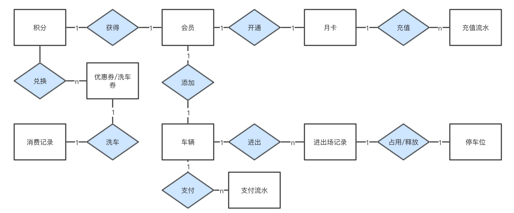
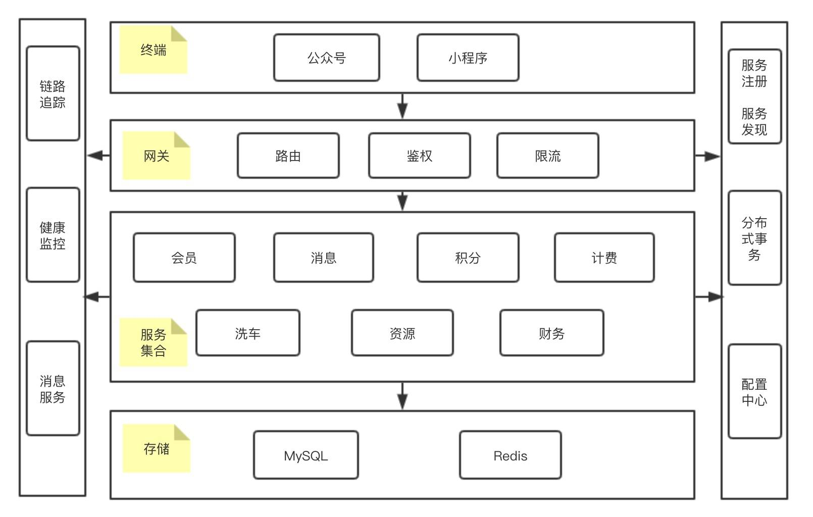
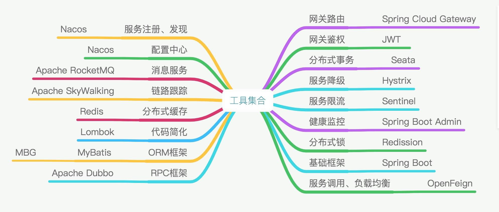

02 具象业务需求再抽象分解——系统设计
====================

经过前篇需求梳理，商场停车收费业务需求情况已经十分明了，本节就依据前文的输出做为输入，开始系统设计工作，包括功能模块设计、存储设计、架构设计等，为后面的编码提供良好的基础保障。

> 有同学可能会有疑问，都使用敏捷了，怎么还要设计，直接上手编码不就行了？敏捷提倡响应变化，减少文档，很多朋友有误解，以为敏捷就是不需要设计，不需要文档，就是要快，凡是阻碍实施交付的都要省掉。其实，敏捷并不是消灭文档，消灭设计，关键性的文档、图片、设计还是要留存的，比如存储设计、关键业务流程设计等，但并不局限于是文档形式，可以是白板上或 A4 纸上的草图，也可以是便利贴，也可以是正式的文档等，能表达意思即可，方便后期追溯。

### 数据实体联系

基于以上业务情况，按领域划分为七个小模块，每个模块中划分出相应实体、事件，通过软件简略画出关键数据实体-联系图（未包含所有实体），如下图所示：

1. 会员，车辆，月卡(绑定手机号，录入车辆，开月卡)
2. 车位，闸机(车辆停靠、车辆离开)
3. 积分(签到、兑换)
4. 计费规则(入场、出场)
5. 交易流水(支付、充值)
6. 消息(推送)
7. 洗车



### 业务模块设计

据第一篇需求分析的情况，我们已经识别出关键流程、主要业务模块以及模块中主要的业务实体、实体相关的事件。本案例完全可以采用单实体的模式开发，但为了模拟微服务开发的场景，所以这里按照微服务的设计方式来进行。

根据关键业务实体联系与事件，将业务模块整合为七个子服务。

* 会员服务，包括会员信息、车辆信息、会员月卡
* 基础资源服务，包括车位、闸机，车辆停靠记录
* 计费服务，车辆出入场记录，计费规则
* 积分服务，积分兑换，会员积分，会员签到得积分
* 财务服务，支付流水，充值流水，财务统计
* 消息服务，记录通知内容
* 洗车服务，积分兑换的洗车券去场内洗车

> 服务的拆分粒度究竟多细，业界并没有统一的标准，必须依据公司团队情况、人员能力水平以及产品的使用情况来划分，不可过细，过粗也失去了微服务的意义。 每个微服务可交由二到三个开发人员维护，避免维护过多，分散精力，同时又可保证快速的响应维护升级。

### 存储设计

微服务架构风格的一个好处，是持久性的封装。我们可以根据每个服务的需要，去选择不同的持久化技术。根据每种数据类型的特点而去选择数据存储的方法，也就是混合持久化，结构化存储与非结构化存储混合使用。不同服务间使用不同的存储模型，单一服务中也可以使用混合存储。既然要采用微服务化结构，从独立开发、运行、部署和运维都是单独的小应用。每个小应用内部业务逻辑处理，到数据库访问，以及数据库都是独立的。

依据本案例的业务场景，我们拆分为七个子存储库，分别为：

* park\_member——会员服务库
* park\_resource——停车场资源服务库
* park\_charging——计费服务库
* park\_card——积分服务库
* park\_finance——财务服务库
* park\_message——消息服务库
* park-carwash——洗车服务库

> 实际中有些实施微服务的团队，将服务拆分，但存储库依旧仍是一份，现实中应该有为数不少的存在。不能说不对，只能说不符合微服务的建议。

结构化存储采用社区版 MySQL 5.7+版本，非结构存储主要涉及到缓存这块，采用 Redis 4.0 +版本。结构化存储中建议设计一些通用字段，主要用于跟踪数据记录，库表结构通用字段如下：

```sql
  `create_by` varchar(32) DEFAULT NULL COMMENT '创建人',

  `create_date` timestamp NOT NULL DEFAULT CURRENT_TIMESTAMP COMMENT '创建日期',

  `update_by` varchar(32) DEFAULT NULL COMMENT '更新人',

  `update_date` timestamp NOT NULL DEFAULT CURRENT_TIMESTAMP COMMENT '更新日期',

  `remark` varchar(500) DEFAULT NULL COMMENT '备注',

  `version` int(4) DEFAULT '0' COMMENT '版本',

  `state` int(4) DEFAULT '1' COMMENT '状态'


```

每条数据记录的创建人、创建时间，后续的更改人、更改时间，非业务层面的备注、版本、状态，有利于数据维护人员识别，建议每个表中都加上。

建库脚本如下

```mysql
CREATE DATABASE `park_member` CHARACTER SET utf8 COLLATE utf8_general_ci;

CREATE DATABASE `park_resource` CHARACTER SET utf8 COLLATE utf8_general_ci;

CREATE DATABASE `park_charging` CHARACTER SET utf8 COLLATE utf8_general_ci;

CREATE DATABASE `park_card` CHARACTER SET utf8 COLLATE utf8_general_ci;

CREATE DATABASE `park_finance` CHARACTER SET utf8 COLLATE utf8_general_ci;

CREATE DATABASE `park_message` CHARACTER SET utf8 COLLATE utf8_general_ci;

CREATE DATABASE `park_carwash` CHARACTER SET utf8 COLLATE utf8_general_ci;


```

#### park\_member 库初始化表结构

```sql
-- ----------------------------

-- Table structure for member

-- ----------------------------

DROP TABLE IF EXISTS `member`;

CREATE TABLE `member` (

  `id` varchar(32) NOT NULL DEFAULT '',

  `phone` varchar(11) DEFAULT NULL COMMENT '手机号',

  `birth` varchar(10) DEFAULT NULL COMMENT '生日',

  `full_name` varchar(20) DEFAULT NULL COMMENT '姓名',

  PRIMARY KEY (`id`) USING BTREE

) ENGINE=InnoDB DEFAULT CHARSET=utf8 COMMENT='会员信息';


-- ----------------------------

-- Table structure for month_card

-- ----------------------------

DROP TABLE IF EXISTS `month_card`;

CREATE TABLE `month_card` (

  `id` varchar(32) NOT NULL DEFAULT '',

  `card_no` varchar(20) DEFAULT NULL COMMENT '会员卡号',

  `start` varchar(16) DEFAULT NULL COMMENT '有效期起始',

  `ends` varchar(16) DEFAULT NULL COMMENT '有效期截止',

  `member_id` varchar(32) DEFAULT NULL COMMENT '会员编号',

  PRIMARY KEY (`id`) USING BTREE

) ENGINE=InnoDB DEFAULT CHARSET=utf8 COMMENT='会员月卡信息';


-- ----------------------------

-- Table structure for vehicle

-- ----------------------------

DROP TABLE IF EXISTS `vehicle`;

CREATE TABLE `vehicle` (

  `id` varchar(32) NOT NULL DEFAULT '',

  `member_id` varchar(32) DEFAULT NULL COMMENT '会员编号',

  `plate_no` varchar(10) DEFAULT NULL COMMENT '车牌号',

  `vehicle_inf` varchar(50) DEFAULT NULL COMMENT '车辆型号',

  PRIMARY KEY (`id`) USING BTREE

) ENGINE=InnoDB DEFAULT CHARSET=utf8 COMMENT='会员车辆';


```

#### park\_resource 库初始化表结构

```sql
-- ----------------------------

-- Table structure for brake

-- ----------------------------

DROP TABLE IF EXISTS `brake`;

CREATE TABLE `brake` (

  `id` varchar(32) NOT NULL DEFAULT '',

  `code` varchar(20) DEFAULT NULL COMMENT '编号',

  `desc` varchar(50) DEFAULT NULL COMMENT '描述',

  PRIMARY KEY (`id`) USING BTREE

) ENGINE=InnoDB DEFAULT CHARSET=utf8 COMMENT='停车场闸机';


-- ----------------------------

-- Table structure for stall

-- ----------------------------

DROP TABLE IF EXISTS `stall`;

CREATE TABLE `stall` (

  `id` varchar(32) NOT NULL DEFAULT '',

  `code` varchar(10) DEFAULT NULL COMMENT '编号',

  `is_parked` int(2) DEFAULT NULL COMMENT '是否被占用',

  PRIMARY KEY (`id`) USING BTREE

) ENGINE=InnoDB DEFAULT CHARSET=utf8 COMMENT='车位表';


-- ----------------------------

-- Table structure for stall_parked

-- ----------------------------

DROP TABLE IF EXISTS `stall_parked`;

CREATE TABLE `stall_parked` (

  `id` varchar(32) NOT NULL DEFAULT '',

  `stall_id` varchar(32) DEFAULT NULL COMMENT '车位编号',

  `plate_no` varchar(30) DEFAULT NULL COMMENT '车牌',

  `mtype` int(2) DEFAULT NULL COMMENT '0 入场，1 出场',

  PRIMARY KEY (`id`) USING BTREE

) ENGINE=InnoDB DEFAULT CHARSET=utf8 COMMENT='车位停靠记录';


```

#### park\_charging 库初始化表结构

```sql
-- ----------------------------

-- Table structure for charging_rule

-- ----------------------------

DROP TABLE IF EXISTS `charging_rule`;

CREATE TABLE `charging_rule` (

  `id` varchar(32) NOT NULL DEFAULT '',

  `start` int(4) DEFAULT NULL COMMENT '停车时间起始',

  `end` int(4) DEFAULT NULL COMMENT '停车时间结束',

  `fee` float DEFAULT NULL COMMENT '收费',

  PRIMARY KEY (`id`) USING BTREE

) ENGINE=InnoDB DEFAULT CHARSET=utf8 COMMENT='计费规则';


-- ----------------------------

-- Table structure for entrance

-- ----------------------------

DROP TABLE IF EXISTS `entrance`;

CREATE TABLE `entrance` (

  `id` varchar(32) NOT NULL DEFAULT '',

  `member_id` varchar(32) DEFAULT NULL COMMENT '会员编号',

  `plate_no` varchar(10) DEFAULT NULL COMMENT '车牌',

  `brake_id` varchar(32) DEFAULT NULL COMMENT '闸机号',

  PRIMARY KEY (`id`) USING BTREE,

  KEY `no_idx` (`plate_no`),

  KEY `member_idx` (`member_id`)

) ENGINE=InnoDB DEFAULT CHARSET=utf8 COMMENT='车辆入场';


-- ----------------------------

-- Table structure for vexists

-- ----------------------------

DROP TABLE IF EXISTS `vexists`;

CREATE TABLE `vexists` (

  `id` varchar(32) NOT NULL DEFAULT '',

  `member_id` varchar(32) DEFAULT NULL COMMENT '会员编号',

  `brake_id` varchar(32) DEFAULT NULL COMMENT '闸机号',

  `plate_no` varchar(32) DEFAULT NULL COMMENT '车牌号',

  PRIMARY KEY (`id`) USING BTREE,

  KEY `no_idx` (`plate_no`),

  KEY `member_idx` (`member_id`)

) ENGINE=InnoDB DEFAULT CHARSET=utf8 COMMENT='车辆驶出';


```

#### park\_card 库初始化表结构

```sql
-- ----------------------------

-- Table structure for exchange

-- ----------------------------

DROP TABLE IF EXISTS `exchange`;

CREATE TABLE `exchange` (

  `id` varchar(32) NOT NULL DEFAULT '',

  `member_id` varchar(32) DEFAULT NULL COMMENT '会员编号',

  `card_qty` int(11) DEFAULT NULL COMMENT '积分数量',

  `ctype` int(4) DEFAULT NULL COMMENT '0 优惠券，1 洗车券',

  `code` varchar(30) DEFAULT NULL COMMENT '券编码',

  PRIMARY KEY (`id`) USING BTREE

) ENGINE=InnoDB DEFAULT CHARSET=utf8 COMMENT='积分兑换';


-- ----------------------------

-- Table structure for member_card

-- ----------------------------

DROP TABLE IF EXISTS `member_card`;

CREATE TABLE `member_card` (

  `id` varchar(32) NOT NULL DEFAULT '',

  `member_id` varchar(32) DEFAULT NULL COMMENT '会员编号',

  `cur_qty` varchar(20) DEFAULT NULL COMMENT '当前可用积分',

  PRIMARY KEY (`id`) USING BTREE

) ENGINE=InnoDB DEFAULT CHARSET=utf8 COMMENT='会员积分';


-- ----------------------------

-- Table structure for member_sign

-- ----------------------------

DROP TABLE IF EXISTS `member_sign`;

CREATE TABLE `member_sign` (

  `id` varchar(32) NOT NULL DEFAULT '',

  `member_id` varchar(32) DEFAULT NULL COMMENT '会员编号',

  `cnt` int(4) DEFAULT NULL COMMENT '积分数量',

  `ctype` int(4) DEFAULT NULL COMMENT '0 签到，1 商场消费',

  PRIMARY KEY (`id`) USING BTREE

) ENGINE=InnoDB DEFAULT CHARSET=utf8 COMMENT='会员签到';


```

#### park\_finance 库初始化表结构

```sql
-- ----------------------------

-- Table structure for billing

-- ----------------------------

DROP TABLE IF EXISTS `billing`;

CREATE TABLE `billing` (

  `id` varchar(32) NOT NULL DEFAULT '',

  `member_id` varchar(32) DEFAULT NULL COMMENT '会员编号',

  `fee` float DEFAULT '0' COMMENT '支付金额',

  `plate_no` varchar(10) DEFAULT NULL COMMENT '车牌号',

  `duration` float DEFAULT '0' COMMENT '停车时间',

  PRIMARY KEY (`id`) USING BTREE,

  KEY `no_idx` (`plate_no`)

) ENGINE=InnoDB DEFAULT CHARSET=utf8 COMMENT='车辆驶出支付流水';


-- ----------------------------

-- Table structure for month_card_recharge

-- ----------------------------

DROP TABLE IF EXISTS `month_card_recharge`;

CREATE TABLE `month_card_recharge` (

  `id` varchar(32) NOT NULL DEFAULT '',

  `card_no` varchar(20) DEFAULT NULL COMMENT '月卡号',

  `member_id` varchar(32) DEFAULT NULL COMMENT '会员编号',

  `amount` float DEFAULT NULL COMMENT '充值金额',

  PRIMARY KEY (`id`) USING BTREE

) ENGINE=InnoDB DEFAULT CHARSET=utf8 COMMENT='会员月卡充值';


```

#### park\_message 库初始化表结构

```sql
-- ----------------------------

-- Table structure for message

-- ----------------------------

DROP TABLE IF EXISTS `message`;

CREATE TABLE `message` (

  `id` varchar(32) NOT NULL DEFAULT '',

  `mtype` char(10) DEFAULT NULL COMMENT '消息类型，PAY 支付消息，BIND 绑定信息',

  `mcontent` varchar(500) DEFAULT NULL COMMENT '消息内容',

  `member_id` varchar(32) DEFAULT NULL COMMENT '会员',

  PRIMARY KEY (`id`) USING BTREE

) ENGINE=InnoDB DEFAULT CHARSET=utf8 COMMENT='推送消息';


```

#### park\_carwash 库表结构

```sql
-- ----------------------------

-- Table structure for car_wash

-- ----------------------------

DROP TABLE IF EXISTS `car_wash`;

CREATE TABLE `car_wash` (

  `id` varchar(32) NOT NULL,

  `member_id` varchar(32) DEFAULT NULL COMMENT '会员编号',

  `plate_no` varchar(10) DEFAULT NULL COMMENT '车牌号',

  `ticket_code` varchar(20) DEFAULT NULL COMMENT '洗车券编码',

  PRIMARY KEY (`id`) USING BTREE

) ENGINE=InnoDB DEFAULT CHARSET=utf8;


```

完整的表结构脚本地址，点击下方链接：

[https://github.com/backkoms/spring-cloud-alibaba-ParkingLot/tree/master/src/script](https://github.com/backkoms/spring-cloud-alibaba-ParkingLot/tree/master/src/script)

#### 初始化数据

有了初步数据库的模型，需要初始化一部分数据进去，比如计费规则、闸机信息，车位信息。

#### 闸机数据

```sql
INSERT INTO `brake` VALUES ('4edb0820241041e5a0f08d01992de4c0', 'ct1', '入场口', 'admin', '2019-12-27 11:37:22', NULL, '2019-12-27 11:37:22', NULL, 0, 1);

INSERT INTO `brake` VALUES ('989170c529a348b3b93bf2a4653e8ea9', 'ct2', '入场口', 'admin', '2019-12-27 11:37:45', NULL, '2019-12-27 11:37:45', NULL, 0, 1);

INSERT INTO `brake` VALUES ('e489029055654bccb3cd601f0be71c41', 'ct3', '出场口', 'admin', '2019-12-27 11:37:36', NULL, '2019-12-27 11:37:36', NULL, 0, 1);

INSERT INTO `brake` VALUES ('f726873ed17441ea8dfbf78381bcde78', 'ct4', '出场口', 'admin', '2019-12-27 11:37:41', NULL, '2019-12-27 11:37:41', NULL, 0, 1);


```

#### 车位数据

```sql
INSERT INTO `stall` VALUES ('004ac347b94e42bb8f0f6febd3265e35', 'P336', 0, 'admin', '2019-12-27 11:42:03', NULL, '2019-12-27 11:42:03', NULL, 0, 1);

INSERT INTO `stall` VALUES ('008773e089664ce49607c86b89dd8c0f', 'P250', 0, 'admin', '2019-12-27 11:42:03', NULL, '2019-12-27 11:42:03', NULL, 0, 1);

INSERT INTO `stall` VALUES ('0110ef02554f46ce91a3eeec6ecf2f95', 'P224', 0, 'admin', '2019-12-27 11:42:03', NULL, '2019-12-27 11:42:03', NULL, 0, 1);

INSERT INTO `stall` VALUES ('014f1f2b972e4e0092d749a7437f824d', 'P577', 0, 'admin', '2019-12-27 11:42:04', NULL, '2019-12-27 11:42:04', NULL, 0, 1);

INSERT INTO `stall` VALUES ('019f4aa0c22849e1a5758aaa33b855df', 'P229', 0, 'admin', '2019-12-27 11:42:03', NULL, '2019-12-27 11:42:03', NULL, 0, 1);


```

#### 计费规则

```sql
INSERT INTO `charging_rule` VALUES ('41ed927623cf4a0bb5354b10100da992', 0, 30, 0, 'admin', '2019-12-27 11:26:08', NULL, '2019-12-27 11:26:08', '30 分钟内免费', 0, 1);

INSERT INTO `charging_rule` VALUES ('41ed927623cf4a0bb5354b10100da993', 31, 120, 5, 'admin', '2019-12-27 11:26:12', NULL, '2019-12-27 11:26:12', '2 小时内，5 元', 0, 1);

INSERT INTO `charging_rule` VALUES ('4edb0820241041e5a0f08d01992de4c0', 121, 720, 10, 'admin', '2019-12-27 11:34:06', NULL, '2019-12-27 11:34:06', '2 小时以上 12 小时以内，10 元', 0, 1);

INSERT INTO `charging_rule` VALUES ('7616fb412e824dcda41ed9367feadfda', 721, 1440, 20, 'admin', '2019-12-27 13:35:37', NULL, '2019-12-27 13:35:37', '12 时至 24 时，20 元', 0, 1);


```

#### 非结构化存储

主要使用 Redis 中间件来存储可用车位的实时性信息，计费规则信息等热数据。

#### 架构设计

没有最优的架构，只有最合适的架构，一切系统设计原则都要以解决业务问题为最终目标，并随着业务的发展，不断进行迭代演进。经过上面业务模块、存储模型的划分，基本的代码架构已经清晰可见。综合业务模块、微服务架构特性，输出功能架构设计图。



基于总体功能架构图，使用特定的功能组件即可实现相应的功能。前期也提到，Spring Cloud 全家桶中囊括了很多组件，开箱即用，这对快速上手微服务开发提供了极大的便利。同时，再融入时常开发实践一些常用的高效工具来提升编码效率如 Lombok，MBG 等。



### 留个思考题

组件库有提成 Lombok，对简化代码开发很有帮助。你有什么好用的组件库，能够在项目开发中，高效发挥作用呢？
