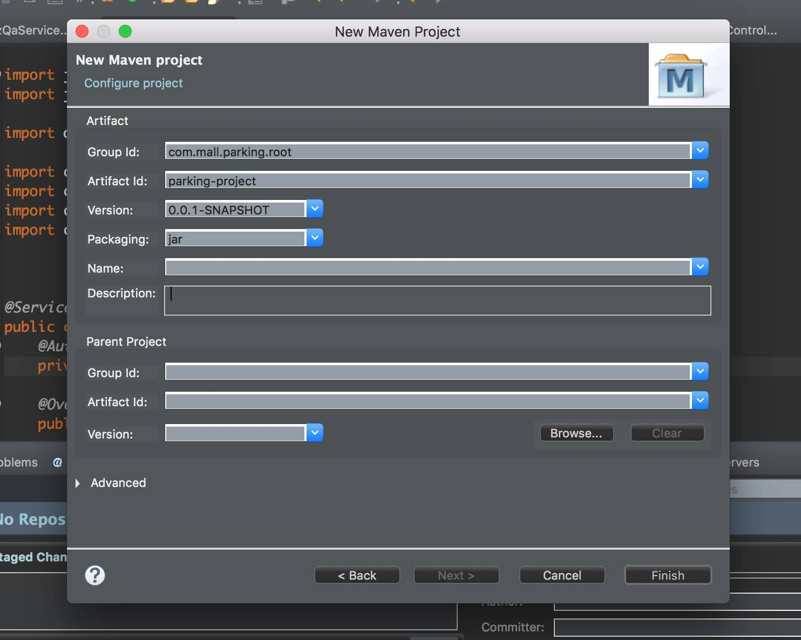
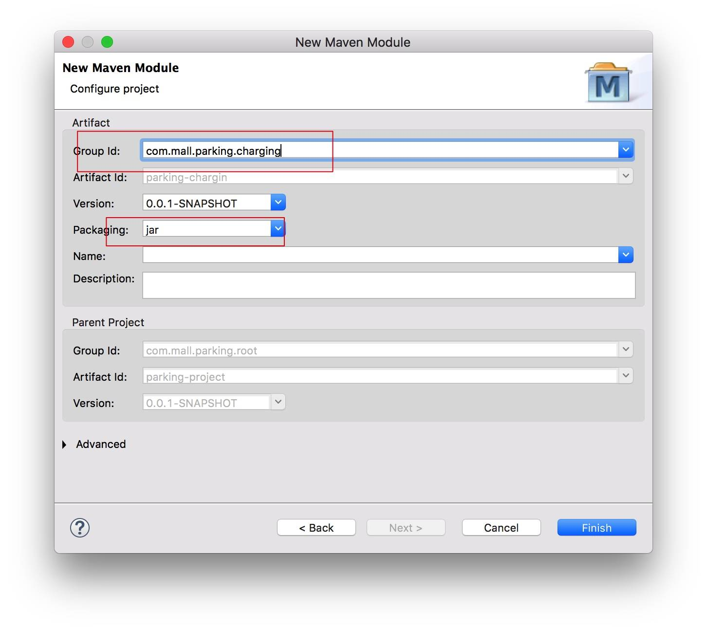
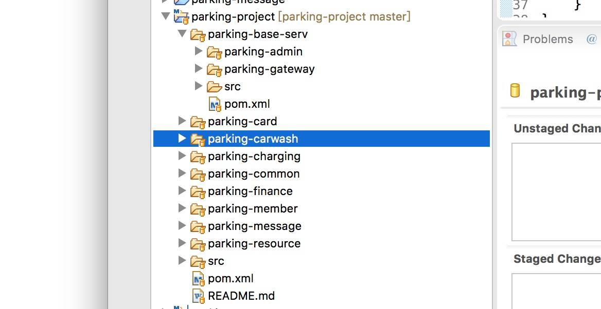
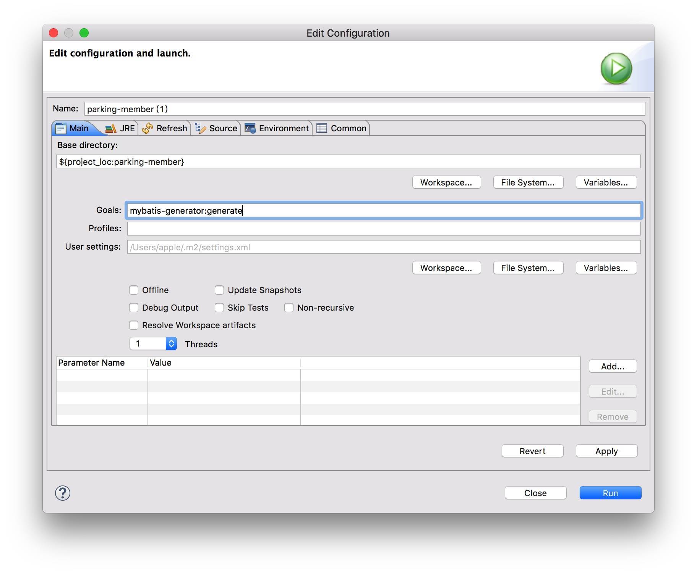
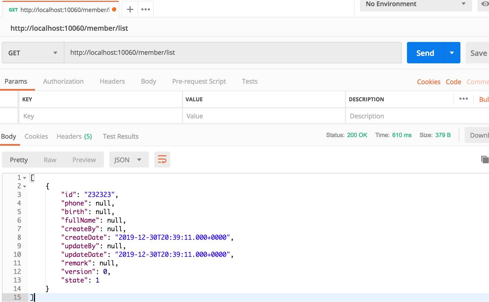

# 03 第一个 Spring Boot 子服务——会员服务

经过上两个章节的分析、设计工作，相信你已经对项目的整体结构有了更清晰的认识，剩下的工作就是依据设计，将项目骨架拉出来，往里面直充血肉。

### 搭建项目骨架

约定项目名称为 parking-project ，建立 Maven 项目，packaging 方式 为 pom，用于管理所有模块。在 parking-project 项目下依据功能模块依次建立 maven module 子项目。IDE 工具采用 Eclipse IDE Photon Release (4.8.0)。

一、以 Maven Project 形式创建父项目，用于管理子模块功能



二、在父项目下，以 Maven Module 创建子模块。



可以看到，子模块自动将 parent project 设置为 parking-project 父项目。由于是采用 Spring Boot 的方式构建子项目，此处选择 packaging 方式为 jar 。依此连续创建各种子模块即可，最终的结果如下：



简单介绍下各模块的功用：

1. parking-base-serv，pom 项目，里面包含两个子模块：parking-admin，parking-gateway。
1. parking-admin，监控子项目的运行情况。
1. parking-gateway，网关子服务，配合 JWT 实现会话、验权等功用。
1. parking-carwash，洗车子服务，连接 park-carwash 数据库。
1. parking-card，积分子服务，连接 park-card 数据库。
1. parking-charging，计费子服务，连接 parking-charging 存储库
1. parking-finance，财务子服务，连接 parking-finance 存储库。
1. parking-member，会员子服务，连接 park-member 存储库。
1. parking-resource，资源子服务，连接 park-resource 存储库。
1. parking-message，消息子服务，连接 park-message 存储库，连同 rocketmq 存储消息数据
1. parking-common，存储通用的工具类，实体包等等。

这是一种手动的方式创建项目，里面依赖的组件都需要手工添加。这里再介绍一种方式，直接采用官方的 Spring Initializr 来初始化项目，分别生成子项目后，再将他们组装成一定的项目结构。

1. 选择是 maven 项目，还是 gradle 项目。(两种不同的构建方式)
1. 项目语言，是 Java、Kotlin 还是 Groovy ，三种基于 JVM 的语言
1. Spring Boot 的版本选择
1. 项目的 groupId、artifact
1. 项目依赖 search，搜索后，直接点击后面的"+“即可依赖进去。
1. 点击下文的按钮" Generate "即可生成 zip 文件，将项目引入 eclipse / idea 即可使用。

官网地址：[https://start.spring.io/](https://start.spring.io/)

### 创建 Spring Boot 子服务

#### 引入 spring-boot-starter-parent 依赖

每个子模块都是一个 Spring Boot 项目，如果在子模块中引入，会造成大量的重复工作，而且版本不宜统一维护，容易出现多版本的混乱局面，所以 Spring Boot 的版本需要全局统一维护。

每个子项目需要构建成 jar 文件运行，子项目中已经依赖父项目的配置，每个子项目 pom.xml 文件都有这样的依赖：

```java
    <parent>
        <groupId>com.mall.parking.root</groupId>
        <artifactId>parking-project</artifactId>
        <version>0.0.1-SNAPSHOT</version>
    </parent>
```

如果按照常见的方式，再用 parent 方式引入 spring-boot-starter-parent 依赖，显然违背单个 pom 文件中只有一个 parent 标签的标准，编译就会不通过。

```java
<parent>
    <groupId>org.springframework.boot</groupId>
    <artifactId>spring-boot-starter-parent</artifactId>
    <version>2.2.2.RELEASE</version>
    <relativePath/> <!-- lookup parent from repository -->
  </parent>
```

为解决这个问题，此处采用 parking-project 父项目中以 depencyMangement 方式引入 spring-boot-starter-parent，子项目依赖 parent 父配置即可。

```java
    <dependencyManagement>
        <dependencies>
            <dependency>
                <groupId>org.springframework.boot</groupId>
                <artifactId>spring-boot-dependencies</artifactId>
                <version>${spring.boot.version}</version>
                <type>pom</type>
                <scope>import</scope>
            </dependency>
        </dependencies>
    </dependencyManagement>
```

> 有小伙伴可能会提出直接在根项目的 pom 采用 parent 的方式引入，子模块直接通过 maven 依赖就可以，这种方式在独立运行 Spring Boot 项目时没问题。后续以同样的方式引入 Spring Cloud 或 Spring Cloud Alibaba ，一个 parent 标签显然不满足这个需求，用 dependencyManagement 的方式可以规避这个问题。

#### 引入 MBG 插件

MBG 插件可以自动生成 mapper 接口、mapper xml 配置、相应实体类，主要作用在于快速开发，省去不必要的代码编写。详细介绍可参见文档：[https://mybatis.org/generator/](https://mybatis.org/generator/)

在 pom 中配置依赖 MBG 的插件：

```xml
<build>
    <finalName>parking-member-service</finalName>
    <plugins>
        <plugin>
            <groupId>org.mybatis.generator</groupId>
            <artifactId>mybatis-generator-maven-plugin</artifactId>
            <version>1.4.0</version>
            <configuration>
                <!-- mybatis 用于生成代码的配置文件 -->
                <configurationFile>src/test/resources/generatorConfig.xml</configurationFile>
                <verbose>true</verbose>
                <overwrite>true</overwrite>
            </configuration>
        </plugin>
    </plugins>
</build>
```

在 src/test/resource 目录下写入 generatorConfig.xml 文件，配置 MBG 插件 所需的基本配置项。

```xml
<generatorConfiguration>
<!-- 本地 mysql 驱动位置 -->
  <classPathEntry location="/Users/apple/.m2/repository/mysql/mysql-connector-java/5.1.42/mysql-connector-java-5.1.42.jar" />
  <context id="mysqlTables" targetRuntime="MyBatis3">
    <jdbcConnection driverClass="com.mysql.jdbc.Driver"
                        connectionURL="jdbc:mysql://localhost:3306/park-member?useUnicode=true" userId="root"
                        password="root">
                        <property name="useInformationSchema" value="true"/>
    </jdbcConnection>
    <javaTypeResolver >
      <property name="forceBigDecimals" value="false" />
    </javaTypeResolver>
<!-- 生成 model 实体类文件位置 -->
    <javaModelGenerator targetPackage="com.mall.parking.member.entity" targetProject="src/test/java">
      <property name="enableSubPackages" value="true" />
      <property name="trimStrings" value="true" />
    </javaModelGenerator>
<!-- 生成 mapper.xml 配置文件位置 -->
    <sqlMapGenerator targetPackage="mybatis.mapper"  targetProject="src/test/resources">
      <property name="enableSubPackages" value="true" />
    </sqlMapGenerator>
<!-- 生成 mapper 接口文件位置 -->
    <javaClientGenerator type="XMLMAPPER" targetPackage="com.mall.parking.member.mapper"  targetProject="src/test/java">
      <property name="enableSubPackages" value="true" />
    </javaClientGenerator>
<!-- 需要生成的实体类对应的表名，多个实体类复制多份该配置即可 -->
     <table tableName="member" domainObjectName="Member">
        <generatedKey column="tid" sqlStatement="SELECT REPLACE(UUID(), '-', '')"/>
    </table>
    <table tableName="vehicle" domainObjectName="Vehicle">
        <generatedKey column="tid" sqlStatement="SELECT REPLACE(UUID(), '-', '')"/>
    </table>
    <table tableName="month_card" domainObjectName="MonthCard">
        <generatedKey column="tid" sqlStatement="SELECT REPLACE(UUID(), '-', '')"/>
    </table>
  </context>
</generatorConfiguration>
```

配置完成后，在项目名称” parking-member “ 上右键，弹出菜单中选择" Run As " —>" Maven build… "，在 Goals 栏目中输入如下命令：

```java
mybatis-generator:generate
```



命令执行成功后，在对应的目录下找到相应的文件，而后 copy 到 src/java 对应的目录下，再将 tes t 目录下生成的文件删除。

> 注：
>
> - 1.4 版本之前的，MBG 插件生成的 xml 文件，是追加模式，而不是覆盖，容易形成重复的标签。
> - MBG 并不会生成 controller/service 层相关的代码，需要自己手动完成。

#### 引入 Lombok，简化代码

官方给出的定义：

> Project Lombok is a java library that automatically plugs into your editor and build tools, spicing up your java. Never write another getter or equals method again, with one annotation your class has a fully featured builder, Automate your logging variables, and much more.

##### lombok 安装

lombok.jar 官方下载地址：[https://projectlombok.org/download](https://projectlombok.org/download)

由于编译阶段就要使用 lombok，所以需要在 IDE 中安装 lombok 插件，才能正常编译。

1. eclipse 下安装 lombok

双击下载好的 lombok.jar，弹出选择框，选择" Specify location "，选择 eclipse 的安装目录，选中执行文件，执行 install/update 操作。安装完成后退出，可以看到 eclipse.ini 文件中多出一个配置行

> -javaagent:${eclipse-home}\\lombok.jar

1. 重启 eclipse 即可。
1. IDEA 中安装 lombok

选择" settings "，点击" plugins “选项，点击" Browse repositories "，查找" lombok "，选择筛选出来的" lombok plugin "，进行 install 操作。

安装完成后在 pom.xml 上引入对应的 jar。

##### sl4j 日志注解

如果不想每次都写

```plaintext
private  final Logger logger = LoggerFactory.getLogger(当前类名.class);
```

可以用注解@Slf4j 来打印日志。

#### 引入 MyBatis

更高效的引入 MyBatis，这里采用 starter 的方式引入，同样在根 pom.xml 文件中维护组件的版本。

```java
<dependency>
    <groupId>org.mybatis.spring.boot</groupId>
    <artifactId>mybatis-spring-boot-starter</artifactId>
</dependency>
<dependency>
    <groupId>mysql</groupId>
    <artifactId>mysql-connector-java</artifactId>
</dependency>
```

在 application.properties 配置文件中设置数据库连接，Spring Boot 2.x 版本默认采用是 HikariCP 作为 JDBC 连接池。

```sql
mybatis.type-aliases-package=com.mall.parking.member.entity
#如果需要更换 Druid 连接池，需要增加如下的配置项：
#spring.datasource.type=com.alibaba.druid.pool.DruidDataSource
#use new driver replace deprecated driver:com.mysql.jdbc.Driver.
spring.datasource.driverClassName = com.mysql.cj.jdbc.Driver
spring.datasource.url = jdbc:mysql://localhost:3306/park_member?useUnicode=true&characterEncoding=utf-8
spring.datasource.username = root
spring.datasource.password = root
```

使 mapper 接口文件能够被系统扫描，在主类中通过 @mapperScan 注解，或直接在 mapper 接口文件上加 @mapper 注解。

编写一个简单的测试方法，检验框架能否运转良好。

```java
@RestController
@RequestMapping("member")
@Slf4j
public class MemberController {
    @Autowired
    MemberService memberService;
    @RequestMapping("/list")
    public List<Member> list() {
        List<Member> members = memberService.list();
        log.debug("query member list = " + members);
        return members;
    }
}
```

MemberService 接口类

```java
List<Member> list();
```

MemberServiceImpl 实现类

```java
@Service
public class MemberServiceImpl implements MemberService {
    @Autowired
    MemberMapper memberMapper;
    @Override
    public List<Member> list() {
        MemberExample example = new MemberExample();
        List<Member> members = memberMapper.selectByExample(example);
        return members;
    }
}
```

启动项目，成功后显示成功日志：

```bash
2019-12-30 16:45:13.496  INFO 9784 --- [           main] c.mall.parking.member.MemberApplication  : Started MemberApplication in 6.52 seconds (JVM running for 7.753)
```

打开 Postman 插件，测试刚才的方法是否正常，操作如下：



#### 多环境配置

日常产品研发中必然涉及到多部署的问题，比如开发环境、测试环境、生产环境等，这就要求代码部署能够应对多环境的要求。通过人工修改的方式，不但容易出错，也会浪费人力成本，必须结合自动化构建来提高准确性。Spring Boot 提供了基于 profile 的多环境配置，可以在各微服务项目上增加多个配置文件，如

> application.properties/yml 基础公共配置 application-dev.properties/yml 开发环境配置 application-test.properties/yml 测试环境配置 application-pro.properties/yml 生产环境配置

在公共配置文件 application.properties 中，通过配置 `spring.profiles.active = dev` 来决定启用哪个配置，或在启动构建包时，增加命令来激活不同的环境配置： `java -jar parking-member.jar --spring.profiles.active=dev`

至此，第一个简单的 Spring Boot 模块搭建完成，下一步将 park-member 模块的正常业务功能编码完成即可。为便于后续课程的顺利开展，可仿照本篇的框架配置，将剩余几个子模块的基本配置完善起来，达到正常使用的目标。

### 留一个思考题

往常情况下，构建出的 war 项目运行时可以受理 HTTP 请求，Spring Boot 项目构建出的 jar 运行时为什么也可以受理 HTTP 请求呢？它是如何做到的呢？
