# 04 如何维护接口文档供外部调用——在线接口文档管理

上个章节初步将一个应用运行起来，由于服务不会单独存在，服务开发团队必然与其他服务团队进行服务调用，暴露出对外接口势在必行。早期做开发的时候，大家习惯于以 word 或 excel 的形式，但弊端显而易见，一旦接口发生变动，文档需要同步更新，遗憾的是很多接口已经更新，但文档都没有跟上，相信你也有过痛苦的经历。本文带领你认识几款接口文档管理工具，并实现本案例实践中用到的在线接口文档管理。

### 几款 API 工具介绍

我们迫切需要一个接口文档工具，能实时与系统接口保持同步，无须额外付出成本（资金成本、时间成本）最好。这里介绍几个开源的 API 工具，可以选择使用。

#### RAP2

官方地址：[http://rap2.taobao.org/](http://rap2.taobao.org/)，早期称为 RAP ，阿里妈妈 MUX 团队出品，后面项目停止维护，转移至 RAP2 项目。

> 来自官网的介绍：RAP2 是时下流行的开发接口管理工具，通常用于前后端分离的开发模式中，共同约定接口，而 RAP2 可以根据约定的接口自动生成 Mock 数据、对后端接口进行校验，拥有较好的文档编写体验，支持复杂的 Mock 逻辑，为开发提供了便利。 RAP2 是参照 [RAP1](https://github.com/thx/RAP) 第一代的基础上，使用 Node + React 重构了所有主要功能。

可以在线使用，也可以本地部署使用，本地部署有详细的步骤介绍，从部署手册来看，产品还是比较重的，环境依赖也比较多。部署后，同样存在要花时间保持与代码同步的问题，针对提供比较稳定接口的项目而言，是个不错的选择。

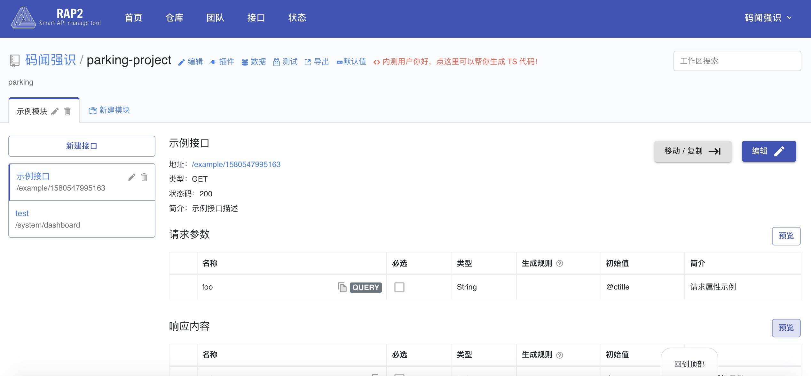

#### APIDOC

官方地址：[https://apidocjs.com/](https://apidocjs.com/)，通过代码中的相当格式的注释来生成 API 接口文档，依赖 Node.js 环境。使用比较简单，弊端：接口发生变动时，需要花时间来同步文档。针对比较稳定的接口系统而言，可以做个备选。

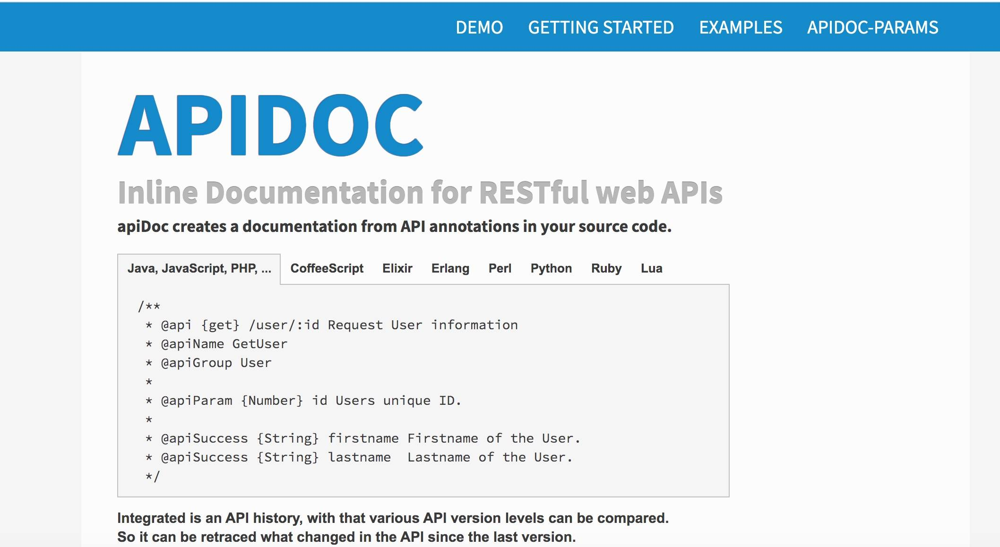

#### Spring REST Docs

Spring 全家桶中很多 API 文档，都是基于此组件生成，据官方提供的使用方法需要编写相应的代码片断，还有相应的语法规范，再通过项目构建的方式生成离线文档。操作起来比较繁琐，这里不推荐使用。生成的文档形如下面截图中所示：

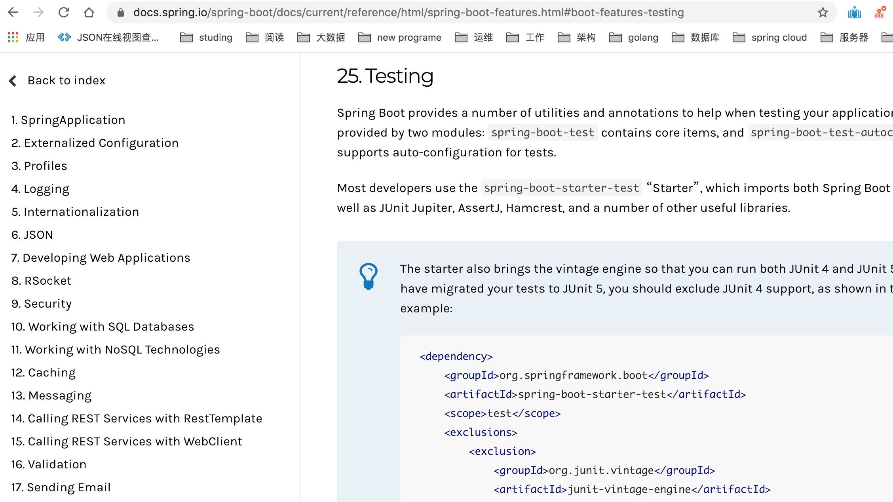

#### Swagger

官网地址：[https://swagger.io](https://swagger.io/) ， 是一款 RESTFU L 接口的文档在线自动生成+功能测试功能软件，是一个规范和完整的框架，标准的，语言无关，用于生成、描述、调用和可视化 RESTful 风格的 Web 服务。总体目标是使客户端和文件系统作为服务器以同样的速度来更新。文件的方法，参数和模型紧密集成到服务器端的代码，允许 API 来始终保持同步。Swagger 让部署管理和使用功能强大的 API 从未如此简单。

本实战案例中采用 Swagger 来进行的 API 的管理。

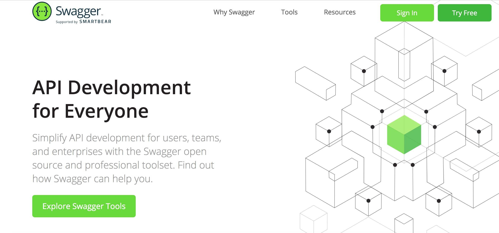

### Spring Boot 整合 Swagger2

#### 1、引入依赖

加入 Swagger 相关的 jar 依赖，由于各个子模块都有用到，这里将 Swagger 在根 pom.xml 中进行统一的版本管理

```
<properties>

        <swagger.version>2.8.0</swagger.version>

</properties>

<!--swagger2 -->

<dependency>

        <groupId>io.springfox</groupId>

        <artifactId>springfox-swagger2</artifactId>

        <version>${swagger.version}</version>

</dependency>

<dependency>

        <groupId>io.springfox</groupId>

        <artifactId>springfox-swagger-ui</artifactId>

        <version>${swagger.version}</version>

</dependency>


```

子模块中无须配置 version，直接引入即可，如果需要变更 version，直接在根 pom.xml 中修改，所有依赖子模块的版本也会一同发生变更。

```
<!--swagger2 -->

<dependency>

        <groupId>io.springfox</groupId>

        <artifactId>springfox-swagger2</artifactId>

</dependency>

<dependency>

        <groupId>io.springfox</groupId>

        <artifactId>springfox-swagger-ui</artifactId>

</dependency>


```

#### 2、Swagger2 配置

建立 config 包，新增 Swagger 配置类。通过 @EnableSwagger2 注解启用 Swagger2 ，然后配置一个 Docket Bean ，配置映射路径和要扫描的接口的位置，在 apiInfo 中，主要配置一下 Swagger2 文档网站的信息，例如网站的 title ，网站的描述，联系人的信息，使用的协议、接口的版本等等。

```java
@EnableSwagger2

@Configuration

public class Swagger2Config {


    @Bean

    public Docket createRestApi() {

        return new Docket(DocumentationType.SWAGGER_2).apiInfo(apiInfo()).select()

                .apis(RequestHandlerSelectors.any()).paths(PathSelectors.any()).build();

    }


    private ApiInfo apiInfo() {

        return new ApiInfoBuilder()

                .title("Member 会员模块接口层（基于 SpringBoot2+Swagger2）.")

                .contact(new Contact("growithus", "https://backkoms.github.io/", "[email protected]"))

                .version("1.0")

                .description("").build();

    }

}


```

由于采用的是较高版本，相应的 Controller 类中无须再编写 Swagger 相应的代码注解，代码侵入性进一步降低。旧版本相关的注解，如 @Api、@ApiOperation、@ApiImplicitParams、@ApiImplicitParam、@ApiModel 等，如果是旧版本，必须要在相关代码中增加以上相应的注解，对代码有一定侵入性。

经过以上两个步骤，Swagger2 就算配置成功了，非常简捷。启动项目，输入 <http://localhost:10060/swagger-ui.html%EF%BC%8C%E8%83%BD%E5%A4%9F%E7%9C%8B%E5%88%B0%E5%A6%82%E4%B8%8B> UI，说明已经配置成功了。

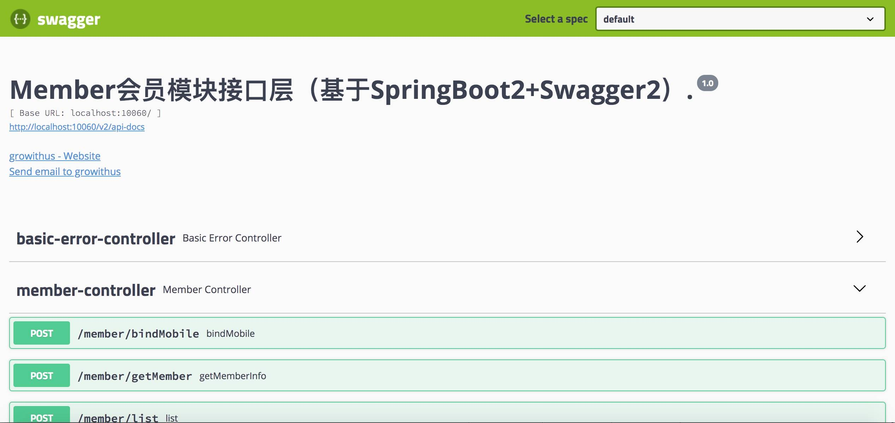

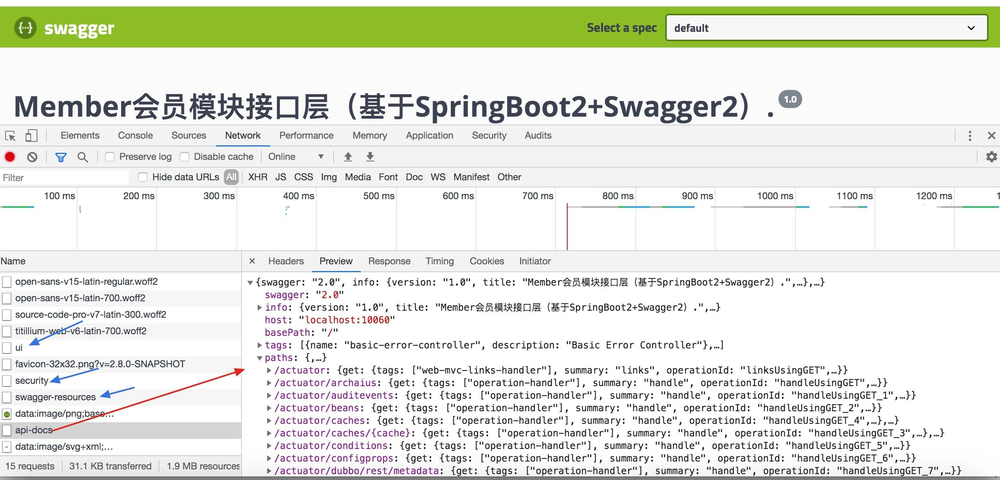

#### 3、API 验证测试

编写测试类，启动项目

```java
@RestController

@RequestMapping("test")

public class APITestController {


    @PostMapping("/hello")//只支持 POST 请求

  //@RequestMapping(name = "hello", method = { RequestMethod.POST })//同样只支持 POST 请求

    public String hello(String name) {

        return "hello " + name;

    }


}


```

> Request 方法有 8 种请求类型：POST \\ GET \\ OPTIONS \\ HEAD \\ PUT \\ DELETE \\ TRACE \\ PATCH，为确保不必要的请求造成的潜在威胁，案例建议中直接采用 POST 方式一种，禁用其它请求方式。 @PostMapping("/hello") 功能等同于 @RequestMapping(name = "hello", method = { RequestMethod.POST })

1、直接使用 Shell 脚本进行请求测试：

> appledeMacBook-Air:~ apple$ curl -X POST "[http://localhost:10060/test?name=world](http://localhost:10060/test?name=world)" hello world

可以看到正常输出结果，再测试一下其它请求方式能否正常请求数据：

> appledeMacBook-Air:~ apple$ curl -X GET "[http://localhost:10060/test?name=world](http://localhost:10060/test?name=world)" {"timestamp":"2020-02-01T12:59:09.508+0000","status":405,"error":"Method Not Allowed","message":"Request method 'GET' not supported","path":"/test"}

响应输出方法不支持，只支持 POST 方式请求。

2、未使用 Swagger 时，可以采用 Postman 测试工具进行接口调试。

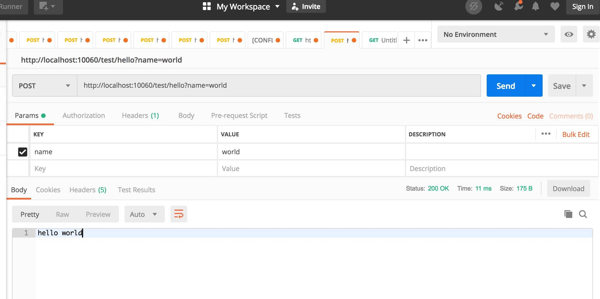

3、现在已经集成了 Swagger 功能，打开[http://localhost:10060/swagger-ui.html](http://localhost:10060/swagger-ui.html)，找到 api-test-controller 下对应的方法，点击" try it out "，输入参数，执行" Execute "功能。查看正常输出结果：

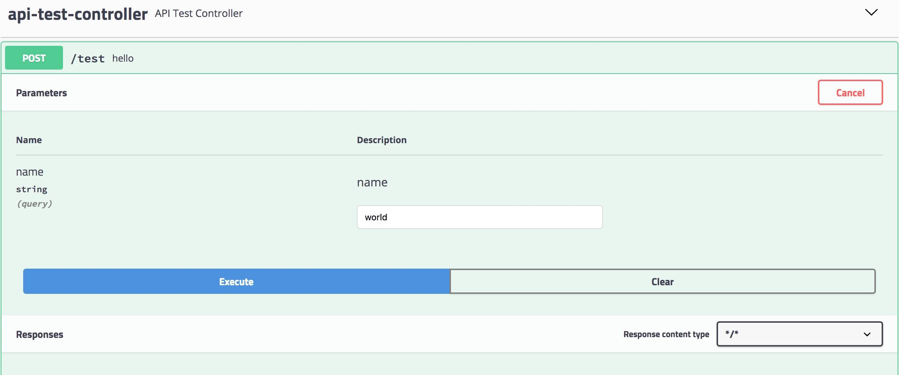

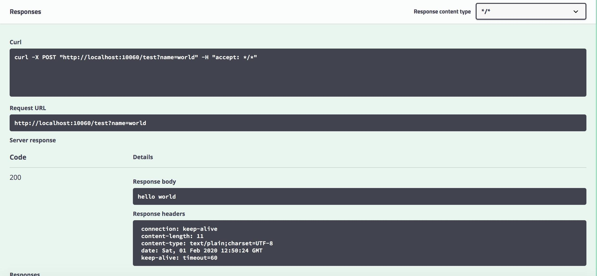

使用 Swagger 即可在直接在线感知接口变更，还能在 UI 上直接进行接口测试，不再依赖第三方组件。

如果参数中存在必输项，又当如何设置呢？此时，必须采用代码注解侵入的方式 @ApiImplicitParam

```java
@ApiImplicitParam(required = true, name = "name", dataType = "String", value = "名字", defaultValue = "world",paramType="query")

/*name：参数名

        value：参数的汉字说明、解释

        required：参数是否必须传

        paramType：参数放在哪个地方

            · header --> 请求参数的获取：@RequestHeader

            · query --> 请求参数的获取：@RequestParam

            · path（用于 restful 接口）--> 请求参数的获取：@PathVariable

            · body（不常用）

            · form（不常用）    

        dataType：参数类型，默认 String，其它值 dataType="Integer"       

        defaultValue：参数的默认值 

*/


```

常用的注解还如下几个，与旧版本的注解略有不同。

```java
@Api                     //用在类上，说明该类的作用

@ApiOperation            //用在方法上，增加方法说明

@ApiImplicitParams       //用在方法上，包含一组参数说明

@ApiImplicitParam        //用在 ApiImplicitParams 中，给方法入参增加说明

@ApiResponses            //用于表示一组响应

@ApiResponse             //用在@ApiResponses 中，用来表达一个错误的信息。【code：错误,message：信息,response:抛出异常类】

@ApiModel                //用在实体类上，描述一个 model 的信息

@ApiModelProperty        //用在实体类的参数上，描述一个参数的信息


```

加入以上注解后，测试类演变如下：

```java
@RestController

@RequestMapping("test")

@Api("测试类")

public class APITestController {


    @ApiOperation("问候")

    @PostMapping("/hello")

    @ApiImplicitParam(required = true, name = "name", dataType = "String", value = "名字", defaultValue = "world", paramType = "query")

    public Hello hello(String name) {

        Hello hello = new Hello();

        hello.setName(name);

        return hello;

    }


}


@ApiModel

class Hello {


    @ApiModelProperty("姓名")

    private String name;


    @ApiModelProperty("年龄")

    private int age = 10;


    public String getName() {

        return name;

    }


    public void setName(String name) {

        this.name = name;

    }


    public int getAge() {

        return age;

    }


    public void setAge(int age) {

        this.age = age;

    }

}


```

重新打开[http://localhost:10060/swagger-ui.html](http://localhost:10060/swagger-ui.html)地址，发现参数已变成必输项，并且有默认值，输出响应值为 Hello 值对象的 JSON 数据格式。

#### 4、生产环境屏蔽

使用 Swagger 大大提高接口的开发测试效率，如果不加以限制，暴露在生产环境中，那就是一个潜在的安全风险，所以在开发、测试环节正常使用，但要在生产环境中屏蔽 Swagger 的功能。上一篇中提及到多环境配置的问题，这里可以利用它来做文章。

实现方式很简单，在 Swagger 配置类增加注解 `@Profile({ "dev", "test" })` ，标记只有在 dev 或 test 环境下才能正常使用 swagger 的接口调试功能，在生产环境下这个类是不会加载的，也就达到了生产环境下屏蔽的目标。启动后测试发现，swagger-ui.html 页面已不能正常加载接口进行测试。

```java
@EnableSwagger2

@Configuration

@Profile({ "dev", "test" })

public class Swagger2Config {

}


```

注意：任何 @Componen t 或 @Configuration 注解的类都可以使用 @Profile 注解。

#### 5、增加 token 统一参数

不少内部服务是需要用户登陆后才能正常使用的，比如用户签到领取积分，必须登陆后才正常使用，如果在每个接口中增加 token 参数，重复度太高，设计也不够优雅，一般情况下将 token 放到请求头中较为合适， Swagger 页面中如何显性增加输入 token 的位置就变成了我们的目标。

在 Swagger 配置类修改配置，完成后如下：

```java
@EnableSwagger2

@Configuration

@Profile({ "dev", "test" })

public class Swagger2Config {


    @Bean

    public Docket createRestApi() {

        ParameterBuilder parameterBuilder = new ParameterBuilder();

        List<Parameter> parameters = new ArrayList<>();

        parameterBuilder.modelRef(new ModelRef("String")).name("token").parameterType("header").description("token").defaultValue("").

        //考虑到有些请求是不需要 token 的，此处不能置必填

        required(false).build();

        parameters.add(parameterBuilder.build());


        return new Docket(DocumentationType.SWAGGER_2).apiInfo(apiInfo()).select()

                .apis(RequestHandlerSelectors.any()).paths(PathSelectors.any()).build().globalOperationParameters(parameters).securitySchemes(getSecuritySchemes());

    }


    private ApiInfo apiInfo() {

        return new ApiInfoBuilder()

                .title("Member 会员模块接口层（基于 SpringBoot2+Swagger2）.")

                .contact(new Contact("growithus", "https://backkoms.github.io/", "[email protected]"))

                .version("1.0")

                .description("").build();

    }


    private List<ApiKey> getSecuritySchemes() {

        List<ApiKey> keys = new ArrayList<>();

        ApiKey key  = new ApiKey("token", "token", "header");

        keys.add(key);

        return keys;

    }

}


```

启动项目后，打开 swagger-ui.html 页面，会发现多出一个 Authorize 的按钮，打开后输入有效 token 就实现登陆，其它接口直接使用即可，无须多次再输入 token （此时并未实现 token 验证，后续可通过 AOP 编程来验证 token 的有效性）。

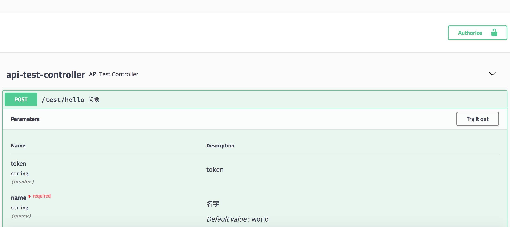

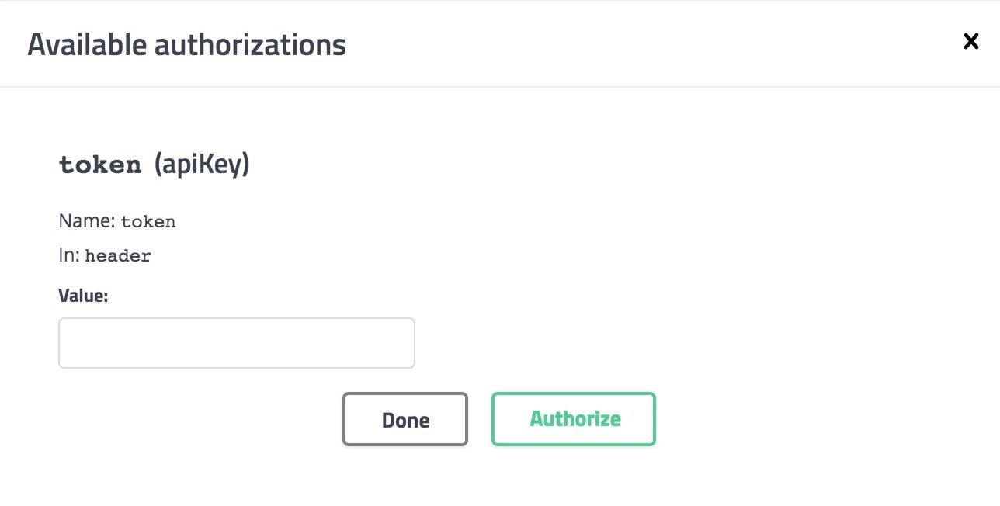

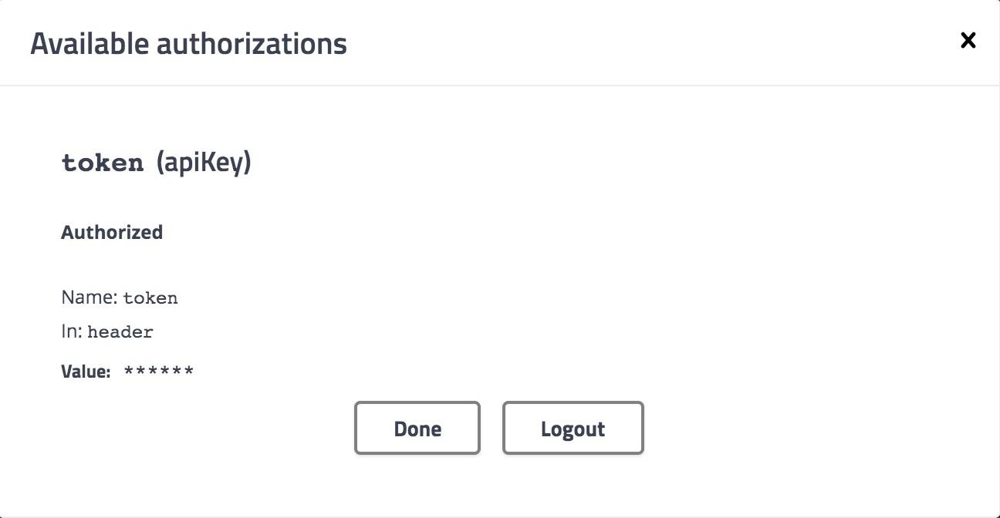

到此，Swagger 已经可以正常应用在项目中，后续直接 Copy 本示例的配置即可复用。

### 留下个思考题

每个子服务模块都会对外暴露接口，如果调用服务很多，将不得不面对接口页面来回切换的繁琐，有没有什么办法简化一下呢？
