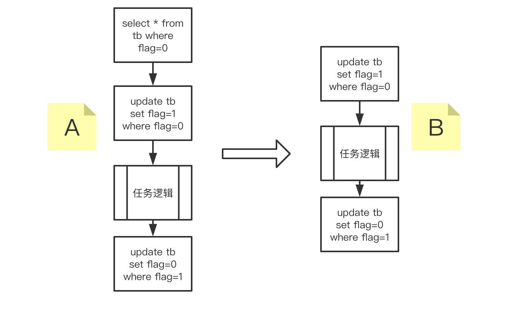

# 11 多实例下的定时任务如何避免重复执行——分布式定时任务

前面的章节，用户通过绑定手机号的注册为会员，并可以补充完个人信息，比如姓名、生日等信息，拿到用户的生日信息之后，就可以通过会员生日信息进行营销，此处就涉及到定时任务执行营销信息推送的问题。本篇就带你走入微服务下的定时任务的构建问题。

### 定时任务选型

常见的定时任务的解决方案有以下几种：


右半部分基于 Java 或 Spring 框架即可支持定时任务的开发运行，左侧部分需要引入第三方框架支持。针对不同方案，作个简单介绍

- XXL-JOB 是一个分布式任务调度平台，其核心设计目标是开发迅速、学习简单、轻量级、易扩展。任务调度与任务执行分离，功能很丰富，在多家公司商业产品中已有应用。官方地址：[https://www.xuxueli.com/xxl-job/](https://www.xuxueli.com/xxl-job/)
- Elastic-Job 是一个分布式调度解决方案，由两个相互独立的子项目 Elastic-Job-Lite 和 Elastic-Job-Cloud 组成。Elastic-Job-Lite 定位为轻量级无中心化解决方案，依赖 Zookeeper ，使用 jar 包的形式提供分布式任务的协调服务，之前是当当网 Java 应用框架 ddframe 框架中的一部分，后分离出来独立发展。
- Quartz 算是定时任务领域的老牌框架了，出自 OpenSymphony 开源组织，完全由 Java 编写，提供内存作业存储和数据库作业存储两种方式。在分布式任务调度时，数据库作业存储在服务器关闭或重启时，任务信息都不会丢失，在集群环境有很好的可用性。
- 淘宝出品的 TBSchedule 是一个简洁的分布式任务调度引擎，基于 Zookeeper 纯 Java 实现，调度与执行同样是分离的，调度端可以控制、监控任务执行状态，可以让任务能够被动态的分配到多个主机的 JVM 中的不同线程组中并行执行，保证任务能够不重复、不遗漏的执行。
- Timer 和 TimerTask 是 Java 基础组件库的两个类，简单的任务尚可应用，但涉及到的复杂任务时，建议选择其它方案。
- ScheduledExecutorService 在 ExecutorService 提供的功能之上再增加了延迟和定期执行任务的功能。虽然有定时执行的功能，但往往大家不选择它作为定时任务的选型方案。
- @EnableScheduling 以注解的形式开启定时任务，依赖 Spring 框架，使用简单，无须 xml 配置。特别是使用 Spring Boot 框架时，更加方便。

引入第三方分布式框架会增加项目复杂度，Timer、TimerTask 比较简单无法符合复杂的分布式定时任务，本次选择基于 注解的 @EnableScheduling 来开启我们的定时任务之旅。

### 建立定时任务项目

在 parking-project 父项目中新增基于 Spring Boot 的定时任务项目，命名为 parking-schedule-job，将基本的项目配置完毕，如端口、项目名称等等。

新增项目启动类

```java
@SpringBootApplication
@EnableScheduling
public class ParkingScheduleJobApplication {
    public static void main(String[] args) {
        SpringApplication.run(ParkingScheduleJobApplication.class, args);
    }
}
```

新增任务执行类

```java
@Component
@Slf4j
public class UserBirthdayBasedPushTask {
  //每隔 5s 输出一次日志
    @Scheduled(cron = " 0/5 * * * * ?")
    public void scheduledTask() {
        log.info("Task running at = "  + LocalDateTime.now());
    }
}
```

一个简单的定时任务项目就此完成，启动项目，日志每隔 5s 输出一次。单实例执行没有问题，但仔细想想似乎不符合我们的预期：微服务架构环境下，进行横向扩展部署多实例时，每隔 5s 每个实例都会执行一次，重复执行会导致数据的混乱或糟糕的用户体验，比如本次基于会员生日推送营销短信时，用户会被短信轰炸，这肯定不是我们想看到的。即使部署了多代码实例，任务在同一时刻应当也只有任务执行才是符合正常逻辑的，而不能因为实例的增多，导致执行次数增多。

### 分布式定时任务

保证任务在同一时刻只有执行，就需要每个实例执行前拿到一个令牌，谁拥有令牌谁有执行任务，其它没有令牌的不能执行任务，通过数据库记录就可以达到这个目的。



有小伙伴给出的是 A 方案，但有一个漏洞：当 select 指定记录后，再去 update 时，存在时间间隙，会导致多个实例同时执行任务，建议采用直接 update 的方案 B 更为可靠， update 更新到记录时会返回 1 ，否则是 0 。

这种方案还需要编写数据更新操作方法，如果这些代码都不想写，有没有什么好办法？当然有，总会有"懒"程序员帮你省事，介绍一个组件 [ShedLock](https://github.com/lukas-krecan/ShedLock)，可以使我们的定时任务在同一时刻，最多执行一次。

1、引入 ShedLock 相关的 jar ，这里依旧采用 MySQL 数据库的形式：

```xml
<dependency>
       <groupId>net.javacrumbs.shedlock</groupId>
       <artifactId>shedlock-core</artifactId>
       <version>4.5.0</version>
</dependency>
<dependency>
        <groupId>net.javacrumbs.shedlock</groupId>
        <artifactId>shedlock-spring</artifactId>
        <version>4.5.0</version>
</dependency>
<dependency>
        <groupId>net.javacrumbs.shedlock</groupId>
        <artifactId>shedlock-provider-jdbc-template</artifactId>
        <version>4.5.0</version>
</dependency>
```

2、变更项目启动类，增加 @EnableSchedulerLock 注解，打开 ShedLock 获取锁的支持。

```java
@SpringBootApplication
@EnableScheduling
@EnableSchedulerLock(defaultLockAtMostFor = "30s")
public class ParkingScheduleJobApplication {
    public static void main(String[] args) {
        SpringApplication.run(ParkingScheduleJobApplication.class, args);
    }
    @Bean
  //基于 Jdbc 的方式提供的锁机制
    public LockProvider lockProvider(DataSource dataSource) {
        return new JdbcTemplateLockProvider(dataSource);
    }
}
```

3、任务执行类的方法上，同样增加 @SchedulerLock 注解，并声明定时任务锁的名称，如果有多个定时任务，要确保名称的唯一性。

4、新增名为 shedlock 的数据库，并新建 shedlock 数据表，表结构如下：

```sql
CREATE TABLE shedlock(
      `NAME` varchar(64) NOT NULL DEFAULT '' COMMENT '任务名',
      `lock_until` timestamp(3) NULL DEFAULT NULL COMMENT '释放时间',
      `locked_at` timestamp(3) NULL DEFAULT NULL COMMENT '锁定时间',
      `locked_by` varchar(255) DEFAULT NULL COMMENT '锁定实例',
    PRIMARY KEY (name)
)
```

5、修改 application.properties 中数据库连接

```properties
spring.datasource.driverClassName = com.mysql.cj.jdbc.Driver
spring.datasource.url = jdbc:mysql://localhost:3306/shedlock?useUnicode=true&characterEncoding=utf-8
spring.datasource.username = root
spring.datasource.password = root
```

6、完成以上步骤，基本配置已经完成，来测试一下，在多实例运行时，同一时刻是否只有一个实施在执行任务。

```
//实例 1 的日志输出
2020-03-07 21:20:45.007  INFO 67479 --- [   scheduling-1] c.m.p.s.j.t.UserBirthdayBasedPushTask    : Task running at = 2020-03-07T21:20:45.007
2020-03-07 21:20:50.011  INFO 67479 --- [   scheduling-1] c.m.p.s.j.t.UserBirthdayBasedPushTask    : Task running at = 2020-03-07T21:20:50.011
2020-03-07 21:21:15.009  INFO 67479 --- [   scheduling-1] c.m.p.s.j.t.UserBirthdayBasedPushTask    : Task running at = 2020-03-07T21:21:15.009
2020-03-07 21:21:30.014  INFO 67479 --- [   scheduling-1] c.m.p.s.j.t.UserBirthdayBasedPushTask    : Task running at = 2020-03-07T21:21:30.014
2020-03-07 21:21:40.008  INFO 67479 --- [   scheduling-1] c.m.p.s.j.t.UserBirthdayBasedPushTask    : Task running at = 2020-03-07T21:21:40.008
//实例 2 的日志输出
2020-03-07 21:21:20.011  INFO 67476 --- [   scheduling-1] c.m.p.s.j.t.UserBirthdayBasedPushTask    : Task running at = 2020-03-07T21:21:20.011
2020-03-07 21:21:25.008  INFO 67476 --- [   scheduling-1] c.m.p.s.j.t.UserBirthdayBasedPushTask    : Task running at = 2020-03-07T21:21:25.008
2020-03-07 21:21:30.006  INFO 67476 --- [   scheduling-1] c.m.p.s.j.t.UserBirthdayBasedPushTask    : Task running at = 2020-03-07T21:21:30.006
2020-03-07 21:21:35.006  INFO 67476 --- [   scheduling-1] c.m.p.s.j.t.UserBirthdayBasedPushTask    : Task running at = 2020-03-07T21:21:35.006
2020-03-07 21:21:45.008  INFO 67476 --- [   scheduling-1] c.m.p.s.j.t.UserBirthdayBasedPushTask    : Task running at = 2020-03-07T21:21:45.008
```

可以看出每 5s 执行一次，是分布在两个实例中，同一时刻只有一个任务在执行，这与我们的预期是一致。数据库表记录(有两个定时任务的情况下)：


### 定时发送营销短信

初步框架构建完成，现在填充据会员生日信息推送营销短信的功能。

> 有小伙伴一听说定时任务，一定要找服务压力小的时间段来处理，索性放到凌晨。但凌晨让用户收到营销短信，真的好吗？所以还是要考虑产品的用户体验，不能盲目定时。

前面服务调用章节我们已经学会了服务间的调用 ，这次是定时任务项目要调用会员服务里的方法，依旧采用 Feign 的方式进行。编写 MemberServiceClient 接口，与会员服务中的会员请求响应类保持一致

```java
@FeignClient(value = "member-service", fallback = MemberServiceFallback.class)
public interface MemberServiceClient {
    @RequestMapping(value = "/member/list", method = RequestMethod.POST)
    public CommonResult<List<Member>> list() throws BusinessException;
    @RequestMapping(value = "/member/getMember", method = RequestMethod.POST)
    public CommonResult<Member> getMemberInfo(@RequestParam(value = "memberId") String memberId);
}
```

任务执行类编写业务逻辑，这里用到了 Member 实体，但这个实体是维护在会员服务中的，未对外公开。`*对于一些公用类，可以抽取到一个公共项目中，供各项目间相互引用，而不是维护多份。*`

```java
@Component
@Slf4j
public class UserBirthdayBasedPushTask {
    @Autowired
    MemberServiceClient memberService;
    @Scheduled(cron = " 0/5 * * * * ?")
    @SchedulerLock(name = "scheduledTaskName")
    public void scheduledTask() {
        CommonResult<List<Member>> members;
        try {
            members = memberService.list();
            List<Member> resp = members.getRespData();
            DateTimeFormatter df = DateTimeFormatter.ofPattern("yyyy-MM-dd HH:mm:ss");
            LocalDateTime time = LocalDateTime.now();
            String curTime = df.format(time);
            for (Member one : resp) {
        //当天生日的推送营销短信
                if (curTime.equals(one.getBirth())) {
                    log.info(" send sms to  " + one.getPhone() );
                }
            }
        } catch (BusinessException e) {
            log.error("catch exception " + e.getMessage());
        }
        log.info("Task running at = "  + LocalDateTime.now());
    }
}
```

启动会员服务、定时任务两个项目，测试业务逻辑的是否运行正常。定时任务执行时，发现出现异常：

```shell
Caused by: org.springframework.http.converter.HttpMessageNotReadableException: JSON parse error: Cannot deserialize instance of `com.mall.parking.common.bean.CommonResult` out of START_ARRAY token; nested exception is com.fasterxml.jackson.databind.exc.MismatchedInputException: Cannot deserialize instance of `com.mall.parking.common.bean.CommonResult` out of START_ARRAY token at [Source: (PushbackInputStream); line: 1, column: 1]
```

定位原因： CommonResult 对象中含有 Member List 对象集合，JSON 对象解析时的结构应该为 `{}`，但返回值是`[]`，肯定会解析异常。需要将 Feign 接口变更为原始的 JSON 字符串形式。

```java
//MemberServiceClient 接口方法变更为此
@RequestMapping(value = "/member/list", method = RequestMethod.POST)
public String list() throws BusinessException;
```

任务执行类变更操作方式，如下

```java
    @Scheduled(cron = " 0/5 * * * * ?")
    @SchedulerLock(name = "scheduledTaskName")
    public void scheduledTask() {
        try {
            String members = memberService.list();
            List<Member> array  = JSONArray.parseArray(members, Member.class);
            DateTimeFormatter df = DateTimeFormatter.ofPattern("yyyy-MM-dd HH:mm:ss");
            LocalDateTime time = LocalDateTime.now();
            String curTime = df.format(time);
            for (Member one : array) {
                if (curTime.equals(one.getBirth())) {
                    log.info(" send sms to  " + one.getPhone() );
                }
            }
        } catch (BusinessException e) {
            log.error("catch exception " + e.getMessage());
        }
        log.info("Task running at = "  + LocalDateTime.now());
    }
```

再重新启动两个项目，测试任务已经可以正常执行。如果你的项目中还需要更多的定时任务的话，参照这种方式编写相应代码即可。

本章节从定时任务入手，谈了几个定时任务的解决方案，接着引入分布式定时任务来完成我们的短信营销任务，完整的实施一次分布式定时任务。给你留下个动手题目吧：如果使用 elastic-job 组件，又当如何实现这个分布式定时任务呢？
