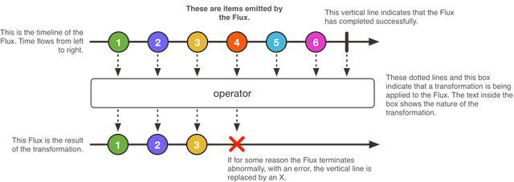
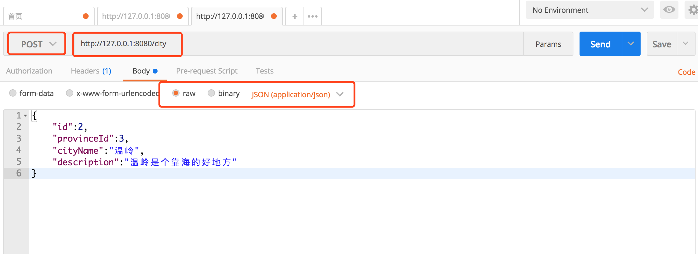
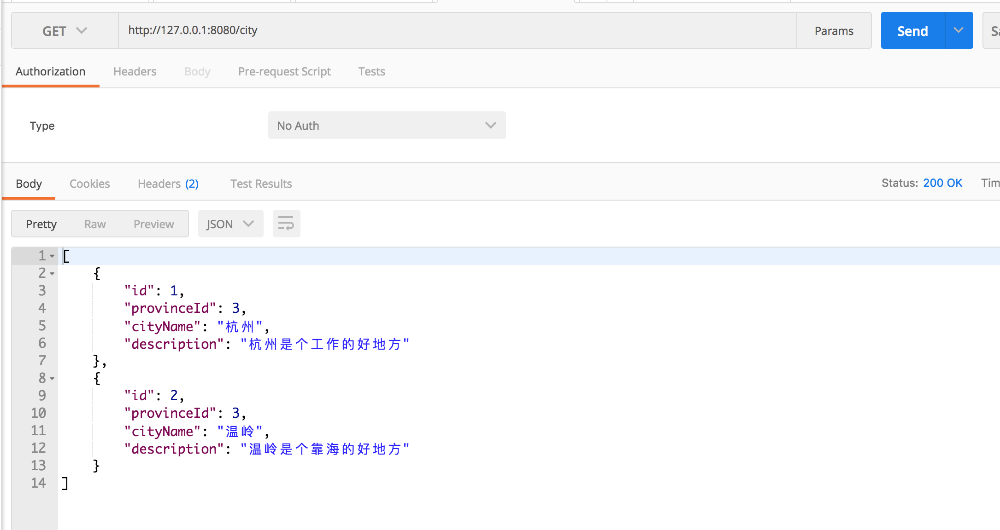

03 WebFlux Web CRUD 实践
======================

上一篇基于功能性端点去创建一个简单服务，实现了 Hello。这一篇用 Spring Boot WebFlux 的注解控制层技术创建一个 CRUD WebFlux 应用，让开发更方便。这里我们不对数据库储存进行访问，因为后续会讲到，而且这里主要是讲一个完整的 WebFlux CRUD。

### 结构

这个工程会对城市（City）进行管理实现 CRUD 操作。该工程创建编写后，得到下面的结构，其目录结构如下：

```
├── pom.xml

├── src

│&nbsp;&nbsp; └── main

│&nbsp;&nbsp;     ├── java

│&nbsp;&nbsp;     │&nbsp;&nbsp; └── org

│&nbsp;&nbsp;     │&nbsp;&nbsp;     └── spring

│&nbsp;&nbsp;     │&nbsp;&nbsp;         └── springboot

│&nbsp;&nbsp;     │&nbsp;&nbsp;             ├── Application.java

│&nbsp;&nbsp;     │&nbsp;&nbsp;             ├── dao

│&nbsp;&nbsp;     │&nbsp;&nbsp;             │&nbsp;&nbsp; └── CityRepository.java

│&nbsp;&nbsp;     │&nbsp;&nbsp;             ├── domain

│&nbsp;&nbsp;     │&nbsp;&nbsp;             │&nbsp;&nbsp; └── City.java

│&nbsp;&nbsp;     │&nbsp;&nbsp;             ├── handler

│&nbsp;&nbsp;     │&nbsp;&nbsp;             │&nbsp;&nbsp; └── CityHandler.java

│&nbsp;&nbsp;     │&nbsp;&nbsp;             └── webflux

│&nbsp;&nbsp;     │&nbsp;&nbsp;                 └── controller

│&nbsp;&nbsp;     │&nbsp;&nbsp;                     └── CityWebFluxController.java

│&nbsp;&nbsp;     └── resources

│&nbsp;&nbsp;         └── application.properties

└── target


```

如目录结构，我们需要编写的内容按顺序有：

* 对象
* 数据访问层类 Repository
* 处理器类 Handler
* 控制器类 Controller

### 对象

新建包 org.spring.springboot.domain，作为编写城市实体对象类。新建城市（City）对象 City，代码如下：

```
/**

 * 城市实体类

 *

 */

public class City {


    /**

     * 城市编号

     */

    private Long id;


    /**

     * 省份编号

     */

    private Long provinceId;


    /**

     * 城市名称

     */

    private String cityName;


    /**

     * 描述

     */

    private String description;


    public Long getId() {

        return id;

    }


    public void setId(Long id) {

        this.id = id;

    }


    public Long getProvinceId() {

        return provinceId;

    }


    public void setProvinceId(Long provinceId) {

        this.provinceId = provinceId;

    }


    public String getCityName() {

        return cityName;

    }


    public void setCityName(String cityName) {

        this.cityName = cityName;

    }


    public String getDescription() {

        return description;

    }


    public void setDescription(String description) {

        this.description = description;

    }

}


```

城市包含了城市编号、省份编号、城市名称和描述。具体开发中，会使用 Lombok 工具来消除冗长的 Java 代码，尤其是 POJO 的 getter / setter 方法，[具体查看 Lombok 官网地址](https://projectlombok.org)。

### 数据访问层 CityRepository

新建包 org.spring.springboot.dao，作为编写城市数据访问层类 Repository。新建 CityRepository，代码如下：

```
import org.spring.springboot.domain.City;

import org.springframework.stereotype.Repository;


import java.util.Collection;

import java.util.concurrent.ConcurrentHashMap;

import java.util.concurrent.ConcurrentMap;

import java.util.concurrent.atomic.AtomicLong;


@Repository

public class CityRepository {


    private ConcurrentMap<Long, City> repository = new ConcurrentHashMap<>();


    private static final AtomicLong idGenerator = new AtomicLong(0);


    public Long save(City city) {

        Long id = idGenerator.incrementAndGet();

        city.setId(id);

        repository.put(id, city);

        return id;

    }


    public Collection<City> findAll() {

        return repository.values();

    }


    public City findCityById(Long id) {

        return repository.get(id);

    }


    public Long updateCity(City city) {

        repository.put(city.getId(), city);

        return city.getId();

    }


    public Long deleteCity(Long id) {

        repository.remove(id);

        return id;

    }

}


```

@Repository 用于标注数据访问组件，即 DAO 组件。实现代码中使用名为 repository 的 Map 对象作为内存数据存储，并对对象具体实现了具体业务逻辑。CityRepository 负责将 Book 持久层（数据操作）相关的封装组织，完成新增、查询、删除等操作。

这里不会涉及到数据存储这块，具体数据存储会在后续介绍。

### 处理器类 Handler

新建包 org.spring.springboot.handler，作为编写城市处理器类 CityHandler。新建 CityHandler，代码如下：

```
import org.spring.springboot.dao.CityRepository;

import org.spring.springboot.domain.City;

import org.springframework.beans.factory.annotation.Autowired;

import org.springframework.stereotype.Component;

import reactor.core.publisher.Flux;

import reactor.core.publisher.Mono;


@Component

public class CityHandler {


    private final CityRepository cityRepository;


    @Autowired

    public CityHandler(CityRepository cityRepository) {

        this.cityRepository = cityRepository;

    }


    public Mono<Long> save(City city) {

        return Mono.create(cityMonoSink -> cityMonoSink.success(cityRepository.save(city)));

    }


    public Mono<City> findCityById(Long id) {

        return Mono.justOrEmpty(cityRepository.findCityById(id));

    }


    public Flux<City> findAllCity() {

        return Flux.fromIterable(cityRepository.findAll());

    }


    public Mono<Long> modifyCity(City city) {

        return Mono.create(cityMonoSink -> cityMonoSink.success(cityRepository.updateCity(city)));

    }


    public Mono<Long> deleteCity(Long id) {

        return Mono.create(cityMonoSink -> cityMonoSink.success(cityRepository.deleteCity(id)));

    }

}


```

@Component 泛指组件，当组件不好归类的时候，使用该注解进行标注，然后用 final 和 @Autowired 标注在构造器注入 CityRepository Bean，代码如下：

```
    private final CityRepository cityRepository;


    @Autowired

    public CityHandler(CityRepository cityRepository) {

        this.cityRepository = cityRepository;

    }


```

从返回值可以看出，Mono 和 Flux 适用于两个场景，即：

* Mono：实现发布者，并返回 0 或 1 个元素，即单对象。
* Flux：实现发布者，并返回 N 个元素，即 List 列表对象。

有人会问，这为啥不直接返回对象，比如返回 City/Long/List。原因是，直接使用 Flux 和 Mono 是非阻塞写法，相当于回调方式。利用函数式可以减少了回调，因此会看不到相关接口。这恰恰是 WebFlux 的好处：集合了非阻塞 + 异步。

### Mono

Mono 是什么？ 官方描述如下：A Reactive Streams Publisher with basic rx operators that completes successfully by emitting an element, or with an error.

Mono 是响应流 Publisher 具有基础 rx 操作符，可以成功发布元素或者错误，如图所示：


Mono 常用的方法有：

* Mono.create()：使用 MonoSink 来创建 Mono。
* Mono.justOrEmpty()：从一个 Optional 对象或 null 对象中创建 Mono。
* Mono.error()：创建一个只包含错误消息的 Mono。
* Mono.never()：创建一个不包含任何消息通知的 Mono。
* Mono.delay()：在指定的延迟时间之后，创建一个 Mono，产生数字 0 作为唯一值。

### Flux

Flux 是什么？官方描述如下：A Reactive Streams Publisher with rx operators that emits 0 to N elements, and then completes (successfully or with an error).

Flux 是响应流 Publisher 具有基础 rx 操作符，可以成功发布 0 到 N 个元素或者错误。Flux 其实是 Mono 的一个补充，如图所示：



所以要注意：如果知道 Publisher 是 0 或 1 个，则用 Mono。

Flux 最值得一提的是 fromIterable 方法，fromIterable(Iterable it) 可以发布 Iterable 类型的元素。当然，Flux 也包含了基础的操作：map、merge、concat、flatMap、take，这里就不展开介绍了。

### 控制器类 Controller

Spring Boot WebFlux 开发中，不需要配置。Spring Boot WebFlux 可以使用自动配置加注解驱动的模式来进行开发。

新建包目录 org.spring.springboot.webflux.controller，并在目录中创建名为 CityWebFluxController 来处理不同的 HTTP Restful 业务请求。代码如下：

```
import org.spring.springboot.domain.City;

import org.spring.springboot.handler.CityHandler;

import org.springframework.beans.factory.annotation.Autowired;

import org.springframework.web.bind.annotation.*;

import reactor.core.publisher.Flux;

import reactor.core.publisher.Mono;


@RestController

@RequestMapping(value = "/city")

public class CityWebFluxController {


    @Autowired

    private CityHandler cityHandler;


    @GetMapping(value = "/{id}")

    public Mono<City> findCityById(@PathVariable("id") Long id) {

        return cityHandler.findCityById(id);

    }


    @GetMapping()

    public Flux<City> findAllCity() {

        return cityHandler.findAllCity();

    }


    @PostMapping()

    public Mono<Long> saveCity(@RequestBody City city) {

        return cityHandler.save(city);

    }


    @PutMapping()

    public Mono<Long> modifyCity(@RequestBody City city) {

        return cityHandler.modifyCity(city);

    }


    @DeleteMapping(value = "/{id}")

    public Mono<Long> deleteCity(@PathVariable("id") Long id) {

        return cityHandler.deleteCity(id);

    }

}


```

这里按照 REST 风格实现接口，那具体什么是 REST?

REST 是属于 Web 自身的一种架构风格，是在 HTTP 1.1 规范下实现的。Representational State Transfer 全称翻译为表现层状态转化。Resource：资源。比如 newsfeed；Representational：表现形式，比如用 JSON、富文本等；State Transfer：状态变化。通过 HTTP 动作实现。

理解 REST，要明白五个关键要素：

* 资源（Resource）
* 资源的表述（Representation）
* 状态转移（State Transfer）
* 统一接口（Uniform Interface）
* 超文本驱动（Hypertext Driven）

6 个主要特性：

* 面向资源（Resource Oriented）
* 可寻址（Addressability）
* 连通性（Connectedness）
* 无状态（Statelessness）
* 统一接口（Uniform Interface）
* 超文本驱动（Hypertext Driven）

具体这里就不一一展开，[详见这里](http://www.infoq.com/cn/articles/understanding-restful-style)。

请求入参、Filters、重定向、Conversion、formatting 等知识会和以前 MVC 的知识一样，[详情见文档](https://docs.spring.io/spring/docs/current/spring-framework-reference/web-reactive.html)。

### 运行工程

一个 CRUD 的 Spring Boot Webflux 工程就开发完毕了，下面运行工程验证下。使用 IDEA 右侧工具栏，点击 Maven Project Tab，点击使用下 Maven 插件的 install 命令，或者使用命令行的形式，在工程根目录下，执行 Maven 清理和安装工程的指令：

```
cd springboot-webflux-2-restful

mvn clean install


```

在控制台中看到成功的输出：

```
... 省略

[INFO] ------------------------------------------------------------------------

[INFO] BUILD SUCCESS

[INFO] ------------------------------------------------------------------------

[INFO] Total time: 01:30 min

[INFO] Finished at: 2017-10-15T10:00:54+08:00

[INFO] Final Memory: 31M/174M

[INFO] ------------------------------------------------------------------------


```

在 IDEA 中执行 Application 类启动，任意正常模式或者 Debug 模式。可以在控制台看到成功运行的输出：

```
... 省略

2018-04-10 08:43:39.932  INFO 2052 --- [ctor-http-nio-1] r.ipc.netty.tcp.BlockingNettyContext     : Started HttpServer on /0:0:0:0:0:0:0:0:8080

2018-04-10 08:43:39.935  INFO 2052 --- [           main] o.s.b.web.embedded.netty.NettyWebServer  : Netty started on port(s): 8080

2018-04-10 08:43:39.960  INFO 2052 --- [           main] org.spring.springboot.Application        : Started Application in 6.547 seconds (JVM running for 9.851)


```

打开 POST MAN 工具，开发必备。进行下面操作：

新增城市信息 POST <http://127.0.0.1:8080/city>



获取城市信息列表 GET <http://127.0.0.1:8080/city>



其他接口就不演示了。

### 总结

这里，探讨了 Spring WebFlux 的一些功能，构建没有底层数据库的基本 CRUD 工程。为了更好的展示了如何创建 Flux 流，以及如何对其进行操作，下篇内容会讲到如何操作数据存储。
