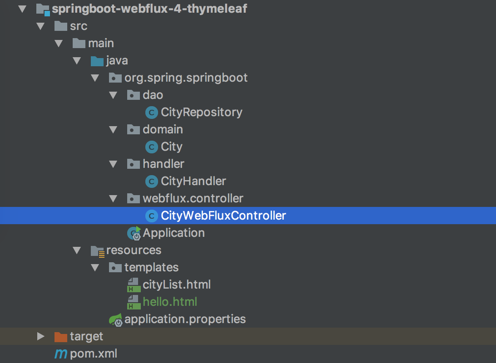
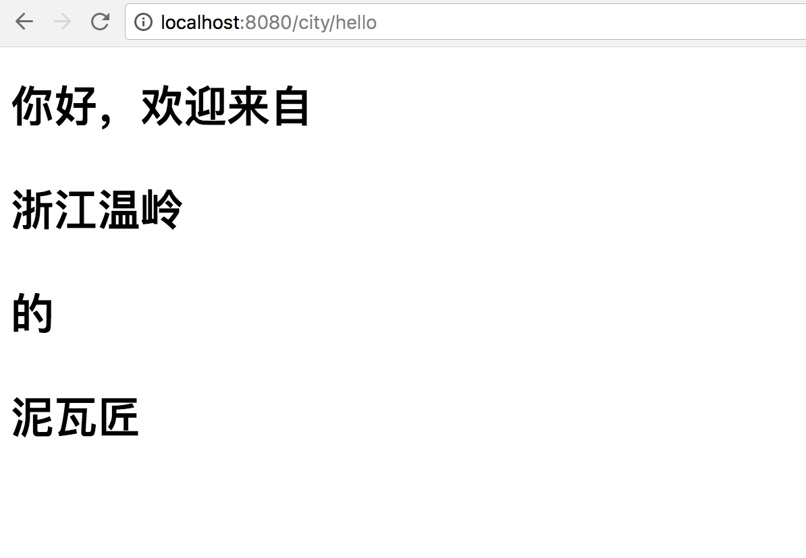
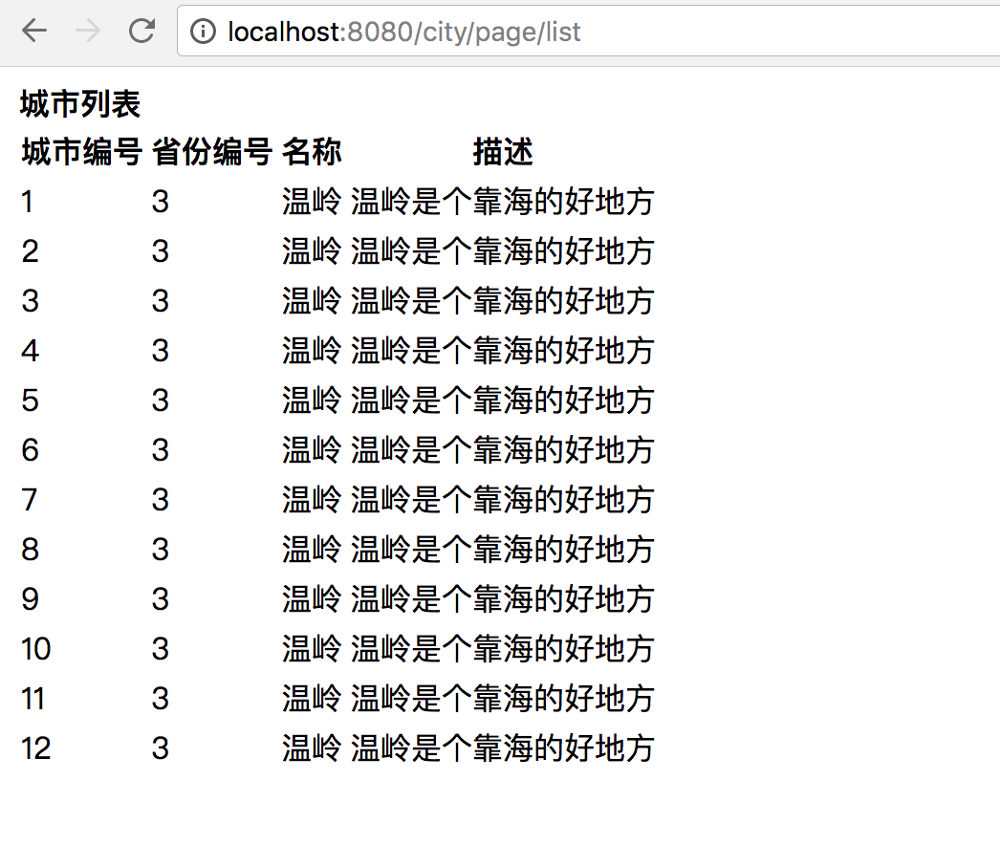

# 05 WebFlux 整合 Thymeleaf

上一篇介绍的是用 MongoDB 来实现 WebFlux 对数据源的操作，那么有了数据需要渲染到前台给用户展示，这就是本文关心的 View 层，View 的表现形式有很多，比如 JSON 和 HTML。开发中常用模板语言很常见的有 Thymeleaf、Freemarker等，那什么是模板语言？

常见的模板语言都包含以下几个概念：数据（Data）、模板（Template）、模板引擎（Template Engine）和结果文档（Result Documents）。

- 数据

数据是信息的表现形式和载体，可以是符号、文字、数字、语音、图像、视频等。数据和信息是不可分离的，数据是信息的表达，信息是数据的内涵。数据本身没有意义，数据只有对实体行为产生影响时才成为信息。

- 模板

模板，是一个蓝图，即一个与类型无关的类。编译器在使用模板时，会根据模板实参对模板进行实例化，得到一个与类型相关的类。

- 模板引擎

模板引擎（这里特指用于 Web 开发的模板引擎）是为了使用户界面与业务数据（内容）分离而产生的，它可以生成特定格式的文档，用于网站的模板引擎就会生成一个标准的 HTML 文档。

- 结果文档

一种特定格式的文档，比如用于网站的模板引擎就会生成一个标准的 HTML 文档。

模板语言用途广泛，常见的用途如下：

- 页面渲染
- 文档生成
- 代码生成
- 所有 “数据+模板=文本” 的应用场景

Spring Boot 推荐使用的模板语言是 Thymeleaf，那什么是 Thymeleaf？

官方的解释如下：

```
Thymeleaf is a modern server-side Java template engine for both web and standalone environments.

```

Thymeleaf 是现代的模板语言引擎，可以独立运行也可以服务于 Web，主要目标是为开发提供天然的模板，并且能在 HTML 里面准确的显示。

Thymeleaf 是新一代 Java 模板引擎，在 Spring 4 后推荐使用。目前是 Spring 5 自然更加推荐。

### 结构

类似上面讲的工程搭建，新建一个工程编写此案例，工程图如图所示：



目录如下：

- org.spring.springboot.webflux.controller：Controller 层
- org.spring.springboot.dao：数据操作层 DAO
- org.spring.springboot.domain：实体类
- org.spring.springboot.handler：业务逻辑层
- Application：应用启动类
- application.properties：应用配置文件
- pom.xml maven 配置
- application.properties 配置文件

模板是会用到下面两个目录：

- static 目录是存放 CSS、JS 等资源文件；
- templates 目录是存放视图。

本文重点在 Controller 层 和 templates 视图的编写。

### 新增 POM 依赖与配置

在 pom.xml 配置新的依赖：

```
  <dependencies>

    <!-- Spring Boot Web Flux 依赖 -->
    <dependency>
      <groupId>org.springframework.boot</groupId>
      <artifactId>spring-boot-starter-webflux</artifactId>
    </dependency>

    <!-- 模板引擎 Thymeleaf 依赖 -->
    <dependency>
      <groupId>org.springframework.boot</groupId>
      <artifactId>spring-boot-starter-thymeleaf</artifactId>
    </dependency>

    <!-- Spring Boot Test 依赖 -->
    <dependency>
      <groupId>org.springframework.boot</groupId>
      <artifactId>spring-boot-starter-test</artifactId>
      <scope>test</scope>
    </dependency>

    <!-- Junit -->
    <dependency>
      <groupId>junit</groupId>
      <artifactId>junit</artifactId>
      <version>4.12</version>
    </dependency>
  </dependencies>

```

这里我们增加了 Thymeleaf 依赖，但不用在 application.properties - 应用配置文件中配置任何配置。默认启动其默认配置，如需修改配置参考 Thymeleaf 依赖配置，如下：

```
spring.thymeleaf.cache=true # Enable template caching.
spring.thymeleaf.check-template=true # Check that the template exists before rendering it.
spring.thymeleaf.check-template-location=true # Check that the templates location exists.
spring.thymeleaf.enabled=true # Enable Thymeleaf view resolution for Web frameworks.
spring.thymeleaf.encoding=UTF-8 # Template files encoding.
spring.thymeleaf.excluded-view-names= # Comma-separated list of view names that should be excluded from resolution.
spring.thymeleaf.mode=HTML5 # Template mode to be applied to templates. See also StandardTemplateModeHandlers.
spring.thymeleaf.prefix=classpath:/templates/ # Prefix that gets prepended to view names when building a URL.
spring.thymeleaf.reactive.max-chunk-size= # Maximum size of data buffers used for writing to the response, in bytes.
spring.thymeleaf.reactive.media-types= # Media types supported by the view technology.
spring.thymeleaf.servlet.content-type=text/html # Content-Type value written to HTTP responses.
spring.thymeleaf.suffix=.html # Suffix that gets appended to view names when building a URL.
spring.thymeleaf.template-resolver-order= # Order of the template resolver in the chain.
spring.thymeleaf.view-names= # Comma-separated list of view names that can be resolved.

```

包括常用的编码、是否开启缓存等等。

### WebFlux 中使用 Thymeleaf

在 CityWebFluxController 控制层，添加两个方法如下：

```
    @GetMapping("/hello")
    public Mono<String> hello(final Model model) {
        model.addAttribute("name", "泥瓦匠");
        model.addAttribute("city", "浙江温岭");

        String path = "hello";
        return Mono.create(monoSink -> monoSink.success(path));
    }

    private static final String CITY_LIST_PATH_NAME = "cityList";

    @GetMapping("/page/list")
    public String listPage(final Model model) {
        final Flux<City> cityFluxList = cityHandler.findAllCity();
        model.addAttribute("cityList", cityFluxList);
        return CITY_LIST_PATH_NAME;
    }

```

解释下语法：

- 返回值 Mono 或者 String 都行，但是 Mono 代表着我这个返回 View 也是回调的。
- return 字符串，该字符串对应的目录在 resources/templates 下的模板名字。
- Model 对象来进行数据绑定到视图。
- 一般会集中用常量管理模板视图的路径。

### Tymeleaf 视图

然后编写两个视图 hello 和 cityList，代码分别如下。

hello.html：

```
<!DOCTYPE html>
<html lang="zh-CN">
<head>
    <meta charset="UTF-8"/>
    <title>欢迎页面</title>
</head>

<body>

<h1 >你好，欢迎来自<p th:text="${city}"></p>的<p th:text="${name}"></p></h1>

</body>
</html>

```

cityList.html：

```
<!DOCTYPE html>
<html lang="zh-CN">
<head>
    <meta charset="UTF-8"/>
    <title>城市列表</title>
</head>

<body>

<div>

    <table>
        <legend>
            <strong>城市列表</strong>
        </legend>
        <thead>
        <tr>
            <th>城市编号</th>
            <th>省份编号</th>
            <th>名称</th>
            <th>描述</th>
        </tr>
        </thead>
        <tbody>
        <tr th:each="city : ${cityList}">
            <td th:text="${city.id}"></td>
            <td th:text="${city.provinceId}"></td>
            <td th:text="${city.cityName}"></td>
            <td th:text="${city.description}"></td>
        </tr>
        </tbody>
    </table>

</div>

</body>
</html>

```

常用语法糖如下：

- ${...}：变量表达式；
- th:text：处理 Tymeleaf 表达式；
- th:each：遍历表达式，可遍历的对象有，实现 java.util.Iterable、java.util.Map（遍历时取 java.util.Map.Entry）、array 等。

还有很多使用，可以参考[官方文档](http://www.thymeleaf.org/documentation.html)。

### 运行工程

下面运行工程验证下，使用 IDEA 右侧工具栏，点击 Maven Project Tab ，点击使用下 Maven 插件的 install 命令；或者使用命令行的形式，在工程根目录下，执行 Maven 清理和安装工程的指令：

```
cd springboot-webflux-4-thymeleaf
mvn clean install

```

在控制台中看到成功的输出：

```
... 省略
[INFO] ------------------------------------------------------------------------
[INFO] BUILD SUCCESS
[INFO] ------------------------------------------------------------------------
[INFO] Total time: 01:30 min
[INFO] Finished at: 2017-10-15T10:00:54+08:00
[INFO] Final Memory: 31M/174M
[INFO] ------------------------------------------------------------------------

```

在 IDEA 中执行 Application 类启动，任意正常模式或者 Debug 模式，可以在控制台看到成功运行的输出：

```
... 省略
2018-04-10 08:43:39.932  INFO 2052 --- [ctor-http-nio-1] r.ipc.netty.tcp.BlockingNettyContext     : Started HttpServer on /0:0:0:0:0:0:0:0:8080
2018-04-10 08:43:39.935  INFO 2052 --- [           main] o.s.b.web.embedded.netty.NettyWebServer  : Netty started on port(s): 8080
2018-04-10 08:43:39.960  INFO 2052 --- [           main] org.spring.springboot.Application        : Started Application in 6.547 seconds (JVM running for 9.851)

```

打开浏览器，访问 <http://localhost:8080/city/hello> ，可以看到如图的响应：



继续访问 <http://localhost:8080/city/page/list> , 发现没有值，那么按照上一讲插入几条数据即可有值，如图：



### 总结

这里探讨了 Spring WebFlux 的如何整合 Thymeleaf，整合其他模板语言 Thymeleaf、Freemarker，就大同小异了。下面，我们可以整合 Thymeleaf 和 MongoBD 来实现一个整体的简单案例。
